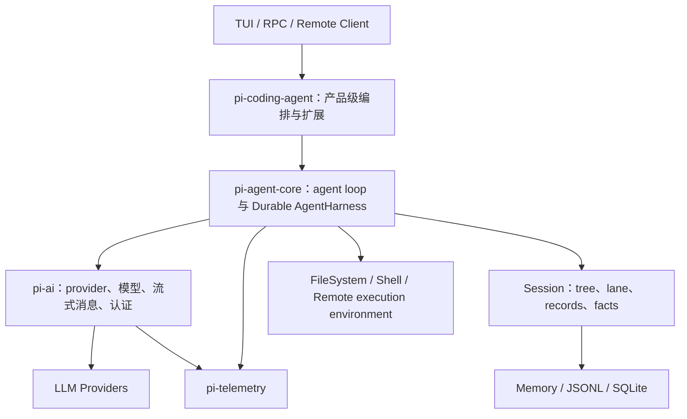
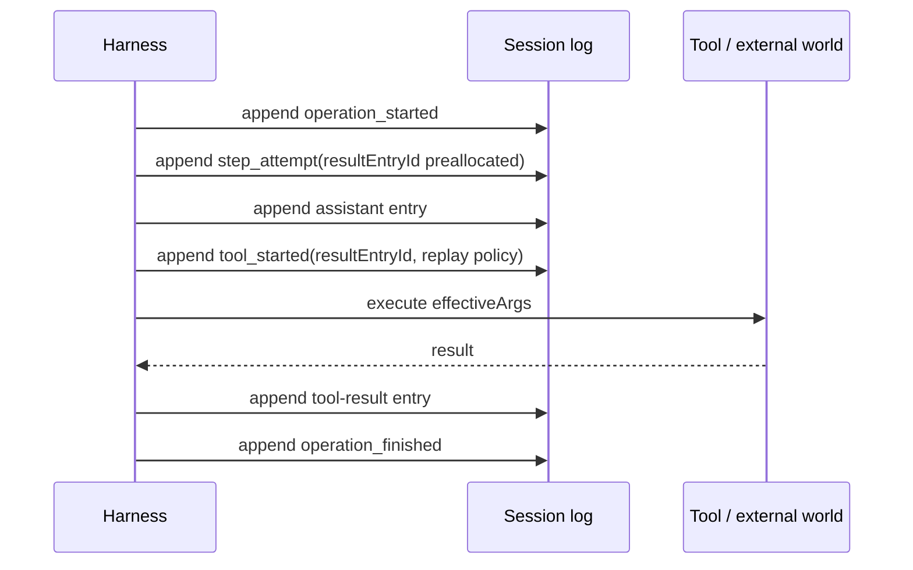

# Pi Agent Harness 设计理念总结

> 调研与代码审阅截止：2026-08-17  
> 仓库版本：`0.84.2`  
> 目标读者：正在从事 agent harness 前馈系统设计、希望判断哪些设计值得迁移到自己项目的工程人员

## 0. 结论先行

Pi 最值得学习的不是某个提示词、某种 agent persona，也不是简单的 `LLM → tool → LLM` 循环，而是它逐步形成的一套运行时观：

1. **会话历史是可恢复的事实，模型上下文只是事实的一次投影。** 保存完整、不可变的执行历史，再按当前模型、token 预算和任务需要构造上下文。
2. **把 agent 执行当作持久化状态机，而不是一个长异步函数。** 意图先落盘，副作用发生后结果再落盘；进程崩溃后由纯 reducer 重建状态。
3. **用 lane 表达并行执行身份，用 branch 表达对话因果历史。** 两者解决的是不同问题，不应混为“多 agent”。
4. **把工具调用拆成声明、准备、校验、拦截、执行、归一化、持久化多个阶段。** 模型看到的 schema 与运行时需要的行为不是同一个抽象层。
5. **显式设计所有中断边界。** steer、follow-up、abort、retry、deferred provider、compaction、navigation 都有明确的接受点、提交点和恢复语义。
6. **把暂态事件与权威状态分离。** 流式 delta 用于低延迟 UI，snapshot 用于一致性；客户端不靠重放 UI 事件猜测真实状态。
7. **把可测试性设计进架构。** 手动驱动 effect、纯 reducer、故障前缀、竞态双序测试、后端一致性测试都不是补充测试技巧，而是运行时设计的一部分。

对前馈 harness 团队而言，最值得优先吸收的是前五项。它们直接提高一次任务执行的正确率、可恢复性和可调试性，不依赖“执行失败后再让模型自我反思”的反馈回路。

但必须先说明一个事实：**Pi 当前存在两套不同成熟度的架构。**

| 层次 | 当前状态 | 应如何阅读 |
|---|---|---|
| `pi-coding-agent` 的 SessionManager v3、AgentSession、扩展和工具系统 | 当前产品实际使用，功能较完整 | 用来学习已验证的交互、会话、压缩、工具和扩展行为 |
| `packages/agent` 下的 Durable AgentHarness v2 | 目标架构，正在分阶段实现 | 用来学习更严格的持久化运行时设计，不能全部当成现成功能 |

截至本次审阅，v2 已完成或基本落地的底座包括：公开 scaffold 的诚实失败、恢复查询契约、记录合法性检查、纯 lane reducer、format-4 的 memory/JSONL 仓储与崩溃处理、遥测契约。运行、工具恢复、队列、abort、deferred provider、compaction、navigation、完整 event/watch 等主体工作仍在路线图中。依据是 [Harness v2 实现清单](packages/agent/docs/harness-v2.md#20-implementation-status-and-work-packages) 和当前 [AgentHarness scaffold](packages/agent/src/harness/agent-harness.ts)。

---

## 1. 本文的范围与“前馈”定义

本文把 agent harness 定义为位于模型与外部世界之间的系统软件，负责：

- 构造模型输入；
- 暴露并调度工具；
- 管理运行、会话、队列和中断；
- 持久化执行事实；
- 执行安全策略；
- 将执行状态呈现给客户端；
- 记录可用于评测和诊断的数据。

这里的**前馈能力**指：在一次执行路径中，通过更好的输入、状态表达、工具接口、调度、恢复、安全边界和验证，使 agent 更大概率第一次就正确完成任务。

本文不把以下内容作为重点：反思后重试、经验蒸馏、自生成训练数据、策略自进化、多轮 critic 优化。它们属于用户所说的反馈方向。文中涉及 evaluator 或 audit 时，只讨论它们作为执行正确性边界的价值，不展开自优化。

---

## 2. 外部调研：截至 2026 年 8 月的研究重点

### 2.1 调研方法

调研优先使用论文、项目官方文档、协议规范和厂商工程文章，覆盖四类资料：

- 学术基准与论文：ReAct、SWE-agent、ToolSandbox、τ-bench、AgentDojo、OSWorld/OSWorld 2.0、AppWorld、ToolBench-X、ToolFailBench、LongHorizon-Harness 等；
- 运行时与框架：OpenAI Agents SDK、LangGraph、Google ADK、AutoGen、OpenHands、Temporal；
- 互操作协议：MCP、A2A；
- 生产工程经验：Anthropic 长任务 harness、context engineering、Managed Agents，OpenAI sandbox/durable execution。

判断一项趋势是否重要，不看宣传频率，而看它是否同时出现在：生产框架 API、公开故障案例、可执行 benchmark 和协议演进中。

### 2.2 研究热点已经从“会不会调用工具”转向“能否长期可靠执行”

| 热点 | 2026 年行业/学术信号 | 对 harness 的要求 |
|---|---|---|
| 持久化执行与崩溃恢复 | LangGraph persistence/interrupt、Temporal durable execution、OpenAI Agents SDK durable execution、MCP Tasks | 意图记录、checkpoint、幂等、恢复 reducer、未知结果处理 |
| 上下文工程 | Anthropic context engineering、Managed Agents、Less Context Better Agents、ContextBudget | 日志与上下文解耦、选择性投影、压缩、缓存友好布局 |
| 长时程任务状态 | OSWorld 2.0 平均数百次工具调用；LongHorizon-Harness 把任务状态移到执行上下文之外 | 显式任务状态、约束保持、中途信息吸收、完成条件验证 |
| 不可靠工具环境 | ToolBench-X 注入 spec drift、调用错误、执行失败、输出漂移、跨源冲突 | 错误分类、重试/回退/交叉验证、调用与结果溯源 |
| 工具接口质量 | SWE-agent 强调 Agent-Computer Interface；BFCL 从函数调用扩展到多轮、记忆和真实执行 | 小而正交的工具、稳定 schema、可诊断结果、低认知负担 |
| 安全与隔离 | AgentDojo、SafeAgent、MCP 安全规范、Codex/Claude sandbox 与审批 | least privilege、凭证隔离、审批恢复、prompt injection 防护 |
| 状态化评测 | ToolSandbox、τ-bench、AppWorld、OSWorld、TheAgentCompany | 评测最终环境状态，不只评文本；记录轨迹、成本、污染和副作用 |
| 多执行体与并行 | AutoGen/A2A、并行 coding agents、Managed Agents 的 many brains/many hands | 明确状态所有权、隔离、路由、取消、结果合并，而非只增加角色 |
| 远程执行与 brain/hands 分离 | OpenHands Agent Server、Anthropic Managed Agents、OpenAI native sandbox | harness 状态外置，计算环境可丢弃和重建，凭证不进入执行容器 |
| 可观测性 | OpenAI tracing、OpenTelemetry 生态、各框架 run/step/tool trace | 稳定 operation/step/tool ID、嵌套 span、成本账本、敏感数据控制 |
| 工具与 agent 互操作 | MCP 2026-07-28、MCP Tasks、A2A | 动态能力发现、长任务句柄、认证上下文绑定、协议级取消 |

外部证据中最重要的转折是：

- [ReAct](https://arxiv.org/abs/2210.03629) 解决了“如何交错推理和行动”的基本形态；到 2026 年，这个 loop 已经不是主要壁垒。
- [OSWorld 2.0](https://arxiv.org/abs/2606.29537) 把任务扩展到平均数百次工具调用，最佳系统完整成功率仍很低，失败集中在约束丢失、中途信息遗漏、猜测而不询问和缺少验证。
- [ToolBench-X](https://arxiv.org/abs/2606.25819) 表明干净环境下表现好的 agent，在可恢复工具故障下仍会显著失败；瓶颈不是多调用几次，而是诊断和恢复。
- [ToolFailBench](https://arxiv.org/abs/2607.04686) 进一步把失败拆成跳过工具、忽略结果、伪造输出和不必要调用，说明单一成功率会隐藏 harness 的真实缺陷。
- [LongHorizon-Harness](https://arxiv.org/abs/2608.01964) 把任务状态从不断增长的模型上下文中移出，并只用环境验证的事实更新状态。这与 Pi“持久事实和上下文投影分离”的方向高度一致。

### 2.3 当前最难的瓶颈

1. **长链路错误非线性累积。** 单步 99% 正确率在数百步任务中仍不够；工具结果误读、约束遗漏和一次错误副作用会污染所有后续步骤。
2. **副作用无法真正 exactly-once。** harness 可保证自身记录只提交一次，但外部 API、shell 或支付调用可能在“已经执行、结果尚未落盘”时崩溃。必须依赖幂等键、查询确认、补偿或人工决策。
3. **上下文不是越多越好。** 全历史会引入陈旧信息、工具输出噪声、成本和缓存失效；过度压缩又会删除未来需要的约束。
4. **streaming 与权威状态之间存在裂缝。** UI 已经显示工具执行完成，不代表结果已经持久化；断线重连后若靠事件重放恢复，很容易出现幽灵状态。
5. **中断与竞态比主循环更复杂。** 用户 steer 与工具完成同时发生、abort 与落盘同时发生、finish 与 follow-up 同时发生，都需要线性化语义。
6. **安全边界与易用性冲突。** 每次审批破坏自治性，完全放权又扩大 prompt injection、凭证泄露和供应链攻击的爆炸半径。
7. **模型和供应商行为并不统一。** tool-call 格式、并行语义、reasoning token、缓存、overflow、deferred response 和错误形状都有差异。
8. **评测容易评错对象。** 最终文本声称完成不等于环境真的完成；单次成功不代表稳定；不计算成本、时间和附带破坏会奖励错误策略。
9. **scaffolding 会随模型进步而过时。** Anthropic 在 [Harness design for long-running application development](https://www.anthropic.com/engineering/harness-design-long-running-apps) 中明确指出，harness 的每一层都编码了“模型做不到什么”的假设，应持续做消融，而不是无限增加编排。

---

## 3. 我分析 Pi 的核心标准

以下标准比“支持多少 provider、多少工具、多少 UI”更能判断一个 harness 是否值得参考。

| 维度 | 核心问题 | 可验证指标 | 对前馈的重要性 |
|---|---|---|---|
| 因果正确性 | 每个结果能否追溯到唯一意图、模型步骤和工具调用？ | 稳定 ID、parent/seq、call-result 配对、无非法状态 | 极高 |
| 持久性与恢复 | 任意进程终止点后能否确定继续、重放、终止还是求助？ | crash-prefix 测试、恢复固定点、无假成功 | 极高 |
| 上下文质量 | 模型看到的是不是当前任务最有用的信息？ | token 利用率、约束保留、缓存命中、压缩后成功率 | 极高 |
| 工具运行时 | 参数、权限、副作用、并行和错误是否有明确阶段？ | schema 校验、拦截点、source-order、幂等策略 | 极高 |
| 中断与控制 | steer、follow-up、abort 在哪个边界生效？ | 接受点/提交点明确、所有竞态双序测试 | 极高 |
| 并发与隔离 | 多任务是否共享了不该共享的可变状态？ | lane 所有权、单写者、顺序一致性、资源隔离 | 高 |
| 安全与信任 | 模型生成的动作能访问什么？谁能批准？ | 最小权限、sandbox、凭证隔离、审计、策略测试 | 极高 |
| 可观测性 | 能否从 trace 解释一次失败和真实成本？ | run/step/tool span、usage ledger、敏感字段规则 | 高 |
| 可测试性 | 是否能无真实模型、无真实副作用地穷举边界？ | faux provider、manual effects、backend conformance | 极高 |
| 协议与互操作 | runtime、客户端、工具和远程执行能否独立演进？ | 严格 schema、版本、capability discovery、适配层 | 中高 |
| 性能与成本 | 并发、上下文和远程容器是否带来可控收益？ | TTFT、step latency、token/cost、容器利用率 | 高 |
| 演进成本 | 模型升级后能否删除不再必要的 scaffolding？ | 模块边界、可消融性、兼容面大小 | 高 |
| 产品体验 | 用户能否理解当前在做什么并安全干预？ | snapshot 一致性、流式反馈、队列可见、错误可操作 | 中高 |
| 实现成熟度 | 设计是文档、scaffold、底座还是生产路径？ | 测试覆盖、调用方、未实现方法、迁移状态 | 必须单列 |

评估时尤其遵循三条原则：

- **区分声明与实现。** 一个严谨 RFC 很有学习价值，但不能因此判定运行时已具备相同可靠性。
- **区分本地正确与端到端正确。** append-only log 正确，不代表外部副作用 exactly-once。
- **区分前馈增益与反馈增益。** 本文优先评价能直接改善当前一步选择和执行的信息、接口与状态设计。

---

## 4. Pi 的整体架构观



这种分包不是纯粹为了代码整洁，而是在隔离五种变化速度不同的东西：

| 模块 | 主要职责 | 值得学习的边界 |
|---|---|---|
| [`packages/ai`](packages/ai) | provider 协议、模型元数据、流式消息、认证、重试、deferred request | 模型差异在 agent loop 之前被归一化，但保留能力差异 |
| [`packages/agent`](packages/agent) | 最小 agent loop、工具运行时、Durable AgentHarness、session | 通用运行时不依赖具体 TUI 和 coding product |
| [`packages/coding-agent`](packages/coding-agent) | CLI/TUI 产品、会话 v3、扩展、资源、内置 coding tools | 产品策略建立在通用 loop 之上，可大量定制 |
| [`packages/tui`](packages/tui) | 终端组件和差分渲染 | UI 渲染与 agent 状态机分离 |
| [`packages/protocol`](packages/protocol) | 严格 CBOR schema 和 framing | wire DTO 不直接复用内部领域对象 |
| [`packages/client`](packages/client) | 运行时无关远程客户端、lease、snapshot | 客户端只相信权威 snapshot，不乐观归约 progress |
| [`packages/server`](packages/server) | 实验性 session server、连接和快照发布 | 服务端拥有领域对象到 wire DTO 的适配边界 |
| [`packages/session-backends`](packages/session-backends) | SQLite 等持久化后端 | 同一 SessionStorage 契约，多后端一致性测试 |
| [`packages/telemetry`](packages/telemetry) | vendor-neutral trace 契约与 schema | 业务层定义语义，adapter 负责导出，不把 OTel 绑进核心 |

---

## 5. 最值得学习的设计理念

下面按对前馈 harness 的参考价值排序。成熟度分为“生产现状”“已落地底座”“目标设计”。

### S1. 完整事实日志与模型上下文彻底分离

**问题。** 把 `messages[]` 同时当数据库、恢复状态和模型输入，会迫使系统在“保留全部历史”和“控制上下文长度”之间二选一。一旦就地删消息或改 summary，恢复、审计和重新投影都会丢失依据。

**Pi 的方案。** 会话树保存物理事实；`buildSessionContext()` 沿指定 leaf 获取分支，再经过 compaction 和自定义 projector 构造模型上下文。compaction entry 不删除旧历史，只改变之后的上下文投影。参见 [v4 session context](packages/agent/src/harness/session/context.ts) 和当前产品的 [session format](packages/coding-agent/docs/session-format.md)。

简化关系是：

```text
durable log/tree  --选择 branch-->  context entries  --project-->  AgentMessage[]  --provider adapter-->  provider messages
```

**价值。**

- 可以针对不同模型、不同 token 预算使用不同投影，而不迁移历史；
- compaction 失败或质量不佳时仍能回看原文；
- UI、审计、计费、恢复与模型输入不再争夺同一种数据结构；
- 与 Anthropic [Managed Agents](https://www.anthropic.com/engineering/managed-agents) 提出的“session 不是模型 context window”高度一致。

**成熟度。** v3 产品和 v4 session 底座均已体现；v2 完整运行时尚未接通。

**应直接借鉴。** 把 `EventLog`、`ContextProjector`、`ProviderMessageAdapter` 设计为三个接口，禁止 provider payload 反向成为持久化真相。

### S2. 把 agent run 建模为持久化状态机

**问题。** 普通实现把一次 run 写成一个长 `async function`。进程若在工具副作用之后、结果写入之前崩溃，重启代码无法知道“没执行”还是“执行了但没记下来”。

**Pi v2 的方案。** 用两类持久对象表达执行：

- **Entry**：进入对话因果树、可能被投影给模型的内容；
- **Record**：operation、attempt、tool intent、queue、abort、usage 等编排事实，不进入模型上下文。

典型工具调用计划是：



所有结果 ID 在副作用前预分配。恢复时，[`validateRecordLog()` 和 `reduceLaneState()`](packages/agent/src/harness/reducer.ts) 只根据有界日志切片重建 lane 状态，并拒绝不可能由协议产生的矛盾状态。

**价值。** 这把“如何恢复”从异常分支变成正常状态机语义，也允许离线验证、迁移和故障注入。

**关键边界。** `tool_started` 只能证明 harness 接受了执行意图，不能证明外部工具未执行或只执行一次。不可幂等工具仍需要业务幂等键、状态查询或人工确认。

**成熟度。** session record 类型、合法性验证和 reducer 已落地；驱动这些记录的完整 v2 runtime 仍是目标设计。

### S3. Effect boundary：把决策、持久化和副作用拆开

**问题。** 如果状态判断、数据库写入、hook、provider 请求和 shell 执行混在同一函数中，就无法证明一个条件判断使用的是哪个时刻的状态，也无法在测试中停在精确边界。

**Pi v2 的方案。** 设计统一 `Effects` 边界，并规定每条 lane 有一条串行 mutation line：

- mutation job 内只做短暂、确定性的状态判断和持久化；
- provider、tool、hook、sleep 等外部 effect 不在 mutation job 内运行；
- effect 结束后再进入 mutation line 条件提交；
- 任何关键持久化失败会 fault 整个 harness，禁止带着未知真相继续。

`drive: "manual"`、`peekAction()`、`executeAction()` 的目标是让测试逐个释放 effect，机械遍历每个崩溃前缀。

**价值。** 这是 Pi v2 中最有系统软件含量的设计。它同时解决竞态线性化、故障注入、确定性测试和 UI 可解释性。

**成熟度。** 目前主要是 [Harness v2 effects 设计](packages/agent/docs/harness-v2.md#the-effects-boundary)；I3–I5 尚未完成，不能按现成功能评估。

### S4. lane 与 branch 是两个正交维度

**问题。** 许多多 agent 框架把“并发执行者”“对话分支”“子 agent”“工作区”混成一个概念，导致状态所有权、恢复和合并语义模糊。

**Pi 的方案。**

- **branch** 是 entry 的父子因果路径，回答“这条对话历史从哪里来”；
- **lane** 是一个持久化命名指针及其运行配置、队列和 operation，回答“哪个独立执行流当前指向哪里、正在做什么”。

多个 lane 可指向共享不可变树的同一节点，再独立向后追加。创建 lane 不复制整段会话；移动 lane 也不改写树。

**价值。**

- 并行执行共享历史但不共享可变 leaf 和队列；
- lane 可独立 suspend/resume/abort；
- 分支仍可用于回溯、探索和比较；
- 将来实现 subagent 时，不需要把所有子 agent 都变成独立 session 文件。

**成熟度。** v4 SessionStorage 的 lane pointer、create/move 和后端已落地；AgentHarness 多 lane 运行仍未落地。

**应直接借鉴。** 在内部模型中至少区分 `SessionId`、`LaneId`、`BranchLeafId`、`OperationId`。即使 UI 都叫“会话”，内部也不能合并这些身份。

### S5. 工具是“双表面”对象：模型声明与运行时行为

**问题。** 模型只需要工具名称、描述和参数 schema；运行时还需要 UI 标签、兼容修复、执行策略、取消、流式更新、重放安全性和结构化详情。若只定义 JSON Schema，重要语义会散落在调度器里。

**Pi 当前方案。** [`AgentTool`](packages/agent/src/types.ts) 在模型 `Tool` 声明之上增加：

- `label`：UI 表达；
- `prepareArguments`：在正式 schema 校验前修复特定模型输出兼容问题；
- `executionMode`：串行或并行；
- `execute`：运行时副作用；
- `onUpdate`：暂态进度；
- result 的 `content/details/usage/addedToolNames/terminate`。

v2 又计划增加 `replay: "never" | "safe"`，用于崩溃恢复时判断工具能否自动重放。

**价值。** 它承认“给模型看的 API”和“交给 runtime 的 capability”不是同一层。这个分离对权限、远程工具、MCP 适配、UI 和可靠恢复都很关键。

**注意。** `prepareArguments` 应仅用于已知兼容缺陷，不能成为静默猜测错误参数的通用通道；修复后的 effective args 必须进入审计记录。

### S6. 工具调用是分阶段 pipeline，不是一次函数调用

**问题。** 直接 `validate → execute` 无法在正确边界插入审批、策略、遥测、持久化和错误归一化，也很难保证并行调用的结果顺序。

**Pi 当前 loop 已体现的阶段：**

1. 查找工具；
2. `prepareArguments`；
3. TypeBox/schema 校验；
4. `beforeToolCall` 拦截或阻断；
5. 执行与进度事件；
6. `afterToolCall` 归一化/覆盖；
7. 输出 tool execution end；
8. 生成标准 toolResult message；
9. 按 assistant 中的 source order 追加结果。

并行模式可以并发执行，但结果消息仍按原始 tool call 顺序提交。若 assistant 因 `length` 截断，Pi 不执行其中可能残缺的工具参数，而是为每个调用生成错误结果，让模型重新发起。

**价值。** 这类确定性顺序看似细节，实际会影响 provider 合法性、可复现性、缓存和下一步推理。错误作为 tool result 返回模型，也比抛出后终止整个 run 更有恢复空间。

**成熟度。** 当前 agent loop 已实现；v2 要把它进一步拆成可持久化、可恢复的 prepare/execute/finalize building blocks。

### S7. 队列和 checkpoint 为用户中断定义线性化点

**问题。** 用户在 agent 运行时发来的新消息不是普通的“再 append 一条 user message”。它可能要立即改变下一次模型调用，也可能等当前 run 完成，或者成为下一个 run。

**Pi 的三个语义：**

- `steer`：在当前 run 的下一个 checkpoint 注入；
- `followUp`：当前 run 自然结束后继续同一 operation；
- `nextRun`：明确排入下一次 operation。

队列支持 `all` 和 `one-at-a-time` 消费模式。Harness v2 进一步要求 enqueue、cancel、consume 和 finish-boundary 都有持久记录，并测试“消息到达”和“运行结束”两种顺序。

**价值。** 对人机协作来说，真正重要的不是能不能发消息，而是用户知道消息**何时生效**。明确 checkpoint 也能减少任意位置插入上下文导致的 prompt cache 失效。

**成熟度。** v3 Agent 已有 steer/follow-up；v2 的持久化竞态语义仍待实现。

### S8. append-only 树支持无损分支、导航和压缩

**问题。** 线性消息数组只能删除后重来或复制整个会话，无法保留探索过但放弃的路径，也无法解释某个结论来自哪条历史。

**Pi v3 的方案。** 每个 entry 有 `id`、`parentId`、`timestamp`；当前上下文是从 leaf 沿 parent 回到 root 的路径。tree navigation 改变当前 leaf，后续 append 自然形成新分支；旧分支仍留在文件中。参见 [Session file format](packages/coding-agent/docs/session-format.md#tree-structure)。

**价值。**

- 支持从任意历史点重做；
- 可为放弃分支生成 summary，带回新路径；
- 能统计和研究失败轨迹，而不是只保留最终成功路径；
- 分支与 compaction 都是附加事实，不破坏原始记录。

**局限。** 当前 v3 的“当前 leaf”不是独立持久化事实，重新打开时通常以物理文件最后一项推导；v4 lane pointer 正是在修复这一建模缺口。

### S9. compaction 是语义 checkpoint，不是简单截断

**问题。** 按 token 数删除最旧消息会破坏 toolCall/toolResult 配对、当前未完成 turn、文件修改状态和任务约束。

**Pi 的方案。** compaction 选择合法 cut point，生成结构化 summary，并保留近期 tail；若 cut point 落在一个跨界 turn 内，还会生成 split-turn 摘要。新的 compaction entry 保存 `summary`、`retainedTail`、`tokensBefore`、usage 等，旧历史不删除。参见 [Compaction & Branch Summarization](packages/coding-agent/docs/compaction.md)。

**价值。** 它把“压缩了什么”和“为什么从这里切”变成可审计对象，并为多次压缩保留连续性。

**外部对照。** [Less Context, Better Agents](https://arxiv.org/abs/2606.10209) 支持选择性历史优于无差别全历史；Anthropic 的[长任务 harness](https://www.anthropic.com/engineering/effective-harnesses-for-long-running-agents) 同时提醒 compaction 并不足以单独解决跨多个 context window 的任务状态问题。

**应进一步加强。** 把硬约束、已验证事实、未完成事项和原始证据引用分开保存；对压缩边界做局部回归评测，而不只看 summary 是否“读起来合理”。

### A1. provider 归一化应保留能力差异，而不是追求虚假统一

`pi-ai` 把多供应商的 streaming、消息、usage、认证、重试、overflow 和模型元数据收敛到统一 API，同时保留 provider/api/model identity 和能力字段。模型目录是生成数据，而不是把所有模型假设写死在 agent loop 中。

这带来两点参考价值：

- harness 的 operation/session/tool 语义不与某个 provider SDK 绑定；
- provider 特有能力，如 prompt cache、reasoning、deferred request，仍可通过能力和选项表达。

值得特别学习的是延迟请求被建模为 `DeferredHandle` 和 `stopReason: "deferred"`，而不是让一个 HTTP promise 永久占住进程。v2 计划把“请求已挂起、何时 fetch、取消结果”纳入恢复状态机。

### A2. hook/extension 是策略平面，核心 loop 保持机制中立

Pi 的扩展系统覆盖 session、agent、turn、message、provider、tool、input、UI 等生命周期，并允许注册工具、provider、命令、renderer、shortcut 和资源。参见 [Extensions](packages/coding-agent/docs/extensions.md)。

设计上最值得学习的是：

- 核心提供稳定的机制和时序；
- 产品或组织策略通过 hook 决定阻断、改写、注入和展示；
- `before_tool` 这类安全关键 hook 应 fail-closed；
- v2 计划为 hook 分配稳定注册 ID，并持久化 resume data，避免崩溃恢复时重复产生不一致决策。

但扩展是完整代码执行能力，不是安全沙箱。第三方扩展应视为与主进程等权的可信代码。

### A3. snapshot 是权威状态，progress event 只是暂态提示

[`pi-protocol`](packages/protocol/README.md) 明确规定：Server/Session snapshot 是权威状态，progress event 不可被客户端归约为权威事实。客户端断线后重新获取 snapshot，而不是依赖自己是否收齐了全部 delta。

`watch()` 的目标接口还采用“先捕获 snapshot、期间缓存事件、再 start listener”的模式，避免订阅时的 snapshot/event gap。

这是远程 agent UI 的关键原则：

- delta 可以低延迟、允许丢失；
- durable state 必须有 revision 和完整 snapshot；
- 成功命令响应也返回 snapshot，客户端不做乐观状态修改；
- subscriber 抛错与协议状态隔离。

### A4. brain、hands、session 三层分离

Pi 的 `ExecutionEnv` 把 FileSystem 和 Shell 作为注入能力；coding-agent 扩展还能把工具路由到远程环境。实验性的 protocol/client/server 又把 UI 与 session runtime 分开。

这与 Anthropic [Managed Agents](https://www.anthropic.com/engineering/managed-agents) 和 OpenAI [Agents SDK 的 sandbox/durable execution](https://openai.com/index/the-next-evolution-of-the-agents-sdk/) 方向一致：

- brain/harness 可保持无状态或轻状态；
- session 在外部持久化；
- hands/sandbox 可按需创建、故障后替换；
- provider 凭证无需进入模型生成代码运行的容器；
- 一个 brain 可以连接多个执行环境，一个环境也可移交给另一个 brain。

Pi 当前还没有把这套分离整合成完整的内建安全控制面，但接口边界已经有参考价值。

### A5. 严格 wire schema 与领域对象适配层

Pi protocol 使用长度前缀 CBOR、严格 TypeBox schema、frame size/嵌套深度限制、未知字段拒绝和明确版本握手。更重要的是，server 不把 `pi-ai` 对象直接序列化到网络，而是拥有单独 adapter，并对 closed union 做穷举映射。

**价值。** 内部模型添加一个字段时，编译和测试会迫使协议作者明确决定是否暴露、如何清洗和如何兼容，降低敏感 details 或 provider 私有结构意外泄露的风险。

### A6. 遥测是独立的、带类型的语义契约

Pi 把遥测拆成 vendor-neutral callback/span 接口、typed schema 和 adapter conformance tests。agent 层定义 `pi.harness.run/turn/step/tool/hook/session.write` 等业务语义，provider 层定义 AI request；adapter 决定是否导出到 OpenTelemetry 或其他后端。参见 [Telemetry schema](packages/agent/docs/telemetry-schema-zh.md)。

对 harness 团队的价值在于：

- operation、step、attempt、tool 和 session write 有统一关联身份；
- 重试、废弃 overflow response、压缩和失败工具仍计入成本；
- 默认 schema 可以明确禁止 prompt、tool args、凭证等敏感内容；
- in-memory adapter 让 trace 结构本身可测试。

### A7. usage ledger 与消息 usage 分离

Harness v2 不只依赖 assistant message 上最终可见的 usage，而是为每次物理 provider 请求、tool、hook 和 adjustment 写 usage record。这样失败重试、被丢弃的 overflow 输出和 deferred fetch 成本不会从账本消失。

这是非常容易被忽略的前馈基础设施：没有真实成本和调用次数，团队无法判断某种上下文、并发或恢复策略是否真的更好，也无法做稳定的消融实验。

### A8. 测试恢复协议，而不只测试业务结果

Pi v2 的测试策略最值得复制的部分包括：

- **Tier A：** reducer 与 resume 固定点；
- **Tier B：** writer 精确日志轨迹；
- **Tier C：** 每个竞态的两种顺序和每个 action 前缀重开；
- memory、JSONL、SQLite 共用 backend conformance；
- faux provider，避免测试调用真实模型；
- manual effect gate，自动与手动驱动应产生相同 durable log；
- torn tail 可修复，malformed interior 必须拒绝，不能静默“修好”。

这比增加大量 happy-path agent task 更能发现 harness 自身的系统性 bug。参考 [Harness v2 test strategy](packages/agent/docs/harness-v2.md#19-testing-strategy)。

### A9. 小而正交的 coding tools 是一种 ACI 设计

Pi 的基础 coding 工具主要围绕 read、bash、edit、write，加上输出截断、路径处理、文件 mutation queue 等运行时辅助。这个方向与 [SWE-agent 的 Agent-Computer Interface 研究](https://arxiv.org/abs/2405.15793) 一致：模型能力相同时，计算机接口的动作空间、反馈形式和防错设计会显著改变成功率。

值得学习的原则：

- 工具少而可组合，避免让模型在大量近义工具中选择；
- 错误信息直接说明如何修正；
- 大输出在 harness 中截断，并告诉模型如何继续读取；
- 文件写入需要并发协调，不能因为 tool batch 并行而让两个 mutation 互相覆盖；
- structured details 服务于 UI/审计，content 服务于模型，不必相同。

### A10. 资源加载、skills 与 prompt template 不写死在 agent loop

Pi 把系统提示、上下文文件、skills、prompt templates、扩展发现放在独立 ResourceLoader/资源层。这样 agent loop 只接受已经解析的资源和消息，不负责遍历文件系统、选择优先级和产品约定。

对前馈团队的意义是：输入质量策略可以独立实验；同一个运行时可以服务不同产品；资源来源及信任边界也更容易审计。

### B1. 显式承认安全缺口，比制造“默认安全”错觉更好

Pi 文档明确说明当前没有内建的 filesystem/process/network/credential 权限系统，默认继承启动进程权限，并建议使用 container、micro-VM 或外部 policy sandbox。参见 [Security](packages/coding-agent/docs/security.md) 和根 [README](README.md#permissions--containerization)。

这种诚实边界值得肯定，但**方案本身不值得原样复制**。2026 年的生产 harness 应把以下能力作为核心运行时的一部分：

- 每个 tool 的 capability 与资源 scope；
- allow/prompt/deny policy；
- 持久化 approval request 和 resume；
- 网络与凭证隔离；
- prompt injection 来源标记与数据流限制；
- 第三方 MCP/extension 的身份、授权上下文和审计。

可参考 [Codex exec policy](https://github.com/openai/codex/blob/main/codex-rs/execpolicy/README.md)、[MCP 2026-07-28 安全规范](https://github.com/modelcontextprotocol/modelcontextprotocol/blob/main/docs/specification/2026-07-28/basic/authorization/security-considerations.mdx) 和 [AgentDojo](https://arxiv.org/abs/2406.13352)。

### B2. 供应链约束也是 harness 安全的一部分

Pi 对直接依赖精确 pin、lockfile 审核、生命周期脚本 allowlist、`--ignore-scripts` 安装、隔离 release smoke test 等有明确规则。agent harness 会执行 shell、加载扩展并持有 provider 凭证，因此依赖安装脚本的风险远高于普通前端项目。

这不是 agent loop 算法，却是生产 harness 最容易被忽略的安全面。

### B3. TUI/RPC/SDK 是同一状态机的不同视图

Pi 同时提供交互 TUI、print、RPC 和 SDK；agent core 发出 typed lifecycle events，产品层负责渲染。TUI 使用差分渲染，RPC 以结构化事件暴露 message/tool/queue/compaction/retry 状态。

值得学习的是“运行时不等待某种 UI 才能工作”。审批或 extension UI 等需要交互的能力应通过明确协议表达，而不是从核心直接调用终端 API。

---

## 6. 这些理念与业界主流方案的对应关系

| Pi 设计 | 外部相近方向 | Pi 的独特价值或差异 |
|---|---|---|
| append-only session + context projection | Anthropic Managed Agents、OpenHands event log | Pi 同时保留树结构、compaction entry 和 branch summary |
| records + reducer + effect boundary | Temporal durable execution、LangGraph checkpoint | 更强调 lane 内单写者、精确 action 前缀和工具恢复矩阵 |
| lane | LangGraph thread、多 agent runtime、A2A task | 明确把执行身份与对话 branch 分开 |
| AgentTool 双表面 | OpenAI tools、MCP tools | UI、兼容修复、流式 details、执行模式和 replay policy 在同一运行时契约中 |
| snapshot/progress 分离 | event-sourced UI、远程 agent servers | protocol 文档明确禁止客户端把 progress 归约成权威状态 |
| compaction entry | 各框架 summary memory | 不删除物理历史，支持 split-turn 与分支摘要 |
| hook/extension | LangGraph nodes/hooks、Agents SDK guardrails | coding product 可扩展面非常宽；代价是扩展信任面大 |
| typed telemetry schema | OpenAI tracing、OTel | 业务语义与 adapter 解耦，schema 可机器读取和编译期检查 |

Pi 最有原创判断力的部分不是单个机制，而是把这些机制统一到一个“**不可变对话树 + lane 指针 + 编排记录 + 纯 reducer + effect driver**”模型中。

---

## 7. 对前馈 harness 团队最可落地的参考架构

如果只吸收 Pi 中最有价值、且不引入自反思/自进化回路的部分，建议按以下顺序建设。

### 第一阶段：先建立正确的数据模型

1. 定义稳定身份：`SessionId / LaneId / OperationId / StepId / Attempt / ToolCallId / EntryId`。
2. 将数据分为五层：
   - durable conversation entries；
   - durable orchestration records；
   - global/session facts；
   - derived runtime state；
   - transient UI progress。
3. 模型上下文只能由 projector 从 durable facts 生成。
4. 为 provider 请求、工具调用和外部写操作预分配结果 ID。

### 第二阶段：建立工具 effect pipeline

1. `resolve → prepare → validate → authorize → persist intent → execute → normalize → persist result → project`。
2. 每个工具声明：副作用类别、幂等键支持、replay policy、超时、取消、资源 scope。
3. 并行执行与结果提交顺序分离；默认保持 source order。
4. 错误分类至少区分：参数、权限、传输、可重试执行、未知结果、业务拒绝、输出不可信。

### 第三阶段：中断、持久化和恢复

1. 每 lane 一个 active operation 和一个 mutation queue。
2. steer/follow-up/next-run 使用不同队列和 checkpoint。
3. abort 先持久化接受，再取消 effect；不能把 `AbortSignal` 当 durable truth。
4. reducer 必须纯，恢复必须达到固定点：再次恢复不产生额外副作用或重复记录。
5. 对不可安全重放的未知工具结果，返回 suspended/needs-decision，而不是自动猜测。

### 第四阶段：上下文和远程执行

1. compaction 不改写历史；summary 引用来源范围。
2. 约束、已验证事实、近期轨迹和大体量工具输出使用不同保留策略。
3. harness/session 与 sandbox 分离，执行容器可重建。
4. snapshot 权威、progress 暂态；客户端断线重连只需重新获取 snapshot。

### 第五阶段：用故障驱动评测

1. 对每个 effect 前后强制 crash 并 reopen。
2. 对每个竞态测试 A→B 和 B→A。
3. 注入 tool spec drift、timeout、partial output、contradiction 和 transport retry。
4. 评测最终环境状态、约束满足、附带破坏、总成本和 pass^k。
5. 对每层 scaffolding 做消融，避免模型升级后保留无效复杂度。

---

## 8. 不应直接照搬的部分与当前缺口

### 8.1 Harness v2 仍主要是高质量目标设计

当前 [`AgentHarness`](packages/agent/src/harness/agent-harness.ts) 中大量公开运行方法仍明确抛出 `HarnessNotImplemented`。这是一种正确的 scaffold 行为——宁可诚实失败，不返回看似成功的空结果——但也意味着不能用 v2 文档推断生产成熟度。

建议把它当作：

- 一份运行时协议规范；
- 一套实现拆分和依赖排序案例；
- 一套故障与竞态测试设计；
- 不是已经验证完整性能的参考实现。

### 8.2 当前产品 v3 与 v2 有迁移断层

v3 coding-agent 已具备丰富会话、扩展和交互行为；v2 的严格 durable runtime 在 `packages/agent` 中推进，且设计明确暂不迁移 `packages/coding-agent`。短期会出现两套 session/compaction/agent 行为并存。

对学习者来说要始终问：

- 这是 v3 当前行为还是 v2 目标语义？
- coding-agent 是否真的调用了这个新 API？
- 对应测试是 scaffold/storage/reducer 测试，还是端到端 run 测试？

### 8.3 安全控制面不足

Pi 当前把隔离主要交给容器或扩展，核心没有完整的权限、审批、网络策略和凭证代理。对于企业远程 agent，这会是最大缺口之一。

### 8.4 标准工具互操作仍不是核心能力

仓库目前的核心抽象可以适配 MCP/A2A，但没有把 MCP capability discovery、长任务、认证上下文和远程 tool provenance 统一进 AgentTool/Session 语义。2026 年以后，这一层很可能需要成为正式边界。

### 8.5 缺少独立、可验证的任务状态层

Pi 有 conversation tree、records、facts 和 compaction summary，但“任务约束、子目标、环境验证事实、完成判据”仍主要存在于消息或 summary 中。LongHorizon-Harness 的最新结果说明，长任务中应考虑额外的、只由环境证据更新的 task-state store。它不同于反馈式 critic：这是前馈执行的事实控制面。

### 8.6 exactly-once 不能只靠日志解决

即使 v2 全部实现，`tool_started` 与 `tool result` 之间仍有无法从本地日志判断的外部世界窗口。生产系统必须按工具类别补充：

- 幂等请求键；
- 查询远端状态；
- outbox/inbox；
- 补偿操作；
- unknown-outcome 人工审批。

---

## 9. 最终优先级：如果只能学十件事

| 优先级 | 设计 | 原因 |
|---|---|---|
| 1 | durable log 与 context projection 分离 | 同时改善长上下文、恢复、审计和模型迁移 |
| 2 | operation records + pure reducer | 是 crash-safe harness 的核心 |
| 3 | effect boundary + manual drive | 让竞态和故障真正可测试 |
| 4 | 工具分阶段 pipeline | 把参数、安全、副作用和结果变成可控边界 |
| 5 | lane/branch 正交 | 为并行和子 agent 提供清晰状态所有权 |
| 6 | steer/follow-up/next-run checkpoint | 解决人机中断和 finish race |
| 7 | snapshot authoritative、progress transient | 解决远程 UI 和重连一致性 |
| 8 | compaction 作为附加 checkpoint | 控制上下文但不破坏事实 |
| 9 | usage ledger + typed telemetry | 让可靠性、成本和消融有数据基础 |
| 10 | crash-prefix/race/backend conformance 测试 | 证明语义，而不只是证明 happy path |

这十项中，1、4、6、7、8 主要提高输入和单次决策质量；2、3、5、10 主要提高运行正确性；9 使团队能判断改动是否真实有效。它们共同构成一套完整的前馈 harness 基础。

---

## 10. 推荐代码阅读顺序

1. [根 README](README.md)：先了解包边界和安全声明。
2. [当前 agent core README](packages/agent/README.md)：理解现有 loop、event、queue 和 tool。
3. [AgentTool 与事件类型](packages/agent/src/types.ts)：理解模型声明与运行时扩展。
4. [当前 agent loop](packages/agent/src/agent-loop.ts)：跟踪一个 assistant/tool turn。
5. [v3 session format](packages/coding-agent/docs/session-format.md) 和 [compaction](packages/coding-agent/docs/compaction.md)：理解当前产品行为。
6. [v4 session types](packages/agent/src/harness/session/types.ts)：理解 entry、record、lane、repo。
7. [Session aggregate](packages/agent/src/harness/session/session.ts) 和 [context projector](packages/agent/src/harness/session/context.ts)。
8. [纯 reducer](packages/agent/src/harness/reducer.ts)：理解恢复如何从事实导出状态。
9. [Durable AgentHarness design](packages/agent/docs/harness-v2.md)：此时再读完整目标设计。
10. [AgentHarness scaffold](packages/agent/src/harness/agent-harness.ts)：对照哪些接口已实现。
11. [Extensions](packages/coding-agent/docs/extensions.md)：理解产品策略平面。
12. [Protocol](packages/protocol/README.md)、[Client](packages/client/README.md)、[Server](packages/server/README.md)：理解远程状态边界。
13. [Telemetry schemas](packages/agent/docs/telemetry-schema-zh.md) 和 [promotion test matrix](packages/agent/docs/harness-v2-test-matrix.md)。

---

## 11. 外部资料索引

### Harness、上下文与持久化运行时

- Anthropic, [Effective harnesses for long-running agents](https://www.anthropic.com/engineering/effective-harnesses-for-long-running-agents), 2025-11-26。
- Anthropic, [Effective context engineering for AI agents](https://www.anthropic.com/engineering/effective-context-engineering-for-ai-agents), 2025-09-29。
- Anthropic, [Harness design for long-running application development](https://www.anthropic.com/engineering/harness-design-long-running-apps), 2026-03-24。
- Anthropic, [Scaling Managed Agents: Decoupling the brain from the hands](https://www.anthropic.com/engineering/managed-agents), 2026-04-08。
- OpenAI, [The next evolution of the Agents SDK](https://openai.com/index/the-next-evolution-of-the-agents-sdk/), 2026-04-15。
- OpenAI, [Agents SDK documentation](https://openai.github.io/openai-agents-python/)。
- LangGraph, [Persistence and durable execution](https://langchain-ai.github.io/langgraph/concepts/persistence/)。
- LangGraph, [Interrupts](https://langchain-ai.github.io/langgraph/concepts/breakpoints/)。
- Temporal, [Durable execution documentation](https://docs.temporal.io/)。
- OpenHands, [Event architecture](https://docs.openhands.dev/sdk/arch/events) 与 [conversation persistence](https://docs.openhands.dev/sdk/guides/convo-persistence)。
- Ma et al., [LongHorizon-Harness](https://arxiv.org/abs/2608.01964), 2026。
- [OneDayAgent: Towards a Long-Horizon Harness for Autonomous Agents](https://arxiv.org/abs/2608.05013), 2026。
- [Less Context, Better Agents](https://arxiv.org/abs/2606.10209), 2026。
- [Toward Reliable Context Compression for Long-Horizon Agents](https://arxiv.org/abs/2608.06503), 2026。

### 工具、接口与状态化评测

- Yao et al., [ReAct](https://arxiv.org/abs/2210.03629), 2022/2023。
- Yang et al., [SWE-agent: Agent-Computer Interfaces Enable Automated Software Engineering](https://arxiv.org/abs/2405.15793), 2024。
- Lu et al., [ToolSandbox](https://arxiv.org/abs/2408.04682), 2024。
- Yao et al., [τ-bench](https://arxiv.org/abs/2406.12045), 2024。
- Zhou et al., [AppWorld](https://arxiv.org/abs/2407.18901), 2024。
- Xie et al., [OSWorld](https://arxiv.org/abs/2404.07972), 2024。
- Yuan et al., [OSWorld 2.0](https://arxiv.org/abs/2606.29537), 2026。
- Tian et al., [ToolBench-X](https://arxiv.org/abs/2606.25819), 2026。
- Soni, [ToolFailBench](https://arxiv.org/abs/2607.04686), 2026。
- Berkeley, [Berkeley Function Calling Leaderboard](https://gorilla.cs.berkeley.edu/leaderboard)。
- Kapoor et al., [AI Agents That Matter](https://arxiv.org/abs/2407.01502), 2024。
- Xu et al., [TheAgentCompany](https://arxiv.org/abs/2412.14161), 2024/2025。
- Anthropic, [Demystifying evals for AI agents](https://www.anthropic.com/engineering/demystifying-evals-for-ai-agents), 2026-01-09。

### 安全、隔离与协议

- Debenedetti et al., [AgentDojo](https://arxiv.org/abs/2406.13352), 2024。
- [SafeAgent: Safeguarding LLM Agents via Runtime Risk Management](https://arxiv.org/abs/2604.17562), 2026。
- Model Context Protocol, [2026-07-28 specification](https://modelcontextprotocol.io/specification/2026-07-28) 与 [Tasks](https://modelcontextprotocol.io/specification/2026-07-28/basic/utilities/tasks)。
- MCP, [Authorization security considerations](https://github.com/modelcontextprotocol/modelcontextprotocol/blob/main/docs/specification/2026-07-28/basic/authorization/security-considerations.mdx)。
- A2A, [Agent2Agent protocol specification](https://github.com/a2aproject/A2A/blob/main/docs/specification.md)。
- OpenAI Codex, [App-server approval protocol](https://github.com/openai/codex/blob/main/codex-rs/app-server/README.md) 与 [exec policy](https://github.com/openai/codex/blob/main/codex-rs/execpolicy/README.md)。
- Google Gemini CLI, [Sandboxing](https://github.com/google-gemini/gemini-cli/blob/main/docs/cli/sandbox.md)。

---

## 12. 一句话判断

Pi 最有参考价值的地方，是它把 agent harness 从“模型外面的一圈胶水代码”提升为一个需要明确事实、因果、并发、持久化和故障语义的运行时系统；对前馈团队而言，这比增加更多 planner、critic 或自反思轮次更基础，也更可迁移。
