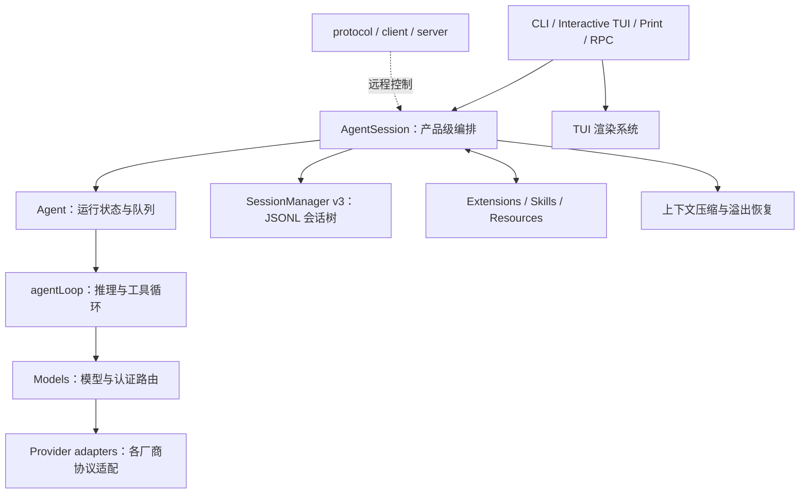

# PI 路线图

这套仓库不是一个单体的 “agent harness”，而是一套分层代理运行栈。

当前真正投入使用的主链路是：



而 [`packages/agent/src/harness`](./pi/packages/agent/src/harness) 下的 `AgentHarness` 是正在建设的 Harness v2。它的存储、状态归约和遥测基础已经存在，但核心的 `prompt()`、`compact()`、`resume()`、hook、lane 执行仍然没有实现。

因此，理解当前系统时，应把 `AgentSession` 看成实际的产品级 harness，而不是从 `AgentHarness` 开始读。

# 一、四层核心结构

## 1. `pi-ai`：统一所有模型供应商

入口主要是：

- [`models.ts`](./pi/packages/ai/src/models.ts:156)
- [`types.ts`](./pi/packages/ai/src/types.ts)
- [`event-stream.ts`](./pi/packages/ai/src/utils/event-stream.ts:4)

它解决的问题是：OpenAI、Anthropic、Google 等供应商的消息、流式事件、工具调用、认证、错误格式都不同。

解决方案是把差异压到 provider adapter 下面，上层只处理统一模型：

```text
Message
AssistantMessageEvent
ToolCall
Usage
StopReason
Model metadata
```

`Models` 负责：

- 模型注册与查询
- provider 选择
- API key、OAuth 等认证解析
- provider、model、request headers 合并
- 动态模型列表刷新
- 把请求委托给对应 provider

一个重要约定是：模型调用失败通常被编码为一个 `AssistantMessage`，其 `stopReason` 为 `error` 或 `aborted`，而不是随意从流中抛异常。这样 agent loop 能用统一方式结束、持久化和展示失败消息。

## 2. `pi-agent-core`：最小代理循环

核心文件：

- [`agent.ts`](./pi/packages/agent/src/agent.ts:173)
- [`agent-loop.ts`](./pi/packages/agent/src/agent-loop.ts:155)
- [`types.ts`](./pi/packages/agent/src/types.ts:149)

职责分得比较清楚：

- `agentLoop`：无产品 UI 的推理—工具循环
- `Agent`：在 loop 外增加状态、队列、事件屏障和生命周期
- `AgentMessage`：应用内部消息
- `Message`：真正发给模型的标准消息

`Agent` 的主要状态包括：

```text
systemPrompt
model
thinkingLevel
tools
messages
isStreaming
streamingMessage
pendingToolCalls
error
```

它只允许一个活跃运行，但支持两个输入队列：

- `steer`：尽快改变当前任务方向
- `followUp`：当前任务结束后再执行

两种队列都支持：

- `one-at-a-time`
- `all`

## 3. `coding-agent`：实际的产品级 harness

核心入口是 [`createAgentSession()`](./pi/packages/coding-agent/src/core/sdk.ts:169)，它组装：

- 模型运行时
- `Agent`
- 会话存储
- 工具
- 扩展
- skills 和 prompt templates
- 项目上下文
- compaction
- 认证、配置和运行模式

实际编排中心是 [`AgentSession`](./pi/packages/coding-agent/src/core/agent-session.ts:305)。

它负责：

- 接收用户输入
- 展开 skills 和模板
- 运行扩展输入 hook
- 检查模型和认证
- 触发自动压缩
- 调用 `Agent.prompt()`
- 保存消息
- 处理 retry、overflow、compaction
- 管理分支和会话切换
- 把事件转给 TUI、RPC 或 SDK 调用者

这也是为什么 `AgentSession` 文件很大：它是产品策略汇聚层，不只是一个简单 wrapper。

## 4. `pi-tui`：终端渲染引擎

[`packages/tui`](./pi/packages/tui) 是一个独立终端 UI 框架，不依赖 agent 语义。

基本组件契约类似：

```ts
render(width): string[]
handleInput?(data): void
invalidate?(): void
```

主要能力包括：

- 差量渲染
- 主屏幕 scrollback 保留
- alternate screen 全屏布局
- overlay
- 编辑器和自动补全
- Markdown、ANSI、图片
- CJK 宽度计算
- 虚拟终端测试

`coding-agent` 的 Interactive Mode 负责把 `AgentSession` 事件翻译成这些组件。

# 二、一条用户请求的真实执行链

以交互模式输入一句话为例：

1. `AgentSession.prompt()` 先识别命令、扩展输入、skills 和模板。
2. 如果 Agent 正在运行，输入进入 `steer` 或 `followUp` 队列。
3. 检查模型认证和上下文长度，必要时预先 compaction。
4. 扩展收到 `before_agent_start`，可以注入消息或覆盖 system prompt。
5. `Agent.prompt()` 快照当前配置并启动 `agentLoop`。
6. 模型边界先执行：

   ```text
   AgentMessage[]
       -> transformContext()
       -> convertToLlm()
       -> Message[]
       -> provider
   ```

7. provider 的流式结果变成 `message_start/update/end` 事件。
8. 如果 assistant 产生工具调用，进入工具执行阶段。
9. 工具结果以 `toolResult` 消息追加，再调用模型。
10. 当前 turn 结束后检查停止条件、steering 和 follow-up。
11. `AgentSession` 在 `message_end` 时把完整消息写入会话。
12. 如果发生上下文溢出，移除失败响应、压缩上下文并重试一次。
13. 所有 retry、compaction 和排队任务完成后，外部 `prompt()` 才真正 settle。

核心循环可以简化为：

```text
用户消息
  ↓
模型生成 assistant
  ↓
有工具调用？──否──→ turn 结束
  │
  是
  ↓
执行工具并生成 toolResult
  ↓
再次调用模型
```

# 三、工具调用的设计

工具类型和事件定义在 [`types.ts`](./pi/packages/agent/src/types.ts:361)，执行实现在 [`agent-loop.ts`](./pi/packages/agent/src/agent-loop.ts:411)。

一次工具调用经过：

```text
查找工具
→ prepareArguments
→ TypeBox 参数校验
→ beforeToolCall
→ execute
→ afterToolCall
→ 生成 toolResult
```

这里有几个值得注意的语义：

- 工具抛异常不会击穿整个 loop，而会转换成 `isError: true` 的工具结果。
- hook 可以在执行前阻止工具，也可以在执行后修改结果。
- 全局 sequential，或者批次中存在要求 sequential 的工具时，整个批次顺序执行。
- 并行模式下，preflight 仍按顺序进行，真正允许的工具 effect 才并发执行。
- `tool_execution_end` 按实际完成顺序发出。
- 最终写入上下文的 `toolResult` 仍保持原始工具调用顺序。

最后一点很重要：它既保留并发效率，又避免消息顺序因运行时调度而不确定。

如果 assistant 因长度限制而中断，该消息里的工具调用不会执行，而会生成解释性错误结果，避免执行参数不完整的工具。

# 四、事件系统为什么分两层

低层 `agentLoop` 返回一个异步事件流。观察者读取事件，但本身不是执行屏障。

`Agent` 在其外部增加了顺序等待的 listener 语义：

```text
loop 产生事件
→ Agent 更新内部状态
→ 按顺序等待所有 listener
→ 继续处理下一事件
```

例如 `message_end` 到达时：

1. Agent 先把消息放入正式消息列表；
2. 清理 streaming 状态；
3. 再调用外部 listener。

因此 `AgentSession` 收到 `message_end` 时，Agent 状态已经一致，可以安全持久化。

需要留意：低层 event stream 和 `Agent.subscribe()` 的同步语义不同。扩展核心事件时不能把两者当成相同机制。

# 五、会话、分支与上下文压缩

## 当前 SessionManager v3

当前生产会话由 [`session-manager.ts`](./pi/packages/coding-agent/src/core/session-manager.ts) 管理。

会话是追加写入的 JSONL：

```text
SessionHeader
SessionEntry { id, parentId, timestamp, type, ... }
SessionEntry
SessionEntry
...
```

每条记录带 `parentId`，因此整个文件实际上是一棵树。

分支不需要复制或删除历史：

```text
A → B → C
     └→ D → E
```

切分支只是改变当前 leaf；下一次 append 从该 leaf 创建新子节点。读取当前上下文时，从 leaf 沿 `parentId` 回溯到根。

这是一个很好的设计选择：

- 历史不可变
- 分支便宜
- 容易审计
- 崩溃恢复简单
- 上下文只是历史的一个投影视图

会话文件还会延迟到出现 assistant 消息后才真正创建，避免为空操作留下大量无价值文件。

## Compaction

实现在 [`compaction.ts`](./pi/packages/coding-agent/src/core/compaction/compaction.ts)。

它不是删除历史，而是改变“发给模型的上下文投影”：

```text
完整历史仍在 JSONL
       ↓
旧消息摘要 + 最近原始消息
       ↓
模型上下文
```

触发阈值约为：

```text
contextWindow - reserveTokens
```

压缩切点不会落在 `toolResult` 上，否则会形成没有对应 tool call 的非法消息序列。

摘要会继承上一轮摘要，并保留重要文件操作信息。发生模型 context overflow 时，系统会：

1. 保存失败响应；
2. 从活跃 Agent 上下文移除它；
3. compact；
4. 重试。

普通阈值触发的压缩不会重新执行一个已经成功的回复。

# 六、扩展系统的定位

扩展 API 允许注册：

- 工具
- 命令
- shortcuts
- provider
- 事件处理器
- 输入转换
- UI renderer、widget
- session hook
- 模型和请求 hook

这套仓库刻意没有把 MCP、subagent、plan mode、permission popup、todo、后台 bash 等全部写死在 core 中。很多产品能力应由扩展实现。

核心只提供：

```text
稳定运行循环
+ hook 点
+ 工具注册
+ 会话与 UI 接口
```

资源加载器还会收集：

- `AGENTS.md`、`CLAUDE.md`
- skills
- prompt templates
- themes
- extensions
- system prompt
- 项目设置

Project Trust 只决定是否加载项目本地代码和配置。它不是工具调用级权限系统，也不是文件系统 sandbox。核心工具默认运行在当前用户权限下，需要真正隔离时仍应使用容器、sandbox 或扩展策略。

# 七、Harness v2：目标与当前现实

规范主要在：

- [`harness-v2.md`](./pi/packages/agent/docs/harness-v2.md:23)
- [`harness-v2-state-machine.md`](./pi/packages/agent/docs/harness-v2-state-machine.md:1)
- [`agent-harness.ts`](./pi/packages/agent/src/harness/agent-harness.ts:305)
- [`reducer.ts`](./pi/packages/agent/src/harness/reducer.ts:505)
- [`session/types.ts`](./pi/packages/agent/src/harness/session/types.ts:290)

它想解决当前 `AgentSession` 的几个长期问题：

- 运行状态部分在内存、部分在 JSONL，恢复语义复杂
- 并行 lane、暂停、恢复、checkpoint 难以严谨表达
- effect 和状态变更耦合
- 崩溃时很难判断某一步“未开始、进行中还是已完成”

v2 的目标模型是：

```text
持久化 SessionTree
  + lane
  + operation
  + step
  + checkpoint
  + effect record
  + 纯 reducer
```

预期原则是：

- 日志是 durable source of truth
- reducer 只根据记录重建状态
- 外部 effect 与状态归约分离
- 每个 operation/step 有显式生命周期
- 可重放、可恢复、可人工 drive
- 存储实现可以替换为 memory、JSONL、SQLite
- `ExecutionEnv` 抽象文件系统和 shell，方便本地与 sandbox 环境切换

目前已经完成的部分主要有：

- Session/Storage 接口
- Memory、JSONL、SQLite 后端基础
- 记录合法性检查
- 纯 lane reducer
- 基础 telemetry
- scaffold hardening

但 [`AgentHarness`](./pi/packages/agent/src/harness/agent-harness.ts:347) 只能创建空会话；对已有记录的会话会拒绝打开。`prompt`、`compact`、`resume`、watch、hooks、lane 操作基本都会返回 `HarnessNotImplemented`。

所以当前不能基于 v2 构建实际 agent 产品，也不能把设计文档中所有状态结构当成已经落地的稳定接口。

# 八、各包功能地图

| 包 | 职责 |
|---|---|
| `packages/ai` | 模型、provider、认证、统一消息与流事件 |
| `packages/agent` | Agent、agentLoop、工具执行、Harness v2 基础 |
| `packages/coding-agent` | 产品级会话编排、工具、扩展、资源、compaction、运行模式 |
| `packages/tui` | 独立终端 UI 和差量渲染 |
| `packages/telemetry` | 与厂商无关的 tracing/telemetry 契约 |
| `packages/protocol` | CBOR、帧格式、请求响应和快照协议 |
| `packages/client` | 远程 session client 和 transport 抽象 |
| `packages/server` | 实验性远程服务边界，不包含完整 agent service |
| `packages/session-backends/sqlite-node` | Harness v2 的 SQLite 持久化后端 |
| `packages/evals` | 使用真实 AgentSession 的模型行为评测 |

# 九、我对这套设计的判断

优点：

- provider 差异被隔离得很干净，agent loop 不感知厂商细节。
- `Agent` 与 `AgentSession` 分离，使核心循环可以独立测试和复用。
- JSONL 树把历史、分支和当前上下文明确分离。
- 工具并发执行但确定性落盘，兼顾性能和可复现性。
- 扩展系统强，很多产品策略不需要污染 core。
- 测试可以使用 faux provider、内存配置和虚拟终端，不依赖真实 API。

主要复杂点：

- 当前 SessionManager v3 和 Harness v2 两套会话模型并存，最容易造成概念混淆。
- `AgentSession` 聚合的职责很多，修改时需要同时考虑 persistence、extensions、compaction 和 UI。
- 低层事件流和高层 Agent listener 的屏障语义不同。
- `AgentHarness` 已经公开导出，但执行能力尚未完成。
- core 没有安全沙箱；Project Trust 也不能替代运行时权限控制。

# 十、最快阅读顺序

建议按真实调用链阅读：

1. [`sdk.ts`](./pi/packages/coding-agent/src/core/sdk.ts:169)：看整个系统如何装配。
2. [`agent-session.ts`](./pi/packages/coding-agent/src/core/agent-session.ts:1116)：看一次 prompt 的产品级流程。
3. [`agent.ts`](./pi/packages/agent/src/agent.ts:409)：看状态、队列和事件。
4. [`agent-loop.ts`](./pi/packages/agent/src/agent-loop.ts:155)：看真正的推理与工具循环。
5. [`models.ts`](./pi/packages/ai/src/models.ts:636)：看认证和 provider 路由。
6. [`session-manager.ts`](./pi/packages/coding-agent/src/core/session-manager.ts)：看 JSONL 树和上下文投影。
7. [`compaction.ts`](./pi/packages/coding-agent/src/core/compaction/compaction.ts)：看长会话处理。
8. `extensions`、`resources`、`tools`：按需要理解产品能力。
9. 最后再读 [`harness-v2.md`](./pi/packages/agent/docs/harness-v2.md)，将其视为下一代架构目标，而非当前主链路。

最核心的心智模型可以压缩成一句话：

> `pi-ai` 统一模型，`agentLoop` 执行推理循环，`Agent` 管理运行状态，`AgentSession` 注入产品策略，`SessionManager` 保存不可变历史，`TUI/RPC` 只是不同的交互外壳。