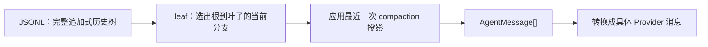

核心结论：这套实现把“完整历史”“当前分支”“发给模型的上下文”分成三层。分支不会复制或删除历史；上下文压缩也不会修改旧消息，而只是改变当前分支投影成模型上下文的方式。



实现主要分布在：

- [session-manager.ts](D:/Code/NLP/Agent/pi/packages/coding-agent/src/core/session-manager.ts:855)：持久化、历史树、leaf、上下文重建。
- [agent-session.ts](D:/Code/NLP/Agent/pi/packages/coding-agent/src/core/agent-session.ts:1790)：手动/自动压缩、溢出恢复、树导航。
- [compaction.ts](D:/Code/NLP/Agent/pi/packages/coding-agent/src/core/compaction/compaction.ts:710)：压缩切点、摘要生成。
- [branch-summarization.ts](D:/Code/NLP/Agent/pi/packages/coding-agent/src/core/compaction/branch-summarization.ts:108)：废弃分支摘要。
- [agent-session-runtime.ts](D:/Code/NLP/Agent/pi/packages/coding-agent/src/core/agent-session-runtime.ts:262)：创建新会话文件的 fork。

## 1. 会话的物理结构

当前 coding-agent 使用版本 3 的 JSONL 格式。第一行是会话头，后面每行一个 entry，定义见 [session-manager.ts](D:/Code/NLP/Agent/pi/packages/coding-agent/src/core/session-manager.ts:30)。

```json
{"type":"session","version":3,"id":"session-id","cwd":"D:/repo"}
{"type":"message","id":"u1","parentId":null,"message":{"role":"user","content":"..."}}
{"type":"message","id":"a1","parentId":"u1","message":{"role":"assistant","content":[...]}}
```

每个普通 entry 都有：

```ts
{
  type: string;
  id: string;
  parentId: string | null;
  timestamp: string;
}
```

因此它不是简单的消息数组，而是一棵通过 `parentId` 构造的树。

### Entry 类型

| 类型 | 功能 | 进入模型上下文 |
|---|---|---:|
| `message` | 用户、助手、工具结果等消息 | 是 |
| `compaction` | 上下文压缩摘要和保留边界 | 是 |
| `branch_summary` | 被放弃分支的摘要 | 是 |
| `custom_message` | 扩展注入的上下文消息 | 是 |
| `model_change` | 模型切换 | 否，单独恢复配置 |
| `thinking_level_change` | 推理等级切换 | 否，单独恢复配置 |
| `custom` | 扩展持久化状态 | 否 |
| `label` | entry 标签变更 | 否 |
| `session_info` | 会话显示名称 | 否 |

具体转换由 [sessionEntryToContextMessages](D:/Code/NLP/Agent/pi/packages/coding-agent/src/core/session-manager.ts:383) 完成。

`custom` 和 `custom_message` 的差异尤其重要：

- `custom` 是扩展自己的持久化数据，不能污染 LLM 上下文。
- `custom_message` 是扩展明确希望模型看到的内容。

## 2. 追加式历史树

所有持久化操作最终都经过 `_appendEntry()`：

1. 把新 entry 放进内存数组。
2. 加入 `id -> entry` 索引。
3. 把 `leafId` 移到新 entry。
4. 追加写入 JSONL。

实现见 [_persist](D:/Code/NLP/Agent/pi/packages/coding-agent/src/core/session-manager.ts:1015) 和 [_appendEntry](D:/Code/NLP/Agent/pi/packages/coding-agent/src/core/session-manager.ts:1044)。

这带来两个核心性质：

- 历史只增长，旧 entry 不修改、不删除。
- 任何追加都会移动当前 leaf，包括 label、session info、custom entry。

例如：

```text
u1 → a1 → u2 → a2
```

回到 `a1` 后继续：

```text
          ┌→ u2 → a2
u1 → a1 ─┤
          └→ u2' → a2'
```

JSONL 的物理顺序可能是：

```text
u1, a1, u2, a2, u2', a2'
```

但树关系由 `parentId` 决定，而不是由行号决定。

`getEntries()` 返回所有物理 entry；`getBranch()` 才会从 leaf 沿 `parentId` 向上回溯，得到当前路径，见 [getBranch](D:/Code/NLP/Agent/pi/packages/coding-agent/src/core/session-manager.ts:1260)。

## 3. 文件创建与恢复

新会话并不会立刻创建文件。

在第一条 assistant 消息出现之前，header、用户消息、模型配置等都暂存在内存。第一条 assistant 消息完成时，才一次性创建文件并写入此前缓冲的全部 entry。这样可以避免留下大量没有模型响应的空会话文件。

之后每个 entry 都同步追加成一行。

重新打开时：

1. 逐行解析 JSONL。
2. 重建 `id -> entry` 索引。
3. 把最后一个成功解析的非 header entry 作为 leaf。
4. 从该 leaf 重建当前路径和上下文。

这有一个重要限制：

> 当前 leaf 没有独立持久化记录。

`branch()` 和 `resetLeaf()` 只移动内存指针，见 [branch](D:/Code/NLP/Agent/pi/packages/coding-agent/src/core/session-manager.ts:1360)。如果移动后没有追加任何 entry，关闭再打开会话，leaf 会回到物理文件最后一个 entry。

因此：

- “导航后继续说话”是持久的，因为新消息会从新位置追加。
- “只导航、不追加，然后退出”不是持久的。
- 导航时添加 branch summary 或 label 也能间接持久化新位置，因为它们会产生新 entry。

另外，解析器会跳过空行和无法解析的行。这提供了一定的尾部损坏容忍，但缺少事务、校验和、完整树验证。如果中间 entry 损坏或父节点缺失，某条路径可能被截断。

## 4. 当前分支如何变成模型上下文

上下文重建入口是 [buildSessionContext](D:/Code/NLP/Agent/pi/packages/coding-agent/src/core/session-manager.ts:461)。

它分两条路径处理：

### 配置恢复

沿完整当前分支扫描：

- 最后一次 `thinking_level_change` 决定 thinking level。
- 最后一次 `model_change` 或 assistant 消息中的 provider/model 决定当前模型。

所以即使模型切换 entry 不进入提示词，重新打开会话时仍能恢复配置。

### 消息恢复

先执行 [buildContextEntries](D:/Code/NLP/Agent/pi/packages/coding-agent/src/core/session-manager.ts:418)，处理最近一次压缩，再把 entry 转换为 `AgentMessage[]`。

压缩摘要和分支摘要都被包装成用户侧上下文消息：

- Compaction：`The conversation history before this point was compacted...`
- Branch：`The following is a summary of a branch that this conversation came back from...`

前缀定义见 [messages.ts](D:/Code/NLP/Agent/pi/packages/coding-agent/src/core/messages.ts:11)。

## 5. 同一会话内的分支导航

`navigateTree()` 在同一个 JSONL 文件里移动 leaf，见 [agent-session.ts](D:/Code/NLP/Agent/pi/packages/coding-agent/src/core/agent-session.ts:2905)。

假设当前路径是：

```text
u1 → a1 → u2 → a2
```

用户选中 `u2`，希望修改后重新执行。

处理过程是：

1. 找到旧 leaf `a2` 和目标 `u2` 的最近公共祖先。
2. 收集即将离开的旧侧内容。
3. 因为目标是用户消息，所以新 leaf 移到 `u2.parentId`，也就是 `a1`。
4. 把原 `u2` 文本返回编辑器。
5. 用户修改后，新消息从 `a1` 后面追加。

结果：

```text
          ┌→ u2 → a2
u1 → a1 ─┤
          └→ u2' → a2'
```

### 带分支摘要的导航

如果开启分支摘要：

```text
u1 → a1 → branch_summary → u2' → a2'
```

原来的 `u2 → a2` 仍然存在。

对于“选中 `u2` 重新编辑”的情况，摘要收集的是目标之后被放弃的内容，例如 `a2`；原 `u2` 本身会返回编辑器，不重复塞入摘要。

如果跳到另一个兄弟分支，则摘要包含从公共祖先之后开始的整个旧侧分歧路径。

分支摘要的作用不是节省窗口，而是：

> 在切换路径后，将旧分支产生的有用发现带入新分支。

它会优先保留旧分支较新的消息，有独立 token budget，并追踪读取、修改过的文件。

## 6. 创建新会话文件的 fork

`fork()` 与同文件导航不是一回事。

它通过 [createBranchedSession](D:/Code/NLP/Agent/pi/packages/coding-agent/src/core/session-manager.ts:1412) 创建一个新的 JSONL 文件：

1. 获取根到目标 leaf 的路径。
2. 只复制这条路径，不复制其他兄弟分支。
3. 创建新的 session id。
4. header 的 `parentSession` 指向原会话文件。
5. 保留原 entry id。
6. 重新连接被保留 entry 的父子关系。
7. 标签 entry 不直接复制，而是在尾部重建最终解析出的标签状态。

例如原会话：

```text
          ┌→ u2 → a2
u1 → a1 ─┤
          └→ u3 → a3
```

在 `a1` fork 后，新文件只有：

```text
u1 → a1
```

后续工作完全写入新文件，原文件不受影响。

限制是：新会话文件只有在第一条 assistant 消息后才真正存在，所以尚未持久化的初始会话不能正常进行文件级 fork。

## 7. 上下文压缩的本质

这里的 compaction 是“语义摘要”，不是模型内部的 KV-cache 压缩，也不是删除 JSONL 历史。

假设物理路径是：

```text
u1 → a1 → tool1 → u2 → a2 → C → u3 → a3
```

其中 `C` 是 compaction entry：

```json
{
  "type": "compaction",
  "summary": "...",
  "firstKeptEntryId": "u2",
  "tokensBefore": 90000
}
```

物理历史仍是：

```text
u1, a1, tool1, u2, a2, C, u3, a3
```

但模型上下文投影成：

```text
C.summary
u2
a2
u3
a3
```

也就是说，`C` 在物理树上位于 `a2` 之后，但构建模型上下文时会被放到保留后缀之前：

```text
[旧历史摘要] + [压缩时保留的近期消息] + [压缩后新增消息]
```

旧消息仍可在会话树中查看、统计和重新分支。

## 8. 什么时候自动压缩

默认配置见 [compaction.ts](D:/Code/NLP/Agent/pi/packages/coding-agent/src/core/compaction/compaction.ts:132)：

```ts
{
  enabled: true,
  reserveTokens: 16384,
  keepRecentTokens: 20000
}
```

普通阈值为：

```text
当前上下文 token >
模型 contextWindow - reserveTokens
```

`reserveTokens` 用于给摘要生成和下一次模型输出预留空间。

Token 估算优先使用最近一次有效 assistant 响应返回的 usage：

- 不能是 error 或 aborted。
- usage 不能全为零。
- 再把该响应之后新增但尚未计入 usage 的消息按字符数近似补上。
- 文字通常按约 `chars / 4` 估算。
- 图片使用固定的较大估算。
- tool call 会计入工具名和参数 JSON。

刚完成 compaction 后，旧 assistant usage 已不代表新上下文，所以在下一次成功模型响应前，context usage 会暂时显示为未知。

## 9. 压缩切点

切点算法见 [findCutPoint](D:/Code/NLP/Agent/pi/packages/coding-agent/src/core/compaction/compaction.ts:403)。

它从最新消息向前累加 token，直到达到 `keepRecentTokens`，然后选择一个合法切点。

合法原则：

- 可以从用户类消息开始。
- 可以从 assistant 开始。
- 不能让孤立的 `toolResult` 成为第一条保留消息。
- 如果保留 assistant，它后面的工具结果会一起保留。
- model/thinking/label 等非上下文 entry 会跟随相邻消息处理。

“用户类消息”不只包含普通 user，还包含 bash execution、custom message、branch summary 和 compaction summary。

### 普通切点

```text
[需要摘要的旧历史]
u5 → a5 → tool5 → u6 → a6
↑ firstKept
```

生成旧历史摘要，保留 `u5` 之后的内容。

### 回合中间切点

如果最近一个回合特别大，预算可能要求从某条 assistant 消息开始保留：

```text
u5 → a5 → tool5 → a6 → tool6
           ↑ firstKept
```

直接丢掉 `u5 → a5` 会使 `a6/tool6` 失去请求背景。因此代码会生成两部分摘要：

```text
旧历史摘要
---
Turn Context (split turn):
当前回合前缀摘要
```

然后保留 `a6 → tool6`。

这是一个重要设计：既避免孤立工具结果，也避免在长 agent 回合中丢失用户目标。

## 10. 多次压缩

再次压缩时，不会简单忽略旧摘要。

`prepareCompaction()` 会找到之前的 compaction：

- 旧摘要作为 `previousSummary` 传给新的总结请求。
- 上次保留的消息这次可能被纳入摘要。
- 新摘要要求保留旧摘要中仍然有效的信息。
- 当前只使用最近一次 compaction 作为最终上下文边界。

因此它是迭代摘要：

```text
S1 = summarize(history1)
S2 = update(S1, newly-summarized messages)
S3 = update(S2, more messages)
```

而不是不断向模型同时塞入 `S1 + S2 + S3`。

摘要模板会要求保存：

- 当前目标。
- 约束。
- 已完成和正在进行的工作。
- 关键决策。
- 下一步。
- 文件路径、函数名和重要错误。
- 已读取、修改的文件列表。

实现入口见 [prepareCompaction](D:/Code/NLP/Agent/pi/packages/coding-agent/src/core/compaction/compaction.ts:710)。

## 11. 手动压缩、自动压缩和溢出恢复

### 手动压缩

`AgentSession.compact()`：

1. 中止当前正在运行的 agent。
2. 获取当前 branch，而不是整个物理树。
3. 运行 `session_before_compact` 扩展钩子。
4. 扩展可以取消压缩或直接提供摘要。
5. 否则调用模型生成摘要。
6. 追加 `compaction` entry。
7. 重新执行 `buildSessionContext()` 替换 Agent 内存上下文。
8. 发出 compaction 完成事件。

代码见 [agent-session.ts](D:/Code/NLP/Agent/pi/packages/coding-agent/src/core/agent-session.ts:1790)。

### 阈值自动压缩

一次正常 assistant 响应结束后，如果上下文接近窗口上限：

- 保存已经完成的回答。
- 执行压缩。
- 不自动要求模型继续回答。

这是“为下一轮腾空间”。

### 上下文溢出恢复

如果 provider 返回 context overflow 或可恢复的 `length`：

1. 失败 assistant 响应已经写入 JSONL，保留审计记录。
2. 将它从当前 Agent 内存消息中移除。
3. 对当前分支执行压缩。
4. 重建上下文后，再确保最终失败响应没有被恢复进 live context。
5. 从原用户消息或 tool result 位置 `continue()`。
6. 同一个触发最多进行一次压缩重试，防止无限循环。

代码见 [_checkCompaction](D:/Code/NLP/Agent/pi/packages/coding-agent/src/core/agent-session.ts:1962)。

只有失败 assistant 的 provider/model 与当前选择的模型一致时，才按它的溢出错误触发恢复，避免切换到更大模型后仍受旧模型错误影响。

## 12. 边界情况

当前算法有几个明确边界：

- 最近一条用户消息本身极大时，它通常不能被摘要掉，因为它是当前回合的起点。
- 巨型 tool result 必须连同之前发起 tool call 的 assistant 一起保留。
- `keepRecentTokens` 是近似预算，不是严格的压缩后上限。
- 摘要自身也占 token。
- 两次压缩之间如果没有新的有效 assistant usage，UI 无法准确计算 context percentage。
- 摘要模型调用成功、但 compaction entry 尚未追加时进程崩溃，该次摘要不会成为持久状态。

## 13. 统计与上下文不是一个口径

会话统计通常遍历全部物理 entry，包括：

- 已被压缩掉的旧消息。
- 已放弃分支。
- 失败 assistant 响应。
- 所有历史模型调用的 usage/cost。

这反映“实际发生过、实际计费过的工作”。

模型上下文则只包含：

```text
当前 leaf 的祖先路径
+ 最近 compaction 投影
```

所以“会话总 token/cost”和“当前上下文 token”不应该相等。

## 14. 当前 v3 与 AgentHarness v2 的关系

当前 coding-agent 的生产运行路径仍是 v3 `SessionManager + AgentSession`。仓库里的 [harness-v2.md](D:/Code/NLP/Agent/pi/packages/agent/docs/harness-v2.md:19) 描述的是更完整的新 harness 目标契约，两者不能混为一套已经上线的行为。

| 能力 | 当前 coding-agent v3 | Harness v2 目标 |
|---|---|---|
| 历史 | 追加式 entry 树 | 共享的不可变 entry 树 |
| 活动位置 | 单个内存 leaf | 持久化的命名 lane leaf |
| 并发分支 | 一个活动 leaf | 多 lane 并行 |
| 模型配置 | 树上的 change entry | lane 的完整配置记录 |
| 操作状态 | 主要在内存 | operation/step/attempt 持久记录 |
| 导航持久性 | 必须靠后续 entry 固化 | lane leaf 本身持久化 |
| 崩溃恢复 | 重放 JSONL，恢复静态会话 | 从操作记录恢复未完成运行 |
| 原子性 | 单行追加 | 多 mutation 原子提交 |
| 测试能力 | 常规执行测试 | 每个 effect 边界可手动 stepping |

v2 的核心升级是：

> 树只保存对话事实；lane 保存当前位置和配置；operation log 保存“正在做什么、做到哪一步”。

文档将其概括为四类状态：

1. 共享会话树。
2. 命名 lanes。
3. 每个 lane 的 operation/step 记录。
4. 全局 facts。

相关设计原则见 [harness-v2.md](D:/Code/NLP/Agent/pi/packages/agent/docs/harness-v2.md:48)。

## 15. 最终心智模型

可以用下面几句话记住整个设计：

1. 会话文件不是线性聊天记录，而是追加式历史树。
2. leaf 决定当前分支，但 v3 的 leaf 本身没有独立持久化。
3. 同文件导航只移动 leaf；fork 才会创建新的会话文件。
4. 分支摘要保存“离开的路径上学到了什么”。
5. compaction 保存“当前路径较早部分讲了什么”。
6. 压缩不删除历史，只改变模型上下文投影。
7. 模型配置从完整当前路径恢复，不依赖压缩后的消息列表。
8. 总 usage 统计全部历史，context usage 只统计当前投影。
9. Harness v2 进一步把 leaf、配置和运行过程变成可恢复的持久状态。

## 同一会话创建分支的含义

同一会话内创建多个分支，本质是在保留共同上下文的前提下，探索不同的后续路径。

例如：

```text
用户：实现登录功能
  └─ 助手：方案 A，改了 5 个文件
       ├─ 用户：继续优化性能
       └─ 用户：回到这里，改用 JWT 方案
```

两条后续路径共享“实现登录功能”和最初分析，但各自保留不同的修改、工具调用和结论。

主要优势：

- 可回退重试：模型走偏、工具误操作、需求变更时，回到任意历史节点继续，而不是删除历史后重来。
- 支持编辑旧问题：修改一条早期用户消息后，在其父节点上产生新分支；原回答仍保留，可对比修改前后的结果。
- 支持方案探索：可以比较不同架构、不同提示词、不同模型或不同实现策略。
- 保留可追溯性：每条分支都记录“当时模型看到了什么、调用了什么工具、产生了什么结果”，便于审计和复现。
- 避免复制上下文：分支通过 `parentId` 共享祖先消息；不像复制一份完整对话那样浪费存储和上下文。
- 配合分支摘要：切换到新路径时，可将旧分支的重要发现压缩成 `branch_summary` 带入新路径，既不完全丢失经验，也不把整段旧历史重新塞给模型。

在 pi 中，分支不是并行运行多个 agent；当前通常仍只有一个 active leaf。分支只是保存多个“可继续的历史位置”。

代价也存在：历史树会更复杂，所有分支会增加会话文件大小和总用量统计；因此 pi 需要 `/tree`、标签、分支摘要和上下文压缩来管理复杂度。