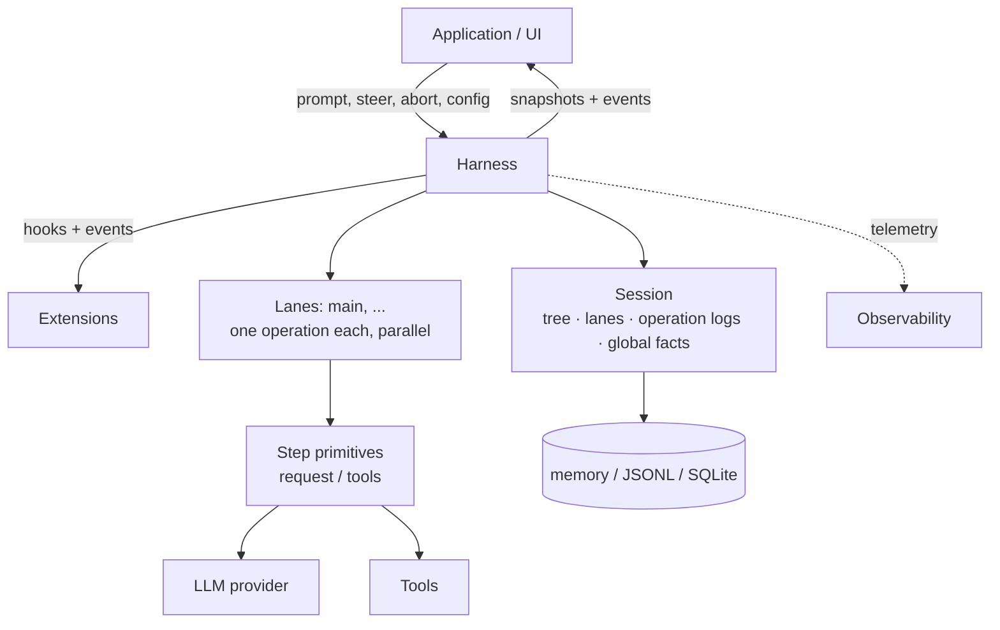
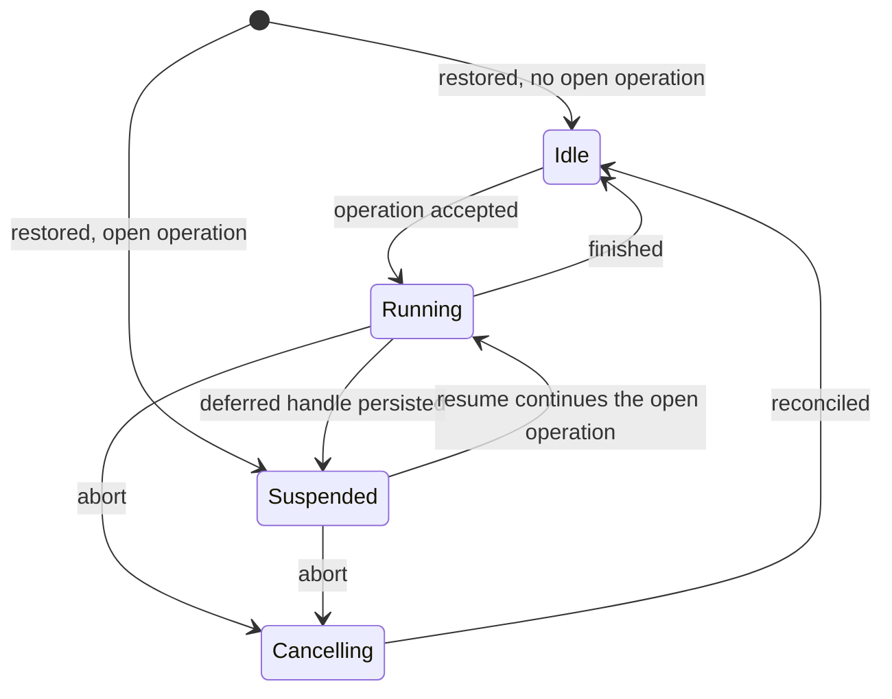

# 持久 AgentHarness 设计

> **兼容策略。** 旧 coding-agent v3 JSONL 会话必须能打开并恢复空闲。这是唯一的向后兼容要求。`packages/agent/src/harness` 和 `packages/session-backends/sqlite-node` 中所有其他格式和 API（及其各自的测试）都可以破坏。我们不为其他任何东西编写迁移、schema 版本化或转换路径。



Harness 针对一个会话执行 run。会话持有四种状态（第 2 节）。泳道在一个 harness 内并行执行（第 3 节）。存储后端编码会话（Part III）。

# Part I — 概念

## 1. 目标

- **持久 run。** 已接受的提示是一个持久操作。崩溃后，新进程恢复会话。它从最后一个安全边界恢复 run。崩溃能产生的每个状态都可恢复。
- **泳道。** 会话承载一个或多个泳道。泳道是对话树中的命名位置。每个泳道一次至多运行一个操作。泳道并行运行。Run 和其排队消息属于接受它们的泳道。例：一个 Slack 频道是一个会话；每个线程是一个泳道。交互式 pi 用一个泳道，不在其 UI 中显示这个概念。扩展得到完整 harness API，包括泳道。例：subagent 工具在其父会话的第二个泳道上运行。
- **无部分结果。** 任何操作内的崩溃 — run、压缩、导航 — 留下两种状态之一：操作没有发生，或恢复能完成它。中间任何东西不可观察。
- **Harness API。** 事件观察执行，不能改变它。钩子拦截执行，能改变它：上下文、请求、工具、run 边界。扩展基于事件和钩子构建。
- **确定性步进。** 每个效果 — 持久写、provider 请求、工具执行、钩子、定时器 — 跨越一个注入边界。`drive: "manual"` 下 harness 在每个效果前停放，测试逐调用驱动它：在任何边界停止、注入输入、或关闭并重新打开模拟崩溃。生产和测试运行相同过程；drive 模式只控制边界（第 15 节）。
- **可观察性。** 所有执行都可为日志和追踪插桩，直到 provider 请求和响应内部。此通道与钩子系统分离。
- **UI 模型。** 客户端得到一个原子快照，然后一个实时事件流。事件不重放。重连意味着新快照。
- **单写者。** 一个 harness 一次写一个会话。服务层强制这一点。会话的所有泳道活在那一个 harness 中。恢复把单写者不能产生的状态当损坏。
- **v3 会话加载。** 旧 coding-agent v3 JSONL 文件不变地打开并恢复空闲。

## 非目标

- **Exactly-once 钩子副作用。** 钩子结果在消费它的记录或条目提交时持久。该提交前的崩溃可能重跑钩子（第 11 节重放表）。钩子自己产生的副作用对 harness 不可见：HTTP 调用、文件写。需要崩溃安全外部效果的钩子必须幂等，例如以操作 id 为键。
- **Provider 流恢复。** 部分流从不持久。中断的流请求被重试或放弃。Deferred 请求不同且在范围内：provider 立即返回 handle 并稍后提供结果（例如 Responses API 上的 `background: true`、批处理 API）。pi-ai 返回带停止原因 `deferred` 的 assistant 消息，携带 handle；它像任何 assistant 消息一样持久。兑付 handle 追加一个正常 assistant 消息。恢复看到未兑付的 handle 并 fetch 而不是为一个新请求付费。
- **多写者。** 一个会话上两个进程超出范围。服务层把会话的所有流量路由到持有其 harness 的进程。泳道覆盖看起来像多写者的工作负载：跨共享历史的并行线程。
- **复制。** 会话活在一个地方。无协调地同步发散副本是另一个设计。这不排除以后做。
- **Coding-agent 迁移。** 迁移 coding-agent 到 `AgentHarness` 超出范围。兼容意味着新 JSONL 仓库能读支持的 coding-agent v3 文件。

## 2. 会话是什么

会话是带四部分的持久状态：

1. **树** — 对话。带 `parentId` 链接的条目：消息、模型/思考/工具激活变更、压缩摘要、分支摘要、自定义条目。树是共享和被动的。它不属于任何泳道。它只增长；条目从不改变或删除。
2. **泳道** — 工作发生的地方。泳道是一个名字加一个叶：未来工作扩展的条目。每个会话都有泳道 `main`。应用以外部身份为键创建更多（一个 Slack 线程 id、一个邮件线程 id）。
3. **泳道操作日志** — 发生了什么、必须发生什么。每泳道一个扁平、按时间的记录序列：操作开始、步骤尝试、工具开始、消息排队、操作结束。这是持久性实现的地方：记录存在使新进程能在崩溃后继续泳道的工作。正常执行期间没有东西读它们。
4. **全局事实** — 会话作用域值，最新写胜出：会话名、条目标签。不是树的一部分。保持为只追加历史；读者看到最新值。

跨四部分的所有写共享一个单调序列号。序列给全局事实历史排序，并让泳道操作日志引用树位置。

```text
tree (shared, append-only)          lanes
a ── b ── c ── d                    main            → d   (op log: …)
      └── e ── f                    slack:171943…   → f   (op log: …)

global facts: name = "Refactor auth", label(b) = "checkpoint-1"
```

### 主动与被动

树和全局事实是被动的：共享数据，任何东西可读。

泳道是主动的。它拥有其叶、其操作日志（至多一个开放操作）、其队列、其待定写。两个泳道从不共享这些中任何。泳道的每个动作产生链到其叶的条目，或其自己操作日志中的记录。

### 不变量

- 树只是对话。没有泳道状态、没有编排状态、没有指针住在其中。
- 条目的父链从不改变。分支共享前缀；没有东西被复制。
- 泳道叶以恰好两种方式移动：泳道追加一个条目（叶成为该条目），或泳道导航（叶跳到已存在条目）。
- 操作日志记录从不影响树。删除每个操作日志留下完整有效的对话。
- 每泳道至多一个开放操作。一个泳道有两个开放操作的状态是损坏。
- 条目共享；记录不。两个泳道可以在其路径上有相同条目。记录恰好属于一个泳道。

记录不是树条目，因为它们描述执行，不是对话：它们从不进入模型上下文、transcript、分支查询或分叉，且在一个泳道内它们的顺序已是它们的含义 — 父链接不会添加任何东西。

## 3. 泳道

泳道是树中的命名位置加在其上串行化的工作。最接近的现有概念是在自己的 worktree 中签出的 git 分支：附加到位置的名字、被新工作推进、可移动到任何条目而不重写历史、从不签出两次。与 git 直觉的一个区别：导航把泳道移动到任何条目，不只是向前。

每个会话都有泳道 `main`。应用以名字和锚点条目创建更多泳道。泳道名是永久应用键：一个 Slack 线程 id、一个邮件线程 id。没有 UI 抽象地列出泳道；平台自己的 UI（线程列表）扮演那个角色。

泳道拥有：

- **其叶。** 新条目链到它并移动它。导航跳它。
- **其操作日志。** 至多一个开放操作。忙碌泳道上的第二个操作被拒绝；其他泳道不受影响。
- **其队列。** Steering、follow-up 和 next-run 消息指向一个泳道。
- **其配置视图。** 模型、思考级别和活跃工具是泳道叶背后路径上的条目。两个泳道可以运行不同模型而互不知道。工具实现、资源和流选项是 harness 全局的；只有其激活是按泳道的。

规则：

- 泳道并行运行操作。Harness 保持单写者；泳道记录和条目在共享序列中交错。
- 创建泳道不复制任何东西。泳道不删除或重命名。
- 一个泳道上的状态依赖变更在该泳道的变更行上线性化：验证、至多一个持久写、内存更新在下一个变更开始前完成（第 15 节）。Provider、工具、钩子和重试工作从不占用变更行。
- 同一叶上的两个泳道在下一个追加处分叉。树处理这个；泳道间没有协调。
- 带未完成操作的泳道恢复为挂起，独立于其兄弟。挂起有原因：崩溃，或 deferred provider 请求（第 1 节）。

## 4. 工作如何执行

### 操作

操作是泳道上持久工作的单元。三种：

- **Run** — 一个已接受的提示，经过所有自动 continuation：工具调用、steering、follow-up、自动压缩。当没有待定的东西时结束。
- **压缩** — 用摘要条目替换旧上下文。
- **导航** — 把泳道叶移动到已存在条目，可选带分支摘要。

操作在执行前被接受。接受是持久的：崩溃后，已接受操作要么被恢复完成，要么被显式关闭。每个已接受 run 以 `completed`、`failed` 或 `aborted`（被中止停止）结束。压缩和导航在其效果的决策钩子否决已接受结构化操作前还可以以 `declined` 结束。

### Run、回合、步骤

一个 run 是一系列回合。一个回合是一个 assistant 步骤加该 assistant 消息请求的完整工具批。

步骤是操作内可重试的工作单元：产生一个 assistant 消息、一个压缩摘要、或一个分支摘要。步骤可能做零、一个或几个 provider 请求。失败的尝试重试同一步骤；尝试计数是持久的并存活重启。Deferred provider 请求结束一个 assistant 步骤：handle 到达在一个持久化 assistant 消息内，该消息关闭步骤，操作挂起，兑付稍后追加真实结果（第 1 节）。

每个开始效果的工具调用也是一个步骤。`tool_started` 打开它；其工具结果条目关闭它。并行批同时持有几个开放工具步骤；其效果并发运行并按源顺序终结（第 14 节）。

### 队列与延迟写

两个机制把输入带入运行中的泳道。它们在中止行为上不同：

- **队列** 携带对话意图：`steer` 纠正当前工作，`followUp` 在模型会停止时添加工作，`nextRun` 种子泳道的下一个 run。Steering 和 follow-up 在中止时死亡；其 payload 返回给调用方。Next-run 消息存活。
- **延迟写** 携带事实：步骤在飞行时请求的条目和配置变更。它们存活中止，即使在取消期间也被应用。

两者在接受时都持久：接受调用把带完整 payload 的记录写到泳道操作日志，然后解决。树条目稍后写，在项被应用或消费时 — 模型第一次看到它的位置。如果进程在接受和树写之间死亡，恢复读记录并执行追加。已接受输入从不丢失。

### 检查点

回合之间，泳道经过一个检查点：

1. 应用待定延迟写。
2. 消费排队的 steering 消息。
3. 如果下一个请求放不下，压缩。

压缩也有一个反应式触发：一个揭示请求放不下的 provider 响应 — 溢出形式错误，或低于预期输出上限的 `length` 停止。该响应被丢弃，run 压缩并重试一次（第 6 节，"assistant 步骤处的上下文溢出"）。

带工具调用的回合强制另一个回合并让模型看到其结果 — 一个例外：每个终结工具结果都持久了 `terminate: true` 的批抑制自动工具 continuation（steering 或 follow-up 输入仍可开始另一个回合）。Follow-up 消息只在工具 continuation 和 steering 耗尽时被消费。当检查点发现没有待定的东西时 run 结束。

### 只追加上下文

> 跨一个泳道的请求，provider 上下文只在尾部增长。在之前请求尾部之前的插入使 provider 的 KV 缓存从该点起失效并使 token 成本倍增。

这个不变量是回合中途写延迟到检查点的原因：检查点应用追加在尾部。压缩是唯一有意的例外；它用一个完整缓存失效交换更小的上下文。

### 泳道生命周期



- 状态是每泳道的。一个例外：失败的存储写使整个 harness 故障。故障的 harness 停止所有效果并拒绝所有调用；原因修复后，重新打开从记录恢复每个泳道。
- **Suspended** 意味着：操作开放，没有东西执行。由崩溃后恢复到达，或在 deferred handle 持久化时有意到达。`resume()` 继续操作；`abort()` 不进一步执行地关闭它。
- **中止** 持久地记录取消、发信号给运行中的效果、然后返回。协调跟随：未解决的工具调用得到合成结果，transcript 得到一个关闭 assistant 消息。自动 drive 在后台运行它；手动 drive 让它停放在其下一个动作。

### 恢复（Resume）

恢复继续开放操作。它从不开始新的。入口点在记录结束处：重试未完成的步骤、兑付 deferred handle、协调半完成的工具批、或在下一个检查点继续。崩溃前接受的排队消息和延迟写仍待定并正常应用。

# Part II — 执行如何被记录

Part II 是后端中立的。它定义泳道写的记录、何时写、恢复如何读回。Part III 把它映射到 API 和存储。

## 5. 记录

### 持久性规则

> 效果前：写一个意图记录，命名将发生什么和它将产生的 id。效果后：把结果作为带恰好那些 id 的条目追加。

没有多记录原子性，也不需要。每个记录和每个条目单独持久。意图和结果之间的崩溃留下未完成的意图；恢复按意图类型决定：完成它、重试它、或以合成结果关闭它。当且仅当其预配 id 的条目存在时意图被完成。条目本身可以命名下一个持久状态：带 `stopReason: "deferred"` 的 assistant 条目完成了其尝试的预配追加并关闭步骤；保持未决的是操作 — 持久化的 handle 等待兑付（第 6 节）。带不同内容存在的预配 id 是损坏。

### 预配 id

意图记录携带尚不存在的条目的 id：

```ts
/** 带预分配 id 的条目 payload。parentId、seq 和 timestamp
    在条目追加时由存储分配：它链到泳道当时当前的叶。 */
type ProvisionedEntry<T extends Entry = Entry> =
  T extends Entry ? Omit<T, "parentId" | "seq" | "timestamp"> : never;
```

### 记录目录

每个记录属于一个泳道的操作日志。属于操作的记录携带 `runId`：该操作 `operation_started` 记录的 id。Next-run 队列记录（`queue_enqueued` 及其 `queue_cancelled`）和独立 `adjustment` 用量记录不携带 `runId`。

```ts
interface RecordBase {
  id: string;
  seq: number;            // 共享序列，第 2 节
  lane: string;
  timestamp: number;      // Unix ms
}

// 操作的接受边界。接受前决定的一切
// 在这里持久。此记录自己的 id 就是操作所有其他
// 记录携带的 runId。
interface OperationStartedRecord extends RecordBase {
  type: "operation_started";
  sourceLeafId: string | null;        // 接受时泳道的叶
  intent:
    | {
        kind: "run";
        /** 规范化调用方输入，在 skill/模板展开后、
            before_run 前。为 SuspendedOperation 和 before_resume 保留。 */
        originalPrompt: AgentMessage[];
        /** 已捕获 nextRun 项，然后提示，然后 before_run
            注入。完整 payload，预配 id。捕获发生在
            接受变更中（第 15 节）：运行时存在的项
            属于本 run；稍后的项属于下一个。 */
        initialMessages: ProvisionedEntry[];
        /** 仅当钩子覆盖了 system prompt 时存在；整个 run
            固定。缺席：systemPrompt 回调每请求运行。 */
        systemPromptOverride?: string;
        /** 以稳定钩子注册 id 为键的不透明状态。每个
            before_resume 处理程序只收到其 id 下的值。 */
        resumeData?: Record<string, JsonValue>;
      }
    | {
        kind: "compaction";
        customInstructions?: string;
        resultEntryId: string;          // 预配压缩条目
      }
    | {
        kind: "navigation";
        targetId: string | null;        // 目的地条目；null = 根
        summarize: boolean;
        customInstructions?: string;
        label?: string;                 // 全局事实，完成时写
        summaryEntryId?: string;        // 预配分支摘要条目
      };
}

// 在 abort() 解决时写。请求标记，不是终止状态：
// 协调跟随，然后带结果 "aborted" 的 operation_finished。
// 杀死本操作的 steer/follow-up 队列项；next-run 项存活。
interface AbortRequestedRecord extends RecordBase {
  type: "abort_requested";
  runId: string;
}

// 关闭操作。failed = 有序的持久失败（例如，
// 重试耗尽）。aborted = 被中止关闭。declined = 在任何
// 效果前被钩子否决。
interface OperationFinishedRecord extends RecordBase {
  type: "operation_finished";
  runId: string;
  outcome: "completed" | "aborted" | "failed" | "declined";
  error?: { code: string; message: string };
}

// 在可重试步骤的每次尝试前写。标记：我们即将
// 做这个，第 n 次。步骤被记录因为它们是
// 可重试的：持久计数跨重启限制重试 —
// 崩溃-重启循环不能重置它。每尝试一条记录；一次尝试
// 可能做零个或几个 provider 请求（拆回合压缩
// 做两个）。Deferred 结果不需要额外
// 记录：handle 活在持久化的 assistant 条目中（第 1 节）。
interface StepAttemptRecord extends RecordBase {
  type: "step_attempt";
  runId: string;
  step: "assistant" | "compaction" | "branch_summary";
  attempt: number;                     // 本步骤内 1 起始
  /** 该尝试成功时产生的条目。Assistant 尝试
      每次预配新 id；一个结构化步骤的所有尝试复用
      一个 id（手动：意图的；自动：第一次尝试的）。放弃
      错误条目完成最后一次尝试的 id。 */
  resultEntryId: string;
  /** 恰好对压缩步骤必需。持久化为什么
      生成摘要，使 resume 重新进入相同结构化工作而不
      重新推导上下文压力。 */
  compactionReason?: "manual" | "threshold" | "overflow";
}
// 恢复请求的模型不从记录读：泳道的
// 有效模型从其路径派生，且 deferred handle 的模型
// 在持久化的 assistant 条目中。

// 在 before_tool 和验证通过后、工具执行前写。
// assistantEntryId + toolIndex 是持久的调用身份。
interface ToolStartedRecord extends RecordBase {
  type: "tool_started";
  runId: string;
  assistantEntryId: string;
  toolIndex: number;
  toolCallId: string;
  toolName: string;
  effectiveArgs: Record<string, unknown>;   // before_tool 后
  resultEntryId: string;                    // 预配
  /** 工具声明的重放安全性，在执行时快照。
      恢复只在该字段 AND 当前工具声明都说 "safe" 时
      重新执行未完成的调用；否则写
      合成 "interrupted" 结果。 */
  replay: "never" | "safe";
}

// 队列接受。payload 在这里旅行；条目在
// 消费点出现。
interface QueueEnqueuedRecord extends RecordBase {
  type: "queue_enqueued";
  queue: "steer" | "followUp" | "nextRun";
  runId?: string;                      // nextRun 缺席
  target: ProvisionedEntry;
}

// 待定队列项的持久撤回，在消费前。没有
// 此记录崩溃会复活该项：恢复把没有其条目的
// queue_enqueued 当待定。
interface QueueCancelledRecord extends RecordBase {
  type: "queue_cancelled";
  runId?: string;                      // 匹配它杀死的 queue_enqueued
  entryId: string;                     // 入队 target 的预配 id
}

// 延迟写接受：步骤在飞行时请求的条目或配置
// 变更。在下一个检查点应用。
interface WriteDeferredRecord extends RecordBase {
  type: "write_deferred";
  runId: string;
  target: ProvisionedEntry;
}

// 成本台账。每当报告或调整用量时写，
// 不管响应如何。纯记账：削减、
// 恢复和有效性检查从不读它，所以它不添加恢复
// 状态和崩溃矩阵行。它记录报告的用量；传输
// 在流中途死亡可能计费没人报告的 token，且崩溃在
// 结算和此写之间丢失那一项 — 不可约窗口。
type UsageRecord = RecordBase & { type: "usage"; usage: Usage } & (
  // provider 请求结算了，不管结果。在任何
  // 分类、重试决定或丢弃前写。拆回合压缩
  // 写共享一个尝试的两条记录。不报告用量的待定 deferred fetch
  // 不写记录。
  | { cause: "assistant" | "compaction" | "branch_summary" | "deferred_fetch";
      runId: string; entryId: string; attempt: number; stopReason: TerminalStopReason }
  // 终结工具结果报告了嵌套 LLM 工作；它
  // 不报告时跳过。安全重放为第二次
  // 执行写第二条记录：两次都被计费。
  | { cause: "tool"; runId: string; entryId: string; toolCallId: string }
  // 钩子提供的摘要携带钩子自己测量的用量。
  | { cause: "hook"; runId: string; entryId: string }
  // 应用提供的，任何时候（lane.recordUsage）：协调、
  // 估计、修正。负值合法。
  | { cause: "adjustment"; runId?: string; entryId?: string; details?: JsonValue }
);

type LaneRecord = OperationStartedRecord | AbortRequestedRecord | OperationFinishedRecord
  | StepAttemptRecord | ToolStartedRecord | QueueEnqueuedRecord | QueueCancelledRecord
  | WriteDeferredRecord | UsageRecord;

type NewRecord<T extends LaneRecord = LaneRecord> =
  T extends LaneRecord ? Omit<T, "seq" | "timestamp"> : never;
```

被阻止或无效的工具调用不写 `tool_started`。没有效果开始，所以不需要意图：阻止以带 `isError: true` 和阻止原因作为内容的工具结果条目持久。该条目前的崩溃只丢失决定，恢复重新做它 — `before_tool` 为没有 `tool_started` 也没有结果的调用再次运行。

工具步骤不需要结果记录。其结果条目是完整的持久结果，包括批控制决定：工具结果条目持久 `terminate`（第 12 节）。执行后但结果条目前的崩溃遵循重放策略（第 6 节）；重新终结再次运行 `after_tool`，第 1 节非目标明确允许。

成本是唯一存在结果记录的关注点：**成本持久性不得依赖结果持久性**。可重试步骤恰好是设计为产生从不变成条目的响应的步骤 — 失败的尝试、耗尽的系列、被丢弃的溢出响应 — 且其花费不得随它们消失。因此每个 provider 请求在任何分类、重试决定或丢弃前以 `usage` 记录结算；工具报告和钩子报告的用量在其条目旁得到记录；应用为 harness 看不见的任何东西追加 `adjustment` 记录。

Harness 写的 `usage` 记录总是把 `entryId` 绑定到其测量所属条目的预配 id；该条目是否存在是另一个问题 — 失败尝试或被丢弃响应的 id 从不物化，这正是重点。三层干净分离：条目的 `usage` 字段是产生该条目的响应的**不可变快照**，在追加时写一次且从不触碰；**条目的有效成本**是读取时查询 — 绑定到其 id 的所有泳道 `usage` 记录之和，基础加调整；**会话的成本**是所有 `usage` 记录之和。恢复可以诚实地计费两次 — 重试的步骤或重放的工具每次执行写一条记录 — 且条目快照等于其 id 的最新非调整记录（对压缩和分支摘要：成功尝试的）。

### 有效性

当以下情况时恢复拒绝泳道日志为损坏：

- 多于一个操作开放；
- 记录引用不存在或已在其结束后的操作；
- 步骤内尝试号不连续；
- 压缩尝试缺席 `compactionReason` 或其他步骤种类存在；
- run 的 steer 或 follow-up `queue_enqueued` 跟随其 `abort_requested`；
- `queue_cancelled` 指向没有 `queue_enqueued` 的 id，或其条目已存在的 id；
- 一个结构化步骤内的尝试在 `resultEntryId` 上不一致，或一个步骤的任何尝试在 `compactionReason` 上不一致；
- `tool_started.toolIndex` 不标识其原始 assistant 条目中存储的 `toolCallId` 和 `toolName`；
- 两个 `tool_started` 记录共享一个调用身份；
- 预配 id 带不同内容存在。

## 6. 每个动作写什么

存储层跟踪。所有跟踪显示一个泳道。图例：

```text
E   追加到树的条目（链到泳道叶）
R   追加到泳道操作日志的记录
L   泳道指针移动
G   写的全局事实
H   钩子（被等待；钩子是 Part I 概念，其 API 是 Part III）
X   崩溃点
```

### 带一个工具调用的 run

```text
    prompt("fix the bug")
H   before_run                        可注入条目、覆盖 system prompt
R   operation_started                 kind run；带预配 id 的初始消息
E   用户消息                            意图中的预配 id
R   step_attempt                      step assistant, attempt 1
E   assistant 消息 [工具调用]
H   before_tool                       可改变参数或阻止
R   tool_started                      有效参数、预配结果 id、replay
H   after_tool                        可 patch 结果和 terminate
E   工具结果                            预配结果 id；持久 terminate 决定
R   step_attempt                      下一回合的 assistant 步骤，attempt 1
E   assistant 消息 "done"
H   before_run_end                    没有待定，不返回
R   operation_finished                completed
```

任意两行之间的崩溃可恢复。一般规则：没有其结果条目的意图被恢复完成、重试或以合成结果关闭；没有已消费意图的结果条目不能存在。

### 重试

```text
R   step_attempt                      attempt 1
    请求失败
R   usage                             失败尝试的成本 — 从不丢失
R   step_attempt                      attempt 2 — 持久计数
R   usage
E   assistant 消息
```

每个 provider 请求以 `usage` 记录结算（第 5 节）；其他跟踪为简洁省略它们。每请求钩子（`transform_context`、`before_request`、`after_response`）在每个请求内运行且处处省略；Tier B 记录它们（第 19 节）。

退避中崩溃：恢复计数两个尝试；resume 从 attempt 3 开始。计数从不重置。低于上限的可重试错误从不作为条目追加。尝试耗尽 — 或不可重试的终止错误 — 追加带错误的 assistant 消息，然后 `operation_finished` failed：

```text
E   assistant 消息                    停止原因 error；失败持久
X   崩溃                              操作仍开放
R   operation_finished                恢复写 failed — 从不 completed
```

错误条目是终止失败标记。发现它的恢复排空已接受的写和排队输入；除非已消费的 steering 或 follow-up 输入开始新工作，它以失败关闭 run（第 7 节）。其最新自有消息是步骤产生错误的 run 永远不能被恢复完成。

### assistant 步骤处的上下文溢出

`length` 是歧义的：生成在某个输出边界停止，但该边界要么是预期的输出限制 — 压缩帮不上 — 要么是更小的上下文或 provider 限制，压缩帮得上。分类比较实际输出用量（包括推理 token）与**预期的**输出上限：

```ts
function isRecoverableLength(message: AssistantMessage, desiredMaxOutput: number): boolean {
  if (message.stopReason !== "length") return false;
  // 达到调用方或模型的预期上限是真实的输出限制停止。
  if (desiredMaxOutput > 0 && message.usage.output >= desiredMaxOutput) return false;
  // 在预期上限下停止：上下文压力或 provider 侧截断。
  return true;
}
```

`desiredMaxOutput` 是设置时调用方提供的 `maxTokens`，否则 `model.maxTokens` — 任何上下文钳制**前**的预期限制。实际发送的值从不能作为参考：有些 provider 完全拒绝显式输出上限（OpenAI Codex 后端对 `max_output_tokens` 返回 HTTP 400），且 Pi 把其他钳制到剩余上下文。这覆盖了上下文钳制的请求对 128k 意图返回 16 个推理 token（恢复）、Xiaomi/Qwen 风格零输出的 `length`（恢复）、显式 1,024 上限用完（真实停止）— 没有上下文百分比启发式。溢出形式错误 — 匹配溢出模式的 provider 拒绝，或提示超出窗口的静默成功 — 以相同方式分类并走相同路径。

可恢复响应被**丢弃**：像可重试错误一样，它从不变成条目，所以重试时无需从上下文清除任何东西，无论存活还是崩溃后。其预配结果 id 保持未完成；其成本已在请求结算时写的 `usage` 记录中持久（第 5 节）。

```text
R   step_attempt                      step assistant, attempt 1
    响应：可恢复                    低于预期上限的 length，或溢出形式错误
R   usage                             被丢弃响应的成本 — 从不丢失
    没有追加其他                      响应本身被丢弃
H   before_compaction                 reason overflow
R   step_attempt                      step compaction, attempt 1
E   压缩条目
R   step_attempt                      step assistant, attempt 1 — 新步骤
E   assistant 消息
```

**每个对话输入一次恢复。** 溢出压缩只能在没有比本 run 最新已消费对话消息（提示、steering 或 follow-up）更新的溢出原因压缩 `step_attempt` 时开始。该窗口内的第二个可恢复响应追加放弃错误条目并通过排空路径使 run 失败 — `length` 响应从不重置守护；只有已消费的对话输入重置。这以每用户动作一次尝试限制压缩-重试循环。`before_compaction` 拒绝或 `overflow` 原因的空压缩准备同样终止：没有压缩请求放不下。钩子提供的溢出压缩在条目前写其压缩 `step_attempt` 使守护计数它 — 唯一写尝试记录的钩子提供摘要。

每崩溃点：

| 崩溃在 | 持久状态 | 恢复 |
|---|---|---|
| `step_attempt`（assistant）后 | 未完成 assistant 步骤 | resume 重试；可恢复响应存活时再次分类 |
| `step_attempt`（compaction, overflow）后 | 未完成压缩步骤 | 用记录的原因恢复压缩步骤 |
| 压缩条目后 | 步骤被其条目关闭 | 检查点路径；新 assistant 步骤跟随 |

真实的 `length` 停止 — 输出在预期上限 — 被追加并按以前处理：带工具调用时，截断批不执行地失败每个调用；没有时，run 推进到其正常完成。面向用户的任何截断响应的措辞保持中立（"response was truncated before completion"）而不是声称达到了配置的输出限制。

### 工具运行中 steering

```text
E   assistant 消息 [工具调用]
R   tool_started
    steer("focus on the tests")       调用方在这里解决
R   queue_enqueued                    steer，完整 payload，预配 id
E   工具结果
E   用户消息                            检查点消费队列项；预配 id
R   step_attempt                      下一请求看到 steering 消息
```

`queue_enqueued` 前崩溃：steer 从未发生；调用方 promise 从未解决。之后崩溃：恢复发现没有其条目的记录并在检查点会追加的相同点追加。

排队项可在消费前被持久撤回：

```text
R   queue_enqueued                    steer，完整 payload，预配 id
    cancelQueued(entryId)             调用方在这里解决
R   queue_cancelled                   条目永远不会被追加
```

两条记录之间崩溃：项仍待定；取消 promise 从未解决。取消和消费是泳道变更行上的作业，所以 `[cancel, consume]` 和 `[consume, cancel]` 是唯一历史（第 15 节）。

### 完成边界处的输入

同泳道决定有一个顺序：泳道变更行（第 15 节）。最终待定工作检查和终止追加是一个 `tryFinishRun` 变更，所以并发 steer 恰好有两种历史：

```text
steer 先                        finish 先
R   queue_enqueued                  R   operation_finished
    tryFinishRun → continue             steer() → NoActiveRun
E   用户消息
... run 继续
R   operation_finished
```

延迟写和中止使用相同顺序。完成前接受的延迟写必须在 run 能关闭前应用；完成后接受的观察到空闲泳道并直接追加。完成前的 `abort_requested` 选择中止协调；完成后的中止返回 `NoActiveOperation`。没有第三种历史 — 这就是全部机制。

### 回合中途延迟写

```text
R   step_attempt                      请求在飞行，上下文止于用户消息 U
    session.appendMessage(M)          调用方在这里解决
R   write_deferred                    完整 payload，预配 id
E   assistant 消息 A                   provider 缓存了 [.., U, A]
E   消息 M                              检查点应用写；尾部追加
```

直接追加 M 会产生 [.., U, M, A]：一个从 M 起使 KV 缓存失效的有效 provider 序列，且一个声称 A 看到了 M 的 transcript 但实际没有。检查点防止两者（只追加上下文，第 4 节）。

### 工具中的中止

```text
E   assistant 消息 [工具调用]
R   tool_started
    abort()                           调用方在这里解决
R   abort_requested                   steer/follow-up 队列死亡；payload 返回
E   工具结果                            合成 "interrupted"，或完成时的真实结果
E   assistant 消息                    关闭消息，停止原因 aborted
R   operation_finished                aborted
```

`abort_requested` 后崩溃：恢复完成相同协调。待定延迟写在这里也被应用；排队 steer/follow-up 项不。

### 工具执行崩溃点

```text
E   assistant 消息，调用 c1, c2
X1  before_tool 前                    c1 没有持久
H   before_tool(c1)
X2  决定已做，什么都没写                同 X1
R   tool_started(c1)
X3  工具执行中
H   after_tool(c1)
X4  钩子被中断                         同 X3 的持久状态
E   工具结果 c1
X5  结果持久                          c1 完成
```

| 崩溃点 | 持久状态 | 恢复 |
|---|---|---|
| X1, X2 | 无记录、无结果 | 完整正常路径；`before_tool` 运行（再次） |
| X3, X4 | `tool_started`、无结果 | 重放安全（记录 AND 当前声明）：重新执行持久参数，新结果上 `after_tool`。否则：合成 "interrupted" 结果，无钩子 |
| X5 | 结果条目存在 | 跳过 c1；c2 在 X1 |

协调按源顺序在各自点处理批的每个调用。步骤然后正常结束。

### 检查点处的自动压缩

```text
E   工具结果                            步骤结束
    检查点：下一请求放不下
H   before_compaction                 可拒绝或提供摘要
R   step_attempt                      step compaction — 钩子提供时跳过
E   压缩条目
R   step_attempt                      step assistant；run 在压缩后上下文继续
```

自动压缩不写 `operation_started`；它属于 run。手动 `compact()` 是自己的操作：`operation_started`（kind compaction，预配结果 id）→ 钩子 → 尝试 → 压缩条目 → `operation_finished`。

### 导航

```text
navigateTree(target, { summarize: true, label: "before-refactor" })
R   operation_started                 kind navigation; target, 预配摘要 id, label
H   before_navigation                 可拒绝或提供摘要
R   step_attempt                      step branch_summary — 钩子提供时跳过
    摘要文本生成                    仅内存
L   泳道移动 → target                一个存储写；提交点
E   分支摘要条目                      追加链到泳道叶 — 现在是 target，
                                      所以摘要落在 target 分支上
G   label                             从意图；最新胜出，幂等
R   operation_finished                completed
```

移动先提交；每个后续写链自持久状态。设计中任何地方都不存在多对象原子写。接受拒绝 `target === sourceLeafId`，所以"移动是否发生了"总是可判定的：泳道叶等于 `intent.targetId` 当且仅当移动提交了。每崩溃点：

| 崩溃在 | 恢复看到 | 动作 |
|---|---|---|
| `operation_started` 后 | 叶在 `sourceLeafId` | 重跑钩子或摘要步骤，然后移动 |
| 摘要生成后 | 文本无持久 | 在相同尝试上限下重新生成 |
| 泳道移动后 | 叶在 `intent.targetId` | `summaryEntryId` 缺失时追加摘要 |
| 摘要条目后 | 条目存在 | 设 label，完成 |
| label 后 | 事实已设（幂等） | 完成 |

在移动和 `operation_finished` 之间，读者看到泳道在 target 上带开放导航 — 可恢复状态，不是无效状态。泳道同时不运行其他东西；每泳道一个操作已保证。

### Deferred provider 请求

```text
R   step_attempt                      流选项请求 deferred 执行
E   assistant 消息                    停止原因 deferred，携带 handle
    泳道挂起；prompt() 以结果 "suspended" 解决
    ... 数小时过去，可能是不同进程 ...
    resume()                          泳道路径上最新条目是 deferred
                                      assistant 消息且无后继
                                      → handle 未兑付，兑付它
    fetchDeferred(model, handle)      模型和 handle 来自该条目
E   assistant 消息                    真实结果
    run 正常继续
```

挂起的泳道在存储中无法与崩溃的区分：最新条目是无后继的 deferred assistant 消息的开放操作。恢复把它列为挂起；`resume()` 检查 handle。兑付不写意图记录：它不开始新模型工作，且已提交的后继条目防止另一个 fetch。

每个 `resume()` 执行一个 fetch。三个结果：

- **pending** — provider 再次返回停止原因 `deferred`。除可能的 `usage` 记录外什么都不写（第 15 节）；泳道重新挂起。轮询节奏是应用策略。
- **ready** — 正常 assistant 消息。作为后继追加，run 继续。
- **terminal** — provider 返回停止原因 `error`（过期、未知、已消费），或 fetch 本身拒绝；harness 把拒绝转换为相同错误消息形式。消息被追加，run 以失败结束。兑付失败从不开始自动替换请求；已为本 run 接受的 steering 或 follow-up 输入仍可开始稍后回合。

挂起泳道上的 `abort()`：`abort_requested` 记录、在 provider 端尽力取消 handle、然后正常协调和 `operation_finished` aborted。Deferred 条目留在 transcript 中。

Deferred assistant 消息携带 handle，不是内容；它们在 provider 上下文中投影为无。

## 7. 恢复

### 恢复（Restore）

打开会话独立恢复每个泳道。恢复读；它从不追加也从不启动效果。

恢复以索引发现开始，不是完整日志扫描：

1. `findOpenOperations(lane, { limit: 2 })` 按最新优先返回未完成的 `operation_started` 记录。零意味空闲，一意味挂起，二意味损坏。后端必须从重放/索引的操作状态回答此；调用方不能只从最新开始推断。
2. 对空闲泳道，一个索引查询找到最新 run 种类 `operation_started`，然后其上的过滤 `queue_enqueued` / `queue_cancelled` 查询重建待定 `nextRun` 项。没有先前 run 时，相同类型过滤查询只读 pre-run 队列状态；无关的用量调整从不被扫描。
3. 对挂起泳道，开放操作选择两个有界 payload 读取：
   - **泳道的记录**自该 `operation_started` 起。前一个操作结束之后的一切都是无关历史。
   - **泳道自己的条目**：从其叶回到操作锚点（`sourceLeafId`）的路径。这些恰好是该操作追加的条目。

归约还可额外为预配条目 id 执行点查找、为操作锚点处的有效模型、思考和活跃工具配置执行有界分支查找。这些是索引查找，不是额外历史扫描。每个扫描以开放操作或仍相关的空闲队列为界，不以总会话历史或其他泳道活动为界。

空闲泳道的剩余状态是待定 next-run 队列项。Next-run 消息可在任何时候入队；只有 run 的接受消费它们 — 压缩和导航越过队列。待定项是泳道最近 run 种类 `operation_started` 后的预配条目不存在且无 `queue_cancelled` 撤回的 `queue_enqueued` 记录。Run 捕获的项列在其意图的 `initialMessages` 中，所以已捕获但未追加的项由该 run 的恢复完成，从不提供给下一个 run。

### 归约（The reduction）

从那两个读取，泳道的状态：

- **aborting** — 存在 `abort_requested` 记录。
- **已用尝试** — 最新 `step_attempt`，当其 `resultEntryId` 无条目时，是未完成的步骤；其 `attempt` 字段是持久计数，其种类和 `compactionReason` 选择 resume 路径。关闭是点查找，不是相邻推断：步骤关闭当且仅当最新尝试的预配结果存在。更早尝试的未完成 id 属于已完成工作，无需检查。
- **溢出恢复已用** — 带 `overflow` 原因的压缩 `step_attempt` 比本 run 最新已消费对话消息更新（第 6 节，溢出守护）。
- **工具批** — 带工具调用的最新 assistant 条目，每个调用匹配 `tool_started` 记录和结果条目（第 6 节，崩溃点表）。Assistant 停止原因被保留：`length` 批被截断且恢复时从不执行。结果条目上持久的 `terminate` 值决定完成的批是否强制另一个回合。
- **deferred handle** — 最新自有条目是无后继的 deferred assistant 消息。
- **最新自有条目** — 第二个读取的最后条目；纯谓词（`needsAssistant()`、终止失败、中止关闭）读它。
- **待定队列项** — 预配条目不存在的 `queue_enqueued` 记录，排除 `queue_cancelled` 撤回的项和被本 run `abort_requested` 杀死的 steer/follow-up 项。
- **待定写** — 预配条目不存在的 `write_deferred` 记录。
- **缺失初始消息** — run 意图中无条目的预配 id。
- **结构化目标** — 对压缩和导航：预配结果条目是否存在。

相同规则存活运行：正常执行期间 harness 在写时更新此状态在内存中；恢复从存储重算它。状态和记录不能不一致，因为状态被定义为它们的归约。`usage` 记录在这里不可见：它们是记账，从不编排。

### Resume

`resume()` 从归约所说的继续开放操作：

- 缺失初始消息 → 追加它们（已接受输入从不丢失），即使在 aborting 时。
- aborting → 协调：合成工具结果、关闭 assistant 消息、`operation_finished` aborted。
- 未解决工具批 → 每调用：跳过、重新执行或合成（第 6 节）。
- deferred handle → 兑付（第 6 节）。
- 终止失败 — 最新自有消息是步骤产生的 assistant 错误（放弃条目、不可重试请求错误、或失败的兑付；从不任意延迟写消息）→ 应用已接受写并消费排队对话输入；如果没有消费的启动新工作，追加 `operation_finished` failed。恢复从不完成这样的 run。
- 未完成步骤 → 在消费新检查点输入前恢复那个确切步骤：上限允许时下一次尝试，否则失败操作。压缩步骤带其记录的 `compactionReason` 恢复。
- 否则 → 在下一个检查点继续；待定写和队列项在那里正常应用。

恢复追加是带一条额外规则的普通追加：跳过任何已存在的预配 id。因此恢复中的崩溃留下更少可恢复的；重跑恢复总是安全的。恢复只在策略允许时重复未知效果：可重试步骤开始新的持久尝试，工具只在两个重放声明都说 `safe` 时重放。被中断的钩子处理程序遵循第 11 节重放表。

旧 v3 会话不含记录。每个泳道问题回答"idle"；第 12 节规范化在事实类条目被丢弃并解析到其最近保留祖先后，把 `main` 恢复在最终保留逻辑条目上。

# Part III — API 与实现

## 8. 公共 API

### 泳道表面

`AgentLane` 是一个泳道的操作表面。`AgentHarness` 为 `main` 实现它：`harness.prompt(...)` 是 main 的 prompt。每个方法都是异步的，包括进程内实现从内存回答的 getter：接口必须能被远程 proxy 实现，所以没有签名能承诺只有本地实现才能保持的同步性。同步例外：`name`，和监听器注册（`hooks.on`、`events.on`）— 服务器在自己的传输上桥接事件，不是注册。

```ts
interface AgentLane {
  readonly name: string;                 // harness 本身上是 "main"
  getLeafId(): Promise<string | null>;

  // 操作。从不 throw；每个调用以结果解决（见下）。
  // 每泳道至多一个操作；其他泳道不受影响。
  prompt(text: string, images?: ImageContent[]): Promise<RunResult>;
  prompt(message: AgentMessage | AgentMessage[]): Promise<RunResult>;
  skill(name: string, additionalInstructions?: string): Promise<RunResult>;
  promptFromTemplate(name: string, args?: string[]): Promise<RunResult>;
  compact(options?: { customInstructions?: string }): Promise<CompactionResult>;
  navigateTree(targetId: string | null, options?: NavigateOptions): Promise<NavigationResult>;
  resume(): Promise<ResumeResult>;       // 继续本泳道的开放操作
  abort(): Promise<AbortResult>;         // 解决时持久；协调在后台运行

  // 队列。解决时持久（queue_enqueued 记录）；返回的
  // entryId 标识该项直到消费。steer/followUp 需要
  // 活跃 run；nextRun 和 cancelQueued 任何时候工作。
  steer(text: string, images?: ImageContent[]): Promise<QueueResult>;
  steer(message: AgentMessage): Promise<QueueResult>;
  followUp(text: string, images?: ImageContent[]): Promise<QueueResult>;
  followUp(message: AgentMessage): Promise<QueueResult>;
  nextRun(text: string, images?: ImageContent[]): Promise<QueueResult>;
  nextRun(message: AgentMessage): Promise<QueueResult>;
  /** 持久撤回待定队列项（queue_cancelled 记录）。 */
  cancelQueued(entryId: string): Promise<CancelQueuedResult>;
  /** 追加一个调整用例行（第 5 节）：协调、
      估计、修正。任何时候允许；记录不是上下文。 */
  recordUsage(usage: Usage, options?: { entryId?: string; details?: JsonValue }):
    Promise<RecordUsageResult>;

  waitForIdle(): Promise<void>;
  runWhenIdle(callback: () => void | Promise<void>): Promise<void>;   // 仅运行时

  // 手动 drive 控制。第 15 节定义其精确行为；它们
  // 只在 AgentHarnessOptions.drive === "manual" 时可用。
  peekAction(): Promise<ActionInfo | undefined>;
  executeAction(): Promise<ActionInfo | undefined>;
  runToCompletion(): Promise<void>;

  // 持久配置 — 本泳道叶背后路径上的条目，
  // 由点查询解析。Setter 持久接受时解决；
  // run 开放时它们成为本泳道上的延迟写。
  getModel(): Promise<Model>;                 setModel(model: Model): Promise<void>;
  getThinkingLevel(): Promise<ThinkingLevel>; setThinkingLevel(level: ThinkingLevel): Promise<void>;
  getActiveTools(): Promise<string[]>;        setActiveTools(names: string[]): Promise<void>;

  /** 本泳道的树视图：读默认到本泳道叶；
      追加在 run 开放时延迟，否则链到叶
      （第 12 节）。 */
  session: SessionTree;

  /** 限定作用域：本泳道的 transcript、状态、队列和事件（第 9 节）。 */
  watch(): Promise<{ snapshot: LaneSnapshot; start: (listener) => void; unsubscribe: () => void }>;
}
```

所有 prompt 重载都规范化为 `AgentMessage[]`。文本加图片变成一个用户消息；输入消息数组在验证后保持其顺序。Skill 和模板展开发生在规范化被存储前。这个规范化数组是 `OperationStartedRecord.intent.originalPrompt`；它排除已捕获 `nextRun` 项和钩子注入。

### Harness

```ts
class AgentHarness implements AgentLane {
  /** 打开会话，恢复每个泳道，不启动效果。
      每个有开放操作的泳道一个挂起条目。 */
  static create(options: AgentHarnessOptions): Promise<{
    harness: AgentHarness;
    suspended: SuspendedOperation[];
  }>;

  // 泳道管理。名字是永久应用键
  // （"slack:1719432.0021"）。句柄是绑定到名字
  // 的无状态外观：任意数量可存在，全都等价；身份是名字，
  // 从不对象。泳道不删除或重命名。
  lane(name: string): Promise<AgentLane | undefined>;    // 查找，从不创建
  createLane(name: string, at: string | null): Promise<CreateLaneResult>;
  /** 清单。总是包含 "main"。 */
  lanes(): Promise<LaneInfo[]>;

  // Harness 全局配置：注册表和运行时能力。
  // 工具实现是代码，不能持久；活跃集合
  // （名字）按泳道持久。
  getTools(): Promise<AgentTool[]>;      setTools(tools: AgentTool[], activeNames?: string[]): Promise<void>;
  getResources(): Promise<Resources>;    setResources(r: Resources): Promise<void>;
  getStreamOptions(): Promise<StreamOptions>;  setStreamOptions(o: StreamOptions): Promise<void>;
  getRetryPolicy(): Promise<RetryPolicy>;      setRetryPolicy(p: RetryPolicy): Promise<void>;
  getCompactionSettings(): Promise<CompactionSettings>; setCompactionSettings(s): Promise<void>;
  getSteeringMode(): Promise<QueueMode>;       setSteeringMode(m: QueueMode): Promise<void>;
  getFollowUpMode(): Promise<QueueMode>;       setFollowUpMode(m: QueueMode): Promise<void>;

  /** 全会话观察者：泳道清单快照加未过滤
      事件流。无 transcript；与 lane.watch() 组合。 */
  watchSession(): Promise<{ snapshot: SessionSnapshot; start; unsubscribe }>;

  // Harness 全局。每个钩子和事件 payload 携带 `lane`。
  hooks: Hooks;
  events: Events;

  /** 干净脱离。发信号给进行中效果、等待追加
      进行中的、释放写者声明。开放操作保持可恢复；
      不需要关闭记录。 */
  close(): Promise<void>;
}

interface LaneInfo {
  name: string;
  leafId: string | null;
  operation: null | { id: string; kind: "run" | "compaction" | "navigation";
                      status: "running" | "suspended" | "aborting" };
}
```

### 选项

```ts
interface AgentHarnessOptions {
  // 身份和 provider
  session: Session;
  models: Models;                        // 所有请求的 provider 集合

  // 初始泳道配置 — 用于泳道路径没有持久
  // 配置条目时；否则持久配置胜出。
  model: Model;
  thinkingLevel?: ThinkingLevel;
  activeToolNames?: string[];

  // 运行时能力 — harness 全局，在 create() 重建
  tools?: AgentTool[];
  toolContext?: TContext | (() => TContext | Promise<TContext>);
  systemPrompt?: string | ((ctx) => string | Promise<string>);   // 每请求求值
  resources?: Resources;                 // skills、prompt 模板

  // 执行策略
  streamOptions?: StreamOptions;         // 传输、头部、超时、deferred
  retry?: RetryPolicy;                   // 步骤尝试上限；持久计数
  compaction?: CompactionSettings;
  steeringMode?: QueueMode;
  followUpMode?: QueueMode;
  /** 批默认；被调用工具声明 executionMode "sequential"
      时无论如何强制顺序（第 14 节）。 */
  toolExecution?: "sequential" | "parallel";   // 默认 parallel
  /** automatic：操作方法把其过程驱动到完成。
      manual：操作的效果停在门处；peekAction() /
      executeAction() / runToCompletion() 驱动它们。确定性测试
      和调试器。第 15 节。 */
  drive?: "automatic" | "manual";       // 默认 automatic

  // 投影
  /** AgentMessage → provider 消息，每个请求前。默认处理
      bash 执行、自定义消息、摘要；在接受时验证
      排队/提示消息能转换为用户消息。 */
  toProviderMessages?: (messages: AgentMessage[]) => Message[] | Promise<Message[]>;
  /** 自定义条目 → 上下文消息，在上下文构建时。没有
      投影器的条目从不进入 provider 上下文。 */
  entryProjectors?: Record<string, EntryProjector>;

  // 遥测。默认上下文是 no-op。第 18 节。
  telemetryContext?: TelemetryContext;
}
```

### 结果与带 tag 的错误

公共 API 使用 `better-result` v3 模式的一个小 vendored 子集。`packages/agent` 不取 `better-result` 的运行时依赖。

子集只包含：

- 可序列化的 `Result.ok()` 和 `Result.err()` 值；
- `Result.isOk()` 和 `Result.isErr()` 守卫；
- `TaggedError`，带字面量 `_tag`、只读 payload、正常 `Error` 行为、`.toJSON()` 和类级 `.is()`；
- 穷尽的 `matchError()`。

```ts
export type Result<T, E> =
  | { ok: true; value: T }
  | { ok: false; error: E };

export const Result = {
  ok<T>(value: T): Result<T, never> {
    return { ok: true, value };
  },
  err<E>(error: E): Result<never, E> {
    return { ok: false, error };
  },
  isOk<T, E>(result: Result<T, E>): result is { ok: true; value: T } {
    return result.ok;
  },
  isErr<T, E>(result: Result<T, E>): result is { ok: false; error: E } {
    return !result.ok;
  },
};

export interface TaggedErrorValue<Tag extends string> extends Error {
  readonly _tag: Tag;
  toJSON(): { _tag: Tag; message: string } & Record<string, unknown>;
}

export interface TaggedErrorFactory<Tag extends string> {
  new <Props extends { message: string }>(
    props: Props,
  ): TaggedErrorValue<Tag> & Readonly<Props>;
  is(value: unknown): value is TaggedErrorValue<Tag>;
}

export declare function TaggedError<Tag extends string>(tag: Tag): TaggedErrorFactory<Tag>;

export type ErrorMatchers<E extends TaggedErrorValue<string>, R> = {
  [Tag in E["_tag"]]: (error: Extract<E, { _tag: Tag }>) => R;
};

export declare function matchError<E extends TaggedErrorValue<string>, R>(
  error: E,
  matchers: ErrorMatchers<E, R>,
): R;
```

实现预计保持约 80 行以内，不含测试。它没有映射组合器、生成器组合、promise 包装、重试助手、集合助手或 `Panic` 类。Promise 保持异步边界。`HarnessFault` 对缺陷使用原生 throw 和 promise 拒绝。

每个预期拒绝是一个类。其 tag 是字符串字面量。其字段携带调用方需要数据。使用下面显示的 v3 类形式；不要在属性类型后添加尾随 `()`：

```ts
class LaneBusy extends TaggedError("LaneBusy")<{
  lane: string;
  operationId: string;
  operationKind: "run" | "compaction" | "navigation";
  message: string;
}> {}

class MissingIdentities extends TaggedError("MissingIdentities")<{
  lane: string;
  tools: string[];
  models: string[];
  message: string;
}> {}
```

其余类使用相同基础：

| 类 | `message` 之外的 payload |
|---|---|
| `NoActiveRun` | `lane` |
| `NoActiveOperation` | `lane` |
| `NothingToResume` | `lane` |
| `InvalidMessage` | `lane`, `reason` |
| `UnknownSkill` | `name` |
| `UnknownTemplate` | `name` |
| `UnknownTarget` | `targetId` |
| `UnknownQueueItem` | `lane`, `entryId` |
| `LaneExists` | `lane` |
| `InvalidLane` | `lane`, `reason` |
| `NothingToCompact` | `lane` |
| `Closed` | 无 |

传输把错误序列化为 `{ _tag, message, ...payload }` 并在 proxy 边界重建类。添加拒绝类改变对应的错误联合。穷尽的 `matchError` 调用然后类型检查失败，直到其调用方处理新 tag。

`Err` 意味着调用没有创建或接受请求的工作。在 harness 保持开放可写期间，每个已接受操作以 `Ok` 解决，包括 `aborted`、`failed` 和 `suspended`：

```ts
interface OperationError {
  code: string;
  message: string;
}

type RunOutcome =
  | { kind: "completed"; leafId: string; finalEntryId: string; finalMessage: AssistantMessage }
  | { kind: "aborted";   leafId: string; finalEntryId: string; finalMessage: AssistantMessage }
  | { kind: "failed";    leafId: string; error: OperationError;
                          finalEntryId?: string; finalMessage?: AssistantMessage }
  | { kind: "suspended"; leafId: string; finalEntryId: string; deferred: DeferredHandle };

type CompactionOutcome =
  | { kind: "completed"; leafId: string; entry: CompactionEntry }
  | { kind: "declined";  leafId: string }
  | { kind: "aborted";   leafId: string }
  | { kind: "failed";    leafId: string; error: OperationError };

type NavigationOutcome =
  | { kind: "completed"; newLeafId: string | null; summaryEntry?: BranchSummaryEntry }
  | { kind: "declined";  leafId: string | null }
  | { kind: "aborted";   leafId: string | null }
  | { kind: "failed";    leafId: string | null; error: OperationError };

type RunRejected = LaneBusy | InvalidMessage | UnknownSkill | UnknownTemplate | Closed;
type CompactionRejected = LaneBusy | NothingToCompact | Closed;
type NavigationRejected = LaneBusy | UnknownTarget | Closed;
type ResumeRejected = LaneBusy | NothingToResume | MissingIdentities | Closed;
type QueueRejected = NoActiveRun | InvalidMessage | Closed;
type CancelQueuedRejected = UnknownQueueItem | Closed;
type AbortRejected = NoActiveOperation | Closed;

type RunResult = Result<{ runId: string } & RunOutcome, RunRejected>;
type CompactionResult = Result<{ runId: string } & CompactionOutcome, CompactionRejected>;
type NavigationResult = Result<{ runId: string } & NavigationOutcome, NavigationRejected>;
type QueueResult = Result<{ entryId: string }, QueueRejected>;
type CancelQueuedResult = Result<{
  outcome: "cancelled" | "already_consumed" | "already_cleared";
}, CancelQueuedRejected>;
type RecordUsageResult = Result<void, Closed>;
type AbortResult = Result<{
  runId: string;
  steer: AgentMessage[];
  followUp: AgentMessage[];
}, AbortRejected>;

type ResumeOutcome =
  | ({ operation: "run"; runId: string } & RunOutcome)
  | ({ operation: "compaction"; runId: string } & CompactionOutcome)
  | ({ operation: "navigation"; runId: string } & NavigationOutcome);

type ResumeResult = Result<ResumeOutcome, ResumeRejected>;

type CreateLaneResult = Result<AgentLane, LaneExists | InvalidLane | UnknownTarget | Closed>;
```

`cancelQueued` 结果镜像变更行历史：`cancelled` 意味着条目永远不会被追加；`already_consumed` 意味着条目存在（模型已看到或会看到）；`already_cleared` 意味着中止排空了项或更早的取消赢了。

存储写失败不是 `Err`。它使 harness 故障并以 `HarnessFault` 拒绝 promise：

```ts
class HarnessFault extends Error {
  readonly cause: unknown;

  constructor(message: string, cause: unknown) {
    super(message);
    this.name = "HarnessFault";
    this.cause = cause;
  }
}

class HarnessClosed extends Error {
  constructor() {
    super("AgentHarness was closed while the operation was active");
    this.name = "HarnessClosed";
  }
}
```

故障 harness 上的调用以相同 `HarnessFault` 实例拒绝，直到会话重新打开。`close()` 以 `HarnessClosed` 拒绝已接受操作的进程本地 promise；其持久操作保持开放且可恢复。`close()` 后做的返回结果的调用返回 `Err(new Closed(...))`；其他调用以 `HarnessClosed` 拒绝。不变量违反也拒绝。因此 promise 拒绝意味着缺陷或死 harness，不是预期的操作结果。这些错误不属于公共 `Result` 错误联合。

`finalMessage` 是 run 的最新投影为 assistant 消息的条目；`finalEntryId` 是该条目的 id。`leafId` 是操作结束时泳道的叶 — 分支查询（`findEntriesOnBranch({ start: leafId })`）的无竞争锚点。当延迟写在最终 assistant 消息后应用时两者不同。完整 transcript 不复制到结果中；它们在会话中且已作为事件投递。

**类型来源。** 核心对话和工具类型（`AgentMessage`、`AgentTool`、`AgentToolResult`、`QueueMode`、`ThinkingLevel`）来自 `packages/agent/src/types.ts`。Provider 类型（`Model`、`Models`、`Usage`、`RetryPolicy`、流选项、deferred handle）来自 `packages/ai`。通用遥测契约和 schema 机制来自 `packages/telemetry`；AI 请求和 harness span schema 来自 `packages/agent/src/harness/telemetry.ts`。会话、harness、钩子、事件、结果、快照、导航和持久记录类型定义在 `packages/agent/src/harness/` 下。第 15 节伪代码中无定义的小写助手（`preparation`、`runToolBatchForSingleCall`、请求/选项包如 `AssistantRequest` 和 `FactWrite`）是构造性实现细节，不是契约。

### 挂起操作

```ts
interface SuspendedOperation {
  lane: string;
  kind: "run" | "compaction" | "navigation";
  id: string;
  startedAt: number;                             // Unix ms，来自 operation_started 记录
  reason: "crash" | "deferred";
  prompt?: AgentMessage[];                       // runs：规范化原始提示
  deferred?: DeferredHandle;                     // reason "deferred"
  aborting?: { steer: AgentMessage[]; followUp: AgentMessage[] };  // 崩溃前接受的中止；
                                                 // 清除的 payload，提供给重新排队
  missing: { tools: string[]; models: string[] };  // 非空：resume() 返回 Err
}
```

### 示例

```ts
// 交互式 pi。suspended 有 0 或 1 个条目，总是 "main"。
const { harness, suspended } = await AgentHarness.create({ session, models, model });
for (const s of suspended) await (await harness.lane(s.lane))!.resume();
await harness.prompt("fix the bug");
await harness.steer("focus on the tests");
await harness.setModel(opus);

// Slack 机器人。频道 = 会话 + main；线程 = 泳道，以线程 id 为键。
const key = `slack:${threadTs}`;
let thread = await harness.lane(key);
if (!thread) {
  const created = await harness.createLane(key, pingedEntryId);
  if (!created.ok) return handleLaneError(created.error);
  thread = created.value;
}
await thread.prompt("summarize this thread");   // 与 main 和其他线程并行
await thread.setModel(haiku);                   // 只此线程
await thread.session.appendMessage(msg);        // 此线程的分支

// 线程渲染器：只此泳道。
const { snapshot, start } = await thread.watch();
render(snapshot.transcript);
start((event) => update(event));

// Deferred run（批处理定价）。prompt() 停放；webhook 或定时器 resume。
const result = await thread.prompt("analyze this mailbox");
if (result.ok && result.value.kind === "suspended") schedulePoll(thread);
// 稍后：await thread.resume();

// 仪表盘：清单 + firehose，无 transcript。
const s = await harness.watchSession();
for (const lane of s.snapshot.lanes) {
  if (lane.operation?.status === "suspended") await (await harness.lane(lane.name))!.resume();
}
```

## 9. 快照与订阅

UI 需要当前状态加之后的每个变更，无间隙。这包括传输间隙：proxy harness 的服务器必须在任何事件上线前把快照投递给其客户端。`watch()` 缓冲直到消费者武装投递：

```ts
const { snapshot, start, unsubscribe } = await lane.watch();   // harness.watch() = main 的

await send(client, { kind: "snapshot", snapshot });   // 快照已上线
start((event) => send(client, event));                // 按顺序刷新缓冲区，然后实时
```

`watch()` 一步捕获快照并开始缓冲。`start(listener)` 按顺序刷新缓冲区并切换到实时投递。每个事件恰好到达一次、按顺序。无序列号、无注册竞争。`unsubscribe()` 丢弃订阅及其缓冲区；从不调用 `start()` 的观察者无界缓冲。

`watch()` 是泳道作用域的：本泳道的 transcript、操作状态、队列、待定写，和只有本泳道的事件。Slack 线程渲染器看到其线程和别的不看到。`watchSession()` 是全会话观察者：泳道清单、无 transcript、未过滤事件流。仪表盘组合两者：`watchSession()` 总览，每个打开的线程 `lane.watch()`。

```ts
interface QueuedItem {
  entryId: string;                     // 与 QueueResult 和 cancelQueued 关联
  message: AgentMessage;
}

interface LaneSnapshot {
  lane: string;
  /** 本泳道的分支，最旧优先：上下文窗口及其
      压缩条目。更旧历史通过会话查询分页。 */
  transcript: Entry[];
  leafId: string | null;

  operation: null | {
    id: string;
    kind: "run" | "compaction" | "navigation";
    status: "running" | "suspended" | "aborting";
    startedAt: number;                   // Unix ms
    /** status "suspended"：客户端提供 resume/abort 需要
        的一切。与 create() 返回的相同数据；远程 UI 只
        看到快照。 */
    suspended?: SuspendedOperation;
    /** 回合中途时的存活进度。观察者会从流式事件
        积累的东西。 */
    streamingMessage?: AssistantMessage;
    runningTools: {
      toolCallId: string;
      toolName: string;
      args: unknown;
      partialResult?: AgentToolResult;
    }[];
    retry?: { attempt: number; maxAttempts: number; nextAttemptAt: number };
  };

  queues: { steer: QueuedItem[]; followUp: QueuedItem[]; nextRun: QueuedItem[] };
  pendingWrites: { id: string; entry: ProvisionedEntry }[];

  faulted: boolean;                      // harness 范围，镜像到每个快照
}

interface SessionSnapshot {
  lanes: (LaneInfo & { suspended?: SuspendedOperation })[];
  faulted: boolean;
}
```

规则：

- 配置不在快照中。Getter 返回当前值；`config_update` 事件（第 10 节）告诉 UI 何时重读。一个真相源。
- `streamingMessage` 和 `runningTools` 让回合中途附着的客户端立即可渲染，不用重放事件。
- 重连意味着新 `watch()`。对存活 harness，新快照包含存活进度。只有进程死亡丢失流状态：恢复的 harness 没有要报告的部分流，快照改显示挂起操作。持久 transcript 无论如何都完整。存活传输丢包是服务层的工作。
- 泳道观察者接收过滤到其泳道的第 10 节事件词汇，加 harness 全局事件如 `fault` 和 `usage`。`watchSession()` 和 `events.on(type, listener)` 接收一切；`events.on` 只实时 — 无快照、无缓冲。
- 观察者独立；每个有自己的缓冲和自己的 `start()` 门。

## 10. 事件

一个扁平流。`events.on(type, listener)` 接收一切；泳道观察者接收其泳道的事件（第 9 节）。

保证：

- 被动。抛出的监听器被捕获并作为 `handler_error` 事件加遥测报告；它从不影响执行。在处理 `handler_error` 时抛出的监听器只去遥测。
- 有序。投递遵循进程顺序，观察者和 `events.on` 相同。并发泳道不承诺 `seq` 有序的被动投递；持久消费者用 `getLog()`。
- 不持久、不重放。重连意味着新 `watch()`。
- 报告持久事实的事件在事实提交后发出；事件宣布的东西已可查询。
- 事件报告钩子变换后的最终值。
- Payload 是 JSON 可序列化且无秘密的；服务器可逐字 proxy。存活对象（模型、工具）按名字引用，从不嵌入。
- 泳道作用域事件携带 `lane: string`（下省略）；harness 全局事件省略它 — 除 `usage`，它 harness 全局投递且 payload 携带记录的泳道。操作作用域事件携带 `runId`；回合作用域事件携带 `turnId`；恢复工作携带 `recovery: true`。

### 目录

```ts
// Run 生命周期
{ type: "run_start";   runId }
{ type: "run_resume";  runId }                       // resume() 进入（任何操作种类）
{ type: "run_suspend"; runId; deferred: DeferredHandle }   // 泳道停放
{ type: "run_abort";   runId; steer: AgentMessage[]; followUp: AgentMessage[] }  // 中止接受；清除的 payload
{ type: "run_end";     runId; outcome: "completed" | "aborted" | "failed";
                       leafId; finalEntryId?; finalMessage?; error? }
{ type: "fault";       code; message }               // harness 范围
{ type: "handler_error"; error; stack? } & ({ kind: "hook"; hook } | { kind: "event"; event })

// 步骤和重试。首次尝试成功不发重试事件。
{ type: "turn_start"; runId; turnId }
{ type: "turn_end";   runId; turnId; message: AssistantMessage; toolResults: ToolResultMessage[] }
{ type: "retry_scheduled"; runId; step; attempt; maxAttempts; delayMs; errorMessage }
{ type: "retry_start";     runId; step; attempt }
{ type: "retry_end";       runId; step; attempt; success: boolean; finalError? }

// 消息。每个进入树的消息（不管来源）都发这些。
// message_end 意味着已提交；entryId 是树条目。
{ type: "message_start";  runId?; message: AgentMessage }
{ type: "message_update"; runId; message: AgentMessage; event: AssistantMessageEvent }  // 仅流式
{ type: "message_end";    runId?; message: AgentMessage; entryId: string }

// 工具
{ type: "tool_start";  runId; turnId; toolCallId; toolName; args }      // 有效参数
{ type: "tool_update"; runId; turnId; toolCallId; toolName; partialResult }
{ type: "tool_end";    runId; turnId; toolCallId; toolName; result; isError; terminate }

// 树、队列、事实
{ type: "entry_added";   entry: Entry }              // 非消息条目
{ type: "write_pending"; runId; entryId; entry }     // 延迟写接受；entry_added
                                                     // 或 message_end 随后带相同 id
{ type: "queue_update";  steer: QueuedItem[]; followUp: QueuedItem[]; nextRun: QueuedItem[] }
{ type: "fact_update" } & (
  | { fact: "name";  name: string | undefined }
  | { fact: "label"; targetId: string; label: string | undefined })

// 配置。紧凑 payload；客户端通过 getter 重读。
{ type: "config_update" } & (
  | { property: "model"; value: { provider; modelId }; previous }
  | { property: "thinkingLevel"; value; previous }
  | { property: "activeTools"; value: string[]; previous: string[] }
  | { property: "tools" | "resources" | "streamOptions" | "retryPolicy"
              | "compactionSettings" | "steeringMode" | "followUpMode" })

// 结构化操作。结束事件镜像操作结果。
{ type: "compaction_start"; runId; reason: "manual" | "threshold" | "overflow" }
{ type: "compaction_end";   runId; reason; outcome: "completed" | "declined" | "aborted" | "failed";
                            entry?: CompactionEntry; fromHook: boolean; error? }
{ type: "navigation_start"; runId; targetId }
{ type: "navigation_end";   runId; outcome: "completed" | "declined" | "aborted" | "failed";
                            oldLeafId; newLeafId; summaryEntry?; error? }

// 泳道
{ type: "lane_created"; at: string | null }

// 成本。Harness 全局投递 — 每个观察者接收 — payload 携带
// 记录的泳道。totals 是此提交时的全会话台账和：
// 无状态消费者渲染它（通过 getStats() 一次种子）；
// 来源消费者读记录。跨泳道投递是进程
// 有序的，不是 seq 有序的；罕见倒序在
// 下一事件自愈。
{ type: "usage"; lane: string; record: UsageRecord; totals: Usage }
```

### 嵌套

```text
run_start
  turn_start
    message_start / message_update* / message_end     assistant 已提交
    tool_start / tool_update* / tool_end              每调用
    message_end                                       工具结果，源顺序
  turn_end
  compaction_start ... compaction_end                 自动，在检查点，需要时
  turn_start ... turn_end                             直到没有待定的东西
run_end
```

UI 的忙碌指示器跨越 `run_start`..`run_end`，以及独立操作的 `compaction_start`/`navigation_start` 括号。恢复的结构化操作重新发出其开始事件（`recovery: true`）使括号总是平衡。

失败尝试发 `retry_scheduled`，然后 `retry_start`，然后 `retry_end`，当重试解决无论如何。`run_suspend` 结束停放泳道的事件流；下一个 `run_resume` 继续它。

## 11. 钩子

钩子是被等待的拦截点。注册镜像事件，带可选稳定注册 id：

```ts
const off = harness.hooks.on("before_tool", async (event) => {
  if (event.toolName === "bash") return { block: { reason: "not allowed" } };
});

harness.hooks.on("before_run", async () => ({
  resumeData: { version: 1 },
}), { id: "extension.example" });
```

语义，所有钩子统一：

- 注册是 harness 全局的。每个钩子事件携带 `lane`（下省略）；处理程序自己限定作用域。
- `before_run` 和 `before_resume` 注册要求稳定 `id`。一个 id 在一个钩子名内唯一；重复注册同步拒绝。相同扩展跨重启用相同 id 用于两个钩子。运行器把每个 `before_run` 处理程序的 `resumeData` 存在其 id 下，给每个 `before_resume` 处理程序只给相同 id 下的值。
- `before_run` 在规范化调用方提示上运行，在泳道变更行外，接受前。它看不到已捕获 nextRun 项；接受变更稍后捕获它们（第 15 节）。被拒绝的接受（忙碌泳道）丢弃钩子输出。
- 处理程序按注册顺序顺序运行。每个变换处理程序看到前一个的输出；返回的 `messages` 追加，返回的 `systemPrompt` 替换当前值。
- 抛出处理程序不使 run 失败：它被跳过、通过 `handler_error` 报告、其余处理程序运行。一个例外：`before_tool` 失败关闭 — 抛出处理程序阻止工具。被跳过的策略处理程序不得允许它可能阻止的工具。
- 馈送持久状态的钩子结果在执行继续前持久：`before_run` 输出落在 `operation_started` 记录，`before_tool` 有效参数在 `tool_started` 记录，终结 `after_tool` 结果加 `terminate` 决定在工具结果条目。钩子的返回单独不持久；该提交前的崩溃可重跑它。
- 事件报告钩子后值；观察者从不看到钩子前状态。

### 目录

```ts
// Run 边界 ------------------------------------------------------

// 每 run 一次，接受前。重试或 resume 不重跑；其
// 输出持久在 operation_started 记录中。
before_run: {
  event:  { prompt: AgentMessage[]; systemPrompt: string; resources };
  result: {
    messages?: AgentMessage[];       // 持久为提示后的条目
    systemPrompt?: string;           // 持久覆盖，run 内固定
    resumeData?: JsonValue;          // 存在此处理程序的注册 id 下
  } | undefined;
}

// 在 resume() 时，任何效果前。重建进程本地扩展状态。
// 必须幂等：崩溃可重跑它。不能重写提示。
before_resume: {
  event:
    | { runId; kind: "run"; prepared: { prompt: AgentMessage[]; systemPromptOverride? };
        resumeData?: JsonValue }
    | { runId; kind: "compaction" | "navigation"; resumeData?: JsonValue };
  result: void;
}

// 在正常完成边界：无工具 continuation、无排队消息。
// 返回的 follow-up 继续同一 run；运行器条件性地
// 提交它们 — 钩子运行期间赢的中止丢弃
// follow-up（第 15 节）。不为中止、终止失败、
// 耗尽自动压缩运行。崩溃后在同一边界
// 可能再次触发；不能双触发的处理程序保留自己的持久
// 标记。
before_run_end: {
  event:  { runId; messages: AgentMessage[] };
  result: { followUp?: string } | undefined;
}

// 请求管道 ----------------------------------------------------

// 每请求。AgentMessage 级，toProviderMessages 前。修剪、
// 注入、自定义消息处理。短暂的：塑造 provider
// 看到的东西，从不会话包含的东西。
transform_context: {
  event:  { messages: AgentMessage[] };
  result: { messages: AgentMessage[] } | undefined;
}

// 每请求。Provider 中立的请求选项。
before_request: {
  event:  { model: Model; step: "assistant" | "compaction" | "branch_summary"; attempt; streamOptions };
  result: { streamOptions?: StreamOptionsPatch } | undefined;
}

// 每请求。Provider 特定的 wire payload。最后一站。
before_payload: {
  event:  { model: Model; payload: unknown };
  result: { payload: unknown } | undefined;
}

// 每响应，流结束后、assistant 消息
// 提交前。提交的消息是事件和会话看到的。
after_response: {
  event:  { status: number; headers: Record<string, string>; message: AssistantMessage };
  result: { message?: AssistantMessage } | undefined;   // 必须保留 role
}

// 工具 ---------------------------------------------------------------

// 验证后、执行前。有效参数持久在
// tool_started 记录中。不为已存在 tool_started 的调用重跑。
before_tool: {
  event:  { toolCallId; toolName; args: Record<string, unknown> };
  result: { args?: Record<string, unknown>; block?: { reason: string } } | undefined;
}

// 执行后、结果条目提交前。Patch 语义，
// 按字段。在安全重放上运行；不在合成结果上。
after_tool: {
  event:  { toolCallId; toolName; args; content; details; isError; usage? };
  result: { content?; details?; isError?; usage?; terminate?: boolean } | undefined;
}

// 结构化操作 ------------------------------------------------

// 拒绝、调整或提供摘要。在 operation_started 后运行，
// 存活和 resume 都一样。当结果条目存在或
// 本工作的任何 step_attempt 已存在时不重跑（钩子写的或生成的
// — 记录不能区分它们，且两者都不再需要钩子）。
before_compaction: {
  event:  { reason: "manual" | "threshold" | "overflow"; preparation: CompactionPreparation; customInstructions? };
  /** 提供的压缩持久为带 fromHook: true 的 CompactionEntry。 */
  result: { decline?: boolean; compaction?: CompactResult } | undefined;
}

before_navigation: {
  event:  { targetId; preparation: NavigationPreparation };
  /** 提供的摘要持久为带 fromHook: true 的 BranchSummaryEntry。 */
  result: { decline?: boolean; summary?: { summary: string; details?; usage? } } | undefined;
}
```

### 跨重试和 resume 的重放

钩子只在工作本身重跑的地方重跑。持久输出从不重算。

| 钩子 | 新 | 重试 | resume |
|---|---|---|---|
| `before_run` | 一次 | 否 | 否（已持久） |
| `before_resume` | 否 | 否 | 是，幂等 |
| `transform_context`、`before_request`、`before_payload` | 每请求 | 是 | 是 |
| `after_response` | 每响应 | 每响应 | 每响应 |
| `before_tool` | 每调用 | — | `tool_started` 存在时不 |
| `after_tool` | 每执行结果 | — | 仅安全重放 |
| `before_compaction`、`before_navigation` | 每操作 | 否 | 本工作的结果条目或任何 `step_attempt` 存在时不 |
| `before_run_end` | 每正常完成边界 | — | 在 resume 到达的边界（可能重复）；从不用于中止、终止失败或耗尽自动压缩 |

## 12. 会话与 SessionTree

### 条目

树内容。不存在其他条目类型；指针和全局事实不是条目（第 2 节）。

```ts
interface EntryBase {
  type: string;
  id: string;
  seq: number;                 // 共享序列；读侧、存储分配
  parentId: string | null;     // 存储分配：追加泳道的叶
  timestamp: number;           // Unix ms，存储分配
}

interface MessageEntry           extends EntryBase { type: "message"; message: AgentMessage;
                                                     terminate?: true }
interface ModelChangeEntry       extends EntryBase { type: "model_change"; provider: string; modelId: string }
interface ThinkingLevelEntry     extends EntryBase { type: "thinking_level_change"; thinkingLevel: string }
interface ActiveToolsEntry       extends EntryBase { type: "active_tools_change"; activeToolNames: string[] }
interface CompactionEntry        extends EntryBase { type: "compaction"; summary: string;
                                                     retainedTail: AgentMessage[];
                                                     tokensBefore: number; details?; usage?; fromHook: boolean }
interface BranchSummaryEntry     extends EntryBase { type: "branch_summary"; fromId: string; summary: string;
                                                     details?; usage?; fromHook: boolean }
interface CustomEntry            extends EntryBase { type: "custom"; customType: string; data? }

type Entry = MessageEntry | ModelChangeEntry | ThinkingLevelEntry | ActiveToolsEntry
           | CompactionEntry | BranchSummaryEntry | CustomEntry;
```

Harness 写的 assistant `MessageEntry` 总是包含 `SettledAssistantMessage`；`pending` 在任何持久写前被拒绝。V4 工具结果 `MessageEntry` 额外把终结的批控制决定持久为 `message` 旁的 `terminate?: true`。它是归约（第 7 节）的编排状态，从不模型上下文；到 provider 消息的投影忽略它。`AgentToolResult.terminate` 在工具 API 层存在但 `ToolResultMessage` 不携带它，所以条目字段是持久形式。

对压缩和分支摘要条目，`fromHook: true` 意味着摘要由 `before_compaction` 或 `before_navigation` 提供；`false` 意味着 harness 生成。该字段在每个 v4 条目上必需。这个持久来源也是 `details` 的所有权边界：harness 生成的摘要可用 harness 拥有的形状，后来的摘要准备可解释（例如累积文件跟踪），而钩子提供的 details 是不透明的，harness 从不解释。

每个 v4 压缩 — 生成或钩子提供 — 存储完整 `retainedTail`；空尾是 `[]`，从不省略。压缩条目是自包含检查点：上下文构建从不读过它。条目 `usage` 字段 — 在 assistant 消息、工具结果、压缩和分支摘要上 — 是产生该条目的响应的不可变显示快照：消息条目匹配其一个产生记录；压缩或分支摘要条目携带其成功尝试的请求，从不失败尝试。持久台账是 `usage` 记录；包含后来调整的有效成本是按 `entryId` 的读取时台账查询（第 5、13 节）。

V3 文件额外包含 `custom_message`、`label` 和 `session_info` 条目，加使用 `firstKeptEntryId` 的旧压缩条目。加载在暴露 v4 树前规范化它们：

- `custom_message` 变成自定义 agent 消息。
- `label` 和 `session_info` 变成全局事实（文件位置最新胜出）并从逻辑树消失。标签指向其最近的保留父。
- 被丢弃条目的每个保留子被重新父化到被丢弃条目的最近保留祖先。
- `main` 的叶是最终物理条目，通过被丢弃条目解析到其最近保留祖先。
- 旧压缩把 `firstKeptEntryId` 对其自身分支解析并物化该范围为 `retainedTail`。V4 从不暴露或持久 `firstKeptEntryId`。
- 压缩和分支摘要条目上现有 `details` 和 `usage` 不变地保留。现有 `fromHook` 来源保留；缺席的 v3 值规范化为 `false`。
- V3 条目时间戳是 ISO 字符串，转换为 Unix 毫秒。

只读打开保持物理 v3 文件不变；第一次 v4 写持久规范化形式（第 13 节）。

### SessionTree

面向树的契约。每个泳道暴露一个视图（`lane.session`）；`Session` 本身为 `main` 实现它。读总是穿过。通过泳道视图的写进入该泳道的变更行：run 开放时 — 包括挂起和取消 — 成为持久延迟写；压缩或导航期间等待操作结束；空闲泳道上直接追加。独立 `Session`（未附着 harness）上的写立即应用。

```ts
interface EntryQuery {
  type?: Entry["type"];
  customType?: string;                     // 对 type "custom"
  order?: "newestFirst" | "oldestFirst";   // 默认 newestFirst
  limit?: number;
  cursor?: EntryCursor;
}

/** 分支扫描的边界。默认：从叶到根的整条路径。 */
interface BranchBounds {
  start?: string;              // 默认：视图的泳道叶
  stopAtType?: Entry["type"];  // 扫描在第一个匹配后结束，含边界
  stopAtId?: string;
}

interface SessionTree {
  getLeafId(): Promise<string | null>;
  getEntry(id: string): Promise<Entry | undefined>;
  getStats(): Promise<SessionStats>;

  // 全局事实。最新胜出；不按分支限定。"set"，不是"append"：
  // 追加词汇保留给树写。
  getName(): Promise<string | undefined>;
  setName(name: string | undefined): Promise<void>;
  getLabel(targetId: string): Promise<string | undefined>;
  setLabel(targetId: string, label: string | undefined): Promise<void>;

  /** 全会话、所有分支、序列顺序。 */
  findEntries(query?: EntryQuery): Promise<Entry[]>;
  findEntry(query?: EntryQuery): Promise<Entry | undefined>;

  /** 分支限定：从 start 到根的路径。 */
  findEntriesOnBranch(query?: EntryQuery & BranchBounds): Promise<Entry[]>;
  findEntryOnBranch(query?: EntryQuery & BranchBounds): Promise<Entry | undefined>;

  // 写。持久接受时解决；返回的 id 是条目的
  // id（写延迟时预配）。
  appendMessage(message: AgentMessage): Promise<string>;
  appendCustomEntry(customType: string, data?: unknown): Promise<string>;
}
```

查询语义：分支扫描取从 `start` 到根的路径，按 `order` 方向走，在 `stopAt` 匹配后（含边界）停止，过滤，然后应用 `limit` 和 `cursor`。

- `newestFirst` 加 `stopAtType: "compaction"` 结束在最新压缩：上下文窗口。
- `type` 和 `customType` 过滤结果；`stopAt` 条目只有通过过滤才返回。
- 扩展模式：有效状态 = `findEntryOnBranch({ type: "custom", customType })`；集合 = `findEntriesOnBranch(...)`；全局清单 = `findEntries(...)`。
- 上下文构建是带 `stopAtType: "compaction"` 的分支扫描，通过 `entryProjectors` 和 `toProviderMessages` 投影。其投影是压缩摘要、物化的 `retainedTail`、然后压缩后的条目；压缩前的任何东西不读。
- `SessionTree` 没有导航；移动泳道是泳道上的 `navigateTree()`。

读一致性：finder 和 `getEntry` 只返回已提交条目。延迟写在应用前不在树中；追加并立即查询的处理程序看不到自己的写。待定写在快照中可见，按预配 id 关联。

### Session

`Session` 添加泳道表面和记录日志。它可独立使用 — 不需要 harness。生产中 harness 写记录；恢复 fixture 和 Tier A 测试通过相同 API 预填充。泳道、条目和事实是 Session 级的。

```ts
class Session implements SessionTree {          // 绑定到 "main"
  constructor(storage: SessionStorage, options?: { idGenerator?: IdGenerator });
  /** Session 和 harness 使用的进程本地 id 预配。默认
      UUIDv7；测试注入确定性生成器。按设计同步。 */
  readonly idGenerator: IdGenerator;

  /** 绑定到泳道的 SessionTree：读默认到其叶，追加链
      到它并推进它。唯一的写绑定机制；没有 SessionTree
      方法取泳道参数。view("main") 行为像 Session。 */
  view(lane: string): SessionTree;

  // 泳道 — 永久命名指针。通过存储持久（第 13 节）。
  getLanes(): Promise<{ lane: string; leafId: string | null }[]>;
  createLane(lane: string, at: string | null): Promise<void>;   // 拒绝现有名字
  moveLane(lane: string, to: string | null): Promise<void>;

  /** 面向 harness、恢复和测试 fixture 的低层预配追加。
      绕过 SessionTree 延迟策略；harness 调用方
      已持有泳道变更行。 */
  appendEntry<T extends Entry>(entry: ProvisionedEntry<T>, lane: string): Promise<T>;

  // 记录 — harness 和恢复写这些；应用可追加
  // 用量调整记录（第 5 节）且只此。
  appendRecord<T extends LaneRecord>(record: NewRecord<T>): Promise<T>;
  findRecords<K extends LaneRecord["type"]>(
    query: RecordQuery & { type: K },
  ): Promise<Extract<LaneRecord, { type: K }>[]>;
  findRecords(query?: RecordQuery): Promise<LaneRecord[]>;
  /** 未完成的操作开始，最新优先。limit: 2 区分
      有效零/一状态和多开放操作损坏。 */
  findOpenOperations(lane: string, options?: { limit?: number }): Promise<OperationStartedRecord[]>;
  /** 完整按时间视图：条目、记录、事实、泳道移动，
      按 seq 合并。调试和测试。 */
  getLog(options?: { afterSeq?: number; limit?: number }): Promise<LogItem[]>;
}

interface IdGenerator { next(): string; }

interface RecordQuery {
  /** 精确泳道匹配。省略则查询每个泳道。 */
  lane?: string;
  /** 精确记录判别匹配。省略则查询每个记录类型。 */
  type?: LaneRecord["type"];
  /**
   * 操作身份。匹配 OperationStartedRecord.id 和操作拥有
   * 记录的 runId 属性。无操作身份的记录
   * 不匹配。
   */
  runId?: string;
  /** 精确操作 intent 种类。仅对 type "operation_started" 有效。 */
  operationKind?: OperationStartedRecord["intent"]["kind"];
  /** 独占时间下界：seq > afterSeq，不管顺序。 */
  afterSeq?: number;
  /** 序列顺序。默认："newestFirst"。 */
  order?: "oldestFirst" | "newestFirst";
  /** 正的最大匹配记录数。 */
  limit?: number;
}
```

`Session` 不暴露 `getStorage()` 逃生口：所有写通过 `Session` 流动，它是存储契约假设的单写者。

**所有权规则：** 应用把 `Session` 传给 `AgentHarness.create()` 后，直到 `close()` 解决只通过 harness 和其泳道视图变更该会话。通过原始独立引用并发写是不支持的调用方误用；harness 不为它添加机制。

## 13. 存储

### 契约

每个存储实例一个会话。存储持久并回答查询；`Session` 拥有验证和视图绑定。存储从不执行操作、队列或恢复。除索引列和必需的开放操作恢复投影外，记录 payload 不透明。

```ts
interface SessionStorage {
  getMetadata(): Promise<SessionMetadata>;

  // 泳道
  getLanes(): Promise<{ lane: string; leafId: string | null }[]>;
  createLane(lane: string, at: string | null): Promise<void>;
  moveLane(lane: string, to: string | null): Promise<void>;

  /** 解决时持久。输入不带 parentId、seq 或 timestamp；
      存储分配全部三个。parentId 是泳道当前叶；
      条目在同一事务中成为泳道新叶。调用方
      不能传过期的父，因为他们从不传父。 */
  appendEntry<T extends Entry>(entry: ProvisionedEntry<T>, lane: string): Promise<T>;
  appendRecord<T extends LaneRecord>(record: NewRecord<T>): Promise<T>;

  // 读
  getEntry(id: string): Promise<Entry | undefined>;
  findEntries(query?: EntryQuery): Promise<Entry[]>;
  /** 此处 start 强制；默认到泳道叶是视图糖。 */
  findEntriesOnBranch(query: EntryQuery & BranchBounds & { start: string }): Promise<Entry[]>;
  findRecords<K extends LaneRecord["type"]>(
    query: RecordQuery & { type: K },
  ): Promise<Extract<LaneRecord, { type: K }>[]>;
  findRecords(query?: RecordQuery): Promise<LaneRecord[]>;
  findOpenOperations(lane: string, options?: { limit?: number }): Promise<OperationStartedRecord[]>;
  getLog(options?): Promise<LogItem[]>;

  // 全局事实
  getName(): Promise<string | undefined>;      setName(name: string | undefined): Promise<void>;
  getLabel(id: string): Promise<string | undefined>;  setLabel(id, label): Promise<void>;
  getStats(): Promise<SessionStats>;
}
```

契约规则，所有后端：

- 一个跨条目、记录、事实和泳道移动的单调 `seq`。
- 存储把会话所有泳道的并发写线性化，并在每个写的原子提交内分配 `seq`；调用方从不读取、预留或递增序列。写 promise 按提交顺序解决。泳道变更行（第 15 节）串行化决定；此规则串行化其下的写 — 两者都需要，彼此不替代。
- 写在其 promise 解决时持久；事件之后发出。
- `Session` 和 harness 用 `session.idGenerator` 预配 id；存储在追加时强制每会话唯一。
- 每个持久 payload 必须 JSON 可序列化。`Session` 在分派前验证，使 Memory、JSONL 和 SQLite 接受相同值；Memory 不保留 JSONL 会拒绝的值。
- 读返回不可变数据。
- `findOpenOperations` 是必需的恢复投影：Memory 用其记录状态维护它，JSONL 在重放文件时派生它，SQLite 从泳道当前开放操作投影回答它。它按最新优先返回未完成的开始，且必须在重放/导入后端观察到多开放操作时暴露第二个结果，使恢复能拒绝损坏。带条件当前状态投影的后端可反而拒绝第二个 `operation_started` 追加而不是通过其正常写 API 创建那个损坏。
- 不存在一般条件写。单写者加泳道变更行使普通追加和指针/事实更新不需要比较交换。泳道开放操作投影是窄例外：开始操作条件地把泳道开放操作从 `null` 设为 run id，失败的更新意味着泳道已忙碌。
- 每会话一个写者，由服务层强制；SQLite 额外自己拒绝第二个写者。每会话，不是每后端：一个 SQLite 数据库承载许多会话，每个有自己的单写者。
- 任何写失败使 harness 故障（第 4 节）。存储留下有效前缀。
- 全局事实和泳道移动历史保留，从不重写：`seq` 最新胜出。历史是更便宜的实现（插入，从不更新），且泳道移动历史是 reflog 如果有人想要。
- 对 format-4 会话，`getStats()` 返回的 token 和成本字段是所有泳道 `usage` 记录之和 — 一条规则、无条目派生计费、按构造无双计。`messageCount` 数会话树中所有消息条目，包括复制到分叉的条目。分叉从其复制条目初始化计数，然后为新追加的消息条目递增。后端把两者保持为运行投影，所以读和 `usage` 事件的 totals 是 O(1)。Format-3 会话无记录；其用量统计保持条目派生。一次性 v4 转换写一个聚合 `adjustment` 记录（`details: { source: "v3-import" }`）求和 v3 条目用量，所以 totals 存活转换。在台账声明之外：结算到写的崩溃窗口、未报告的流中计费、不报告就死掉的工具、扩展私有 LLM 调用（第 1 节非目标）— 虽然 `adjustment` 记录让应用事后关闭甚至那些。

### Memory

普通结构：条目映射、记录列表、泳道映射、事实列表、一个 seq 计数器、一个全会话写队列。追加验证、克隆、在该队头分配 `seq`、提交；读克隆出来。参考实现：一致性测试套件首先对它运行。

### JSONL

具体仓库是 `JsonlSessionRepo`。其元数据和选项扩展后端中立契约：

```ts
interface JsonlSessionMetadata extends SessionMetadata {
  cwd: string;
  path: string;
  modifiedAt: number;                 // 用于列表顺序的文件系统 mtime
  sourceFormat: 3 | 4;
  /** 仅当 v3 父路径尚不能解析到 id 时存在。 */
  legacyParentSessionPath?: string;
}
interface JsonlSessionCreateOptions extends SessionCreateOptions {
  cwd: string;
  metadata?: Record<string, JsonValue>;
}
interface JsonlSessionListOptions { cwd?: string; }
```

V3 `parentSession` 路径在该文件可用时解析到父头部 id。如果不可用，元数据保留 `legacyParentSessionPath`；首次写转换保留该可选头部字段而不是悄悄丢弃关系。Format-4 代码用 `parentSessionId` 表示仓库关系。`modifiedAt` 从文件系统读取，不是带序列的会话变更。

仓库布局匹配 coding-agent v3。`sessionsRoot` 下，每个解析的 cwd 使用名为 `--${resolvedCwd.replace(/^[/\\]/, "").replace(/[/\\:]/g, "-")}--` 的目录。新文件命名为 `${createdAtIso.replace(/[:.]/g, "-")}_${sessionId}.jsonl`。`list({ cwd })` 扫描该 cwd 的目录；`list()` 扫描每个直接子目录。列表只读每个文件的头部和文件系统元数据；它不打开或重放会话。头部缺失或畸形的文件从结果中省略。首次写 v3 转换就地替换原文件且从不改变其目录或文件名。

每会话一个文件：一个头部行，然后每行一个 JSON 对象，按 `seq` 顺序。每个逻辑变更恰好一行；行是原子单元。

```text
{"kind":"header", "version":4, id, createdAt, cwd, parentSessionId?, legacyParentSessionPath?, metadata?}
{"kind":"entry",  "lane":"main", id, parentId, type, timestamp, ...}  // 追加；推进 main
{"kind":"entry",  id, parentId, type, timestamp, ...}                    // 分叉导入；不推进泳道
{"kind":"record", "lane":"main", id, runId?, type, timestamp, ...}
{"kind":"lane",   "lane":"slack:t1", "leafId":"e42"}        // 创建或移动
{"kind":"fact",   "fact":"name",  "name":"Refactor auth"}
{"kind":"fact",   "fact":"label", "targetId":"e17", "label":"checkpoint"}
```

- 打开把整个文件读入内存；所有查询对该状态运行。一个全会话追加队列串行化每个泳道的写，每行一个；队列分配 `seq`，其顺序就是行顺序。本节每个存储变更恰好一行 — 设计中没有东西需要多行原子写。
- 仓库不保留创建或打开的存储实例。它知道如何定位和加载会话，然后把每个存储及其写队列转移给返回的 `Session`。重新打开加载新存储实例；服务层的单写者所有权规则防止并发打开写。仓库操作不串行化，所以调用方等待有顺序依赖的操作。
- 条目行上可选 `lane` 是信封元数据，在解码时死亡。存在时，行原子地追加条目并推进该泳道；重放要求 `parentId` 等于其当前叶。缺席时，行导入分叉条目而不移动泳道。条目暴露 `seq` 但不暴露泳道。
- 撕裂尾部：畸形最终行是写中途死亡的追加。打开截断它；写从未确认，没有东西丢失。其他任何位置的畸形行是损坏；打开拒绝。
- 持久性是进程崩溃级别：已解决的追加调用。无 fsync 承诺；如果需要掉电持久性，它成为显式能力。
- V3 文件：只有条目，无 `kind` 标签。打开从第 12 节构建规范化逻辑树；每个条目属于 `main`，且 `main` 的叶是最终物理条目，通过被丢弃条目解析到其最近保留祖先。在第一次 v4 追加前，文件用 v4 头部重写一次（写临时、rename）。这是兼容策略允许的唯一转换。只读打开从不重写。

### SQLite

SQLite 使用绿地 schema，每泳道一个持久叶。

```sql
session_sequences (session_id, next_seq)                    -- 原子 seq 分配器
entries        (session_id, seq, id, parent_id, type, timestamp, payload)
records        (session_id, seq, id, lane, run_id, type, op_kind, timestamp, payload)
lanes          (session_id, lane, leaf_id, open_operation_id) -- 当前指针 + 开放操作投影
lane_moves     (session_id, seq, lane, leaf_id)     -- 历史；getLog 对等
facts          (session_id, seq, kind, key, value)  -- name、labels；seq 最新
branch_entries (session_id, branch_id, entry_id, entry_seq, entry_type, custom_type)
branch_tips    (session_id, branch_id, tip_id)      -- PRIMARY KEY (session_id, tip_id)
writer_leases (session_id, owner_id, fence, expires_at_ms)  -- 写者声明

-- 索引
records:        (session_id, lane, type, seq), (session_id, lane, type, op_kind, seq)
branch_entries: (session_id, branch_id, entry_type, entry_seq)
                (session_id, entry_id)              -- 反向查找：条目 → 分支
```

`writer_leases` 用会过期、带围栏的声明强制每会话一个写者。存储在每个写事务内和空闲时更新声明。仓库拥有的清理只释放其匹配的 owner 和 fence。

`open()` 获取该写者声明。`list()` 从不获取或更新写者租约：它直接从会话目录读每个匹配的会话，并把最新 name 事实投影到顶层 `SqliteSessionMetadata.name` 字段供服务器侧清单。应用拥有的 `SqliteSessionMetadata.metadata` 保持不变。

`branch_entries` 和 `branch_tips` 是私有读缓存。没有接口暴露它们；没有其他后端有它们；从父指针重建它们是显式修复操作，从不运行时回退。

两个不变量承载整个设计：

- **每个条目在至少一个分支中。** 每个追加把其条目插入一个分支（扩展或复制，见下）。分支持有完整根路径；在其包含的任何条目之下，它与包含该条目的每个其他分支一致，因为父链唯一。
- **Tips 唯一。** 分支永远只以刚创建的条目结束 — 扩展和复制都在末端放一个全新条目 — 所以没有两个分支共享 tip。`branch_tips` 用一次点查找回答"分支是否以 X 结束"，0 或 1 行。

**读计划** — `findEntriesOnBranch({ start })`，任何条目，tip 或非：

1. 反向索引：查找 `start` → 任何包含分支。
2. 范围扫描该分支，`entry_seq <= start.seq`（父先于子使路径顺序等于 seq 顺序），join 条目，应用过滤和停止。

**追加计划** — `appendEntry(entry, lane)`，一个事务。存储实例在打开事务前排写；事务递增会话序列行并使用返回的值，所以并发泳道调用不能收到相同 `seq`，其 promise 按该顺序解决。

1. `leaf = lanes[lane].leaf_id`；从 `session_sequences` 分配 `seq`；以 `parent_id = leaf` 插入条目。
2. `branch_tips` 查找：分支是否以 `leaf` 结束？
   - 是 → 在那里插入一行 `branch_entries`；把该 tip 更新为新条目。
   - 否 → 新分支：从任何包含 `leaf` 的分支复制行 `entry_seq <= leaf.seq`，插入新条目的行，插入其 tip。（空泳道：不复制，只新分支。）
3. `lanes[lane].leaf_id = entry.id`。更新事实/统计投影。提交，然后事件。

四个情况，`Bn: [...]` 是一个分支按 seq 顺序的行：

```text
Case 1 — 普通追加。压倒性的常见情况：一次查找、一行。

  tree: a(1)─b(2)─c(3)      lanes: main→c       cache: B1:[a b c]
  main 追加 d(4):           一个分支以 c 结束 → 扩展
  tree: a─b─c─d             lanes: main→d       cache: B1:[a b c d]

Case 2 — 两个泳道、一个叶。第一个扩展，第二个复制。

  lanes: main→c, t1→c                           cache: B1:[a b c]
  t1 追加 u(4):              B1 以 c 结束 → 扩展        B1:[a b c u]
    （B1 现在越过 main 的叶 — 无害：main 的读停在 seq ≤ 3）
  main 追加 d(5):            没有分支以 c 结束 → 复制   B2:[a b c d]
  tree: a─b─c─u                                 lanes: main→d, t1→u
            └─d

Case 3 — 泳道停在历史中途。createLane("t2", at=b)，然后追加。

  lanes: main→d, t2→b                           cache: B1:[a b c u], B2:[a b c d]
  t2 读:                  在 B1（或 B2）中找到 b，扫 seq ≤ 2 — 什么都没构建
  t2 追加 x(6):            没有分支以 b 结束 → 复制   B3:[a b x]

Case 4 — 分支仍以有条目的结尾。

  来自 case 2：B1:[a b c u]、B2:[a b c d]；t1 导航离开，main 导航到 c。

main 追加 e(7):             c 有子节点（u, d）— 但 tip 测试问的是
                            正确的问题：分支以 c 结束吗？否 → 复制。
  反而如果一个分支确实在那里结束（其 continuation 去了
  另一个分支的副本），tip 测试扩展它 — 一行而不是路径复制。
  has-children 测试会不必要地复制；tip 测试从不。
```

陈旧分支（没有泳道通过它们解析）保留。

每个恢复查询是索引 seek 加有界扫描：泳道开放操作通过 `(lane, type, seq)`，其最后 run 种类开始通过 `(lane, type, op_kind, seq)`，其操作上的记录通过相同索引，其自有条目从其叶通过读计划。没有查询触碰其他泳道的流量。

SQLite 实现后续项：

- 完成现在进行中的搜索后端工作。
- 给搜索结果添加 limit 和 cursor 支持。
- 尽可能通过索引/搜索支撑的查询路径路由 `findEntries`，而不是解码并过滤所有会话条目。
- 搜索和 `findEntries` 变更后重新审计 SQLite 查询计划，看是否需要进一步的索引或查询形状改进。

## 14. Agent 循环构件

`agent-loop.ts` 暴露不拥有持久状态且不知道会话、记录或泳道的构件。Harness 组合它们并在其阶段之间插入持久性写。

### 流式一个 assistant 响应

```ts
export interface StreamAssistantConfig {
  model: Model;
  systemPrompt?: string;
  tools?: AgentTool[];
  /** AgentMessage[] → AgentMessage[]。修剪、注入。 */
  transformContext?: (messages: AgentMessage[], signal?: AbortSignal) => Promise<AgentMessage[]>;
  /** AgentMessage[] → provider 消息。 */
  toProviderMessages: (messages: AgentMessage[]) => Message[] | Promise<Message[]>;
  /** 分派。models.streamSimple 每请求解析认证（凭证
      存储、会过期 token、头部合并、env、baseUrl）— 此配置
      上没有认证表面。streamFn 为测试覆盖分派。 */
  models: Models;
  streamFn?: StreamFn;
  /** SimpleStreamOptions 携带 apiKey/headers/env 覆盖、传输、
      超时、元数据、deferred — 加 onPayload/onResponse，
      before_payload 和 after_response 钩子的挂载点。 */
  streamOptions?: SimpleStreamOptions;
  /** 请求遥测的显式父级。第 18 节。 */
  telemetryContext: TelemetryContext;
  signal?: AbortSignal;
}

/** 一个 provider 请求。向 sink 发 message_start / message_update / message_end；
    返回最终 assistant 消息。Provider 错误带内：stopReason "error" | "aborted" |
    "deferred"。不变更其输入 — 持久性是调用方的工作。 */
export function streamAssistant(
  messages: AgentMessage[],
  config: StreamAssistantConfig,
  emit: AgentEventSink,
): Promise<SettledAssistantMessage>;
```

### 工具执行

工具声明恢复安全性。省略意味着 `"never"`：

```ts
interface AgentTool {
  replay?: "never" | "safe";
  // 现有字段
}
```

每调用三个阶段，分开暴露因为 harness 需要在它们之间写且恢复需要 phase 2 和 3 而不需要 phase 1：

```ts
type PreparedToolCall  = { kind: "prepared"; toolCall: AgentToolCall; tool: AgentTool; args: unknown };
type ImmediateOutcome  = { kind: "immediate"; result: AgentToolResult; isError: true };
                         // 未知工具、无效参数、被阻止、被中止
type FinalizedToolCall = { toolCall: AgentToolCall; result: AgentToolResult; isError: boolean };

/** Phase 1 — 放行。工具查找、prepareArguments、schema 验证、
    beforeToolCall（可替换参数或阻止）、替换参数验证、
    中止检查。这里没有效果开始。 */
export function prepareToolCall(
  toolCall: AgentToolCall, tools: AgentTool[], callbacks: ToolCallbacks,
  telemetryContext: TelemetryContext, signal?: AbortSignal,
): Promise<PreparedToolCall | ImmediateOutcome>;

/** Phase 2 — 效果。通过 sink 流 tool_execution_update 并在
    解决前排空待定更新事件。从不 throw；失败
    变成错误结果。 */
export function executeToolCall(
  prepared: PreparedToolCall, emit: AgentEventSink,
  telemetryContext: TelemetryContext, signal?: AbortSignal,
): Promise<{ result: AgentToolResult; isError: boolean }>;

/** Phase 3 — afterToolCall patch，按字段；抛出的回调
    变成错误结果。 */
export function finalizeToolCall(
  prepared: PreparedToolCall, executed: { result; isError }, callbacks: ToolCallbacks,
  telemetryContext: TelemetryContext, signal?: AbortSignal,
): Promise<FinalizedToolCall>;

/** content ?? [] 规范化、addedToolNames 传递、时间戳。 */
export function createToolResultMessage(finalized: FinalizedToolCall): ToolResultMessage;
export function createErrorToolResult(text: string): AgentToolResult;

export interface ToolCallbacks {
  beforeToolCall?(call, args, signal): Promise<{
    args?: Record<string, unknown>;
    block?: { reason: string };
  } | undefined>;
  afterToolCall?(call, args, result, isError, signal): Promise<ToolResultPatch | undefined>;
  /** 在 phase 1 和 2 之间：持久性点。Harness 在这里写其
      tool_started 记录。两种模式下都按源顺序调用 —
      准备总是顺序的。 */
  onToolStart?(call: AgentToolCall, effectiveArgs: Record<string, unknown>): Promise<void>;
  /** 在 phase 3 后、结果消息发出前；源顺序。
      Harness 在这里追加结果条目，在其上持久终结的
      terminate 决定（第 12 节）。 */
  onToolResult?(message: ToolResultMessage, terminate: boolean): Promise<void>;
}

/** 批驱动规则：
    - stopReason "length" 不执行地失败每个调用：流式
      参数可被抢救解析并可在静默截断下验证；都不安全。
    - 模式：选项.toolExecution === "sequential" 或任何被调用工具
      声明 executionMode "sequential" 时顺序；否则并行。
    - 并行模式：phase 1 和 onToolStart 按源顺序顺序
      运行；phase 2 并发运行；phase 3、onToolResult 和消息
      发出在所有执行结算后按源顺序发生。
    - 中止：不再准备调用；已在执行的调用结算。
    - terminate：每个终结结果都设 terminate 时为 true。 */
export function executeToolBatch(
  assistant: AssistantMessage, tools: AgentTool[], callbacks: ToolCallbacks,
  options: { toolExecution?: "sequential" | "parallel" }, emit: AgentEventSink,
  telemetryContext: TelemetryContext, signal?: AbortSignal,
): Promise<{ messages: ToolResultMessage[]; terminate: boolean }>;
```

### 兼容包装

`agent-loop.ts` 的现有公共接口不破坏。每个导出保持其签名和行为：`agentLoop`、`agentLoopContinue`、`runAgentLoop`、`runAgentLoopContinue`、`AgentEventSink`，以及它们消费的配置表面（`getSteeringMessages`、`getFollowUpMessages`、`prepareNextTurn`、`shouldStopAfterTurn`、`beforeToolCall`、`afterToolCall`，包括事件顺序）。它们用 no-op `TelemetryContext` 组合 `streamAssistant` 和 `executeToolBatch` — 无持久性、无新语义。现有 `agent-loop` 和 `agent` 测试套件不变地通过。

## 15. Harness 内部

下面的代码是 harness 行为的规范，由第 14 节的构件组合而成。存活调用和 resume 运行相同过程：`prompt()` 在接受后运行 `runProcedure()`；`resume()` 在操作已记录时运行它。一切都是泳道作用域的；不同泳道的过程并发运行且只在存储追加路径相遇。

Part III 相对于 Part II 不添加新持久性语义。它添加两个机制：**效果边界**，使每个崩溃点可步进；以及**泳道变更行**，关闭运行中过程和公共泳道表面之间的先检查后行动竞争。

### 效果边界

过程执行的每个效果都通过一个注入的 `Effects` 句柄 `fx`。`drive: "automatic"` 下句柄直通到会话、模型、工具和钩子运行器。`drive: "manual"` 下相同句柄被包装在门中（下）。方法列表是完整的崩溃点目录：在这些调用之一前或后停止恰好是第 6 节 X 状态。

```ts
interface Effects {
  // 持久写。每个在泳道变更行（下）头验证并提交，
  // 然后更新 LaneState。
  appendEntry(entry: ProvisionedEntry, telemetryContext: TelemetryContext): Promise<Entry>;
  appendRecord<T extends LaneRecord>(record: NewRecord<T>, telemetryContext: TelemetryContext): Promise<T>;
  moveLane(to: string | null, telemetryContext: TelemetryContext): Promise<void>;
  setFact(fact: FactWrite, telemetryContext: TelemetryContext): Promise<void>;

  // 条件提交。决定和写在一个变更行作业中。
  tryFinishRun(runId: string, outcome: "completed" | "failed",
               telemetryContext: TelemetryContext,
               error?: OperationError): Promise<"finished" | "continue">;
  finishOperation(runId: string, outcome: "completed" | "declined" | "failed" | "aborted",
                  telemetryContext: TelemetryContext,
                  error?: OperationError): Promise<"finished" | "continue">;
  commitRunEndFollowUp(runId: string, item: ProvisionedEntry,
                       telemetryContext: TelemetryContext): Promise<"committed" | "dropped">;
  consumeQueueItem(runId: string, queue: "steer" | "followUp", entryId: string,
                   telemetryContext: TelemetryContext): Promise<"consumed" | "skipped">;
  applyPendingWrite(runId: string, entryId: string,
                    telemetryContext: TelemetryContext): Promise<"applied" | "skipped">;

  // 外部效果。
  streamAssistant(request: AssistantRequest,
                  telemetryContext: TelemetryContext): Promise<SettledAssistantMessage>;
  executeTool(prepared: PreparedToolCall,
              telemetryContext: TelemetryContext): Promise<{ result: AgentToolResult; isError: boolean }>;
  fetchDeferred(model: Model, handle: DeferredHandle,
                telemetryContext: TelemetryContext): Promise<SettledAssistantMessage>;
  cancelDeferred(model: Model, handle: DeferredHandle,
                 telemetryContext: TelemetryContext): Promise<void>;

  // 拦截和时间。
  runHook<K extends HookName>(name: K, event: HookEvent<K>,
                              telemetryContext: TelemetryContext): Promise<HookResult<K>>;
  sleep(delayMs: number, telemetryContext: TelemetryContext): Promise<"elapsed" | "aborted">;
}
```

规则：

- 读（`getEntry`、`findEntriesOnBranch`、上下文构建、id 分配）不是效果且从不门控。
- **构造规则：** 过程只接收 `fx` 加其当前 `TelemetryContext` — 从不直接接收会话、模型、工具或钩子运行器。每个 `Effects` 调用把该上下文作为其最后一个非 payload 参数接收；第 15 节过程片段在会混淆控制流时省略重复的上下文传递，在父级重要时显示它。交给 `executeToolBatch` 的工具对象被包装使每个 `execute` 通过 `fx.executeTool` 路由；第 14 节回调通过 `fx.runHook`、`fx.appendRecord` 和 `fx.appendEntry` 路由，总是带当前作用域上下文。规则由构造和测试强制：任何手动模式下驱动的操作在停放期间执行零存储写和零 provider 或工具调用。
- `fx.streamAssistant` 用通过 `Models` 的带认证分派包装第 14 节 `streamAssistant`；`transform_context`、`before_payload` 和 `after_response` 通过 `fx.runHook` 在其内运行。摘要步骤强制 `deferred: false`；deferred 结构化结果是缺陷。
- `fx` 实现把被拒绝的 `fetchDeferred` 转换为 `stopReason: "error"` assistant 消息，所以预期的 provider 失败保持带内。持久写的意外拒绝使 harness 故障（第 4 节）。

### 泳道变更行

本设计中每个竞争有一个形状：从泳道状态做决定，`await` 经过，然后持久写提交过期的决定。修复是结构性的。每个泳道有一个进程本地 FIFO — promise 链 — 且每个状态依赖的决定在其上一个作业内提交：

```ts
let tail: Promise<unknown> = Promise.resolve();

function mutateLane<T>(job: () => Promise<T>): Promise<T> {
  const result = tail.then(job);
  tail = result.then(() => undefined, () => undefined);
  return result;
}
```

作业是：对存活 `LaneState` 验证 → 至多一个持久写 → 更新 `LaneState`。没有别的。Provider 请求、工具执行、钩子和退背从不运行在作业内；它们运行在作业之间，这正是每个提交在自己的作业内重新验证的原因。因为作业一次运行一个，泳道上两个并发操作恰好有两种可能历史 — `[A, B]` 或 `[B, A]` — 且两者都是定义良好的结果。没有第三种交错历史存在。

作业，按调用方：

- **泳道表面**（无门控、直接入队）：
  - *操作接受* — 验证空闲、把待定 `nextRun` 项捕获进 `initialMessages`、写 `operation_started`、设 `state.operation`。两个并发接受的第二个看到第一个并不写地拒绝 `busy`。`before_run` 在此作业前、行外、只对提示运行。
  - *队列接受*（`steer`、`followUp`）— 验证活跃、非 aborting 的 run；写 `queue_enqueued`。`nextRun` 不验证任何东西且总是接受。
  - *队列取消*（`cancelQueued`）— 该 id 无 `queue_enqueued`：`Err(UnknownQueueItem)`；目标条目存在：`already_consumed`；非待定（中止排空或已取消）：`already_cleared`；否则写 `queue_cancelled` 并从其待定集移除项。
  - *延迟写接受*（泳道视图写、配置 setter）— run 开放：写 `write_deferred`；结构化操作开放：等它结束，然后重新进入；空闲：直接追加条目。
  - *中止* — 写 `abort_requested`、设 `aborting`、排空 `pendingSteer`/`pendingFollowUp`（payload 返回给中止调用方并在 `run_abort` 事件中）、发信号给活跃效果的 `AbortController`。
  - *Resume 准入* — 预留泳道的单个执行槽；无写。
- **过程通过 `fx`**（手动模式下门控）：
  - `tryFinishRun` — 如果 aborting 或有任何待定，不写并返回 `"continue"`；否则写 `operation_finished` 并让泳道空闲。
  - `consumeQueueItem` — 如果项仍待定且 run 非 aborting，追加其条目并移除；否则 `"skipped"`。
  - `applyPendingWrite` — 对延迟写相同形状；它们即使在 aborting 时也应用。
  - `commitRunEndFollowUp` — 只在 run 活跃且非 aborting 时写 `queue_enqueued`；否则 `"dropped"`。
  - `finishOperation` — 终止记录，除非被抢占：非中止结果在中止标记存在时返回 `"continue"`；`"aborted"` 结果在延迟写仍待定时返回 `"continue"`，所以协调先应用它们。
  - 普通 `appendEntry`/`appendRecord`/`moveLane`/`setFact` — 无条件单写，仍由行串行化。

两个例子，两种顺序都合法，没有别的可能：

```text
steer vs finish                          abort vs before_run_end follow-up
[steer, finish]:                         [abort, commit]:
  queue_enqueued; pendingSteer=[x]         abort_requested; 队列排空
  tryFinishRun → "continue"                commitRunEndFollowUp → "dropped"
  run 消费 steer                           协调；中止后无记录
[finish, steer]:                         [commit, abort]:
  operation_finished; 泳道空闲             queue_enqueued 已提交
  steer → NoActiveRun，无写               中止排空它；payload 返回
```

### 竞争目录

完整列表。每行命名两种合法历史和强制它们的作业。Tier C（第 19 节）测试每行的两种顺序。

| # | 竞争 | 历史 | 机制 |
|---|---|---|---|
| 1 | `prompt()` vs `prompt()` | 一个接受；另一个 `busy`，无写 | 接受作业 |
| 2 | `steer`/`followUp` vs run 完成 | 在检查点消费 · `NoActiveRun` | 队列接受 + `tryFinishRun` |
| 3 | 延迟写 vs run 完成 | 关闭前应用 · 空闲直接追加 | 写接受 + `tryFinishRun` |
| 4 | 中止 vs run 完成 | 协调、结果 `aborted` · `NoActiveOperation` | 中止作业 + `tryFinishRun` |
| 5 | 中止 vs 队列消费 | 条目追加、不在中止 payload 中 · 被中止返回、跳过 | `consumeQueueItem` + 中止排空 |
| 6 | 中止 vs `before_run_end` follow-up | 提交然后被中止排空 · 丢弃、标记后无东西 | `commitRunEndFollowUp` |
| 7 | `nextRun` vs 接受 | 被本 run 捕获 · 属于下一个 | 接受内捕获 |
| 8 | 延迟写 vs 中止关闭 | 协调期间应用 · 其前应用 | `finishOperation("aborted")` 循环 |
| 9 | 配置/树写 vs 接受快照 | 在 run 第一请求前提交 · 延迟写 | 都是行作业；快照在接受后读 |
| 10 | 中止 vs 在飞行 provider/工具效果 | 效果结算 · 效果被中断 | 不可约：信号取消；只有过程提交结果（中止路径拥有合成物） |
| 11 | 跨泳道写 | 任何交错 | 存储 `seq` 线性化（第 13 节）；泳道不共享状态 |
| 12 | `cancelQueued` vs 消费 | 先消费：`already_consumed` · 先取消：消费跳过，模型从来看不到 | 取消作业 + `consumeQueueItem` |

第 10 行是没有排序能移除的竞争：外部效果可能已发生即使其结果从未到达。设计的回答是第 5 节意图记录加重放策略 — 与崩溃相同的回答。

### Drive 模式

`drive: "automatic"` 直通 `fx`；零开销。`drive: "manual"` 把操作的 `fx` 包装在门中：每个方法调用在执行前停放并暴露一个 JSON 安全的描述。

```ts
type ActionInfo =
  | { kind: "append_entry";  entryType: Entry["type"]; entryId: string }
  | { kind: "append_record"; recordType: LaneRecord["type"] }
  | { kind: "move_lane"; to: string | null }
  | { kind: "set_fact"; fact: "name" | "label" }
  | { kind: "try_finish_run"; outcome: "completed" | "failed" }
  | { kind: "finish_operation"; outcome: "completed" | "declined" | "failed" | "aborted" }
  | { kind: "commit_follow_up" }
  | { kind: "consume_queue_item"; queue: "steer" | "followUp"; entryId: string }
  | { kind: "apply_pending_write"; entryId: string }
  | { kind: "stream_assistant"; step: "assistant" | "compaction" | "branch_summary"; attempt: number }
  | { kind: "execute_tool"; toolCallId: string; toolName: string }
  | { kind: "fetch_deferred" | "cancel_deferred"; provider: string; id: string }
  | { kind: "hook"; name: HookName }
  | { kind: "sleep"; delayMs: number };
```

```ts
class GatedEffects implements Effects {
  private readonly queue: { info: ActionInfo; release: () => Promise<void> }[] = [];

  private gate<T>(info: ActionInfo, run: () => Promise<T>): Promise<T> {
    return new Promise((resolve, reject) => {
      this.queue.push({
        info,
        release: async () => { await run().then(resolve, reject); },
      });
      this.arrived();          // 唤醒待定的驱动者
    });
  }

  appendRecord(record: NewRecord, telemetryContext: TelemetryContext) {
    return this.gate({ kind: "append_record", recordType: record.type },
                     () => this.inner.appendRecord(record, telemetryContext));
  }
  // ... 每方法一个包装
}
```

公共控制，在泳道上（第 8 节）：

- `peekAction()` 以下一个停放调用的描述解决，无操作存在或操作已结算时 `undefined`。无副作用；调用两次返回相同动作。
- `executeAction()` 恰好释放 `peekAction()` 描述的停放调用。然后等待直到该调用结算、操作结算、或释放的调用停放嵌套动作；它返回下一个停放动作或 `undefined`。从不释放两个动作。
- `runToCompletion()` 释放直到操作结算。
- 两个并发驱动者是程序员缺陷，在 automatic 模式调用控制也是。

使测试确定性的语义：

- 门是可重入的。释放的动作可调用另一个 `fx` 方法 — 特别是 `stream_assistant` 内到达的 `transform_context`、`before_payload` 和 `after_response` 钩子。嵌套调用作为其自己的动作停放。驱动者观察并释放它，然后外层动作才能继续；它从不隐藏嵌套停放地等待外层动作。因此每个钩子保持独立的崩溃边界而不死锁手动 drive。
- 门串行化。并行工具批按源顺序发出 phase-2 调用（phase 1 顺序，第 14 节）；门把它们停放为单独 `execute_tool` 动作，手动模式一次运行一个。并行是生产优化；源顺序终结已固定语义，所以 automatic 和手动模式产生相同持久日志。
- 泳道表面保持无门控。过程停放期间，测试调用 `steer()`、`abort()`、`session.appendMessage()` — 其作业立即在变更行上运行。通过选择在 `executeAction()` 前或后调用表面方法来构造每个竞争目录行的两种顺序。
- 停放时 `close()`：每个停放调用以 `HarnessClosed` 拒绝，本地操作 promise 拒绝，没有别的提交。持久状态恰好是已释放效果的前缀 — 崩溃点的定义。重新打开后端且 `resume()` 运行普通第 7 节恢复。Automatic 模式 `close()` 发信号给在飞行效果、等待追加进行中的、释放写者声明；开放操作无论如何保持可恢复。

### 存活泳道状态

```ts
interface EffectiveLaneConfiguration {
  model: { provider: string; modelId: string };
  thinkingLevel: ThinkingLevel;
  activeToolNames: string[];
}

interface TerminalFailureState {
  entryId: string;
  source: "step" | "deferred_fetch";
  message: AssistantMessage;
}

/** 每泳道的内存编排状态。总是等于归约泳道记录和自有
    条目产生的 laneState（第 7 节）：存活提交更新它；
    恢复重算它。 */
interface LaneState {
  lane: string;
  leafId: string | null;
  operation: null | {
    id: string;
    kind: "run" | "compaction" | "navigation";
    intent: OperationStartedRecord["intent"];
    aborting: boolean;
    step: null | {                          // 未完成步骤：最新尝试的结果条目缺失
      kind: "assistant" | "compaction" | "branch_summary";
      attempts: number;
      resultEntryId: string;                // 最新尝试的预配结果
      compactionReason?: "manual" | "threshold" | "overflow";
    };
    toolBatch: null | ToolBatchState;
    missingInitialMessages: ProvisionedEntry[];
    pendingSteer: ProvisionedEntry[];
    pendingFollowUp: ProvisionedEntry[];
    pendingWrites: ProvisionedEntry[];
    deferred: DeferredHandle | null;        // 未兑付 handle
    overflowRecoveryUsed: boolean;          // 第 6 节溢出守护，来自归约
    /** 本操作追加的最新条目；纯谓词读它。 */
    newestOwn: null | { entryId: string; type: Entry["type"];
                        role?: AgentMessage["role"]; stopReason?: TerminalStopReason };
    targets: { result?: boolean; summary?: boolean };   // 结构化操作
  };
  pendingNextRun: ProvisionedEntry[];
}

interface ToolBatchState {
  assistantEntryId: string;
  calls: {                                  // 原始源顺序和序号
    toolIndex: number;
    toolCall: AgentToolCall;
    started?: ToolStartedRecord;
    resultExists: boolean;
    terminate?: boolean;                    // 持久在结果条目上
  }[];
  truncated: boolean;                       // assistant stopReason 是 "length"
  unresolved: boolean;
}

interface LaneReductionInput extends RecordLogSlice {
  leafId: string | null;
  /** 开放操作追加的条目，最旧优先。空闲时空。 */
  ownEntries: readonly Entry[];
  /** 操作锚点或空闲叶处有界有效状态查找，最旧优先。 */
  configurationEntries: readonly Entry[];
  /** 无持久值时使用的 harness 选项回退。 */
  defaults: EffectiveLaneConfiguration;
}

interface LaneReductionResult {
  laneState: LaneState;
  effectiveConfiguration: EffectiveLaneConfiguration;
  /** 仅当 newestOwn 是步骤或 deferred fetch 产生的错误时非空，
      从不用于任意错误形状的延迟写。 */
  terminalFailure: TerminalFailureState | null;
}

function reduceLaneState(input: LaneReductionInput): LaneReductionResult;
```

四个控制流信号在过程内以异常旅行；没有一个逃逸到调用方。`RunFailed` 把终止失败带入排空-完成路径。`Park` 在 deferred handle 持久化时展开；泳道挂起。`Aborted` 展开到中止路径。`Overflow` 把被丢弃的可恢复响应（第 6 节）路由到压缩-重试路径。任何其他拒绝使 harness 故障。

```ts
class RunFailed { constructor(readonly error: OperationError) {} }
class Park      { constructor(readonly handle: DeferredHandle) {} }
class Aborted   {}
class Overflow  {}   // 可恢复响应被丢弃；其成本已在台账中

const newId = (): string => session.idGenerator.next();

/** 到处恢复安全重入：跳过已存在的预配 id
    （验证相等内容；不同内容是损坏）。 */
async function appendIfMissing(target: ProvisionedEntry): Promise<void> {
  if (!(await session.getEntry(target.id))) await fx.appendEntry(target);
}
```

### 分派

```ts
async function resume(): Promise<ResumeResult> {
  if (missing.tools.length || missing.models.length) {
    return Result.err(new MissingIdentities({ lane: state.lane, ...missing,
                                              message: "Missing tools or models" }));
  }
  await fx.runHook("before_resume", beforeResumeEvent(state));  // 每注册 id（第 11 节）
  emit({ type: "run_resume", runId: op.id, recovery: true });
  // tagResume 把操作 Result 重新标记为 ResumeResult：Ok 获得
  // { operation }，Err 不变地穿过。
  switch (op.kind) {
    case "run":        return tagResume("run",        await runProcedure());
    case "compaction": return tagResume("compaction", await compactionProcedure());
    case "navigation": return tagResume("navigation", await navigationProcedure());
  }
}

async function runProcedure(): Promise<RunResult> {
  try {
    for (const m of [...op.missingInitialMessages]) await appendIfMissing(m);  // 从不丢弃
    if (op.aborting) return await abortPath();

    if (op.deferred) {
      const redeemed = await redeemDeferred();               // 可抛 Park、RunFailed、Aborted
      if (hasToolCalls(redeemed)) await runToolBatch(redeemed);
    }
    if (op.toolBatch?.unresolved) await reconcileToolBatch(op.toolBatch);

    // 步骤中途的崩溃在消费新检查点输入前
    // 恢复那个确切步骤（第 7 节）。存活重试和恢复相同消费。
    if (op.step?.kind === "assistant") {
      const outcome = await runTurn();
      if (outcome) return outcome;
    } else if (op.step?.kind === "compaction") {
      await autoCompact(requireAutoReason(op.step));         // 记录的原因
    } else if (op.step) {
      throw new Error("Run has a branch-summary step");      // 损坏
    }

    if (newestOwnMessageIsStepError(state)) {                // 终止失败标记（第 7 节）
      return await handleRunFailed(existingFailure(state));
    }
    return await driverLoop();
  } catch (e) {
    return await handleRunSignal(e);
  }
}

async function handleRunSignal(e: unknown): Promise<RunResult> {
  if (e instanceof Park)      return suspended(e.handle);    // 丢弃过程；泳道停放
  if (e instanceof Aborted)   return await abortPath();
  if (e instanceof RunFailed) return await handleRunFailed(e.error);
  throw e;                                                   // 存储/缺陷 → 故障 harness
}
```

**不动点自检。** 当 `resume()` 完成、停放或关闭其操作时，harness 从存储重算第 7 节归约并把其 `laneState` 与存活 `LaneState` 比较。不匹配是损坏并使 harness 故障 — 写者/归约器漂移在它发生的那一刻被捕获，而不是一个崩溃之后。检查是便宜的（恢复执行的相同两个有界读）且在生产中运行，不只测试下。

### 循环

```ts
async function driverLoop(): Promise<RunResult> {
  while (true) {
    // 检查点 — 每个消费是条件变更行作业
    for (const w of [...op.pendingWrites])            await fx.applyPendingWrite(op.id, w.id);
    for (const m of steeringForThisCheckpoint(op))    await fx.consumeQueueItem(op.id, "steer", m.id);
    if (op.aborting) return await abortPath();
    if (await contextOverLimit()) {
      await autoCompact(pressureReason());                  // 可抛 RunFailed
      continue;                                             // 新检查点：输入可能在压缩期间到达
    }

    if (needsAssistant()) {
      const outcome = await runTurn();
      if (outcome) return outcome;
      continue;                                              // 新检查点
    }

    for (const m of followUpsForThisCheckpoint(op))   await fx.consumeQueueItem(op.id, "followUp", m.id);
    if (needsAssistant() || hasPendingWork()) continue;

    // 完成边界
    const r = await fx.runHook("before_run_end", { runId: op.id, messages: runMessages() });
    if (r?.followUp) {
      await fx.commitRunEndFollowUp(op.id, provisionUserMessage(newId(), r.followUp));
    }
    if (hasPendingWork()) continue;

    const done = await fx.tryFinishRun(op.id, "completed");
    if (done === "finished") return finished("completed");
    // "continue"：已接受输入或中止赢了排序 — 循环
  }
}

async function runTurn(): Promise<RunResult | undefined> {
  let assistant: AssistantMessage;
  try {
    assistant = await assistantStep();          // 可抛 Park、RunFailed、Aborted、Overflow
  } catch (e) {
    if (e instanceof Overflow) return await recoverOverflow();
    throw e;
  }
  if (assistant.stopReason === "aborted" || op.aborting) return await abortPath();
  if (hasToolCalls(assistant)) await runToolBatch(assistant);
  return undefined;
}

async function recoverOverflow(): Promise<RunResult | undefined> {
  if (op.aborting) return await abortPath();
  if (op.overflowRecoveryUsed) {                // 每对话输入一次（第 6 节）
    await fx.appendEntry(giveUpAssistantEntry(lastAttemptResultId(op), state, truncationError()));
    return await handleRunFailed(truncationError());
  }
  await autoCompact("overflow");              // 拒绝或无可压缩 → RunFailed
  return undefined;                             // driverLoop 循环；needsAssistant 仍为真
}

async function handleRunFailed(error: OperationError): Promise<RunResult> {
  try {
    // 排空已接受输入。无 before_run_end、无进一步模型工作
    // 除非已消费的对话输入重启循环。
    while (true) {
      for (const w of [...op.pendingWrites]) await fx.applyPendingWrite(op.id, w.id);
      let consumed = 0;
      for (const m of steeringForThisCheckpoint(op)) {
        if (await fx.consumeQueueItem(op.id, "steer", m.id) === "consumed") consumed++;
      }
      if (consumed === 0) {
        for (const m of followUpsForThisCheckpoint(op)) {
          if (await fx.consumeQueueItem(op.id, "followUp", m.id) === "consumed") consumed++;
        }
      }
      if (op.aborting) return await abortPath();
      if (consumed > 0) return await driverLoop();           // 输入清除失败
      const done = await fx.tryFinishRun(op.id, "failed", error);
      if (done === "finished") return finished("failed", error);
    }
  } catch (e) {
    return await handleRunSignal(e);
  }
}
```

`needsAssistant()`：最新自有消息是用户、steering、follow-up 或工具结果消息 — 除了每个结果都持久 `terminate: true` 的完成工具批，它本身不强制另一个回合（第 4 节）。`hasPendingWork()`：待定写、待定队列项、或 `needsAssistant()`。

### 步骤

失败的尝试什么都不追加。除成功响应外，只有 deferred handle、终止消息或最终放弃错误进入树（第 6 节，重试跟踪）。

```ts
async function assistantStep(): Promise<SettledAssistantMessage> {
  while (true) {
    if (op.aborting) throw new Aborted();
    const attempt = (op.step?.kind === "assistant" ? op.step.attempts : 0) + 1;
    if (attempt > retry.maxAttempts) {
      const error = retriesExhausted();
      // 放弃条目完成最后一次尝试的预配 id。
      await fx.appendEntry(giveUpAssistantEntry(lastAttemptResultId(op), state, error));
      throw new RunFailed(error);
    }

    const options = await fx.runHook("before_request",
      { model: laneModel(state), step: "assistant", attempt, streamOptions });
    const resultEntryId = newId();
    await fx.appendRecord(stepAttempt(op.id, "assistant", attempt, resultEntryId));

    const final = await fx.streamAssistant(assistantRequest(state, options));
    await fx.appendRecord(usageRecord("assistant", op.id, resultEntryId, attempt, final));  // 台账，在任何分支前

    if (isRecoverableOverflow(final, state)) {
      throw new Overflow();                     // 丢弃；resultEntryId 保持未完成
    }
    if (final.stopReason === "deferred") {
      await fx.appendEntry(assistantEntry(resultEntryId, final));
      emit({ type: "run_suspend", runId: op.id, deferred: final.deferred });
      throw new Park(final.deferred);
    }
    if (final.stopReason === "error" && isRetryable(final)) {
      await fx.sleep(retryDelay(attempt));                   // 周围重试事件
      continue;                                              // 持久计数已前进
    }

    await fx.appendEntry(assistantEntry(resultEntryId, final));
    if (final.stopReason === "error") throw new RunFailed(messageError(final));
    return final;                                            // stop、toolUse、真实 length、aborted
  }
}
```

`isRecoverableOverflow(final, state)` 是 `isContextOverflow(final)` — 溢出模式错误和静默溢出 — 或第 6 节的 `isRecoverableLength(final, desiredMaxOutput(state))`，其中 `desiredMaxOutput(state)` 是设置时调用方提供的 `maxTokens`，否则泳道模型的 `maxTokens`。检查在可重试错误分支前运行：溢出形式错误压缩而不是重试同一个超大请求。

`summaryStep(step, reason, resultEntryId)` 同形：每次尝试前 `step_attempt`（压缩步骤带 `compactionReason`）携带步骤的单个结果 id、`before_request`、一个或两个非 deferred 请求 — 每个后跟绑定到该 id 的 `usage` 记录 — 持久上限。它返回摘要值；调用方在该 id 下追加结果条目。钩子提供的摘要不做请求也不写请求记录；其条目持久 `fromHook: true`，如果它携带钩子自己测量的用量，追加过程在条目旁写 `hook` 用量记录。对 `overflow` 原因，追加过程也写压缩 `step_attempt`，所以每输入一次守护计数该恢复（第 6 节）。

### Deferred 兑付

```ts
async function redeemDeferred(): Promise<SettledAssistantMessage> {
  const final = await fx.fetchDeferred(deferredModel(state), op.deferred!);
  const resultEntryId = newId();
  if (final.stopReason !== "deferred" || hasReportedUsage(final)) {
    await fx.appendRecord(usageRecord("deferred_fetch", op.id, resultEntryId, 1, final));
  }
  if (op.aborting) throw new Aborted();
  if (final.stopReason === "deferred") {
    requireSameHandle(final.deferred, op.deferred!);           // 不匹配是缺陷（第 16 节）
    throw new Park(op.deferred!);                              // pending；无其他写
  }
  if (final.stopReason === "aborted")  throw new Aborted();

  await fx.appendEntry(assistantEntry(resultEntryId, final));  // ready 或 terminal
  if (final.stopReason === "error") throw new RunFailed(messageError(final));
  return final;
}
```

每 `resume()` 一个 fetch。Pending 无写地重新停放。终止答案 — 返回的或从被拒绝 fetch 转换的 — 作为错误条目落地并通过普通排空路径使 run 失败，该路径仍尊重失败前接受的输入（第 6 节）。

### 工具

存活路径是第 14 节 `executeToolBatch`；持久性回调通过 `fx` 路由，所以门和跟踪按顺序看到每个写：

```ts
async function runToolBatch(assistant: AssistantMessage, telemetryContext: TelemetryContext): Promise<void> {
  const resultIds = new Map<string, string>();               // toolCallId → 预配 id

  await executeToolBatch(assistant, gatedActiveTools(), {
    beforeToolCall: async (call, args) => {
      return await fx.runHook("before_tool",
        { toolCallId: call.id, toolName: call.name, args });  // 可 patch 参数或阻止
    },
    onToolStart: async (call, effectiveArgs) => {
      const resultEntryId = newId();
      resultIds.set(call.id, resultEntryId);
      await fx.appendRecord(toolStarted(op.id, {
        assistantEntryId: newestAssistantEntryId(state),
        toolIndex: indexOf(assistant, call),
        toolCallId: call.id, toolName: call.name,
        effectiveArgs, resultEntryId,
        replay: declaredReplay(call),
      }));
    },
    afterToolCall: (call, args, result, isError) =>
      fx.runHook("after_tool", { toolCallId: call.id, toolName: call.name, args, ...result, isError }),
    onToolResult: async (message, terminate) => {
      // 被阻止/无效调用无 tool_started 也无预配 id；
      // 其错误结果条目得到新 id（第 5 节）。
      const entryId = resultIds.get(message.toolCallId) ?? newId();
      if (message.usage) {
        await fx.appendRecord(toolUsageRecord(op.id, entryId, message.toolCallId, message.usage));
      }
      await appendIfMissing(resultEntry(entryId, message, terminate));
    },
  }, { toolExecution: config.toolExecution }, emitLaneEvents, telemetryContext, abortSignal);
}
```

恢复路径按源顺序在各自崩溃点处理每个调用，保持原始序号：

```ts
async function reconcileToolBatch(batch: ToolBatchState, telemetryContext: TelemetryContext): Promise<void> {
  if (batch.truncated) {                                     // stopReason "length"：从不执行
    for (const call of batch.calls) {
      if (!call.resultExists) await appendIfMissing(truncatedToolResult(newId(), call.toolCall));
    }
    return;
  }

  for (const call of batch.calls) {
    if (call.resultExists) continue;

    if (call.started) {                                      // X3：效果结果未知
      if (call.started.replay === "safe" && currentDeclaration(call) === "safe") {
        const prepared = { kind: "prepared", toolCall: call.toolCall,
                           tool: toolByName(call.started.toolName),
                           args: call.started.effectiveArgs };   // 持久的，不重新推导
        const executed  = await fx.executeTool(prepared);
        const finalized = await finalizeToolCall(prepared, executed,
          { afterToolCall }, telemetryContext, abortSignal); // fx 接线的钩子回调
        if (finalized.result.usage) {
          await fx.appendRecord(toolUsageRecord(op.id, call.started.resultEntryId,
            call.toolCall.id, finalized.result.usage));   // 重放自己的记录
        }
        await appendIfMissing(resultEntry(call.started.resultEntryId,
          createToolResultMessage(finalized), finalized.result.terminate === true));
      } else {
        await appendIfMissing(syntheticResult(call.started.resultEntryId, "interrupted"));
      }
    } else {                                                 // X1/X2：完整路径，原始序号
      await runToolBatchForSingleCall(call);
    }
  }
}
```

### 中止

`abort()` 本身是泳道表面作业（上面的变更行）：标记、队列排空、发信号、解决。协调是过程工作。如果操作挂起且无过程运行，`abort()` 在中止路径启动一个；手动模式让它停放在其第一个动作。

```ts
async function abortPath(): Promise<RunResult> {
  if (op.deferred) await fx.cancelDeferred(deferredModel(state), op.deferred);  // 尽力而为：
                                                             // 拒绝 → 遥测，然后继续
  while (true) {
    for (const call of op.toolBatch?.calls ?? []) {
      if (call.resultExists) continue;
      await appendIfMissing(syntheticResult(idFor(call), call.started ? "interrupted" : "aborted"));
    }
    for (const w of [...op.pendingWrites]) await fx.applyPendingWrite(op.id, w.id);  // 事实存活中止
    if (!newestOwnMessageIsAborted(state)) await appendIfMissing(abortClosureEntry(newId(), state));

    const done = await fx.finishOperation(op.id, "aborted");
    if (done === "finished") return finished("aborted");
    // "continue"：延迟写在此期间到达 — 关闭前应用它
  }
}
```

### 结构化操作

```ts
async function compactionProcedure(): Promise<CompactionResult> {
  try {
    if (op.aborting) return await abortStructural();
    if (!op.targets.result) {
      let result: CompactResult | undefined;
      let fromHook = false;
      if (!op.step) {          // 尚无尝试：决策钩子可能仍运行
        const hook = await fx.runHook("before_compaction",
          { reason: "manual", preparation: preparation(state),
            customInstructions: op.intent.customInstructions });
        if (hook?.decline) return await finishStructural("declined");
        result = hook?.compaction;
        fromHook = result !== undefined;
        if (result?.usage) {
          await fx.appendRecord(hookUsageRecord(op.id, op.intent.resultEntryId, result.usage));
        }
      }
      result ??= await summaryStep("compaction", "manual", op.intent.resultEntryId);
      await appendIfMissing(compactionEntry(op.intent.resultEntryId, result, fromHook));
    }
    return await finishStructural("completed");
  } catch (e) { return await handleStructuralSignal(e); }
}

/** 在 run 内，在检查点或溢出响应后。相同钩子、
    与手动压缩相同的持久尝试和上限；无嵌套操作
    记录。重试耗尽抛 RunFailed — 外层 run 排空
    并以失败结束，没有 before_run_end（第 11 节）。对
    "overflow" 原因，钩子拒绝或空准备也抛
    RunFailed：没有压缩请求放不下（第 6 节）。 */
async function autoCompact(reason: "threshold" | "overflow"): Promise<void> {
  const resultEntryId = op.step?.kind === "compaction" ? op.step.resultEntryId : newId();
  if (op.step?.kind !== "compaction") {   // 尚无持久压缩决定；在溢出
                                          // 路径 op.step 是被放弃的 assistant 步骤
    const prep = preparation(state);
    if (nothingToCompact(prep)) {
      if (reason === "overflow") throw new RunFailed(truncationError());
      return;
    }
    const hook = await fx.runHook("before_compaction", { reason, preparation: prep });
    if (hook?.decline) {
      if (reason === "overflow") throw new RunFailed(truncationError());
      return;
    }
    if (hook?.compaction) {
      if (reason === "overflow") {        // 每输入一次守护计数此尝试
        await fx.appendRecord(stepAttempt(op.id, "compaction", 1, resultEntryId, reason));
      }
      if (hook.compaction.usage) {
        await fx.appendRecord(hookUsageRecord(op.id, resultEntryId, hook.compaction.usage));
      }
      await appendIfMissing(compactionEntry(resultEntryId, hook.compaction, true));
      return;
    }
  }
  const result = await summaryStep("compaction", reason, resultEntryId);
  await appendIfMissing(compactionEntry(resultEntryId, result, false));
}

async function navigationProcedure(): Promise<NavigationResult> {
  try {
    if (op.aborting) return await abortStructural();
    const moved = state.leafId === op.intent.targetId;       // 接受拒绝了 target == source
    let summary: SummaryValue | undefined;
    let fromHook = false;

    if (op.intent.summarize && !op.targets.summary) {
      if (!moved && !op.step) {                              // 决策钩子：一次，移动前
        const hook = await fx.runHook("before_navigation",
          { targetId: op.intent.targetId,
            preparation: preparation(state) });                // 准备从
                                                             // intent.sourceLeafId 派生 — 移动前后都有效
        if (hook?.decline) return await finishStructural("declined");
        summary = hook?.summary;
        fromHook = summary !== undefined;
        if (summary?.usage) {
          await fx.appendRecord(hookUsageRecord(op.id, op.intent.summaryEntryId!, summary.usage));
        }
      }
      summary ??= await summaryStep("branch_summary", undefined,
                                    op.intent.summaryEntryId!);   // 移动后崩溃后重新生成
    }

    if (!moved) await fx.moveLane(op.intent.targetId);       // 提交点（第 6 节）
    if (op.intent.summarize && !op.targets.summary) {
      await appendIfMissing(summaryEntry(op.intent.summaryEntryId!, summary!, fromHook));  // 链到 target
    }
    if (op.intent.label !== undefined) {
      await fx.setFact(labelFact(op.intent.targetId, op.intent.label));          // 幂等
    }
    return await finishStructural("completed");
  } catch (e) { return await handleStructuralSignal(e); }
}

async function finishStructural(outcome: "completed" | "declined") {
  const done = await fx.finishOperation(op.id, outcome);
  if (done === "continue") return await abortStructural();   // 中止赢了排序
  return structuralOutcome(outcome);
}

async function abortStructural() {
  // 无东西可协调：结构化操作不拥有工具批，且
  // 泳道视图写等它们（第 12 节）。
  await fx.finishOperation(op.id, "aborted");
  return structuralOutcome("aborted");
}

async function handleStructuralSignal(e: unknown) {
  if (e instanceof Aborted)   return await abortStructural();
  if (e instanceof RunFailed) {
    const done = await fx.finishOperation(op.id, "failed", e.error);
    return done === "continue" ? await abortStructural() : structuralOutcome("failed", e.error);
  }
  throw e;
}
```

钩子到块的接线，一个表：

| harness 钩子 | 插入点 |
|---|---|
| `transform_context` | `fx.streamAssistant` 内（`StreamAssistantConfig.transformContext`） |
| `before_request` | `fx.streamAssistant` 前，patch 流选项 |
| `before_payload` | 流函数内，provider 级 |
| `after_response` | 在流结果上，条目追加前 |
| `before_tool` | `ToolCallbacks.beforeToolCall`（phase 1） |
| `after_tool` | `ToolCallbacks.afterToolCall`（phase 3） |
| `before_run_end` | `driverLoop` 完成边界；结果通过 `fx.commitRunEndFollowUp` 提交 |
| `before_resume` | `resume()` 分派，任何效果前 |
| —（记录/条目写） | `ToolCallbacks.onToolStart` / `onToolResult` 通过 `fx` |

注释：

- run 内的自动压缩在 run 自己的记录下运行；无嵌套操作。
- 代码中没有"步骤中途崩溃"情况：被中断的尝试是没有结果条目的尝试，上限检查决定重试还是 `RunFailed`。
- 并行批和崩溃点组合：`tool_started` 记录在顺序 phase-1 遍历中按源顺序写，所以批中途崩溃留下记录的源顺序前缀 — 一些有结果，一些没有（第 6 节表按调用适用）。
- 被中止的 assistant 消息（`stopReason: "aborted"`）跳过工具执行；`abortPath()` 拥有合成结果。
- 导航移动和其摘要条目之间的崩溃丢失内存摘要文本；恢复在相同尝试上限下重新生成。该窗口丢失的钩子提供摘要被重新生成而不是重新询问：钩子的拒绝权在移动时结束。

## 16. pi-ai：deferred 请求

一切都是每请求的；批处理 API 可通过自定义 provider 实现相同形状。

```ts
// 请求。Provider 把它映射到其原生机制，例如
// Responses API 上的 background: true，或批处理提交。
interface SimpleStreamOptions extends StreamOptions {
  deferred?: boolean | { window?: "15m" | "1h" | "24h" };
  // ... 其他选项
}

// 响应。Deferred 请求快速以 handle 而非
// 内容解决。消息像任何 assistant 消息一样持久；handle
// 是恢复需要的持久事实。
type StopReason = "pending" | "stop" | "length" | "toolUse" | "error" | "aborted" | "deferred";
// Agent 侧结算结果窄化。
type TerminalStopReason = Exclude<StopReason, "pending">;
type SettledAssistantMessage = AssistantMessage & { stopReason: TerminalStopReason };

interface DeferredHandle {
  provider: string;
  modelId: string;
  api: string;
  id: string;                    // provider token：response id、batch id + 行
  expiresAt?: number;            // Unix ms
  pollAfterMs?: number;          // provider 提示
  data?: JsonValue;              // provider 转换数据
}

interface AssistantMessage {
  // ... 其他字段
  stopReason: StopReason;
  deferred?: DeferredHandle;     // 当且仅当 stopReason === "deferred" 时存在
}

// stream、image 和 deferred provider 操作共享的带认证
// HTTP 请求管道。生成和流传输控制
// 不在此接口中。
interface ProviderRequestOptions<TModel = Model<Api>> {
  signal?: AbortSignal;
  /** 此逻辑 pi-ai 操作的显式父级。被 stream、
      simple-stream、deferred fetch/cancel、image 选项继承。 */
  telemetryContext?: TelemetryContext;
  apiKey?: string;
  fetch?: FetchFunction;
  env?: ProviderEnv;
  onPayload?: (payload: unknown, model: TModel) =>
    unknown | undefined | Promise<unknown | undefined>;
  onResponse?: (response: ProviderResponse, model: TModel) => void | Promise<void>;
  headers?: ProviderHeaders;
  timeoutMs?: number;
  maxRetries?: number;
  maxRetryDelayMs?: number;
}

interface DeferredFetchOptions extends ProviderRequestOptions<Model<Api>> {
  /** provider 长轮询最大时长。省略或零检查一次。 */
  wait?: number;
}

type DeferredCancelOptions = ProviderRequestOptions<Model<Api>>;

// 兑付在 provider 上。两个方法可选：它们的
// 存在是能力信号。没有它们的 provider 从不返回
// stopReason "deferred" 并忽略 deferred 请求选项。
export interface ProviderStreams {
  stream(model: Model<Api>, context: Context, options?: StreamOptions): AssistantMessageEventStream;
  streamSimple(model: Model<Api>, context: Context, options?: SimpleStreamOptions): AssistantMessageEventStream;

  /** 兑付 handle。与 streamSimple 相同返回类型；下游代码
      相同。轮询或重新附着直到 terminal，然后发正常
      事件和最终消息。解决状态，全带内：
      - ready:          正常消息（stop | toolUse | length）
      - 仍 pending:     stopReason "deferred" 带相同 handle（在
                        `wait` 过期后；wait: 0 检查一次）
      - terminal:       stopReason "error"（过期、未知、已消费）     */
  fetchDeferred?(model: Model<Api>, handle: DeferredHandle,
                 options?: DeferredFetchOptions): AssistantMessageEventStream;

  /** 尽力而为；无取消的 provider 省略它。 */
  cancelDeferred?(model: Model<Api>, handle: DeferredHandle,
                  options?: DeferredCancelOptions): Promise<void>;
}
```

`ProviderRequestOptions.telemetryContext` 被 `StreamOptions`、`SimpleStreamOptions`、`DeferredFetchOptions`、`DeferredCancelOptions` 和 `ImagesOptions` 继承；provider、`Models`、`ImagesModels` 和直接 stream/image 分派不变地保留它。`buildBaseOptions()` 在内置 `streamSimple()` 实现转换为 provider 特定流选项时也保留它。

`pending` 是可变存活流消息内部的。请求包装器结果使用 `SettledAssistantMessage`；harness 写的条目、持久用量记录和结算的 `pi.ai.request` span 不能包含 `pending`。遥测把 terminal `toolUse` 规范化为 `tool_use`。

Harness 使用带认证的 `Models` 分派表面而不是直接对 provider 对象说话：

```ts
type ModelsDeferredFetchOptions = DeferredFetchOptions & ModelsRequestTransforms;
type ModelsDeferredCancelOptions = DeferredCancelOptions & ModelsRequestTransforms;

interface Models {
  // 其他方法
  fetchDeferred(model: Model<Api>, handle: DeferredHandle,
                options?: ModelsDeferredFetchOptions): Promise<AssistantMessage>;
  cancelDeferred(model: Model<Api>, handle: DeferredHandle,
                 options?: ModelsDeferredCancelOptions): Promise<void>;
}
```

`Models.fetchDeferred` 和 `Models.cancelDeferred` 用正常模型解析和认证（凭证存储、会过期 token、头部合并）委托给 provider 方法。其选项携带正常 HTTP 请求设置、生命周期回调和模型变换；fetch 选项额外携带 provider 长轮询时长。返回 `stopReason: "deferred"` 的 provider 必须实现 fetch；取消是尽力而为。

终止 fetch 答案对 run 是最终的：harness 追加错误消息并失败操作，从不开始自动替换请求，且把被拒绝的 fetch promise 转换为相同 `stopReason: "error"` 消息形式使预期的 provider 和认证失败保持带内。对返回的仍 deferred 消息，它要求完整 handle 等于持久 handle：provider 不能在没有写的情况下替换持久 handle 数据，所以不匹配是缺陷。

Deferred assistant 消息携带 handle，不是内容。会话上下文投影把它们从 provider 上下文中省略；持久挂起和兑付使用持久 handle。

停止原因规范化是 adapter 的工作，harness 只在规范化值上分支。对 OpenAI Responses：`incomplete_details.reason === "max_output_tokens"` 映射到 `stopReason: "length"`；`content_filter` 映射到不可重试 `stopReason: "error"`。Adapter 可保留 provider 原因为 `rawStopReason` 供诊断；核心逻辑从不读它。

## 17. 分叉与 subagent

会话仓库上的一个复制基元：

```ts
type ForkOptions =
  | { scope?: "branch"; entryId?: string; position?: "before" | "at" }  // 一条路径，根到分叉点
  | { scope: "tree" };                                                  // 所有条目、每个分支

repo.fork(source, options & { id?, parentSessionId? }): Promise<Session>;
repo.create({ id?, parentSessionId? }): Promise<Session>;
```

- 只有条目。JSONL 不带 `lane` 地复制它们，然后写最终泳道指针。无记录、无队列：分叉从空闲开始，每个泳道问题回答"无开放操作"。无记录也意味着无台账：分叉的 token 和成本统计从零开始 — 成本属于产生它的会话；条目用量快照仍显示。其 `messageCount` 从所有复制消息条目初始化。
- 泳道：`scope: "branch"` → 分叉只有 `main`，在分叉点。`scope: "tree"` → 每个泳道名和叶指针被复制。两种方式都不复制操作日志或队列，所以每个分叉泳道空闲。
- 事实：`scope: "tree"` 复制所有；`scope: "branch"` 总是复制名字，标签只在目标条目被复制时复制。
- 分叉点可以是任何消息条目。tip 停在工具批中途的副本仍可提示：pi-ai 的 transformMessages 在请求构建时为孤儿工具调用插入合成空结果。
- 源不受触碰；其运行时复制读已提交前缀。
- 关联是 `parentSessionId`，由 `fork()` 设置且可在 `create()` 设置 — subagent 父/子跟踪和导出包的基础。
- Subagent 工具从其调用确定性派生其子会话 id（`f(parentSessionId, toolCallId)`）：安全重放重新附着到相同子而不是生成双胞胎，且子即使崩溃吞了工具结果也可从父发现。
- 策略，从 Part I 重述：与其频道共享历史的平台线程是泳道；分叉用于隔离 — subagent、导出、克隆。Subagent 也可在隔离不需要时在其父会话的泳道上运行。

## 18. 遥测

遥测使用显式上下文传递。核心代码不使用 `AsyncLocalStorage`、全局当前 span 状态、或运行时特定上下文 API：pi 运行在 Node、Bun、浏览器和 worker 中，所以没有运行时的环境上下文机制能是核心抽象。Adapter 可在内部使用环境上下文 — 例如 OpenTelemetry adapter 可激活其原生子上下文使 HTTP 自动插桩正确附着 — 但 pi 总是显式传递父级。

Pi 不发行导出器且不需要后端特定遥测实现。它发行 `InMemoryTelemetryContext` 作为确定性后端中立参考实现；应用可用它做进程本地捕获或提供桥接 span 到 OTel、Sentry、日志或其他后端的 `TelemetryContext` adapter。Adapter 受信遵守下面的回调契约。它拥有后端 id 和原生上下文对象；核心从不携带 trace-id 管道。

### 包所有权

通用契约、schema 定义机制、共享 no-op、内存参考实现在 `packages/telemetry/src/` 下并从 `@earendil-works/pi-telemetry` 导出。运行器无关的一致性用例在 `packages/telemetry/src/testing/` 下并从 `@earendil-works/pi-telemetry/testing` 导出。Pi-ai 只为请求选项导入 `TelemetryContext`；它不拥有 span schema 或助手且本身不发遥测。`packages/agent/src/harness/telemetry.ts` 同时拥有 `AI_TELEMETRY_SCHEMA` / `startAiSpan()` 和 `HARNESS_TELEMETRY_SCHEMA` / `startHarnessSpan()`，加只读 `AGENT_TELEMETRY_SCHEMAS` 元组，它组合它们的带类型词汇而不合并其 schema 数据或版本。Agent 包根重新导出那些领域 schema、助手、元组和通用遥测表面。有一个通用契约和一个领域 schema 所有者。

`AgentHarnessOptions.telemetryContext` 默认 no-op 上下文，agent 侧请求包装器通过 agent 拥有的 AI schema 发 `pi.ai.request`。

两个 schema 都是 pi 拥有的。Span 名用 `pi.ai.*`、`pi.harness.*`、`pi.session.*` 家族；属性用相同 pi 拥有的 `pi.*` 词汇且不采纳外部语义约定命名空间。Adapter 在有用时翻译它们；发出的 pi 词汇无论后端约定如何变化都保持稳定。

### 上下文契约

```ts
type AttributeValue =
  | string
  | number
  | boolean
  | readonly string[]
  | readonly number[]
  | readonly boolean[];

interface SpanAttributes {
  [name: string]: AttributeValue | undefined;
}

interface SpanOptions {
  name: string;
  attributes?: SpanAttributes;
}

type SpanStatus =
  | { status: "ok" }
  | { status: "error"; error?: { name: string; message: string } };

interface TelemetryContext {
  startSpan<T>(
    options: SpanOptions,
    callback: (span: TelemetrySpan) => T | Promise<T>,
  ): Promise<T>;
}

interface TelemetrySpan extends TelemetryContext {
  addEvent(name: string, attributes?: SpanAttributes): void;
  setAttributes(attributes: SpanAttributes): void;
  setStatus(status: SpanStatus): void;
}
```

遥测包导出共享 no-op 上下文和确定性内存参考上下文。Harness 和兼容包装器在未提供应用上下文时选择 no-op。上下文契约下，`startSpan()` 创建子并同步地恰好一次调用其回调，在返回 promise 前。它保持 span 打开直到回调的值或 promise 结算：

- 返回或解决：默认状态 `ok`，然后自动 end；
- 同步 throw：在自动错误状态和 end 后返回以相同抛出值拒绝的 promise；
- 异步拒绝：自动错误状态和 end，然后以相同值拒绝；
- 以值表示的预期失败：回调在返回前调用 `setStatus({ status: "error", ... })`；
- 重复 `setStatus()` 调用最后写胜出；自动完成从不覆盖显式状态；
- `setAttributes()` 合并 key；后来的定义值覆盖早前的，`undefined` 被忽略；
- 对已结算 span 的调用无效且从不 throw。

Adapter 保留回调的结果和错误。其记录方法是同步、被动、不得 throw；异步导出器内部缓冲并按自己的节奏刷新。如果原生 span 创建或记录失败，adapter 抑制该失败、原子地忽略失败的记录调用、替换 no-op 行为、仍恰好一次调用业务回调。不合规范的 adapter 是应用缺陷。No-op 实现以一个共享惰性 span 调用回调、不分配每 span 对象、不检查也不保留属性、否则保留回调行为。关闭时刷新真实 adapter 是应用的责任。

Harness 运行时把上下文作为普通参数传给每个带效果的实现边界。没有核心函数查找当前上下文：

```ts
streamAssistant(messages, configWithTelemetryContext, emit);
prepareToolCall(call, tools, callbacks, telemetryContext, signal);
executeToolCall(prepared, emit, telemetryContext, signal);
finalizeToolCall(prepared, executed, callbacks, telemetryContext, signal);
fx.appendEntry(entry, telemetryContext);
fx.runHook(name, event, telemetryContext);
```

`TelemetrySpan` 也是显式子 `TelemetryContext`。把回调 span 传给低层工作通过普通调用图创建嵌套。下面带类型 schema API 通过给每个回调一个绑定到其存活 span 的子 starter 来自动化那个交接；它不使用环境可变上下文。每个 `Effects` 方法把其父级作为参数接收，并行工具使用单独子 span 因此单独父上下文。

### 带类型 schema

低层 adapter 接受开放的 `SpanAttributes` 包。Pi 插桩从不直接构造无类型 span 名或属性包。Agent 包为此导出两个普通、可序列化的领域 schema 对象及其带类型助手。

```ts
type TelemetryAttributeType =
  | "string"
  | "number"
  | "boolean"
  | "string[]"
  | "number[]"
  | "boolean[]";

interface TelemetryAttributeMetadata {
  description: string;
  sensitive?: boolean;
  cardinality?: "low" | "high";
}

type TelemetryAttributeDefinition = TelemetryAttributeMetadata & (
  | { type: "string"; values?: readonly string[]; examples?: readonly string[] }
  | { type: "number"; values?: readonly number[]; examples?: readonly number[] }
  | { type: "boolean"; values?: readonly boolean[]; examples?: readonly boolean[] }
  | { type: "string[]"; elementValues?: readonly string[]; examples?: readonly (readonly string[])[] }
  | { type: "number[]"; elementValues?: readonly number[]; examples?: readonly (readonly number[])[] }
  | { type: "boolean[]"; elementValues?: readonly boolean[]; examples?: readonly (readonly boolean[])[] }
);

type TelemetryStartAttributeDefinition = TelemetryAttributeDefinition & { required: boolean };
type TelemetryEventAttributeDefinition = TelemetryAttributeDefinition & { required: boolean };

interface TelemetryEventDefinition {
  description: string;
  attributes: Record<string, TelemetryEventAttributeDefinition>;
}

type TelemetryParentDefinition =
  | { kind: "any" }
  | { kind: "root_or_external" }
  | { kind: "spans"; spans: readonly string[] };

interface TelemetrySpanDefinition {
  description: string;
  /** 穷尽允许父级规则。"external" 意为 pi schema
      之外的调用方拥有 span。 */
  parents: TelemetryParentDefinition;
  startAttributes: Record<string, TelemetryStartAttributeDefinition>;
  /** 仅完成补充。每个 end 属性可选；startSpan()
      无论设置了哪些属性都拥有结束 span。 */
  endAttributes: Record<string, TelemetryAttributeDefinition>;
  events?: Record<string, TelemetryEventDefinition>;
  status: { default: "ok"; errorWhen: string };
}

interface TelemetrySchemaDefinition {
  version: number;
  spans: Record<string, TelemetrySpanDefinition>;
}

declare function defineTelemetrySchema<const T extends TelemetrySchemaDefinition>(schema: T): T;
```

`defineTelemetrySchema()` 是带类型恒等助手；返回值是普通可序列化数据，不是验证运行时。Span 名、属性类型、必需 key、字面量 `values` 从该值推断。下面的表是规范性领域词汇；`packages/agent/docs/telemetry-schema.md` 是其生成的参考。

`createTypedSpanStarter(context, schemas)` 把一个显式父上下文绑定到非空只读 schema 元组的组合 span 词汇。Schema 保留独立对象、所有权、文档和版本；元组不是第三个合并 schema。Span 名必须在元组间唯一，重复字面量名编译失败。Schema 值否则只是类型推断输入，运行时不检查也不保留。

返回的 `TypedSpanStarter` 是按名重载集，只接受声明的字面量名和该 span 的精确开始属性。联合值名必须在调用前窄化，所以其运行时名不能与另一个 span 的属性配对。其回调接收 schema 作用域的 span 加另一个绑定到回调 span 的相同 schema 元组的 starter。因此子 starter 无环境上下文或手动重绑定地创建正确嵌套的 span，且并发回调接收独立 starter：

```ts
const AGENT_TELEMETRY_SCHEMAS = [
  AI_TELEMETRY_SCHEMA,
  HARNESS_TELEMETRY_SCHEMA,
] as const;

const startSpan = createTypedSpanStarter(
  telemetryContext,
  AGENT_TELEMETRY_SCHEMAS,
);

await startSpan("pi.harness.step", stepAttributes, async (stepSpan, startChildSpan) => {
  stepSpan.setAttributes({ "pi.step.outcome": "succeeded" });
  return startChildSpan("pi.ai.request", requestAttributes, async (requestSpan) => {
    requestSpan.setAttributes({ "pi.ai.response.stop_reason": "stop" });
  });
});
```

回调 span 仍保留开放的通用 `TelemetryContext.startSpan()` 方法，所以集成有意跨词汇时可传给不同 schema 元组的 starter。`createTypedSpanStarter()` 本身不添加运行时 span、schema 验证、父级规则强制或持久状态。

下面的表是 schema 对象的规范性输入。`!` 意味必需开始属性；`?` 意味可选开始属性。每个 end 属性都是可选补充。数组元素集用 `elementValues`；所有其他封闭集用 `values`。上下文契约的自动 throw/reject 规则除了显示的显式状态规则外适用于每个 span。

#### AI 请求 schema

`AI_TELEMETRY_SCHEMA` 不声明任何 pi 写的 span 事件，只声明一个 span。其父级规则是 `{ kind: "any" }`：

| span | 允许的父级 | 状态 |
|---|---|---|
| `pi.ai.request` | 根或任何调用方 span | throw/reject 或带 stop reason `error` 的返回结果为错误；`aborted` 和 `deferred` 是正常结果 |

| `pi.ai.request` 开始属性 | 类型 | 要求 | 值 / 含义 |
|---|---|---|---|
| `pi.ai.operation` | string | ! | `stream`、`fetch_deferred`、`cancel_deferred`、`generate_images` |
| `pi.ai.provider` | string | ! | 选中的 provider id |
| `pi.ai.model` | string | ! | 请求的模型 id |
| `pi.ai.api` | string | ! | provider API id |
| `pi.ai.streaming` | boolean | ! | 此操作是否返回流 |
| `pi.ai.deferred` | boolean | ? | 操作是否请求或参与 deferred 执行 |

| `pi.ai.request` 结束属性 | 类型 | 值 / 含义 |
|---|---|---|
| `pi.ai.response.model` | string | 具体响应模型（如报告） |
| `pi.ai.response.id` | string | provider 响应 id；高基数 |
| `pi.ai.response.stop_reason` | string | `stop`、`length`、`tool_use`、`error`、`aborted`、`deferred`；terminal `toolUse` 规范化为 `tool_use`，且 `pending` 从不记录 |
| `pi.ai.http.status_code` | number | provider 路径暴露时的最终 HTTP 状态 |
| `pi.ai.usage.input_tokens` | number | 报告的输入 token |
| `pi.ai.usage.output_tokens` | number | 报告的输出 token |
| `pi.ai.usage.cache_read_tokens` | number | 报告的缓存读取 token |
| `pi.ai.usage.cache_write_tokens` | number | 报告的缓存写入 token |
| `pi.ai.usage.reasoning_tokens` | number | 报告的输出中推理部分 |
| `pi.ai.usage.total_tokens` | number | 报告的总 token |
| `pi.ai.usage.cost` | number | 报告的总成本 |
| `pi.ai.stream.chunk_count` | number | 流式更新块数，不含块内容 |
| `pi.ai.stream.time_to_first_chunk_ms` | number | 到第一个更新块的经过毫秒 |
| `pi.ai.error.type` | string | 低基数 provider 或传输错误类别 |

Schema 不声明逐块遥测事件。Assistant 流携带实时增量，而遥测只记录聚合块数和首块延迟。默认遥测从不包含请求或响应内容。

#### Harness schema

三个操作 span 共享 `pi.session.id`（string，必需，高基数）、`pi.lane.name`（string，必需，高基数）、`pi.operation.id`（string，必需，高基数）和 `pi.operation.recovery`（boolean，必需）。每个还要求 `pi.operation.kind` 且只取与该 span 匹配的单个字面量。操作错误状态可追加可选结束属性 `pi.error.code` 和 `pi.error.type`，两者都是低基数 string；自由格式错误消息是状态诊断，不是 schema 属性。

| span | 允许的父级 | 开始属性 | 可选结束属性 | 显式错误状态 |
|---|---|---|---|---|
| `pi.harness.run` | 根或应用 span | 公共操作属性加 `pi.operation.kind`：`run` | `pi.operation.outcome`：`completed`、`aborted`、`failed`、`suspended` | outcome `failed` |
| `pi.harness.compaction` | 根或应用 span | 公共操作属性加 `pi.operation.kind`：`compaction` | `pi.operation.outcome`：`completed`、`declined`、`aborted`、`failed` | outcome `failed` |
| `pi.harness.navigation` | 根或应用 span | 公共操作属性加 `pi.operation.kind`：`navigation` | `pi.operation.outcome`：`completed`、`declined`、`aborted`、`failed` | outcome `failed` |
| `pi.harness.checkpoint` | `pi.harness.run` | `pi.lane.name`!、`pi.operation.id`!、`pi.checkpoint.kind`!：`normal`、`failure_drain`、`abort_reconcile` | 无 | 仅 throw/reject |
| `pi.harness.turn` | `pi.harness.run` | `pi.lane.name`!、`pi.operation.id`!、`pi.turn.id`! string，高基数 | 无 | 仅 throw/reject |
| `pi.harness.step` | `pi.harness.turn`、`pi.harness.checkpoint`、`pi.harness.compaction` 或 `pi.harness.navigation` | `pi.lane.name`!、`pi.operation.id`!、`pi.step.kind`!：`assistant`、`compaction`、`branch_summary`；`pi.step.attempt`! number；`pi.compaction.reason`?：`manual`、`threshold`、`overflow` | `pi.step.outcome`：`succeeded`、`retry`、`failed`、`aborted`、`deferred`、`overflow` | outcome `retry` 或 `failed` |
| `pi.harness.tool` | 存活工作为 `pi.harness.turn`，协调为 `pi.harness.run` | `pi.lane.name`!、`pi.operation.id`!、`pi.turn.id`? string 高基数、`pi.tool.name`! string、`pi.tool.call_id`! string 高基数、`pi.tool.replay`!：`never`、`safe`；`pi.tool.recovery`! boolean | 原始 phase-2 执行结果的 `pi.tool.is_error` boolean | `pi.tool.is_error: true` |
| `pi.harness.hook` | 根或当前 harness/AI 作用域 | `pi.lane.name`!、`pi.operation.id`? string 高基数、`pi.hook.name`! 值来自 `HookName` 的 string、`pi.hook.registration_id`? string | `pi.hook.outcome`：`completed`、`skipped`、`blocked`、`failed` | handler throw，包括 fail-closed 的 `before_tool` |
| `pi.harness.sleep` | `pi.harness.step` 或 `pi.harness.run` | `pi.operation.id`!、`pi.sleep.delay_ms`! number | `pi.sleep.outcome`：`elapsed`、`aborted` | 仅 throw/reject |
| `pi.harness.event_handler` | 根或发射事件的作用域 | `pi.event.type`! 带第 10 节事件判别值的低基数 string、`pi.lane.name`? string 高基数 | 无 | listener throw；事件系统在 span 拒绝后捕获它 |
| `pi.session.write` | 根或当前 harness 作用域 | `pi.lane.name`!、`pi.operation.id`? string 高基数、`pi.session.mutation`!：`entry`、`record`、`lane`、`fact`；`pi.session.item_type`? string | 已提交 API 暴露时的 `pi.session.seq` number | 存储拒绝 |

父级列直接映射到 `TelemetryParentDefinition`："根或应用 span" 是 `root_or_external`；"根或当前作用域" 和 "根或任何调用方 span" 是 `any`；每个有限 pi span 列表都用 `spans` 加恰好这些名字。`pi.harness.tool` 只包住 phase 2（`executeTool`）且在 `after_tool` 终结前结算：`pi.tool.is_error` 描述原始执行结果，没有最终 `terminate` 属性，从不执行的被阻止或无效调用不发工具 span。存活执行提供活跃 turn id 并把 span 挂在 `pi.harness.turn` 下；协调无持久 turn id，省略它，并把 span 直接挂在被恢复的 `pi.harness.run` 调用下。`pi.hook.name` 值数组恰好是 `before_run`、`before_resume`、`before_run_end`、`transform_context`、`before_request`、`before_payload`、`after_response`、`before_tool`、`after_tool`、`before_compaction` 和 `before_navigation`。`pi.event.type` 值数组包含第 10 节目录中所有 `type` 判别值，不含其他。`pi.harness.hook` 描述一次注册 handler 调用，所以隔离的 handler 失败有自己的状态而不使外层 run 失败。`pi.harness.event_handler` 对被动 listener 失败做同样的事。Harness schema 初始不声明 span 事件。

动态标识符和名字是属性，从不作为 span 名。Schema 定义是 pi 插桩可发射的穷尽词汇。

Agent 包导出两个 schema、`AGENT_TELEMETRY_SCHEMAS`、每个 span 名联合、按名 start/end/组合属性类型、事件类型、带判别的 span 联合，以及带类型的 `startAiSpan()` / `startHarnessSpan()` 助手。遥测包导出 `createTypedSpanStarter()` 和 `TypedSpanStarter`；调用方需要 AI 请求和 harness span 两者的一个作用域时可绑定 agent 元组。每个带类型 starter 或领域助手只接受该 span 的开始属性；其回调接收存活 span 的 schema 作用域视图，其 `setAttributes()` 只接受该 span 的可选结束属性，其 `addEvent()` 只接受声明的事件名和属性。单独的调用在编译时拒绝缺失的必需属性、重复的组合 span 名、未知属性、类型不匹配和非法封闭集值。TypeScript 不试图证明任何结束 setter 运行过；`startSpan()` 总是拥有自动结算。作用域视图擦除为通用 `TelemetrySpan`；生产不做 schema 验证。

Schema 对象也是文档源。`packages/agent/scripts/generate-telemetry-docs.ts`（通过包脚本 `generate-telemetry-docs` 和 `check:telemetry-docs` 暴露）在 `packages/agent/docs/telemetry-schema.md` 生成合并的 AI 请求和 harness 参考。Markdown 文件是仓库文档，不是 npm 包文件；发布的消费者从 agent 包根导入两个可序列化 schema 对象。Schema `version` 从 1 开始；包 changelog 记录兼容性新增和破坏性重命名、移除、类型或含义变更。只有真实消费者需要自动翻译时才添加显式迁移元数据。

### Effects 与嵌套

遥测包装器跟随普通工作的所有权。过程层包住编排作用域 — 操作调用、检查点、turn、可重试步骤 — 并把每个回调的 `TelemetrySpan` 作为父级参数传给下面的工作。`Effects` 包住它拥有的原子效果。遥测不是门控动作词汇的一部分，也不创建持久崩溃边界。

```ts
async function assistantAttempt(
  turnContext: TelemetryContext,
  attempt: number,
  resultEntryId: string,
): Promise<SettledAssistantMessage> {
  return startHarnessSpan(
    turnContext,
    "pi.harness.step",
    {
      "pi.lane.name": state.lane,
      "pi.operation.id": op.id,
      "pi.step.kind": "assistant",
      "pi.step.attempt": attempt,
    },
    async (stepContext) => {
      await fx.appendRecord(
        stepAttempt(op.id, "assistant", attempt, resultEntryId),
        stepContext,
      );
      const final = await fx.streamAssistant(assistantRequest(state), stepContext);
      await fx.appendRecord(
        usageRecord("assistant", op.id, resultEntryId, attempt, final),
        stepContext,
      );
      return final;
    },
  );
}
```

第 14 节的 `streamAssistant()` 是逻辑模型请求包装器。它用 `startAiSpan()` 启动 `pi.ai.request`，把该回调 span 作为 `ProviderRequestOptions.telemetryContext` 通过 `Models` 传递，只记录 schema 声明的聚合响应字段，并返回相同 assistant 消息。`Effects.executeTool()` 类似地只把 phase 2 包在 `pi.harness.tool` 中；钩子和事件运行器遵循相同的显式父级模式。

| 所有者 / 方法 | 目标遥测 |
|---|---|
| 操作分派器 | `pi.harness.run`、`pi.harness.compaction` 或 `pi.harness.navigation` |
| 检查点 / turn / 步骤过程作用域 | 对应的 `pi.harness.*` 作用域 span |
| 写了的 `appendEntry`、`appendRecord`、`moveLane`、`setFact` 和条件提交 | `pi.session.write`；无写的条件结果不发写 span |
| `streamAssistant`、`fetchDeferred`、`cancelDeferred` | 带匹配 `pi.ai.operation` 的 `pi.ai.request` |
| `executeTool` | `pi.harness.tool` |
| `runHook` | 每个注册 handler 一个 `pi.harness.hook` |
| `sleep` | `pi.harness.sleep` |
| 被动事件投递 | 每个 listener 一个 `pi.harness.event_handler` |

上下文对象和 adapter 原生 span 是进程本地能力。两者都不持久在记录、条目、快照、事件或 deferred handle 中。

### Span 生命周期

一个操作 span 包住进程内操作工作的一次已接受调用。初始 `prompt()` / `compact()` / `navigateTree()` 只在 `operation_started` 接受提交后启动其 span；`LaneBusy`、`InvalidMessage`、`NothingToCompact`、`UnknownTarget` 这类接受 `Err` 不发操作 span。`resume()` 只在泳道预留、身份检查和其他预期拒绝检查通过后启动其包装器。每次成功的 resume 接受都得到一个带相同持久操作 id 且 recovery 为 `true` 的新 span。因此重复的 deferred 轮询产生按操作 id 关联的重复普通包装器 span — 无额外公共生命周期概念或持久遥测状态。

- 返回的 `completed`、`declined`、`aborted` 或 `suspended` 结果正常解决；插桩可用匹配的允许 outcome 丰富 span；
- 返回的 `failed` 结果显式设置错误状态并仍按公共 API 要求正常解决；它也可用 outcome `failed` 丰富 span；
- `close()`、harness 故障或不变量缺陷拒绝回调，因此本地 span 自动以错误结束；
- 真实进程死亡不运行任何清理，所以后端可能丢失或保留一个未完成 span；下一个进程只在 `resume()` 时创建新 span。

如果设置了 outcome 属性，run span 从不使用 `declined`；该值只存在于 compaction 和 navigation schema。Trace 上下文不持久。持久化后端特定 trace token 会把恢复数据与一个遥测系统耦合。服务层有该信息时可把恢复的 span 链接到更早的 trace。

Span 树跟随执行作用域：

```text
pi.harness.run
├─ pi.harness.checkpoint
│  └─ pi.harness.step          compaction, attempt
├─ pi.harness.turn
│  ├─ pi.harness.step          assistant, attempt
│  │  ├─ pi.ai.request         provider, model, stop reason
│  │  └─ pi.harness.sleep      retry delay
│  └─ pi.harness.tool          tool name, call id, replay
├─ pi.harness.hook
├─ pi.harness.event_handler
└─ pi.session.write            entry/record/lane/fact

pi.harness.compaction          manual operation
pi.harness.navigation
```

过程层拥有操作、检查点、turn 和步骤作用域。`Effects` 拥有会话写、phase-2 工具执行、钩子和 sleep。`Models` 周围的请求分派包装器拥有 `pi.ai.request`；被动事件投递拥有 handler span。每个所有者都显式接收其父上下文。

### 安全与测试

默认属性只携带 schema 声明的标识符、名字、计数、时长、stop reason、状态码和用量。它们绝不能携带提示、补全、工具参数、工具输出、文件内容、provider 载荷、头部或凭证。Schema 字段显式标记任何未来的敏感或高基数属性。

遥测与事件和钩子保持分离：

- 事件是公共的实时观察。
- 钩子可以改变执行。
- 遥测是被动的进程本地诊断。

## 19. 测试策略

三层。每层测试不同的主张；没有哪层替代另一层。

### 层 A — 归约与恢复

通过公共 `Session` API（`appendRecord`、低层 `appendEntry`）用第 6 节一个崩溃状态的记录和条目预填会话，打开 harness，调用 `resume()`，断言持久结果。

```ts
await session.appendRecord(opStarted("run", { originalPrompt, initialMessages: [userEntry] }));
await session.appendEntry(userEntry, "main");
await session.appendRecord(stepAttempt("assistant", 1));
await session.appendEntry(assistantWithToolCall, "main");
await session.appendRecord(toolStarted({ replay: "safe", resultEntryId: "result-1" }));
// 这个持久前缀是 X3。

const { harness, suspended } = await AgentHarness.create(options);
expect(suspended).toHaveLength(1);
expect((await harness.resume()).ok).toBe(true);
```

覆盖：每个 X1–X5 工具状态、replay safe/never/changed 声明、批中每个源顺序位置、证明无执行的截断（`length`）批、每个持久点前后的中止、带和不带之后已消费输入的终止失败标记、缺失初始消息、pending/cancelled/中止杀掉的队列项、延迟写、deferred handle（pending、ready、terminal、被拒绝 fetch、不匹配 handle、abort）、新检查点输入消费前恢复的未完成步骤 — 包括被中断重试期间接受的 steering — 跨重启的尝试上限（包括自动压缩耗尽）、第 6 节表的所有溢出崩溃点、第 6 节表的移动后导航状态、第 5 节有效性拒绝，以及半完成的恢复（同一前缀跑两次恢复）。

内存后端是参考。一致性套件对 memory、JSONL 和 SQLite 跑相同设置；一个用例在两个泳道上并发写并断言唯一递增的 `seq` 和相同顺序的 `getLog()`；另一个断言每个后端拒绝相同的非 JSON 载荷。

### 层 B — 写者一致性

层 A 假设存活执行写出的前缀正确；层 B 验证它。对带仪表的 `Session` 跑公共 harness，记录每个条目（`E`）、记录（`R`）、泳道移动（`L`）、事实（`G`）和钩子（`H`）。对第 6 节追踪断言精确顺序：单工具 run、重试、终止失败、工具期间的 steering、队列取消、完成边界顺序、turn 中途延迟写、工具期间中止、自动压缩、上下文溢出（丢弃、守护、钩子提供）、手动压缩、导航（先移动）、deferred 挂起和每个 fetch 结果。该层抓住关键回归类别：效果在其意图记录前开始。

层 B 还可执行地断言追加-only 上下文不变量（第 4 节）：一个 run 内，每个 faux provider 请求的消息列表都以前一个请求的精确前缀扩展 — 除了跨压缩条目，那个唯一批准的失效。只要写路径在尾之前插入，这把 KV-cache 纪律从散文变成失败测试。

### 层 C — 确定性交错

对真实 `AgentHarness`、faux provider 和真实后端跑 `drive: "manual"`。门是唯一的测试钩子；没有第二台机器。

```ts
const { harness } = await AgentHarness.create({ session, models, model, tools: [calc], drive: "manual" });
const promptResult = harness.prompt("calculate");

while ((await harness.peekAction())?.kind !== "execute_tool") await harness.executeAction();

// X3：意图已持久，效果未开始
const started = await session.findRecords({ lane: "main", type: "tool_started" });
expect(await session.getEntry(started[0]!.resultEntryId)).toBeUndefined();

expect((await harness.steer("focus on tests")).ok).toBe(true);   // 表面不受门控
await harness.runToCompletion();
expect((await promptResult).ok).toBe(true);
```

崩溃模拟是在选定边界 `close()`，然后重开相同后端并恢复。崩溃点机械派生，不手挑：手动模式驱动每个第 6 节追踪，在每个 `executeAction()` 后快照后端，然后重开每个快照并 `resume()` — 且每个快照跑两次恢复，证明半完成恢复安全。追踪中新加的效果自动获得崩溃覆盖。覆盖：**竞争目录每一行的两个顺序（第 15 节）**、任意动作间注入的输入、可取消效果停放时和运行时中止、以及自动与手动 drive 对相同脚本 provider 产生相同持久日志和结果。

层 C 跨断言的门不变量：

- 每次 `resume()` 结果后，重算归约的 `laneState` 等于存活 `LaneState`（第 15 节不动点自检触发并通过）。
- `peekAction()` 无副作用且在 `executeAction()` 前稳定。
- `executeAction()` 恰好释放被 peek 的动作，从不释放更晚的。
- 在动作前停止留下恰好前一个持久前缀。
- 停放时零存储写、零 provider 或工具调用（构造规则，第 15 节）。
- 每个被接受的操作恰好一个 `operation_finished`（除非挂起）。
- 故障写留下有效前缀并使整个 harness 故障。

### 其他套件

- 遥测参考 adapter 和每个第三方 adapter 跑导出的一致性用例：同步接受、结果/拒绝同一性、自动和显式状态、属性合并、事件顺序、结算后行为、父级关系、不可读载荷抑制。
- 运行时遥测测试用内存参考断言精确的 schema 合规 span 树，且每个状态路径上 start/end/event 包各自有效。结束属性保持可选。内容和机密 fixture 断言不存在，而不只是被脱敏。
- 现有 `agent-loop` 和 `agent` 套件无修改通过 — 第 14 节兼容性判据。
- 第 10 节事件顺序，包括提交后的 `message_end`。
- 钩子：注册 id 的 `resumeData` 往返、重复 id 拒绝、聚合顺序、fail-closed 的 `before_tool`、持久摘要 `fromHook` 溯源，以及 harness 不解释钩子拥有的摘要细节。
- 台账完整性与匹配不变量：每个 provider 请求每个物理请求恰好留下一个 `usage` 记录（分 turn：每尝试两个；不报告用量的待定 deferred fetch 不写）；失败的压缩系列和丢弃的溢出响应不丢失已记录成本；每个带用量条目快照等于绑定其 id 的最新非调整记录；重放工具记录两次执行；调整从不改变条目并汇总为读取时有效成本；每次提交后 `getStats()` token 和成本字段等于台账和 `usage` 事件总和；fork 的 token 和成本字段从零开始而 `messageCount` 包含所有复制的消息条目；v3 转换通过聚合导入调整保持总和。
- 对照报告的 provider 形状的溢出分类：272,000 窗口的 268,009 和 84,500 的 81,217（可恢复）、非零纯推理输出、缓存写入重的用量、拒绝 `max_output_tokens` 的 Codex 风格 provider、完全用满的真实 1,024 token 上限（不可恢复）、以及每会话输入恰好一次恢复后的 `length → length` 停止。
- v3 fixture：链中和文件尾的标签和会话信息、旧 `firstKeptEntryId` 压缩、压缩和分支摘要条目上保留的 `fromHook` 溯源 — 全部打开为一个规范化空闲 `main` 泳道。

## 20. 实现状态与工作包

工作限于 `packages/agent`、`packages/session-backends/sqlite-node`、`packages/telemetry` 和 `packages/ai` 的遥测请求选项表面。其他包源码禁入。特别地，本计划不迁移 `packages/coding-agent`；I0 已完成的依赖接线是唯一例外。Coding-agent v3 兼容只意味新 JSONL 仓库能读受支持的 v3 会话。

### 认领与完成工作包

1. 与 `main` 同步。只有当复选框为空、每个依赖已勾选、且无活跃预留拥有该包或重叠主要文件时，才可认领包。
2. 在包条目正上方添加 `**Reserved: <package-id> by @<username>.**`。用提交消息 `docs(agent): reserve <package-id>` 单独落地该变更。只有该提交到达 `main` 后包才被认领；如果有冲突的预留先落地，删掉你的并重新选择。
3. 从预留提交开始。读引用的设计和主要文件。
4. 循环工作：
   1. 在主要文件内实现包描述的行为。未完成的公共操作继续以 `HarnessNotImplemented` 拒绝。
   2. 实现全面的聚焦测试，编码包的接受标准和包拥有的每个设计不变量。只有冒烟测试和 happy-path 覆盖是不够的；每个拥有的不变量必须有可执行断言。
   3. 迭代实现和测试，直到行为完整且所有受影响测试通过。
   4. 如果设计站不住，停下来在 Discord 上问 Mario。达成一致后，更新设计和包描述，然后回到步骤 1。
5. 运行 `npm run check`。实现 PR 或提交删除其预留并把包复选框改为已勾选。如果放弃工作，删除预留但不勾选包。

### 轨道 F — 脚手架真实性与公共所有权

- [x] **F0 — 加固脚手架。** 依赖：无。
  - 主要文件：`packages/agent/src/harness/agent-harness.ts`、`packages/agent/test/harness/agent-harness-scaffold.test.ts`。
  - 清点每个公共方法。只保留无操作运行时也真正正确的行为，例如不可变 harness 全局配置副本和直接叶读。让所有其他占位符以 `HarnessNotImplemented` 拒绝，而不是返回空快照、空闲状态或 no-op drive/wait 成功。
  - R3 前，`AgentHarness.create()` 只能打开无记录会话。它拒绝任何含记录的会话，而不是报告虚假的空挂起列表。
  - 接受标准：表驱动脚手架测试覆盖每个公共方法并证明没有未完成方法报告似真成功。

### 公共方法所有权

此表是穷尽的。包在拥有列出的语义和测试前不从方法删除 `HarnessNotImplemented`。

| 公共表面 | 拥有包 |
|---|---|
| 脚手架安全的 `name`、`getLeafId`、无记录 create、运行时设置 | F0 |
| `AgentHarness.create()` 恢复和 `suspended` 清点 | R3 |
| `lane`、`createLane`、`lanes`、泳道 façade、泳道绑定会话读 | H0 |
| 资源、stream/retry/压缩设置、队列模式 | F0 |
| 工具注册表加持久激活工具选择 | H4 |
| `prompt`、`skill`、`promptFromTemplate` | H1 |
| run `resume`、重试、终止失败 | H2 |
| `steer`、`followUp`、`nextRun`、`cancelQueued` | H3 |
| 持久 model/thinking/激活工具、泳道视图写、`recordUsage` | H4 |
| `abort`、`waitForIdle`、`runWhenIdle`、关闭结算 | H5 |
| 存活工具和工具事件 | H6 |
| 通过 `resume` 的工具恢复 | H7 |
| deferred-handle `resume` 和取消 | H8 |
| `compact` 和压缩恢复 | C1–C3 |
| `navigateTree` 和导航恢复 | N1 |
| `peekAction`、`executeAction`、`runToCompletion` 原语/集成 | I5/H0 |
| 钩子/事件注册原语和 harness 接线 | I1/I2/H0 |
| `watch`、`watchSession`、完整快照 | O1 |

### 轨道 QA — 旧测试抢救

实现包的测试派生自本设计，不使用升级测试矩阵。只有 QA 轨道拥有 `packages/agent/docs/harness-v2-test-matrix.md`。旧测试是证据，不是规范：只有当用例仍表达目标设计不变量且当前全面覆盖尚不存在时，QA 才移植它。

- [x] **QA1 — 清点被删测试。** 依赖：无。
  - 清点 harness 升级删除的测试，记录每个用例是被覆盖、不适用还是阻塞于新实现包。
  - 接受标准：每个被删用例在矩阵中有处置；不改生产或测试代码。

- [x] **QA2 — 抢救存储与查询测试。** 依赖：QA1、R0。
  - 移植有价值的、替代 API 已存在的有界查询、损坏、fork、不可变读、泳道、记录查询和恢复查询用例。跳过已删实现细节和后端一致性已覆盖的行为。
  - 接受标准：每个审阅的存储/查询用例被引用当前测试覆盖、移植为全面不变量测试、标记不适用、或保留阻塞于 J1–J6。

- [ ] **QA3 — 抢救其余旧测试。** 依赖：QA2、J6、O2。
  - 新存储和 harness 运行时完成后，审阅矩阵中所有仍阻塞或未覆盖的用例。只对仍有效的不变量按新公共 API 移植；不恢复已删 API 或旧实现细节。QA3 可改聚焦测试和矩阵，但不改生产代码。
  - 接受标准：每个矩阵行以引用当前测试覆盖、被全面新测试移植、或显式不适用收尾；无行保持阻塞或未覆盖。

### 轨道 R — 恢复查询、归约器与恢复

这些包按 R0 → R1 → R2 → R3 合并。R1 和 R2 添加归约器模块而不是让 `agent-harness.ts` 膨胀。R3 是本轨道第一个拥有 `agent-harness.ts` 的包，因此在 F0 后运行。

- [x] **R0 — 恢复查询契约。** 依赖：无。
  - 主要文件：`packages/agent/src/harness/session/types.ts`、`session.ts`、`memory.ts`、SQLite 记录存储/仓库文件、后端一致性、聚焦恢复查询测试。
  - 按第 7、12、13 节规格添加 `RecordQuery.operationKind` 和 `findOpenOperations(lane, { limit })`。内存维护投影，JSONL 将在重放时派生它，SQLite 从泳道开放操作投影回答它。
  - 证明零/一个开放操作可区分、正常写不能在忙泳道上启动第二个操作、最新 run 类开始是索引查询。添加泳道开放操作投影。
  - 接受标准：memory 和 SQLite 有相同查询行为、非法查询组合拒绝、且无恢复算法需要全历史扫描。

- [x] **R1 — 纯记录日志有效性。** 依赖：R0。
  - 主要文件：`packages/agent/src/harness/reducer.ts`、`packages/agent/test/harness/reducer.test.ts`。
  - 从发现的开放开始、有界记录和点查条目验证第 5 节损坏规则，无写无效果。
  - 接受标准：每个有效性条目一个聚焦拒绝测试，加第 6 节每个崩溃点的有效前缀。

- [x] **R2 — 纯泳道状态归约。** 依赖：R1。
  - 主要文件：`packages/agent/src/harness/reducer.ts`、`packages/agent/test/harness/reducer.test.ts`。
  - 实现第 15 节 `LaneReductionInput` → `LaneReductionResult` 契约。把待定队列/写、尝试、工具批、deferred handle、结构化目标和空闲 next-run 状态归约为 `laneState`；从相同第 7 节查询输入在旁派生有效配置和终止失败溯源。
  - 把 `LaneState` 限于编排状态。归约独占拥有三个输出；后续恢复包消费 `LaneReductionResult`，不重新归约工具或操作记录。
  - 接受标准：表驱动测试覆盖空闲和每个挂起状态、配置回退/覆盖、终止失败溯源；归约确定性且无写。

- [ ] **R3 — harness 恢复清点。** 依赖：F0、R2。
  - 主要文件：`packages/agent/src/harness/agent-harness.ts`、归约器集成助手、恢复测试。
  - 接线 `AgentHarness.create()` 使用索引开放操作发现、有界空闲/开放扫描、显式预配 id 点查、有界配置查询。不启动效果地返回精确 `SuspendedOperation[]`。
  - 接受标准：空闲和多泳道恢复不写任何东西、多个开放操作作为损坏拒绝、挂起元数据完整、一个泳道从不扫描另一泳道的流量。`resume()` 仍可拒绝为未实现。

### 轨道 J — JSONL 存储

**进行中且预留：@davidbrai。** 工作在本计划拆分为 J0–J6 前已开始。合并前，轨道所有者必须包含或 rebase 到 R0 的恢复查询契约并报告哪些 J 包完成。此所有权标记存在期间其他 agent 不得拾取 J 包。

这些包拥有 `packages/agent/src/harness/session/jsonl/**`、具体 `JsonlSessionRepo` 导出和 `packages/agent/test/harness/session/jsonl*.test.ts`。它们按 J0 → J1 → J2 → J3 → J4 → J5 → J6 合并，R0 后可能与轨道 L 和 I 并行。

- [x] **J0 — JSONL 元数据与编解码契约。** 依赖：R0。
  - 主要文件：JSONL 类型/编解码模块和聚焦编解码测试；尚无公共仓库导出。
  - 实现第 13 节的 `JsonlSessionMetadata`、create/list 选项、format-4 头、行判别值、`modifiedAt`、元数据和父 id/legacy 父路径规则。
  - 接受标准：类型和编解码往返覆盖每个头字段和行类型；尚无文件系统生命周期。
- [x] **J1 — format-4 每会话存储。** 依赖：J0。
  - 为条目、记录、泳道、事实、统计、分支查询、操作类查询和开放操作投影实现单会话重放/写支持。
  - 保持内部；不导出部分实现的仓库。
  - 接受标准：聚焦往返测试覆盖每个变更、共享 `seq`、查询边界、不可变读和 JSON 验证。
- [x] **J2 — format-4 仓库生命周期与 fork。** 依赖：J1。
  - 添加 create/open/list/delete、每会话一个写队列、元数据排序/过滤、分支/树 fork 和具体公共 `JsonlSessionRepo` 导出。
  - 接受标准：完整后端中立一致性套件对 JSONL 通过，包括并发泳道写和 fork。
- [x] **J3 — format-4 崩溃与损坏行为。** 依赖：J2。
  - 添加撕裂尾截断、非法内部拒绝、缺失引用拒绝、生命周期/并发边界情况。
  - 接受标准：已确认写在重开后存活且非法非尾数据从不被静默修复。
- [ ] **J4 — 只读 v3 规范化。** 依赖：J3。
  - 把受支持的 coding-agent v3 文件解码为规范化 v4 逻辑树：自定义消息、标签、会话信息、丢弃条目重父、旧压缩、摘要 `fromHook` 溯源、时间戳、父映射、最终保留逻辑条目上的空闲 `main`。
  - 只读打开不得修改物理文件。不改 coding-agent 源码或测试。
  - 接受标准：fixture 测试覆盖第 12 节每个规范化规则，包括 `fromHook` true 和 false 以及缺失 v3 值规范化为 false，和非法 v3 输入。
- [ ] **J5 — 首写 v3 转换。** 依赖：J4。
  - 首次变更时通过临时 format-4 文件重写，保留元数据/事实/树和已解析或 legacy 父链接，添加聚合 v3 用量调整。
  - 接受标准：崩溃安全转换测试覆盖 rename 前失败、成功重开、统计保留、未解析 legacy 父路径、无第二次转换。

- [ ] **J6 — 基于 schema 的持久载荷验证。** 依赖：J5。
  - 为 format-4 JSON 定义共享 TypeBox schema 并从中派生会话类型，包括应用定义 `AgentMessage` 变体的运行时 schema 注册。
  - 接受标准：非法持久载荷一致地被拒绝且 JSONL 解码使用共享 schema。

### 轨道 I — 原语

I0、I1、I2 可独立进行。I3 → I4 → I5 串行且在 R2 确定 `LaneState` 形状后开始。这些包使用独立模块和聚焦单元测试；I5 保持只有原语，不编辑 `agent-harness.ts`。

- [x] **I0 — 遥测契约、带类型 schema 与 no-op 上下文。** 依赖：无。
  - 主要文件：`packages/telemetry/src/index.ts`、`packages/telemetry/src/memory.ts`、`packages/telemetry/src/testing/` 和聚焦测试；pi-ai 请求选项类型/传播和聚焦测试；`packages/agent/src/harness/telemetry.ts`、`packages/agent/src/index.ts`、聚焦测试、包脚本、`packages/agent/scripts/generate-telemetry-docs.ts` 和生成的 `packages/agent/docs/telemetry-schema.md`。不编辑 `agent-harness.ts`；其规范上下文类型已落地，而 H0 在收敛后拥有选项重命名/默认化/存储和执行穿线。
  - 在遥测中实现唯一规范的第 18 节基于回调的 `TelemetryContext` / `TelemetrySpan` 契约、共享 no-op 上下文、确定性内存参考 adapter、运行器无关的 adapter 一致性用例、可序列化 `defineTelemetrySchema()` 机制和 `createTypedSpanStarter(context, schemas)` 组合（带子绑定 starter）。
  - 在 pi-ai 中给 `ProviderRequestOptions` 加可选 `telemetryContext`，使每个 stream、deferred 和 image 选项继承它；provider、`Models`、`ImagesModels`、直接分派和简单选项转换保留它。Pi-ai 不拥有领域 schema 或助手。
  - 在 agent 中定义完整规范的 `AI_TELEMETRY_SCHEMA` 和 `HARNESS_TELEMETRY_SCHEMA`、其推断类型、只读 `AGENT_TELEMETRY_SCHEMAS` 组合元组和带类型的 `startAiSpan()` / `startHarnessSpan()` 助手。导出两个 schema、元组和助手，并从 agent 包根重新导出通用遥测表面。不复制通用契约，也不采纳 OTel 或其他外部语义约定。
  - 用命名的 agent 包脚本从运行时 schema 值生成仅仓库的合并 Markdown 参考。生产助手不做运行时 schema 验证；schema 编译时检查每个 pi 写的 start/end/event 调用，且保持可作为机器可读数据导入。
  - 在工作区、本地发布、publish、剖析和 coding-agent 二进制构建顺序中把遥测接线到 pi-ai 之前；添加 source-test 别名并刷新工作区/生成依赖锁。
  - 已落地覆盖：聚焦测试验证 no-op 同步接受、返回值和同步/异步拒绝保留、显式 no-op 子传播、一个共享冻结惰性 span 且无载荷检查、精确 start/可选 end 推断、多 schema 词汇组合、子 starter 父传播、拒绝重复 span 名和缺失/未知/空 schema/非法封闭集属性、声明 span 事件缺失、schema JSON 序列化、内存参考对每个导出 adapter 一致性用例、provider/`Models` stream 和 deferred 分派的选项传播、直接和 `ImagesModels` image 分派、内置简单选项转换、生成文档新鲜度。O2 将用参考 adapter 测试 pi 的运行时状态和嵌套行为（捕获 span）。
- [ ] **I1 — 钩子注册表与运行器。** 依赖：无。
  - 主要文件：`packages/agent/src/harness/hooks.ts`、`packages/agent/test/harness/hooks.test.ts`。
  - 实现带类型注册、稳定 id 验证、顺序聚合、错误隔离、fail-closed 的 `before_tool`、按 id 的恢复数据处理。
  - 接受标准：聚焦测试覆盖第 11 节每个聚合和失败规则；尚无操作接线。

**Reserved: I2 by @vegarsti.**

- [ ] **I2 — 被动事件与 watch 缓冲。** 依赖：无。
  - 主要文件：`packages/agent/src/harness/events.ts`、`packages/agent/test/harness/events.test.ts`。
  - 实现被动 listener 隔离和泳道/会话 watcher 使用的快照/开始/退订缓冲原语。
  - 接受标准：无快照/事件间隙、顺序一次性刷新、独立 watcher、`handler_error` 递归安全；尚无操作接线。
- [ ] **I3 — 泳道变更行。** 依赖：R2。
  - 主要文件：`packages/agent/src/harness/lane-runtime.ts`、聚焦变更行测试。
  - 用第 15 节每个条件历史的测试专用 job 实现每泳道 FIFO 和状态更新纪律。
  - 接受标准：job 从不交错、被拒绝 job 不污染队列、且 job 内不运行外部效果。
- [ ] **I4 — 自动 `Effects` 实现。** 依赖：I0、I1、I3、L3。
  - 主要文件：`packages/agent/src/harness/effects.ts`、聚焦 effects 测试。
  - 在完整 `Effects` 接口后实现持久写、条件提交、provider/工具/钩子 adapter、sleep、故障传播和存活状态更新。
  - 接受标准：每个外部效果和持久写都跨 `Effects`，且失败的写使整个 harness 故障。
- [ ] **I5 — 手动门原语。** 依赖：I4。
  - 主要文件：`packages/agent/src/harness/gated-effects.ts`、聚焦门测试。
  - 实现 `GatedEffects` 动作描述、稳定 peek、恰好一次释放、可重入嵌套动作、run-through 和停放拒绝，尚不接线公共泳道控制。
  - 接受标准：停放时零效果、嵌套钩子动作无死锁地表面化其已释放父级、持久前缀 close 模拟在原语边界通过。

### 轨道 L — agent-loop 构件

这些包都拥有 `packages/agent/src/agent-loop.ts`，因此严格按 L1 → L2 → L3 合并。每个包后，现有 `agent-loop` 和 `agent` 测试无修改通过。

**Reserved: L1 by @cristinaponcela.** 此所有权标记存在期间其他 agent 不得拾取 L1。

- [ ] **L1 — 提取 assistant 流式。** 依赖：I0。
  - 添加 `streamAssistant()` 和 `StreamAssistantConfig`（包括显式遥测上下文）；不改变事件或结果，让兼容循环的请求路径走它。
  - 接受标准：聚焦 stream 测试覆盖结算结果窄化（最终 `pending` 值是缺陷），加无变化的现有循环测试。
- [ ] **L2 — 提取工具调用阶段。** 依赖：L1。
  - 添加 `prepareToolCall()`、`executeToolCall()`、`finalizeToolCall()`、结果助手、重放声明、显式遥测上下文和持久回调，不改变批行为。
  - 接受标准：阶段测试覆盖验证、阻止、中止、回调失败、更新和 patch。
- [ ] **L3 — 组合工具批与兼容包装器。** 依赖：L2。
  - 添加 `executeToolBatch()`（带顺序/并行源顺序、截断、中止和 `terminate` 规则）；让每个 legacy 循环导出成为用 no-op 上下文的薄组合。
  - 接受标准：源顺序和并行性测试，加无变化的 `agent-loop` 和 `agent` 套件。

### 轨道 H — harness 集成与 run 执行

H0 把恢复和原语收敛到 `agent-harness.ts`。H0–H8 之后严格按顺序合并。每个包添加其层 A 恢复用例、层 B 精确追踪、相关事件/钩子和层 C 交错，而不是把测试推迟到最后。

- [ ] **H0 — 泳道 façade 与原语集成。** 依赖：R3、I2、I5。
  - 接线持久泳道查找/创建/清点、等价的名字绑定 façade、规范钩子/事件/遥测类型、把 `AgentHarnessOptions.context` 重命名为 `telemetryContext`（带 no-op 默认和存储的根上下文）、公共手动 drive 控制、所有权/关闭管道。
  - 接受标准：重复 façade 等价、泳道保持隔离、公共 drive 控制匹配门动作、且无占位符操作被意外启用。
- [ ] **H1 — 一个无工具成功 run。** 依赖：H0、L3、I1。
  - 实现 `prompt`、skill/模板展开、run 接受、已待定 next-run 项的捕获、初始追加、一个 assistant 步骤、用量记录、消息提交、条件完成、结果、基本 run/turn/消息事件/钩子。
  - H3 之后拥有公共 next-run 入队/取消/竞争行为；H1 拥有捕获进 `operation_started.initialMessages`。
  - 接受标准：自动/手动持久日志相同；每个已释放动作后 close 恢复预期挂起前缀。
- [ ] **H2 — 重试、run 恢复与终止失败。** 依赖：H1。
  - 添加持久尝试计数、重试策略/退避/事件、未完成 assistant 恢复、放弃错误条目、终止失败排空、这些状态的不动点检查。
  - 接受标准：重试上限跨重开存活；失败尝试记录用量但不记消息；半完成恢复幂等。
- [ ] **H3 — 队列与检查点。** 依赖：H2。
  - 添加 next-run/steer/follow-up 接受和模式、取消、检查点消费、队列事件、完成边界条件。消费 R2 独占产生的队列状态。
  - 接受标准：竞争行 2、5、7、12 的两个顺序；provider 上下文只在尾增长。
- [ ] **H4 — 延迟写、持久配置与调整。** 依赖：H3。
  - 添加延迟泳道视图树/配置写、直接空闲写、model/thinking/激活工具持久化和查找、`recordUsage`、待定写快照/事件、完成条件。
  - 接受标准：竞争行 3 和 9 的两个顺序；被接受写跨崩溃和中止标记存活；调整影响台账总和但从不影响条目。
- [ ] **H5 — 中止、等待、空闲运行与关闭。** 依赖：H4。
  - 添加持久中止接受、队列排空、待定写应用、合成关闭消息/结果、挂起中止、空闲等待者/回调、进程本地关闭结算。
  - 接受标准：竞争行 4、6、8、10 的两个顺序和每个中止动作后的崩溃/重开。
- [ ] **H6 — 存活持久工具批。** 依赖：H5。
  - 通过 `Effects` 接线第 14 节工具回调；执行前写 `tool_started`，持久化终结结果和 `terminate`，报告用量，发射工具事件。
  - 接受标准：精确单工具和并行批追踪；被阻止/无效工具不写意图；源顺序终结稳定。
- [ ] **H7 — 工具恢复。** 依赖：H6。
  - 消费 R2 的 X1–X5 归约状态并协调；只在持久和当前声明都安全时重放，保持序号，不执行地处理截断批。不复制归约器逻辑。
  - 接受标准：完整工具崩溃矩阵、变更的重放声明、并行前缀崩溃、幂等第二次恢复。
- [ ] **H8 — deferred provider 兑付。** 依赖：H7。
  - 集成已落地的 pi-ai deferred API：挂起、pending 重停放、ready 继续、终止/被拒绝 fetch 失败、handle 不匹配、尽力而为取消。
  - 选择并记录 `resume()` 用非零 `fetchDeferred` wait 还是检查一次立即重停放。
  - 接受标准：每 resume 一个 fetch；pending 除报告用量的外不写；终止错误从不启动替换请求。

### 轨道 C/N — 结构化操作

这些包也拥有 `agent-harness.ts`，在 H8 后按 C1 → C2 → C3 → N1 合并。

- [ ] **C1 — 手动压缩操作。** 依赖：H8。
  - 添加接受、钩子决策、持久摘要尝试/用量、完整 `retainedTail`、结果条目、中止/失败、结构化恢复。
  - 接受标准：精确手动压缩追踪和每个崩溃边界；钩子提供摘要遵循相同持久条目契约并持久化 `fromHook: true`。
- [ ] **C2 — 阈值自动压缩。** 依赖：C1、H4。
  - 在活跃 run 内、无嵌套操作地在检查点运行压缩并继续 assistant 循环。
  - 接受标准：除压缩边界外追加-only 上下文成立；重复压缩保留上一检查点尾。
- [ ] **C3 — 溢出恢复。** 依赖：C2、H2。
  - 分类可恢复溢出/length 结果、用量记账后丢弃、压缩、每会话输入重试一次、有界失败。
  - 接受标准：第 6 节和第 20 节的每个 provider 形状和崩溃行，包括钩子拒绝和 `length → length`。
- [ ] **N1 — 先移动导航。** 依赖：C3。
  - 添加接受、被弃分支准备、钩子/生成摘要、移动提交、移动后摘要/事实写、中止/失败、结构化恢复。
  - 接受标准：每个导航崩溃行，包括移动后崩溃的重生成和 target/source 验证；钩子提供摘要持久化 `fromHook: true`。

### 轨道 O — 可观察性与核心完成

这些包在 N1 后按 O1 → O2 → O3 → O4 合并，QA3 在 O2 和 O3 之间。QA3 还需要 J6。它们不得修改 `packages/coding-agent/**`。

- [ ] **O1 — 快照与事件完整性。** 依赖：N1、I2。
  - 完成存活泳道/会话快照、事件过滤、streaming/运行工具状态、所有第 10 节事件插入点。
  - 接受标准：事件嵌套/顺序测试和操作中途附加的快照测试且无订阅间隙。
- [ ] **O2 — 运行时遥测插桩。** 依赖：O1、I0。
  - 在其过程作用域插入操作/检查点/turn/步骤包装器，在其拥有边界用 `startHarnessSpan()` 插效果和无 handler span，用 `startAiSpan()` 插逻辑模型请求 span。只填充 schema 声明的属性，包括并行工具子 span 和恢复操作关联；预期带内失败显式设置错误状态。
  - 接受标准：捕获遥测对成功、失败、挂起/恢复、重试、压缩和并行工具有精确 schema 合规 span 树；每个发出的 start/end/event 包独立合规、回调 span 恰好结算一次、默认中无未声明名字、内容或机密。
- [ ] **O3 — 动作前缀与竞争审计。** 依赖：O2、QA3。
  - 为每个竞争行完成层 C，机械重开每个动作前缀，对比自动/手动日志，验证归约器/存活状态不动点。
  - 接受标准：每个竞争行有两个顺序且无文档崩溃动作缺少重开测试。
- [ ] **O4 — 后端一致性与最终核心审计。** 依赖：J6、O3。
  - 对 memory、JSONL、SQLite 跑完整存储/恢复矩阵；删除无用的 agent/存储声明和兼容注释；验证导出/声明和 `./node`；更新 changelog 和核心文档。
  - 接受标准：所有非 e2e 测试和 `npm run check` 通过、无活跃 harness 操作保持脚手架状态、`packages/coding-agent/**` 无变化、工作树干净。

### 依赖、优先级与合并汇总

串行存储泳道是 **R0 → J0 → J1 → J2 → J3 → J4 → J5 → J6**。归约器泳道是 **R0 → R1 → R2 → R3**。循环泳道是 **I0 → L1 → L2 → L3**。Effects 泳道是 **R2 → I3 → I4 → I5**，I4 还需 I0、I1、L3。H0 前的收敛门是 **F0 + R3 + I2 + I5**。

运行时合并泳道严格是 **H0 → H1 → H2 → H3 → H4 → H5 → H6 → H7 → H8 → C1 → C2 → C3 → N1 → O1 → O2 → QA3 → O3 → O4**。J6 可在 QA3 前任何时间独立落地。此顺序防止 `agent-harness.ts` 并发重写、为每个公共方法分配所有者、并确保每个存活路径只在其归约器、遥测、拦截和效果边界存在后落地。

## 21. 必读材料

对新的实现会话，按此顺序。本文档优先于更早的 harness 设计。

1. `packages/agent/docs/harness-v2.md` — 本文档。
2. `packages/agent/src/harness/session/types.ts` — v4 条目、记录、存储和仓库契约。
3. `packages/agent/src/harness/session/session.ts` — 会话验证和泳道绑定视图。
4. `packages/agent/src/harness/session/memory.ts` — 参考后端。
5. `packages/session-backends/sqlite-node/src/sqlite/repo.ts` — v4 SQLite 仓库、租约和 fork。
6. `packages/session-backends/sqlite-node/src/sqlite/storage/branch-entries.ts` — 分支缓存查询。
7. `packages/agent/src/harness/agent-harness.ts` — 公共 harness API 和运行时。
8. `packages/telemetry/src/index.ts` — 规范遥测契约、schema 机制、带类型 starter 和公共导出。
9. `packages/telemetry/src/noop.ts`、`memory.ts` 和 `testing/` — no-op/参考上下文和可复用一致性用例。
10. `packages/agent/src/harness/telemetry.ts` — AI 请求和 harness schema、组合 schema 元组和带类型助手。
11. `packages/agent/src/agent-loop.ts` — agent-loop 实现和第 14 节构件。
12. `packages/agent/src/agent.ts` — 要在精神上保留的队列、继续、中止、结算。
13. `packages/agent/src/harness/messages.ts` — 消息转换（`toProviderMessages` 默认）。
14. `packages/agent/src/harness/compaction/compaction.ts` — 准备和分 turn 摘要。
15. `packages/ai/src/utils/transform-messages.ts` — 孤儿工具调用修复。
16. `packages/coding-agent/src/core/agent-session.ts` — 只读行为参考；不得修改。
17. `packages/coding-agent/src/core/extensions/runner.ts` — 只读错误隔离参考；不得修改。
18. `packages/coding-agent/docs/session-format.md` — 只读 v3 JSONL 格式参考。
