# AgentHarness — 实现规范

- [Part 0 — 导论](#part-0--orientation)
  - [0.1 这是什么](#01-what-this-is)
  - [0.2 系统模型](#02-system-model)
  - [0.3 三个存储](#03-the-three-stores)
  - [0.4 示例 — 一个 Slack 线程](#04-worked-example--a-slack-thread)
  - [0.5 示例 — 工具执行中途崩溃](#05-worked-example--a-crash-mid-tool)
  - [0.6 非目标](#06-non-goals)
  - [0.7 记法与源码类型](#07-notation-and-source-types)
- [Part 1 — 存储](#part-1--storage)
  - [1.1 模型](#11-the-model)
  - [1.2 身份](#12-identity)
  - [1.3 寄存器命名空间](#13-register-namespaces)
  - [1.4 事务](#14-transactions)
  - [1.5 查询](#15-queries)
  - [1.6 用量台账](#16-usage-ledger)
  - [1.7 后端](#17-backends)
  - [1.8 为什么是只写一次加寄存器](#18-why-write-once-plus-registers)
- [Part 2 — 对话树](#part-2--the-conversation-tree)
  - [2.1 条目](#21-entries)
  - [2.2 放置](#22-placement)
  - [2.3 泳道（Lanes）](#23-lanes)
  - [2.4 事实（Facts）](#24-facts)
  - [2.5 分支查询与上下文](#25-branch-queries-and-context)
  - [2.6 分支索引](#26-the-branch-index)
  - [2.7 分叉](#27-forks)
  - [2.8 会话与仓库边界](#28-session-and-repository-boundary)
  - [2.9 精确重写](#29-the-precise-rewrite)
- [Part 3 — 操作状态机](#part-3--the-operation-state-machine)
  - [3.1 操作](#31-operations)
  - [3.2 操作状态 — 程序计数器](#32-operation-state--the-program-counter)
  - [3.3 泳道状态与当前状态有效性](#33-lane-state-and-current-state-validity)
  - [3.4 原子转移规则](#34-the-atomic-transition-rule)
  - [3.5 状态图](#35-the-graph)
  - [3.6 接受](#36-acceptance)
  - [3.7 Assistant 生成](#37-assistant-generation)
  - [3.8 工具](#38-tools)
  - [3.9 摘要生成 — 压缩与导航摘要](#39-summary-generation--compaction-and-navigation-summaries)
  - [3.10 导航](#310-navigation)
  - [3.11 收件箱、队列、延迟写入](#311-inbox-queues-deferred-writes)
  - [3.12 检查点流程](#312-the-checkpoint-procedure)
  - [3.13 终止事务](#313-terminal-transactions)
- [Part 4 — 执行、恢复、中止、关闭](#part-4--execution-recovery-abort-close)
  - [4.1 解释器](#41-the-interpreter)
  - [4.2 效果边界](#42-the-effects-boundary)
  - [4.3 泳道变更行](#43-the-lane-mutation-line)
  - [4.4 恢复（Restore）](#44-restore)
  - [4.5 崩溃位置与恢复策略](#45-crash-positions-and-recovery-policy)
  - [4.6 中止（Abort）](#46-abort)
  - [4.7 关闭 — 受控崩溃](#47-close--a-controlled-crash)
  - [4.8 故障（Faults）](#48-faults)
  - [4.9 外部终结](#49-external-finalization)
- [Part 5 — 公共表面](#part-5--public-surface)
  - [5.1 泳道表面](#51-the-lane-surface)
  - [5.2 Harness](#52-the-harness)
  - [5.3 SessionTree](#53-sessiontree)
  - [5.4 快照与订阅](#54-snapshots-and-subscription)
  - [5.5 事件](#55-events)
  - [5.6 钩子](#56-hooks)
  - [5.7 Agent 循环构件](#57-agent-loop-building-blocks)
  - [5.8 遥测](#58-telemetry)
- [Part 6 — 未来：分区保留（Postgres）](#part-6--future-partitioned-retention-postgres)
- [Part 7 — Schema 演进](#part-7--schema-evolution)
  - [7.1 问题](#71-the-problem)
  - [7.2 为什么这个设计缩小了问题](#72-why-this-design-shrinks-the-problem)
  - [7.3 机制：存储版本加打开时迁移](#73-the-mechanism-storage-version-plus-migrate-on-open)
  - [7.4 迁移是完备的](#74-migrations-are-total)
  - [7.5 三个层，重述为策略](#75-the-three-strata-restated-as-policy)
- [Part 8 — 构建顺序](#part-8--build-order)
- [Part 9 — 不变量与测试](#part-9--invariants-and-tests)
  - [9.1 不变量](#91-invariants)
  - [9.2 竞态目录](#92-race-catalog)
  - [9.3 测试层级](#93-test-tiers)
- [附录 A — 术语表](#appendix-a--glossary)
- [附录 B — Coding-agent v3 格式兼容](#appendix-b--coding-agent-v3-format-compatibility)
- [附录 C — 未决问题](#appendix-c--open-questions)
# Part 0 — 导论（Orientation）

## 0.1 这是什么

一个用于 agent 对话的持久运行时（durable runtime）。它持久化对话和操作状态，使被中断的工作能够恢复而不重复已结算的效果。

## 0.2 系统模型

### 会话（Session）

一个会话分组相关工作，由四部分组成：

- **条目树。** 条目是消息、压缩、分支摘要或应用定义的自定义条目。条目不可变。每个分支是一个对话线程；共享树在保留历史的同时支持分支、压缩、分叉和并行工作。

  ```text
  a ── b ── c ── d
        └── e ── f
  ```

- **事实（Facts）。** 可变的、带命名空间的键值状态。内置包括会话名和条目标签；应用可以存储自定义事实。
- **泳道（Lanes）。** 指向树的命名游标。每个会话都有 `main`。一个泳道拥有其叶、模型配置、队列和至多一个操作。额外泳道支持 Slack 线程、子 agent 和其他在共享历史上的并行工作。
- **用量台账（Usage ledger）。** 会话的追加式 token 和成本事件。

### Harness 与操作

会话层管理持久数据并暴露带类型的树视图。Harness 驱动泳道：它接受提示、运行模型和工具步骤、管理队列、压缩或导航树，并恢复被中断的工作。它还拥有 harness 范围的可用工具和提示资源注册表、拦截和转换执行的钩子、报告活动和持久变更的被动事件，以及运行时配置。

一个**操作（operation）**是一个被接受的泳道工作单元：一个 run、压缩或导航。其不可变元数据记录它的身份、意图和起点；其完备的当前状态记录它的阶段、控制、队列和恢复数据。每次持久转移替换当前状态。完成时移除操作状态并记录泳道结果。

### 存储

在会话和 harness 之下，`Storage` 对三种持久形式暴露原子事务和查询：不可变条目、可变寄存器和追加式用例行。寄存器构成一个可变的、带命名空间的键值存储。事实存放在那里；内部 harness 命名空间持久化存储待处理内容和恢复所需的泳道与操作状态。特别是，`op.meta` 用操作的元数据写入一次，而 `op.state` 在每次转移后以其完整当前状态替换。终止事务删除两者并写入 `lane.lastResult`。看不到部分事务。

## 0.3 三个存储

Part 1–5 的一切都由此推导。

**1. 三个存储，一个不变量。** 一切持久数据都是以下之一：

```text
entries        对话树 — 只写一次，追加式
registers      当前可变状态 — 带命名空间的类型化单元，覆盖或删除
usage ledger   成本历史 — 追加式行
```

*每个 payload 都在一个条目、一个寄存器或台账里；没有第三个地方。* 条目是完整的对话记录——放置和 payload 在一行里。寄存器直接保存其当前类型化值；覆盖丢弃旧值，删除移除该 key。在持久存在之前就有位置的内容（排队输入、延迟写入）在 `pending.entry` 寄存器中等待，并在放置它的交易/事务中成为条目。按后端投影——分支索引、全文搜索、统计——可以从三个存储重建，不携带权威。

**2. 原子事务。** 一个事务是条目插入、用例行插入和寄存器写入（set 或 delete）的集合，以严格递增的序列号全有或全无地提交。事务内部没有崩溃状态。这是唯一的写原语。

**3. 持久程序计数器。** 每一步之后，harness 用一个寄存器——`op.state/{operationId}`——覆盖写入操作的*完整*当前状态。恢复不重放日志，也不从缺失推断位置；它读那个寄存器并对其分支判断。状态是*完备的*——它从不依赖之前的状态。小的捕获值（配置、流选项、重试策略）内联；大的稳定 payload 存放在兄弟 `op.*` 寄存器中或按 id 命名。操作结束时，终止事务删除其寄存器：完成的会话恰好持有对话、台账和少量泳道与事实寄存器。没有需要回收的死状态。

**4. 效果三明治。** Provider 请求和真实工具调用被两个提交包裹：

```
commit:  "即将做 X；其输出将使用 id R 和 U"     ← 意图
         做 X                                                  ← 不确定部分
commit:  输出 + 用量 + 下一状态                           ← 结算
```

钩子遵循其重放契约：结果在消费它的事务中持久化，该事务之前的崩溃可能重跑钩子。因此每个外部效果仍然可能已发生但没有持久结算。Provider/工具意图在重放策略依赖它的地方使这种不确定性显式；幂等钩子把它接受为非目标。

## 0.4 示例 — 一个 Slack 线程

用户在已有 400 条条目历史的频道里发帖。应用为线程创建一个泳道，锚定在频道当前叶上。条目 id 是 UUIDv7（§1.2）；示例中缩写。

```
harness.createLane("slack:1719432.0021", at: "0195c8d1-4a2e-7b31-…")
lane.prompt("what changed in auth last week?")
```

按顺序发生的事：

1. **接受（Acceptance）。** Harness 验证、运行 `before_run` 钩子，提交一个事务：用户消息条目、操作的 `op.meta` 寄存器和它的第一次 `op.state`——*"我在检查点，需要一个 assistant 响应。"*
2. **意图（Intent）。** 在内部就绪状态提交之后，它提交请求意图：*"我即将发起 provider 请求。响应将是条目 `0195c8d1-53a0-7c44-…`，用例行将是 `0195c8d1-53a0-7d18-…`。"* 两个 id 现在铸造；尚未发送任何东西。
3. **请求。** 流式发生。这是唯一不持久的部分。
4. **结算（Settlement）。** 一个事务提交响应条目、其用例行和下一状态：*"响应有工具调用；这是批计划，结果 id 已分配。"*
5. 工具调用遵循相同的意图 → 效果 → 结算形状，每对一次提交。
6. 当模型不带工具调用停止时，终止事务删除操作的寄存器，把结果记录在 `lane.lastResult`，让泳道回到空闲。

作为追踪（id 缩写；每个 `TX[...]` 是一个原子提交）：

```text
TX[ insert entry n1 (user msg), upsert op.meta/O, upsert op.state/O = checkpoint,
    upsert lane.leaf = n1, upsert lane.state = { currentOperationId: O } ]
TX[ upsert op.state/O = assistant ready (config snapshot) ]
TX[ upsert op.state/O = effect_pending (reserves response n2, usage u1) ]
… provider streams …                                  ← 不确定窗口
TX[ insert entry n2, insert usage u1, upsert lane.leaf = n2,
    upsert op.state/O = tools (result id n3 reserved) ]
TX[ upsert op.tool_args/O:s1:0, upsert op.state/O = call 0 effect_pending ]
… tool runs …
TX[ insert entry n3, upsert lane.leaf = n3, upsert op.state/O = checkpoint ]
… second turn: ready · intent · stream · settle (n4, u2) …
TX[ delete op.meta/O, op.state/O, op.tool_args/O:*,
    upsert lane.lastResult = { O, completed, n4 },
    upsert lane.state = { currentOperationId: null } ]
```

在任意两个事务之间杀掉进程并重启。Harness 读泳道的寄存器，看到恰好哪句话是最后提交的，然后继续。如果死在第 3 步，它知道一个请求可能已被计费、可能产出也可能没有产出——这是整个系统中唯一真正不确定的窗口，并且有明确的策略。

同时，同一频道里的第二个线程正在自己的泳道上运行，共享同样的 400 条历史，彼此没有协调。

## 0.5 示例 — 工具执行中途崩溃

```
lane.prompt("delete the stale migrations and run the test suite")
```

模型返回两个工具调用。Harness 提交批计划，然后提交 `call 0 即将执行，带这些精确参数，并声明自己不安全重放`。工具开始删文件。进程被杀。

```text
TX[ insert entry n2 (assistant, 2 calls), insert usage u1, upsert lane.leaf = n2,
    upsert op.state/O = tools (result ids n3, n4 reserved) ]
TX[ upsert op.tool_args/O:s1:0, upsert op.state/O = call 0 effect_pending,
                                                    replay: "never" ]
… tool deletes files …  ← CRASH
```

重启后 harness 读一个寄存器，发现 `calls[0].status = "effect_pending", replay = "never"`。它不重跑删除。它在效果开始之前预留的结果 id 下追加一个合成的错误结果，标记该调用完成，继续 call 1：

```text
TX[ insert entry n3 (synthetic "interrupted" result), upsert lane.leaf = n3,
    upsert op.state/O = call 0 completed ]
```

对话保持连贯——每个工具调用都有结果——且没有任何东西运行两次。

如果工具声明 `replay: "safe"`（一个读取、一个查询），harness 会改用持久化的参数重新执行它。

## 0.6 非目标

- **外部效果恰好一次。** 见上。自带副作用的钩子必须幂等，以操作 id 为键。
- **Provider 流恢复。** 部分流是进程本地的，从不持久化。已结算的响应在分类之前被*完整地*持久化。
- **多写者。** 每个会话一个进程。服务层相应路由，SQLite 后端用带围栏的租约强制它（§1.7）。泳道覆盖看起来像多写者的工作负载。
- **复制。** 一个会话只在一个地方。
- **持久写历史。** 寄存器只持有当前值：被覆盖的寄存器消失，没有任何 API 或表暴露写历史。测试中的写入顺序断言使用围绕 `commit()` 的插桩存储装饰器（Part 9）；生产审计属于遥测层（§5.8）。
- **删除作为运行时特性。** 条目和用例行从不删除：压缩改变 provider 上下文而非存储，终止清理只删除寄存器。注意 `retainedTail` 把旧消息向前复制进更新的压缩条目，摘要派生自旧内容，所以压缩也不是擦除。合规级的"擦除这个"是管理性的精确重写（§2.9），是唯一认可的例外。

## 0.7 记法与源码类型

- `TX[ a, b, c ]` — 一个按顺序包含写入 `a`、`b`、`c` 的原子提交。写入词汇是 `insert entry`、`insert usage`、`upsert namespace/key = value` 和 `delete namespace/key`。
- id 是 UUIDv7（§1.2）。示例缩写它们：短标签——`e_*` 条目 id、`u_*` 用 id、`op_*` 操作 id——在时间前缀无关处代替完整 id；前缀重要时，示例显示它（`0195c8d1-4a2e-7b31-…`）。
- `S(next)` — 用下一个完备操作状态覆盖 `op.state/{operationId}` 寄存器。`L(next)` — 对 `lane.state/{lane}` 同样。
- **must / must not（必须/必须不）**是规范性的。其余是解释。

源码类型出处：

- `AgentMessage`、`AgentTool`、`AgentToolResult`、`QueueMode` 和 `ThinkingLevel`：`packages/agent/src/types.ts`。
- `AgentEventSink`：`packages/agent/src/agent-loop.ts`。
- `Skill`、`PromptTemplate`、`AgentHarnessResources`（下文 `Resources`）、`AgentHarnessTool`、`AgentHarnessStreamOptions` 和 `AgentHarnessStreamOptionsPatch`：`packages/agent/src/harness/types.ts`。
- `Model`、`Models`、`Usage`、`RetryPolicy`、`StopReason`、`AssistantMessage`、`ImageContent`、provider 消息、流选项和延迟句柄：`packages/ai`。
- `CompactionSettings`、`CompactionPreparation`、`CompactResult`、`BranchPreparation` 和 `BranchSummaryResult`：`packages/agent/src/harness/compaction/`。现有的准备和 split-turn 算法保持为实现起点，除非本文档显式改变它们。
- `TelemetryContext` 和带类型的 schema 帮助函数：`packages/telemetry`；agent 拥有的 schema 保留在 `packages/agent/src/harness/telemetry.ts`。
- 持久自定义消息注册的 `TSchema`：`typebox`。

公共 `QueueMode` 保持 `"all" | "one-at-a-time"`。公共 `RetryPolicy` 保持 pi-ai 形状 `{ enabled, maxRetries, baseDelayMs }`；操作状态存储其规范化 `{ maxAttempts, baseDelayMs }` 等价物。`maxRetries` 和 `baseDelayMs` 必须是有限非负安全整数，且 `maxRetries + 1` 必须保持安全；禁用的重试规范化为一次尝试。指数延迟和 `notBefore` 算术在 `Number.MAX_SAFE_INTEGER` 处饱和。公共 `CompactionSettings` 保持 `{ enabled, reserveTokens, keepRecentTokens }`；两个 token 数都必须是有限非负安全整数。构造器和 setter 在发布前拒绝无效设置。本设计向 `AgentHarnessStreamOptions` 及其 patch 类型添加 `deferred?: boolean | { window?: "15m" | "1h" | "24h" }`；结构化请求总是强制它为 false。

```ts
type SettledAssistantMessage = AssistantMessage & {
  stopReason: Exclude<StopReason, "pending">;
};

// Provider dispatch resolves the durable { provider, modelId } identity
// through Models at request time, which also applies auth. A missing or
// swapped registry entry fails the request in-band, like an unknown tool.
```

---

# Part 1 — 存储（Storage）

存储不了解 agent、泳道或对话。它存储条目和用例行，更新寄存器，并回答一小组固定查询。Part 2–4 完全建立在此之上。

## 1.1 模型

```ts
type JsonValue = null | boolean | number | string | JsonValue[] | { [k: string]: JsonValue };

/** Write-once. The complete conversation record: placement and payload in one
    row. Created in exactly one transaction, never modified or deleted. The
    four concrete entry types extending this base are defined in §2.1. */
interface EntryBase {
  id: string;                // UUIDv7 (§1.2)
  parentId: string | null;
  seq: number;               // storage-assigned at commit
  timestamp: number;         // Unix ms, storage-assigned at commit
  type: EntryType;
  customType?: string;       // when type === "custom"
  // ...payload fields per entry type (§2.1)
}

type EntryType = "message" | "compaction" | "branch_summary" | "custom";

/** The only mutable store. A namespaced key holding its current typed value
    directly. Overwrite replaces the value; delete removes the key. */
interface Register<N extends RegisterNamespace = RegisterNamespace> {
  namespace: N;
  key: string;
  value: RegisterValues[N];
  seq: number;               // seq of the write that last set this register
}

/** Append-only cost ledger row. Never modified, never deleted (§1.6). */
interface UsageRow {
  id: string;                // UUIDv7 (§1.2)
  seq: number;               // storage-assigned at commit
  usage: Usage;
  entryId?: string;          // the entry this cost belongs to, when there is one
  adjustment: boolean;       // true = caller-supplied reconciliation, not a provider report
  details?: JsonValue;
}
```

## 1.2 身份

每个 id——条目、用量和每个预留 id——都是来自会话 id 生成器的 **UUIDv7**（§2.8）；遗留导入重新铸造以符合（附录 B）。前 48 位是铸造时间，所以每个引用都是自描述的且可按时间排序。接受的代价：id 泄漏创建时间。（未来的分区 Postgres 后端将建立在这个前缀之上——Part 6 信息性说明。）

铸造规则：

1. id 在**预留时**用 `now()` 铸造。直接追加在同一事务中放置；assistant/工具 id 至多比放置晚一个请求时长。
2. **工具结果 id 继承其 assistant id 的时间戳**（`idGenerator.next(timestampMs?)`，新的随机尾部），所以调用和结果组在 id 顺序下时间聚拢，即使跨午夜边界。
3. 合成结算在已预留的 id 下写入（§4.5）——没有特殊情形。

**不透明 payload**——自定义条目 `data`、`details`、`fact.custom` 值、消息文本、钩子 `resumeData`——可以嵌入条目 id。Harness 从不跟踪这些引用，它们可能过期；复制内容，不要引用它。

**绝对规则。** 在一个会话内，条目和用例行从不删除——精确重写（§2.9）是唯一例外。缺失的父级总是损坏。

## 1.3 寄存器命名空间

```ts
interface RegisterValues {
  "lane.leaf":       string | null;                // entry id; null = lane at the root
  "lane.config":     LaneConfiguration;            // §2.3
  "lane.state":      LaneState;                    // §3.3
  "lane.lastResult": LaneLastResult;               // §3.13
  "op.meta":         Operation;                    // §3.1
  "op.state":        OperationState;               // §3.2 — the program counter
  "op.tool_args":    Record<string, JsonValue>;    // effective tool arguments (§3.8)
  "op.preparation":  DurableStructuralPreparation; // §3.9
  "pending.entry":   PendingEntry;                 // §2.2
  "fact.name":       string;
  "fact.label":      string;
  "fact.custom":     JsonValue;                    // JSON null is a legal value
}
type RegisterNamespace = keyof RegisterValues;

/** Unplaced content: current mutable state until the placement transaction
    writes the complete entry and deletes this register (§2.2). */
interface PendingEntry {
  type: "message" | "custom";
  customType?: string;
  payload?: JsonValue;       // the content that becomes the entry's payload;
                             // absent = a custom entry with no data
}

interface DurableFileOperations {
  read: string[]; written: string[]; edited: string[];
}
type DurableStructuralPreparation =
  | { kind: "compaction"; messagesToSummarize: AgentMessage[];
      turnPrefixMessages: AgentMessage[]; retainedTail: AgentMessage[];
      isSplitTurn: boolean; tokensBefore: number; previousSummary?: string;
      fileOps: DurableFileOperations; settings: CompactionSettings }
  | { kind: "branch_summary"; messages: AgentMessage[];
      fileOps: DurableFileOperations; totalTokens: number };
```

| 命名空间 | Key | 值 | 含义 |
|---|---|---|---|
| `lane.leaf` | 泳道名 | 条目 id 或 `null` | 该泳道下一个追加的位置 |
| `lane.config` | 泳道名 | `LaneConfiguration` | 完备泳道配置 |
| `lane.state` | 泳道名 | `LaneState`（§3.3） | `currentOperationId`、`pendingNextRun` |
| `lane.lastResult` | 泳道名 | `LaneLastResult`（§3.13） | 泳道最近操作的终止结果 |
| `op.meta` | 操作 id | `Operation`（§3.1） | 接受数据；写入一次，从不覆盖 |
| `op.state` | 操作 id | `OperationState`（§3.2） | 完备操作状态——**程序计数器** |
| `op.tool_args` | `{opId}:{stepId}:{sourceIndex}` | 有效参数 | 在工具放行时写入一次（§3.8） |
| `op.preparation` | `{opId}:{taskId}` | `DurableStructuralPreparation` | 在决策钩子前写入一次（§3.9） |
| `pending.entry` | 预留条目 id | `PendingEntry` | 等待放置的排队内容（§2.2） |
| `fact.name` | `""` | string | 会话名 |
| `fact.label` | 条目 id | string | 条目标签 |
| `fact.custom` | 应用 key | `JsonValue` | 应用状态 |

这是完整集合。两种生命周期从 key 形状可见：

```text
lane.*  fact.*     会话生命周期；事实只由显式应用动作删除
op.*               操作生命周期；由终止事务删除（§3.13）
pending.entry      存活直到其内容被放置或取消
```

- `op.meta` 和 `op.preparation` key 恰好写入一次；`op.tool_args` key 每 key 写入一次，以产生它的 step 为键，所以批次从不冲突。它们至迟在终止事务删除；只有 `op.state` 在操作期间被覆盖。
- 操作拥有的在结束时仍未消费的 `pending.entry` 寄存器（剩余收件箱项和中止排空项）由终止事务删除——已消费项的寄存器死在其放置事务中；泳道拥有的（`pendingNextRun`）比操作活得久，在消费或取消时死亡（§3.11）。
- `lane.lastResult` 只由终止事务写入，并被其泳道上的下一个终止事务覆盖——每个泳道永远一个有界寄存器。恢复从不读它；它的存在是为了让接受了一个操作、崩溃并重新打开的应用仍能得知其结果（§3.13）。
- 删除一个事实移除其寄存器。在 `fact.custom` 存 JSON `null` 是另一个合法状态；没有墓碑。
- 取消不留痕迹：`cancelQueued` 按 待定 → `cancelled`、条目存在 → `already_consumed`、否则 → `not_found` 分类（§3.11）。重试丢失取消的客户端把 `not_found` 当作成功。

## 1.4 事务

```ts
/** Mapped discriminated union: the namespace forces the value type. */
type RegisterSetWrite = {
  [N in RegisterNamespace]: { kind: "register"; op: "set"; namespace: N;
                              key: string; value: RegisterValues[N] }
}[RegisterNamespace];

type Write =
  | { kind: "entry"; entry: Omit<Entry, "seq" | "timestamp"> }
  | { kind: "usage"; row: Omit<UsageRow, "seq"> }
  | RegisterSetWrite
  | { kind: "register"; op: "delete"; namespace: RegisterNamespace; key: string };

interface Transaction { writes: Write[] }

interface CommitResult { firstSeq: number; seqs: number[]; timestamp: number }
```

规则：

1. 一个事务提交**全有或全无**。不存在部分写入存在而另一部分不存在的可观察状态。
2. 写入按给定顺序获得**严格递增**的 `seq` 值；间隙合法，事务内和事务间都如此。`seq` 跨所有泳道和所有写种类全会话单调。寄存器 `set` 用其分配的 `seq` 盖戳寄存器。
3. 事务内，写入按顺序应用：一个条目可以命名同一事务更早创建的父级；一个寄存器值可以引用同一事务更早创建的条目或用 id。放置事务一起插入完整条目并删除其 `pending.entry` 寄存器（§2.2）——从不存在两者同时存在的时刻。
4. 条目和用量 id 共享一个全会话 id 命名空间。在已存在的 id 下写任一类型是**损坏**，不是更新。
5. 相同 `(namespace, key)` 的寄存器 `set` 替换当前值；`delete` 移除 key；之后的 `set` 重建它。不保留历史。命名不存在 key 的 `delete` 是空操作，所以清除未设置标签这类公共删除保持合法。
6. 一个会话上的事务**串行化**。一个写者，一个队列。

会话在存储接受前验证完整事务，包括 JSON 序列化和运行时 schema。失败的已接受提交**使 harness 故障**：所有效果停止，所有调用拒绝，进程必须重启。部分应用的事务不被容忍。

## 1.5 查询

一个 `Storage` 实例服务一个会话。仓库发现和生命周期在此接口之外（§2.8）。

```ts
interface Storage {
  commit(tx: Transaction): Promise<CommitResult>;

  getEntries(ids: string[]): Promise<ReadonlyMap<string, Entry>>;

  getRegister<N extends RegisterNamespace>(namespace: N, key: string):
    Promise<Register<N> | undefined>;
  /** keyPrefix is an indexed prefix listing over (namespace, key); terminal
      cleanup's op.* prefix scans use it (§3.13). */
  listRegisters<N extends RegisterNamespace>(namespace: N, keyPrefix?: string):
    Promise<Register<N>[]>;

  scanBranch(q: BranchScan): Promise<Entry[]>;            // §2.5
  scanBranchStructure(q: BranchScan): Promise<EntryStructure[]>;
  scanEntries(q: EntryScan): Promise<Entry[]>;            // session-wide tree inventory
  scanUsage(q: UsageScan): Promise<UsageRow[]>;           // seq-ranged ledger read (§1.6)
  getStats(): Promise<SessionStats>;                      // maintained projection (§1.6)

  close(): Promise<void>;
}

/** Placement metadata without payload fields. */
type EntryStructure = Pick<Entry, "id" | "parentId" | "seq" | "timestamp" | "type" | "customType">;

interface EntryScan {
  type?: EntryType; customType?: string;
  fromSeq?: number; toSeq?: number;
  order?: "asc" | "desc"; limit?: number;
}

interface UsageScan {
  fromSeq?: number; toSeq?: number;
  order?: "asc" | "desc"; limit?: number;
}
```

有意没有跨命名空间寄存器扫描和持久写日志。恢复、事实、分叉和执行遵循精确 id 和 key；条目清单用 `scanEntries`；台账读取用 `scanUsage`；总计用统计投影（§1.6）；测试顺序断言用插桩存储装饰器包裹 `commit()`（Part 9）；生产审计属于遥测（§5.8）。

恢复和执行读取必须索引驱动且有界。它们不得从不存在的值推断状态，也没有寄存器历史可折叠。允许精确解引用：一个当前状态可以命名一个有界集合的条目和寄存器，在一个批次中获取，不做顺序依赖的归约。公共清单和调试 API 可以有意识地比热路径读更多；它们的 `limit`/分页行为在 `SessionTree` 层显式。

`close()` 幂等。它封印接受，拒绝该实例之后的读/提交，排空封印前已接受的事务，然后释放资源和写者声明。持久数据通过仓库重新打开。

## 1.6 用量台账

每个已结算的 provider 尝试写一个 `UsageRow`——成功的、失败的、重试的和合成的尝试一样，包括其操作之后中止的尝试。结算事务一起写响应条目和其用例行（§3.7）；合成结算在预留的用 id 下写零用量。行是追加式的：终止清理删除操作的寄存器但从不删除其台账行，所以计费存活于编排状态可能发生的一切。

```jsonc
{ "id": "u_7", "seq": 815, "entryId": "e_51", "adjustment": false,
  "usage": { "input": 12000, "output": 431, "cost": { ... } } }
```

- `entryId` 命名成本所属的条目（如果有）。在产出条目前失败的结构化（摘要）尝试和独立调整没有。
- `adjustment: true` 标记调用方提供的对账（`recordUsage`，§5.1），而非 provider 报告。Format-3 导入写一个聚合调整行（附录 B）。
- Provider 尝试用 id 是意图提交预留的 UUIDv7（§1.2），所以结算在其意图承诺的 id 下写入。调整行、工具报告用例行、钩子提供的压缩/导航用例行（§3.9、§3.10）和导入聚合在提交时铸造 id；没有预留。
- `getStats()` 是台账和消息条目计数上的维护投影——`messageCount` 只数 `message` 条目，不是压缩、摘要或自定义条目。每次提交后它等于台账总和；一致性套件断言这一点（Part 9）。单行通过提交时的 `usage` 事件到达应用（§5.5），`scanUsage`（§1.5）按 seq 范围读回——持久化最大已应用事件 `seq` 的消费者停后用 `scanUsage({ fromSeq })` 追赶。恢复从不读台账。

## 1.7 后端

三个对同一模型的编码现在发布——Memory、JSONL、SQLite——三者都通过同一一致性套件（Part 9）。每个后端记录会话的 `storageVersion`（Part 7）：JSONL 头字段、SQLite 编目列。Memory 会话总是当前版本。可能的第四后端——分区 Postgres——在 Part 6 信息性勾勒；这里什么都不依赖它。

### Memory

```ts
entries:   Map<string, Entry>
registers: Map<string, Register>       // key: `${namespace}\u0000${key}`
usage:     Map<string, UsageRow>
children:  Map<string, string[]>       // parentId → entry ids, for tree walks
```

一个队列串行化提交。一个提交验证并应用写入到临时事务状态，然后一起发布 map。寄存器删除是 map 删除。读取是 map 查找；`scanBranch` 走 `parentId` 并在内存过滤。没有日志：Memory 恰好持有活跃状态和别无其他。

### JSONL

文件不是状态；它是上面 Memory map 的**重放配方**。每个 `commit()` 一个物理行。存储先分配序列/时间戳字段，然后把一个已提交写入编码为 JSON 对象行，或几个编码为一个**数组行**。

```jsonl
{"v":4,"kind":"header","id":"s_1","storageVersion":1,"createdAt":1700000000000,"cwd":"..."}
[{"kind":"entry","seq":101,"timestamp":1700000000000,"id":"e_50","parentId":"e_41","type":"message","message":{"role":"user","content":[...]}},
 {"kind":"register","op":"set","seq":102,"namespace":"op.meta","key":"op_9","value":{...}},
 {"kind":"register","op":"set","seq":103,"namespace":"op.state","key":"op_9","value":{...}},
 {"kind":"register","op":"set","seq":104,"namespace":"lane.leaf","key":"main","value":"e_50"},
 {"kind":"register","op":"set","seq":105,"namespace":"lane.state","key":"main","value":{...}}]
{"kind":"usage","seq":110,"id":"u_7","entryId":"e_51","adjustment":false,"usage":{...}}
{"kind":"register","op":"delete","seq":131,"namespace":"op.state","key":"op_9"}
```

- 这是 format 4。源树中当前不兼容的 format-4 代码未完成并被就地替换；不需要为它迁移。Coding-agent format 3 保持支持（附录 B）。
- 打开按顺序重放行到 Memory map：条目和用例行累积；后面的寄存器 `set` 覆盖 key，`delete` 移除它。这是*解码*，不是恢复逻辑。打开验证持久化序列单调性——严格递增，间隙合法（§1.4）——和时间戳，从不重新生成已提交时间戳。然后所有查询在内存运行。
- **撕裂的最终行整体丢弃**，包括数组的每个元素，并在新写入接受前被截断。这让"事务内部没有崩溃前缀"在这里成立。
- 格式错误的*内部*行，或完整但无效的事务，是损坏。唯一例外：schema 迁移前被取代的旧形状寄存器行在重放期间宽松解码为带 key 的原始 JSON（Part 7）；压缩淘汰它们。
- 持久性是进程崩溃级：已解决的 `commit()` 存活进程死亡。不承诺 fsync。
- 可选：保留每个条目的 `(offset, length)` 并懒加载 payload，只让结构和寄存器常驻。仅在剖析要求时做。

**快照压缩。** 在 SQLite 中寄存器 `set` 是就地 upsert——一个 30 回合的 run 留下一个 `op.state` 行然后为零。在 JSONL 中每个 `set` 追加，所以同一个 run 追加约 10 行完整 `op.state`，在终止 `delete` 行落地的那一刻全部死亡：文件随*写历史*增长，即使逻辑状态不增长。修复是把文件重写为 `header + 当前条目 + 当前寄存器 + 用例行`，通过临时文件 + 原子重命名；存活行保留原始 `seq` 值，被丢弃行留下的间隙合法（§1.4），所以压缩不需要重新编号机制。对一个四条目 run：

```text
before compaction:  ~10 transaction lines, ~27 writes — op.state revisions,
                    tool args, pending payloads, all dead since the terminal line
after compaction:   header + 4 entry lines + 2 usage lines + 4 lane register lines
```

何时压缩：打开时死字节比超过阈值；可选地在终止事务后；schema 迁移（Part 7）后总是。压缩之间，正常操作是追加式且每提交 O(1)。一个值得说明的后果：删除的待定 payload 和被取代的状态修订**作为字节滞留**直到压缩——逻辑删除是即时的，物理删除是延迟的。需要快速物理移除敏感取消内容的部署在终止边界积极压缩。

### SQLite

**每个会话一个数据库文件。** 文件就是会话，恰如 JSONL
文件那样。损坏被限制在一个会话内，删除是 unlink 一个文件，而
SQLite 每文件单写者规则与设计的
每会话单写者规则按构造重合。

```sql
entries(id TEXT PRIMARY KEY, parent_id TEXT, seq INTEGER, type TEXT,
        custom_type TEXT, timestamp INTEGER, payload TEXT) WITHOUT ROWID;
CREATE INDEX ix_entry_parent ON entries(parent_id);
CREATE INDEX ix_entry_seq ON entries(seq, type);

registers(namespace TEXT, key TEXT, seq INTEGER, value TEXT,
          PRIMARY KEY (namespace, key));

usage_ledger(id TEXT PRIMARY KEY, seq INTEGER, entry_id TEXT, adjustment INTEGER,
             usage TEXT, details TEXT) WITHOUT ROWID;
CREATE INDEX ix_usage_seq ON usage_ledger(seq);

-- Private branch index (§2.6). Not registers; no equivalent in the other backends.
branch_entries(branch_id TEXT, entry_id TEXT, entry_seq INTEGER, entry_type TEXT,
               PRIMARY KEY (branch_id, entry_id)) WITHOUT ROWID;
-- Ordered scans. entry_seq must follow branch_id directly or ORDER BY needs a
-- temp b-tree; entry_id and entry_type trail so the index covers id-only reads.
CREATE INDEX ix_be_seq  ON branch_entries(branch_id, entry_seq, entry_id, entry_type);
-- Type-filtered scans.
CREATE INDEX ix_be_type ON branch_entries(branch_id, entry_type, entry_seq, entry_id);
CREATE INDEX ix_be_entry ON branch_entries(entry_id);
branch_meta(branch_id TEXT PRIMARY KEY, tip_entry_id TEXT, tip_seq INTEGER,
            base_branch_id TEXT, base_seq INTEGER);
CREATE UNIQUE INDEX ix_bm_tip ON branch_meta(tip_entry_id);

-- One row each: the file is the session.
session(created_at, parent_session_id, storage_version, metadata,
        message_count, usage_payload, next_seq);
writer_lease(owner_id TEXT, fence INTEGER, expires_at_ms INTEGER);
```

一个 `commit()` 是一个 SQL 事务：插入条目、插入台账行、upsert 或删除寄存器、维护分支索引、递增 `session_stats`。从不 UPDATE 或 DELETE 条目或台账行；可变性被限制在寄存器、分支索引（`branch_meta` 尖和基）、统计、序列、会话编目行和租约。

**每个事务必须以 `BEGIN IMMEDIATE` 开始。** 一个在写入前读取的延迟 `BEGIN`
获取读快照，之后必须升级到写
锁；如果另一个写者在之间提交了，SQLite 使该升级失败——而
`busy_timeout` **不能**挽救它，因为多久的等待都无法刷新
一个陈旧快照。唯一恢复是回滚和完全重试。

每个提交都是这个形状，不只是少数。分配序列范围读取
会话行的 `next_seq` 然后写入它，所以在系统执行的每个
事务中读取先于写入。分支创建（§2.6）添加第二个实例，
在插入前读取最新压缩。`BEGIN IMMEDIATE` 预先获取写
锁并避免不可恢复的陈旧快照升级，所以不存在
延迟 `BEGIN` 在这里是正确选择的情形。

**`writer_lease` 强制执行单写者规则。** WAL 愉快地让两个
进程交替写一个文件，这正是设计禁止的
交错——所以每会话文件不消除对租约的需求。过期的带围栏所有权：
`open()` 获取声明，存储在追加和空闲时续期，close
在队列排空后停止续期并只删除其匹配的 `(owner_id,
fence)` 对——所以陈旧的 owner 不能释放取代它的后继者。
这让"一个进程拥有一个会话"成为强制属性而非
服务层被信任遵守的约定。Memory 和 JSONL 没有
等价物并依赖进程所有权；被打开两次的 JSONL 会话是损坏的
且未被检测。

原子性本身不需要特殊处理。多写事务按文件格式
全有或全无：WAL 帧只在提交记录落地时可见，所以
并发读者观察到事务写入的无或全部。

`scanBranch` 的每个物理段使用一个 JOIN；§2.6 组合段范围：

```sql
SELECT e.id, e.parent_id, e.seq, e.type, e.custom_type, e.timestamp, e.payload
FROM branch_entries b
CROSS JOIN entries e ON e.id = b.entry_id
WHERE b.branch_id = ? AND b.entry_seq > ? AND b.entry_seq <= ?
ORDER BY b.entry_seq;
```

`CROSS JOIN` 是承重的：它强制 `branch_entries` 作为外层循环。放任自流时，规划器可能从 `entries` 驱动、扫描表并通过临时 b-tree 排序。在测试中断言计划：

```
SEARCH b USING COVERING INDEX ix_be_seq (branch_id=? AND entry_seq>?)
SEARCH e USING PRIMARY KEY (id=?)
```

任何包含 `USE TEMP B-TREE FOR ORDER BY` 或 `entries` 扫描的计划都是回归。

`scanBranchStructure` 是同一查询去掉 payload 列。`getEntries` 是以 `e.id IN (...)` 为键的主键查找。

因为文件就是会话，精确重写（§2.9）和分叉是文件操作：构建一个全新数据库（`VACUUM INTO` 或在单个读快照上逐行复制），对重写则原子地把它换到旧路径上——与 JSONL 使用的形状相同。

## 1.8 为什么是只写一次加寄存器

- **恢复是读取。** 每个泳道五个寄存器点查找，然后精确 id 解引用（§4.4）。不存在有 bug 可能的 reducer。
- **崩溃状态可枚举。** 在事务之间，绝不在一个事务内部。
- **清理是删除，不是回收。** 一个 30 回合的 run 覆盖一个 `op.state` 寄存器约 30 次然后删除它。剩下的恰好是对话、台账和少量泳道与事实寄存器——没有死状态值、没有历史行、没有需要垃圾回收的东西。（JSONL 把*物理*回收推迟到快照压缩；逻辑状态相同。）
- **没有重写式修复。** 恢复追加条目并只覆盖它拥有的寄存器，用正常执行会提交的相同转移；中断它并重新运行它，得到相同结果。
- **并发是平凡的。** 读者从不看到部分状态；没有需要加锁的东西。
- **唯一一个有意的双写。** 排队内容被序列化两次：入队时进入其 `pending.entry` 寄存器，放置时进入其条目。只有排队项支付它——assistant 和工具结算（热路径）只写一次它们的条目。作为交换，每个队列项是一个 id，取消直接删除内容，且没有 payload 在没有 owner 的情况下存在。

---

# Part 2 — 对话树（The conversation tree）

## 2.1 条目

一个**条目（entry）**是完整的存储行（§1.1）：放置字段和 payload 在一起。`getEntries` 和扫描返回的恰好是提交的内容——没有物化步骤，没有 join。

```ts
interface MessageEntry       extends EntryBase { type: "message"; message: AgentMessage;
                                                 terminate?: true }
interface CompactionEntry    extends EntryBase { type: "compaction"; summary: string;
                                                 retainedTail: AgentMessage[]; tokensBefore: number;
                                                 details?: JsonValue; usage?: Usage; fromHook: boolean }
/** fromId is the summarized branch's pre-navigation leaf: the producing
    operation's sourceLeafId (§3.10). */
interface BranchSummaryEntry extends EntryBase { type: "branch_summary"; fromId: string;
                                                 summary: string; details?: JsonValue;
                                                 usage?: Usage; fromHook: boolean }
interface CustomEntry        extends EntryBase { type: "custom"; customType: string; data?: JsonValue }

type Entry = MessageEntry | CompactionEntry | BranchSummaryEntry | CustomEntry;
```

规则：

- `type` 和 `customType` 是结构化字段：分支查询按它们过滤，分支索引反规范化它们（§2.6）。`customType` 恰好在自定义条目上设置；payload 字段从不驱动结构。
- Assistant 条目总是包含一个 `SettledAssistantMessage`。写入前拒绝 `pending`。
- 工具结果条目携带 `terminate?: true`。它是 `ToolResultMessage` 没有字段表示的编排状态。
- 每个压缩和分支摘要携带 `fromHook`：钩子输出为 `true`，生成为 `false`。
- 每个压缩存储完整的 `retainedTail`（空时为 `[]`）。**上下文从不读过压缩。** 这让压缩成为自包含的检查点而非指向历史的光标。
- 自定义条目可以不携带 `data`。条目要么按其类型的运行时 schema 解码，要么是损坏。
- Payload 内联，所以两个条目从不共享存储内容；没有去重层。

## 2.2 放置

树的核心规则：

> **条目**在放置发生时被完整创建。放置*之前*就持久的内容是当前可变状态，在 `pending.entry` 寄存器中等待；放置事务写条目并删除寄存器。之后两者都从不修改。

三种情形，都是机械的：

**出生即放置（Born placed）** — assistant 响应、工具结果、对空闲泳道的直接追加。内容和放置一起到达；一个事务：

```
TX[ insert e_a4 = { parent: e_q1, type: "message", message: <assistant response> },
    upsert lane.leaf/main = "e_a4" ]
```

**内容先到，放置后到（Content first, placement later）** — 排队输入（`steer`、`followUp`、`nextRun`）和延迟树写入。条目 id 在入队时铸造并兼作寄存器 key；队列状态用那一个 id 引用内容。两个可能相隔很远的事务：

```
t0  TX[ upsert pending.entry/e_q1 = { type: "message", payload: <200KB message> },
        S(next){ ...inbox.steer += "e_q1" } ]

t1  TX[ insert e_q1 = { parent: e_a3, type: "message", message: <from the register> },
        delete pending.entry/e_q1,
        upsert lane.leaf/main = "e_q1",
        S(next){ ...inbox.steer -= "e_q1" } ]
```

寄存器死在放置条目的事务中。`t1` 前崩溃：项仍在排队。之后崩溃：已放置，寄存器消失。**没有第三种状态** — 直到放置或取消，每个提交边界上寄存器和条目恰好存在一个，从不同时存在也从不都不存在。取消是另一个出口：`cancelQueued` 删除寄存器，内容就此消失，从未触碰树（§3.11）。

**id 在内容存在前预留** — assistant 响应和工具结果。预留 id 是 `op.state` 内的一个普通铸造字符串；在结算插入完整条目之前，不存在寄存器和行。预留不花任何成本。

这是**两种预留机制**：结算家族 id（响应、工具结果、用例行）是操作状态中的字符串；排队内容 id 是 `pending.entry` 寄存器。"预留 id 只是一个字符串"只对第一个家族为真。

可依赖的后果：

- 待定项对树查询**不可见**（没有条目）但在快照中**可见**：拥有状态列出其 id，payload 从其寄存器解引用。
- "是否已放置？"由拥有队列列表和寄存器存在性回答——从不由条目缺失回答。
- 双写是模型中唯一的有意冗余（§1.8）。SQLite 和 Postgres 可以在放置事务内部实现为从寄存器行 `INSERT … SELECT` 的放置；在 JSONL 中两份拷贝都作为字节持久化直到快照压缩（§1.7）。只有排队项支付它；结算从不支付。

## 2.3 泳道

一个已配置的泳道是三个寄存器——加上其第一个操作结束后（§3.13）的 `lane.lastResult`。新的或规范化 v3 的 `main` 可以暂时没有 `lane.config`，直到第一次 harness 附着：

```
lane.leaf/{name}    = entry id or null
lane.config/{name}  = LaneConfiguration      // absent only for unconfigured main
lane.state/{name}   = LaneState
```

```ts
interface LaneConfiguration {
  model: { provider: string; modelId: string };
  thinkingLevel: ThinkingLevel;
  activeToolNames: string[];
}
```

- 泳道的叶只有两种移动方式：泳道追加一个条目（叶成为该条目），或泳道导航（叶跳到已存在的条目）。
- `LaneConfiguration` 是**完备的**。setter 覆盖整个寄存器；它从不是 patch，从不是树条目。
- 创建泳道不从其锚点复制任何树内容、历史或配置：

```
TX[ upsert lane.config/{name} = <seed configuration>,
    upsert lane.leaf/{name}   = anchorEntryId,
    upsert lane.state/{name}  = { currentOperationId: null, pendingNextRun: [] } ]
```

- 泳道从不删除或重命名。名字是永久应用 key。
- `main` 存在于每个会话。
- 两个泳道在同一叶上简单地在下一个追加处分叉。

## 2.4 事实

会话作用域、最新胜出、不属于树的一部分。

```
fact.name/""          = string
fact.label/{entryId}  = string
fact.custom/{key}     = JsonValue
```

把一个事实设为 `undefined` 删除其寄存器——真实删除，不是墓碑；删除未设置的事实是空操作（§1.4）。JSON `null` 是合法的自定义值，直接存储，并且可区分于删除，因为寄存器本身存在或不存在。内置和自定义命名空间从不重叠。事实写入立即提交，从不移动叶。

## 2.5 分支查询与上下文

```ts
interface BranchScan {
  start?: string;               // required at the Storage layer; the Session
                                // tree view defaults it to the view's lane leaf
  stopAtType?: EntryType;       // scan ends after the first match, inclusive
  stopAtId?: string;
  type?: EntryType;
  customType?: string;
  order?: "newestFirst" | "oldestFirst";   // default newestFirst
  limit?: number;
  cursor?: EntryCursor;
}
type EntryCursor = { seq: number };
```

语义：取从 `start` 向根的路径，排序（默认 `newestFirst`），在第一个 `stopAt` 匹配处**含边界地**停止，按 `type`/`customType` 过滤，应用独占游标，然后应用 `limit`。对 `newestFirst`，游标保留 `seq < cursor.seq`；对 `oldestFirst`，保留 `seq > cursor.seq`。`stopAt` 条目只有在也通过过滤时才返回。

**上下文投影** — provider 请求如何构建：

1. `scanBranch({ start: leaf, order: "newestFirst", stopAtType: "compaction" })`。
2. 反转为最旧优先。如果压缩终止了扫描，上下文是：其 `summary`，然后其 `retainedTail`，然后其后所有条目。**不读取更早的内容。**
3. 丢弃停止原因为 `error`、`aborted` 或 `deferred` 的 assistant 响应。保留真实的输出限制 `length`。
4. 把自定义条目通过 `entryProjectors`。未投影的自定义条目从不进入上下文。
5. 运行 `transform_context`，然后 `toProviderMessages`。

溢出响应不需要专门的省略规则：它以停止原因 `error` 提交（§3.7），因此像任何其他错误一样被规则 3 丢弃，也被以同样方式过滤的下游 `transformMessages` 丢弃。

**追加式上下文不变量。** 跨一个泳道的请求，provider 上下文只能在尾部增长。在之前请求尾部之前的插入会使 provider 的 KV 缓存失效并使成本倍增。这*就是*为什么 run 中途写入延迟到检查点，在那里它们在尾部追加。压缩是唯一有意的缓存失效，并且用更小的上下文交换它。

## 2.6 分支索引

Memory 和 JSONL 在内存中走父指针。SQLite 维护一个私有的分段分支缓存，使分叉追加不复制无界的根前缀。

`branch_entries` 存储一个段中物理存在的条目。`branch_meta` 存储其尖和可选 `{ baseBranchId, baseSeq }`。一个段逻辑上包含其 `baseSeq` 之上的自身行，加上通过 `baseSeq` 的被引用基础前缀。

追加：

1. 如果分支尖等于泳道叶，追加一行并移动该尖。
2. 否则解析一个实际覆盖叶的分支，通过完整段链找到叶处或叶下最新的压缩，只复制该压缩之后到叶的行，并把更旧的前缀设为新段的基础。
3. 追加新条目并使其成为新段尖。

先读最新段。如果请求范围跨越 `baseSeq`，以上界封顶到该边界继续通过基础链。在过滤/限界前把段结果合并到请求顺序。

两条正确性规则是强制的：

- 基础分支必须在自身逻辑范围内覆盖叶；仅在一个祖先中包含叶不够。
- 最新压缩搜索必须遍历基础链；只检查最新物理段可能错过它。

缓存必须保持：

- 跟随段链得到无间隙无重复的精确根路径；
- 包含一个条目的所有链在其下一致；
- 运行时读取从不回退到表扫描或父指针行走；
- 陈旧分支保持有效缓存历史；
- 只有显式修复操作从条目重建缓存。

测试断言这些不变量和所需查询计划。没有规范性的挂钟阈值。

## 2.7 分叉

分叉是对一个连贯源会话快照的仓库操作。它复制选定的条目、最新事实、泳道叶和完备配置；它从不复制 `op.*`、`pending.entry` 或 `lane.lastResult` 寄存器或用行——目标泳道以新的空 `LaneState` 开始。

```ts
type ForkOptions =
  | { scope?: "branch"; entryId?: string; position?: "before" | "at" }
  | { scope: "tree" };
```

- Memory 和 JSONL 把快照作为源存储队列上的一个作业获取。SQLite 使用一个读事务。
- 分支作用域复制一条路径并只创建目标 `main`。树作用域复制整棵树和每个泳道叶/配置。
- 目标是空闲的，其 token/成本台账从零开始。条目本地显示用量保留在被复制条目上。
- 事实跟随选定作用域：name/custom 事实总是复制；标签只在目标被复制时复制，除非树作用域复制所有目标。
- 任何消息都可以是分叉点。请求构建修复孤儿工具调用。
- 被复制条目保留其 id。
- 目标元数据记录 `parentSessionId`。

只有新的/未配置 `main` 的源——新的 format 4 或只读规范化 v3——可能没有配置。此时任一 fork 作用域创建一个未配置的目标 `main`，第一次 harness 附着正常播种。被 fork 复制的每个已配置 format-4 泳道保持其当前完备配置。

## 2.8 会话与仓库边界

`Storage` 有意只针对单会话。`Session` 提供带类型的验证、泳道绑定视图和带类型的条目/寄存器解码。`SessionRepo` 拥有发现和存储实例生命周期：

```ts
interface SessionMetadata {
  id: string;
  createdAt: number;
  /** Current storage schema version (Part 7). */
  storageVersion: number;      // starts at 1 for new format-4 sessions
  cwd?: string;                // working directory, when the application records one
  parentSessionId?: string;
  /** Only when a v3 parent path cannot be resolved to an available header id. */
  legacyParentSessionPath?: string;
}

interface SessionCodecOptions {
  /** Built-in provider-message roles are registered by default. */
  customMessageSchemas?: Record<string, TSchema>;  // keyed by custom `role`
}

interface SessionRepo<M extends SessionMetadata = SessionMetadata,
                      C extends { id?: string; parentSessionId?: string } =
                        { id?: string; parentSessionId?: string },
                      L = void> {
  create(options: C): Promise<Session<M>>;
  open(metadata: M): Promise<Session<M>>;
  list(options?: L): Promise<M[]>;
  delete(metadata: M): Promise<void>;
  fork(source: M, options: ForkOptions & C): Promise<Session<M>>;
}

interface Session<M extends SessionMetadata = SessionMetadata> extends SessionTree {
  readonly metadata: M;
  /** Mints UUIDv7 ids; a supplied timestamp mints a follower id (§1.2). */
  readonly idGenerator: { next(timestampMs?: number): string };
  view(lane: string): SessionTree;

  /** Package-internal harness storage surface; validates before delegating to Storage. */
  commit(tx: Transaction): Promise<CommitResult>;
  getEntries(ids: string[]): Promise<ReadonlyMap<string, Entry>>;
  getRegister<N extends RegisterNamespace>(namespace: N, key: string):
    Promise<Register<N> | undefined>;
  listRegisters<N extends RegisterNamespace>(namespace: N, keyPrefix?: string):
    Promise<Register<N>[]>;

  close(): Promise<void>;
}
```

仓库构造器接受 `SessionCodecOptions`。每个声明合并的自定义 `AgentMessage` 必须有字符串 `role` 和已注册的运行时 schema；未知自定义 role 在持久化和解码时被拒绝。新仓库会话创建叶为 null 且 `LaneState` 为空的 `main`，但没有配置；第一次 harness 附着写入其播种配置。

`open()` 比较存储的 `storageVersion` 与二进制的：相等则继续；更旧时在返回前在写者租约下运行链式迁移（Part 7）；更新则拒绝打开。旧的 coding-agent v3 JSONL 会话通过同一仓库打开并在加载时规范化（附录 B — 那里的 "v3" 指遗留 JSONL 会话格式，不是本文档）。

仓库实现把 `fork(source, ...)` 解析到源的序列化快照边界：活跃的 Memory/JSONL 存储把快照与提交排队；不活跃的 JSONL 文件作为一个不可变前缀读取；SQLite 使用会话文件的一个读快照。仓库可以为这个目的按会话 id 保留活跃存储注册表。这是仓库协调，不是单会话 `Storage` 契约的一部分。

仓库如何组织其会话是其自己的选择，只受存储后端约束：JSONL 和 SQLite 存储是每会话一个文件，所以其仓库是基于文件的；Postgres 存储可以把所有会话放在一个数据库里。

### 搜索

搜索是**仓库之上的独立服务**，有自己的存储。依赖方向单一：服务消费 `repo.list()` 和只读会话打开；仓库不了解搜索、不暴露搜索方法，且没有一致性测试覆盖其中任何内容。想要搜索的应用构造服务并直接查询它：

```ts
const search = createSqliteSearchService({ repo, dbPath });    // reference impl
await search.sync();                                           // catch up cursors
events.on("entry_added", (e) => search.notify(e.sessionId));   // optional freshness

const hits = await search.searchSessions({ text: "auth migration", limit: 10 });
```

```ts
interface SessionSearchService {
  /** Sessions ranked by best match. Required. */
  searchSessions(query: SearchQuery): Promise<SessionSearchHit[]>;
  /** Entries ranked by match. Optional capability. */
  searchEntries?(query: SearchQuery): Promise<EntrySearchHit[]>;

  sync(): Promise<void>;              // enumerate sessions, catch up all cursors
  notify(sessionId: string): void;    // freshness hint; debounced single-session pull
  remove(sessionId: string): Promise<void>;
  close(): Promise<void>;
}

interface SearchQuery { text: string; limit?: number }  // limit counts the method's unit

interface SessionSearchHit {
  sessionId: string;
  score?: number;
  top?: { entryId: string; snippet?: string; timestamp: number };  // best match, for display
}

interface EntrySearchHit {
  sessionId: string; entryId: string; timestamp: number;
  snippet?: string; score?: number;
}
```

应用拥有生命周期：启动时或按计划 `sync()`，想要新鲜度时把 `notify()` 接到其事件流，`remove()` 伴随 `repo.delete()`（或留给下一次 `sync()`，它对照 `repo.list()` 对账）。命中携带 `sessionId`；调用方通过其已持有的仓库连接元数据。

**索引是拉取式的；事件只是提示。** 服务每会话保留一个持久游标——其已索引的最高条目 `seq`。`sync()` 通过仓库枚举会话（新旧的和通过拷贝到达的文件一样），在每会话上读 `scanEntries({ fromSeq: cursor + 1 })`，按 `(sessionId, entryId)` 幂等地索引消息条目文本，并推进游标。批中崩溃把几行重新索引到相同状态；部署在多年现有会话上的服务从空开始并用同一循环追赶。`notify()` 从不携带内容——它是一个触发单会话防抖拉取的轻推；丢失的轻推被下一次扫描捕获。索引是零权威的、可重建的投影：索引失败从不影响 harness 或提交。

两个机械性说明。读取另一个进程正在写的会话是合法的——写者租约门控写者，WAL 提供跨进程快照读取——但扫描可以作为优化跳过持租约的会话，因为 `notify()` 覆盖热的。精确重写（§2.9）换掉会话的存储并可能重编号 seq，所以游标以 `(sessionId, storeGeneration)` 为键；重写在元数据中递增一个代计数器，不匹配触发该会话的完全重新索引。

参考实现是一个独立的 SQLite 数据库——`(session_id, entry_id, text)` 上的 FTS5 表加游标表——并且对 JSONL 会话文件不改动地工作。几个进程可以按通常纪律（WAL、`busy_timeout`、`BEGIN IMMEDIATE`、幂等行、单调游标更新）共享它；写者串行化。

**未决问题 — 元数据过滤。** Coding-agent 的恢复流程按 `cwd` 过滤会话；其他仓库完全没有 cwd 概念。仓库已经通过其 `L` 选项泛型（`list(options?: L)`）建模实现特定的列表，但 `SearchQuery` 有意通用——repo 特定的过滤如何到达索引？候选项，交给会为它争执的人定夺：

```ts
// (a) typed filter passthrough — service becomes generic over a filter type
await search.searchSessions({ text: "auth", filter: { cwd: "/repo" } });

// (b) pre-restrict via the repo's own listing; pass the candidate id set
const local = await repo.list({ cwd: "/repo" });
await search.searchSessions({ text: "auth", within: local.map((m) => m.id) });

// (c) post-filter in the app — breaks ranking: limit applies before the filter
const all = await search.searchSessions({ text: "auth", limit: 10 });
const hits = all.filter((h) => byId.get(h.sessionId)?.cwd === "/repo");

// (d) index chosen metadata fields at sync time; filter natively in the index
createSqliteSearchService({ repo, dbPath, metadataFields: ["cwd"] });
await search.searchSessions({ text: "auth", where: { cwd: "/repo" } });
```

(a) 保持一次往返但使服务对每个 repo 的过滤词汇泛型化；(b) 不变地与任何 repo 组合，但把一个可能巨大的 id 集合带进查询；(c) 如所示不可靠——在 `limit` 之后过滤会丢弃结果；(d) 是索引最擅长做的，但把服务耦合到 sync 时选择的元数据字段，字段变化时需要重新 `sync`。

## 2.9 精确重写

条目和用例行从不删除（§1.2）。唯一认可的例外是**精确重写（precise rewrite）**：一个管理性仓库操作，把保留集合——条目、用例行、事实、泳道寄存器——恰如分叉（§2.8）一样复制到一个一致快照上的全新会话存储，然后原子地把它换掉旧存储。它的保留谓词可以表达任何运行时机制不能的：合规级擦除（包括被向前复制进 `retainedTail` 和摘要的内容）、修剪废弃分支、重新铸造遗留格式 id（附录 B）。它是 harness 之上的工具——没有 harness 表面暴露它，没有核心规则依赖它。

# Part 3 — 操作状态机（The operation state machine）

## 3.1 操作

```ts
interface Operation {
  operationId: string;
  lane: string;
  sourceLeafId: string | null;
  startedAt: number;
  intent:
    | { kind: "run"; promptEntryIds: string[];
        systemPromptOverride?: string; resumeData?: Record<string, JsonValue> }
    | { kind: "compaction"; customInstructions?: string }
    | { kind: "navigation"; targetId: string | null; summarize: boolean;
        label?: string; customInstructions?: string };
}
```

接受数据存放在 `op.meta/{operationId}` 寄存器：接受时写入一次，从不覆盖，由终止事务删除（§3.13）。`sourceLeafId` 是操作*之前*的泳道叶；操作自身追加的条目在它之后。`promptEntryIds` 命名调用方规范化的提示条目，在接收事务中出生即放置（§3.6）。

## 3.2 操作状态 — 程序计数器

`op.state/{operationId}` 直接持有一个完备的 `OperationState`。每次转移覆盖整个寄存器；终止事务删除它（§3.13）。联合中没有 finished 成员——结束的操作根本没有状态，其结果在 `lane.lastResult`。

```ts
type OperationState = RunState | CompactionState | NavigationState;

type Control =
  | { status: "running" }
  | { status: "cancel_requested"; requestedAt: number;
      /** Drained queue ids. Their pending.entry registers survive the drain
          and are deleted only by the terminal transaction (§3.11, §3.13). */
      drainedSteer: string[]; drainedFollowUp: string[] };

interface RunState {
  kind: "run";
  control: Control;
  /** Captured atomically at acceptance; setters affect later operations. */
  settings: {
    compaction: CompactionSettings;
    steeringMode: QueueMode;
    followUpMode: QueueMode;
    toolExecution: "sequential" | "parallel";
  };
  phase: RunPhase;
  inbox: Inbox;
  /** Newest durable assistant generation/fetch response in this operation. */
  latestAssistantEntryId: string | null;
}

interface CheckpointPhase {
  kind: "checkpoint";
  continuation: Continuation;
  /** Durable correlation source for the next generation step. */
  triggerEntryId: string;
  /** Threshold compaction is attempted at most once per trigger boundary. */
  thresholdCheckedTriggerEntryId?: string;
  /** Generate before draining another queued input after one-at-a-time drain. */
  skipInboxOnce?: boolean;
}

type RunPhase =
  | CheckpointPhase
  | { kind: "assistant"; generation: Generation }
  | { kind: "tools"; batch: ToolBatch }
  | { kind: "compaction"; reason: "threshold" | "overflow";
      structural: StructuralDecision; resumeAfter: CheckpointPhase }
  | { kind: "deferred"; deferred: Deferred }
  | { kind: "failure_drain"; error: OperationError; provenance:
      | { kind: "response"; entryId: string }
      | { kind: "structural"; taskId: string } };

type Continuation =
  | { kind: "need_assistant"; overflowRecoveryUsed: boolean }
  | { kind: "may_finish"; includeFinalAssistant: boolean };

interface Inbox {
  /** Reserved entry ids. Payloads — and, for writes, the entry type and
      customType — live in each id's pending.entry register (§1.3, §2.2). */
  steer: string[];
  followUp: string[];
  writes: string[];
}

interface OperationError { code: string; message: string; details?: JsonValue }
```

队列项是一个条目 id；关于它的其他一切——payload、写类型、`customType`——从其 `pending.entry` 寄存器解引用。

`latestAssistantEntryId` 在每次 assistant 生成或延迟 fetch 响应的同一结算事务中更新。它让完成和恢复构建结果/事件而不需要分支扫描。工具批在工具工作保持活跃时保留其产生回合 id。

任何追加对话输入或工具结果并要求另一个 assistant 的转移写一个 `need_assistant(false)` 检查点，追加条目作为 `triggerEntryId`。`may_finish` 检查点把 `triggerEntryId` 设为导致边界的条目：`stop`/真实 `length` 结算的已结算响应（§3.7），全终止工具批的最新结果条目（§3.8）——所以阈值去重（§3.12）和恢复验证（§3.3）总是命名一个已存在的条目。未投影的自定义写保留当前检查点，包括触发和溢出标志。进入阈值压缩时先把检查点复制到 `resumeAfter` 并 `thresholdCheckedTriggerEntryId = triggerEntryId`；拒绝、空准备、成功和崩溃因此不能重查同一边界。

### 生成（Generation）

```ts
interface NormalizedRetryPolicy { maxAttempts: number; baseDelayMs: number }

interface GenerationContext {
  stepId: string;
  triggerEntryId: string;
  /** Inline snapshot of the lane configuration at step start. */
  configuration: LaneConfiguration;
  streamOptions: AgentHarnessStreamOptions;
  retryPolicy: NormalizedRetryPolicy;
  /** Copied from the producing checkpoint's need_assistant continuation so a
      settlement classified after crash-restore still knows whether overflow
      recovery was already spent (§3.7, §3.9). */
  overflowRecoveryUsed: boolean;
}

type Generation =
  | { status: "ready"; context: GenerationContext; nextAttempt: number }
  | { status: "effect_pending"; context: GenerationContext; attempt: number;
      responseEntryId: string; usageId: string;
      intendedOutputLimit: number; contextWindow: number }
  | { status: "retry_wait"; context: GenerationContext; nextAttempt: number;
      notBefore: number; errorMessage: string };
```

上下文**内联**快照配置、流选项和重试策略；`LaneConfiguration` 很小。因此恢复可以在不解析任何东西的情况下精确报告缺什么（§4.4）。对每次尝试，`before_request` 从生成的 `ready` 运行（经过的重试等待先回到 `ready`）。其精选 patch 与上下文捕获的基础流选项组合，然后 `intendedOutputLimit` 和 `contextWindow` 被计算并在分派前持久化到 `effect_pending` 意图中。意图前崩溃可能重跑钩子。Harness 拥有的 `before_payload`/`after_response` 回调只在意图后挂载，不能通过流选项替换。

### 工具批

```ts
interface ToolBatch {
  assistantEntryId: string;
  /** Producing generation/fetch snapshot; active tool names come from here. */
  configuration: LaneConfiguration;
  /** The assistant generation step id; recovered tool events use it as turnId. */
  turnId: string;
  calls: ToolCall[];
}

type ToolCall =
  | { status: "planned"; sourceIndex: number; resultEntryId: string }
  | { status: "effect_pending"; sourceIndex: number; resultEntryId: string;
      replay: "never" | "safe" }
  | { status: "completed"; sourceIndex: number; resultEntryId: string;
      terminate: boolean };
```

源调用来自 `assistantEntryId` 加 `sourceIndex`；大的有效参数一次存放在 `op.tool_args/{operationId}:{stepId}:{sourceIndex}` 寄存器——产生生成的 `stepId` 区分跨回合的批次——在放行时写入（§3.8）并由该确定性 key 定位——状态不携带每调用参数引用。无条件持久化它们，因为 `prepareArguments`（不只是 `before_tool`）可能改变它们。并行调用可以一起 effect-pending；结果条目按源顺序提交。

### 延迟（Deferred）

```ts
type Deferred =
  | { status: "suspended"; stepId: string; sourceEntryId: string; poll: number;
      configuration: LaneConfiguration; streamOptions: AgentHarnessStreamOptions }
  | { status: "effect_pending"; stepId: string; sourceEntryId: string; poll: number;
      responseEntryId: string; usageId: string;
      configuration: LaneConfiguration; streamOptions: AgentHarnessStreamOptions };
```

一个 `resume()` 至多执行一次 `fetchDeferred(handle, { wait: 0 })`。挂起的 `poll` 是已完成轮询数；新意图用 `poll + 1`，该从 1 开始的值是 `before_request.attempt` 和轮询 turn-id 后缀。轮询从原始生成复制的基础流选项开始，强制 `deferred:false`，运行 `before_request`，挂载 `before_payload`/`after_response`，然后像 assistant 生成一样提交其新意图并分派。当前全局流设置不影响它。没有轮询重试上限、退避或内部循环。待处理响应必须有完全相等的 handle，并成为下一个源。不匹配的待处理 handle 被规范化为解释不匹配的持久 `error` 响应；响应、用量、`latestAssistantEntryId` 和响应来源 `failure_drain` 原子提交。

完整的转移表——每行是一个 `commit()`；分类顺序（§3.7）适用于每个轮询结算，取消优先：

| 从 | 触发 | 事务 | 到 |
|---|---|---|---|
| assistant `effect_pending` | 结算分类为带有效 handle 的 `deferred` | §3.7 的 deferred 行 | suspended，`poll: 0`，`sourceEntryId: R` |
| suspended，poll *k* | `resume()`：轮询的 `before_request` 结算提交其意图，消费该调用的单个轮询许可 | 铸造新 R′ 和 U′，然后 `TX[ S(deferred{effect_pending, poll k+1, responseEntryId R′, usageId U′}) ]` | effect_pending，poll *k*+1 |
| effect_pending，poll *k*+1 | fetch 返回**pending** 且 handle 完全相等 | `TX[ insert response entry R′, upsert lane.leaf = R′, insert usage U′, S(latestAssistantEntryId=R′, deferred{suspended, sourceEntryId R′, poll k+1}) ]` — 待处理响应成为下一个源，操作重新挂起；本次调用没有第二次轮询 | suspended，poll *k*+1 |
| effect_pending | fetch 返回**pending** 且 handle 不匹配 | 规范化为解释不匹配的持久 `error` 响应：`TX[ insert normalized response R′, upsert lane.leaf = R′, insert usage U′, S(latestAssistantEntryId=R′, failure_drain{error, provenance:response R′}) ]` | failure_drain |
| effect_pending | fetch 返回**ready** 且带工具调用 | `TX[ insert response R′, upsert lane.leaf = R′, insert usage U′, S(latestAssistantEntryId=R′, tools{plan with reserved result ids}) ]` — 结果 id 作为 R′ 的跟随者铸造（§1.2） | tools |
| effect_pending | fetch 返回**ready** 且不带工具调用 | `TX[ insert response R′, upsert lane.leaf = R′, insert usage U′, S(latestAssistantEntryId=R′, checkpoint{may_finish, includeFinalAssistant:true}) ]` | checkpoint |
| effect_pending | fetch 结算为 provider `error` | `TX[ insert response R′, upsert lane.leaf = R′, insert usage U′, S(latestAssistantEntryId=R′, failure_drain{error, provenance:response R′}) ]` — 轮询没有重试路径 | failure_drain |
| effect_pending，已恢复，running 控制 | 崩溃留下轮询结果未知；下一个 `resume()` 替换它 | 在新 **相同** poll 号提交新意图，铸造新 R″/U″ — 结果未知的轮询从未完成，所以 `poll` 不递增；旧的预留 id 字符串被抛弃，从不物化 | effect_pending，poll *k*+1 |
| effect_pending，cancelled 控制 | 协调，活跃或已恢复（§4.5、§4.6） | 在**已存在**预留 id 下的合成结算：`TX[ insert synthetic aborted response R′, upsert lane.leaf = R′, insert zero usage U′, S(latestAssistantEntryId=R′, cancelled checkpoint{may_finish}) ]` | cancelled checkpoint → aborted finish |
| suspended，cancelled 控制 | 协调 | 不启动 fetch；尽力而为的 `cancel_deferred` 瞄准最新源（§4.6），操作通过 aborted 终止事务结束 | terminal |

### 结构化工作

```ts
type StructuralDecision = { taskId: string } & (
  | { status: "deciding" }
  | { status: "generating"; generation: SummaryGeneration }
);

interface SummaryContext {
  taskId: string;
  resultEntryId: string;
  kind: "compaction" | "branch_summary";
  configuration: LaneConfiguration;
  streamOptions: AgentHarnessStreamOptions;
  retryPolicy: NormalizedRetryPolicy;
  reason?: "manual" | "threshold" | "overflow";
}

type SummaryGeneration =
  | { status: "ready"; context: SummaryContext; nextAttempt: number }
  | { status: "effect_pending"; context: SummaryContext; attempt: number;
      /** Current nested request intent; absent between requests. */
      request?: { index: number; usageId: string };
      usageIds: string[] }
  | { status: "retry_wait"; context: SummaryContext; nextAttempt: number;
      notBefore: number; errorMessage: string };

interface CompactionState {
  kind: "compaction";
  control: Control;
  customInstructions?: string;
  structural: StructuralDecision;
}

type NavigationState =
  | { kind: "navigation"; control: Control; targetId: string | null; label?: string;
      summarize: false; phase: { kind: "ready_to_commit" } }
  | { kind: "navigation"; control: Control; targetId: string; label?: string;
      customInstructions?: string; summarize: true;
      phase: { kind: "summary"; structural: StructuralDecision } };
```

结构化准备从预留源叶和设置快照构建，规范化（`Set<string>` 文件操作字段变成排序数组），在决策钩子前的同一事务中（`deciding` 状态）一次性写入 `op.preparation/{operationId}:{taskId}` 寄存器（§3.9）。状态只携带 `taskId`；确定性 key 定位寄存器，钩子/生成器把数组水合回源准备类型。重新打开从不从当前设置重建它，所以 provider 看到钩子批准的相同摘要输入。

一个结构化尝试可以使用现有压缩实现发起一个或两个 provider 请求。其请求回调先提交 `request:{index,usageId}`，然后通过嵌套 Effects 动作执行该 provider 请求，然后原子写用量并清除/推进 request 字段。中间内容保持进程本地；任何恢复的 `effect_pending` 尝试被当作完全不确定，在捕获的策略下开始后续尝试而不是继续第二个请求。持久的 `generating` 决定阻止其决策钩子重跑。

## 3.3 泳道状态与当前状态有效性

```ts
interface LaneState {
  currentOperationId: string | null;
  /** Reserved entry ids; payloads in pending.entry registers (§2.2). */
  pendingNextRun: string[];
}
```

恢复只验证当前泳道和操作寄存器以及它们直接命名的条目/寄存器；没有可审计的历史，也不存在。必需检查：

- `lane.state/{lane}` 持有一个 `LaneState`；当它命名操作 O 时，`op.meta/O` 持有该泳道的 `Operation`，且 `op.state/O` 持有与 O 的 intent 种类兼容的 `OperationState`；
- 当前状态或 `op.meta` 命名的每个条目 id——触发、最新 assistant、批 assistant、延迟源、已完成结果、提示条目、非 null `sourceLeafId`、导航 intent 的非 null `targetId`、泳道叶——解析到预期类型的已存在条目；
- 预留的响应/结果/用量 id，如果已物化，包含预期的种类和身份；未物化的预留 id 解析为无，这是预期的结算前状态，从不是错误；
- `inbox.*`、`control.drained*` 和 `pendingNextRun` 中的每个 id 都有带有效 payload 的 `pending.entry` 寄存器；每个 effect-pending 调用有其 `op.tool_args` 寄存器；每个结构化决定有其 `op.preparation` 寄存器；
- 工具源索引完整、有序、唯一、在范围内，且使用唯一结果 id；已完成结果条目与其源调用匹配；
- 取消、导航源/目标和结构化源的组合满足状态判别。

运行时 schema 在发布前验证每个解码的寄存器值。`lane.lastResult` 在其公共读路径上验证——结果/错误/`runCompletion` 组合对该操作种类必须合法，且完成的 run 只在 `runCompletion: "terminated_tools"` 时省略其最终 assistant——但它从不是恢复输入（§3.13）。这些有界检查拒绝 TypeScript 转移函数不可能产生的损坏/导入状态。

## 3.4 原子转移规则

> 在内存中计算下一个完备状态，然后原子提交使该状态为真的每个条目插入、用量插入和寄存器写入。

写完备 `LaneState` 的事务在泳道变更行内重新读取最新寄存器值，只改变该转移拥有的字段。特别是，终止事务清除 `currentOperationId` 同时保留并发接受的 `pendingNextRun`。条件转移用寄存器 `seq` 标识它们扩展的状态——`op.state` seq、`lane.state` seq，以及转移快照配置时预期的 `lane.config` seq（§4.1）——从不用值 id；CAS token 变了，线性化没变。下面每条边恰好是一个 `commit()`。

## 3.5 状态图

```mermaid
stateDiagram-v2
    [*] --> idle
    idle --> checkpoint : prompt() accepted

    checkpoint --> assistant : continuation = need_assistant
    checkpoint --> compaction : context threshold
    checkpoint --> checkpoint : apply write / consume steer / consume follow-up
    checkpoint --> terminal : may_finish + empty inbox

    assistant --> assistant : retryable error (retry_wait)
    assistant --> tools : toolUse
    assistant --> compaction : overflow (first time)
    assistant --> deferred : stopReason deferred
    assistant --> checkpoint : stop / genuine length
    assistant --> failure_drain : terminal error / retries exhausted / 2nd overflow

    tools --> tools : per-call intent + settlement
    tools --> checkpoint : batch complete

    compaction --> checkpoint : resumeAfter restored
    compaction --> failure_drain : overflow declined; threshold/overflow generation failed

    deferred --> deferred : poll returns pending
    deferred --> tools : ready response with calls
    deferred --> checkpoint : ready response without calls
    deferred --> failure_drain : provider error

    failure_drain --> checkpoint : new user-context input applied
    failure_drain --> terminal : inbox drained (failed)

    checkpoint --> terminal : abort reconciled (aborted)
    compaction --> terminal : abort before structural commit (aborted)
    failure_drain --> terminal : abort reconciled after writes drain (aborted)
    terminal --> [*]
```



`terminal` 不是状态。它是终止事务（§3.13）：它提交后，操作根本没有 `op.state` 寄存器。

独立操作：

```
compaction:  deciding ──hook declines───────────→ terminal TX (declined)
                      ──hook supplies result────→ terminal TX (completed)
                      ──hook selects generation─→ generating ──→ terminal TX (completed|failed)

navigation:  ready_to_commit ───────────────────→ terminal TX (completed)
             summary.deciding ──hook declines───→ terminal TX (declined; no move)
                              ──→ generating ───→ terminal TX (completed|failed)
```

被拒绝的带摘要导航什么都不移动：叶留在源上，终止事务记录结果 `declined`。任何结构化提交前的中止以 `aborted` 结束，同样不移动（§4.6）。

## 3.6 接受（Acceptance）

| 从 | 触发 | 事务 |
|---|---|---|
| 空闲泳道 | `before_run` 后的 `prompt()` | `TX[ 按顺序插入已捕获 nextRun 项（payload 来自其 pending.entry 寄存器）和新消息（调用方提示、钩子注入）的条目，删除已捕获的 pending.entry 寄存器，upsert lane.leaf = 最新条目，upsert op.meta/O，S(run{captured settings, checkpoint need_assistant(false), trigger = 最新条目, skipInboxOnce, 空 inbox})，L({currentOperationId: O, 从 pendingNextRun 移除已捕获 id}) ]` |
| 预留的空闲泳道 | 准备非空的 `compact()` | `TX[ upsert op.preparation/O:{taskId} = P, upsert op.meta/O, S(compaction{deciding, taskId}), L({currentOperationId: O}) ]` |
| 空闲泳道 | 验证后的不带摘要 `navigateTree()` | `TX[ upsert op.meta/O, S(navigation{ready_to_commit}), L ]` |
| 预留的空闲泳道 | 带准备的带摘要 `navigateTree()` | `TX[ upsert op.preparation/O:{taskId} = P, upsert op.meta/O, S(navigation{summary.deciding, taskId}), L ]` |

已捕获的 `nextRun` 项的 payload 已在 `pending.entry` 寄存器中；接受从那些 payload 插入其条目、删除寄存器、从 `pendingNextRun` 移除 id——唯一一个有意双写的放置半边（§1.8）。晚捕获的项保留其入队时铸造的 id（§1.2）。

手动压缩先分配其操作 id 并获取进程本地泳道接受预留，然后读准备。带摘要导航在收集/构建分支准备时使用同一预留；不带摘要导航不需要，因为验证和接受共享一个泳道行作业。预留期间，竞争操作收到命名该临时 id/种类的 `LaneBusy`，空闲树写入等待；`nextRun` 和配置变更仍可提交，因为不移动叶。空压缩准备释放预留并返回无操作写入的 `NothingToCompact`。非空准备只对未变的预留源叶接受。进程死亡丢弃预留并让泳道空闲。

接受前拒绝**不写任何东西**：`LaneBusy`、`NothingToCompact`、`InvalidNavigation`（目标是当前叶、根目标上的标签、从根 summarize、或 summarize 为 null 的目标）、`UnknownTarget`（非 null 目标缺失）、`MissingIdentities`（模型、provider 或活跃工具名无法解析）、以及当接受会追加零条目时的 `InvalidMessage`——空规范化提示没有钩子注入、没有已捕获 `nextRun` 项，就没有最新条目来锚定检查点的触发。Prompt 在 `before_run` 前分配其操作 id，所以钩子幂等 key 稳定。钩子仍在接受前运行；如果并发调用方赢得泳道，其输出和临时 id 被丢弃，不存在操作。

**接受必须观察 `currentOperationId === null`。** 因为接受在泳道变更行上，这是验证，不是比较交换（compare-and-swap）。

## 3.7 Assistant 生成

| 从 | 触发 | 事务 | 到 |
|---|---|---|---|
| checkpoint `need_assistant` | drive | 在 `TX[ S(assistant{ready, nextAttempt:1}) ]` 中条件性地内联快照当前泳道配置、流选项和规范化重试策略到上下文 | ready |
| assistant `ready` | `before_request` 聚合完成 | 铸造 R 和 U，然后 `TX[ S(assistant{effect_pending, attempt=nextAttempt, responseEntryId R, usageId U, intendedOutputLimit, contextWindow}) ]` | effect_pending |
| effect_pending | 带工具调用结算 | `TX[ insert response entry R, upsert lane.leaf = R, insert usage U, S(latestAssistantEntryId=R, tools{plan with reserved result ids}) ]` | tools |
| effect_pending | 可重试错误，还有尝试次数 | `TX[ insert response entry R, upsert lane.leaf = R, insert usage U, S(latestAssistantEntryId=R, assistant{retry_wait, nextAttempt k+1, notBefore}) ]` | retry_wait |
| effect_pending | 第一次溢出，准备非空 | `TX[ insert response entry R **规范化为 error**, upsert lane.leaf = R, insert usage U, upsert op.preparation/O:{taskId} = P, S(latestAssistantEntryId=R, compaction{reason:overflow, structural:{deciding, taskId}, resumeAfter:{checkpoint, prior trigger, need_assistant(true)}}) ]` | compaction |
| effect_pending | 第一次溢出，准备为空 | `TX[ insert normalized response entry R, upsert lane.leaf = R, insert usage U, S(latestAssistantEntryId=R, failure_drain{error, provenance:response R}) ]` | failure_drain |
| effect_pending | `stopReason: "deferred"` | `TX[ insert response entry R, upsert lane.leaf = R, insert usage U, S(latestAssistantEntryId=R, deferred{suspended, sourceEntryId R, poll 0, configuration/options copied}) ]` | deferred |
| effect_pending | `stop` 或真实 `length` | `TX[ insert response entry R, upsert lane.leaf = R, insert usage U, S(latestAssistantEntryId=R, checkpoint{may_finish, includeFinalAssistant:true}) ]` | checkpoint |
| effect_pending | 终止错误、重试耗尽或第二次溢出 | `TX[ insert response entry R, upsert lane.leaf = R, insert usage U, S(latestAssistantEntryId=R, failure_drain{error, provenance:response R}) ]` | failure_drain |
| retry_wait | `notBefore` 经过 | `TX[ S(assistant{ready, nextAttempt:k+1}) ]` | ready |

**从不存在持久的"无用量响应"或"有响应和用量但无决定"。** 三者一起落地或都不落地。`R` 和 `U` 在意图时铸造，在结算插入完整行之前只是状态中的字符串（§2.2）。规划工具的结算把每个 `resultEntryId` 作为 `R` 的跟随者铸造，继承其 48 位时间戳（§1.2），所以 assistant 及其结果按构造形成一个 id 聚拢组。

### 分类顺序

纯函数，在结算事务前在内存中计算。第一个匹配胜出。

| 条件 | 结果 |
|---|---|
| `control.status === "cancel_requested"` | 停止原因规范化为 `aborted`；在 cancelled 控制下提交 `checkpoint{may_finish, includeFinalAssistant:true}`，然后协调写/完成 |
| 溢出：adapter 报告的，或消息匹配上下文限制模式的 `error`，或输出低于 `intendedOutputLimit` 的 `length` | **停止原因规范化为 `error`**；压缩（第一次）或 `failure_drain`（第二次） |
| 带有效 handle 的 `deferred` | deferred suspended |
| 可重试 `error`，还有尝试次数 / 其他 | retry_wait / failure_drain |
| `toolUse`，或携带调用的已接受响应 | tools |
| `stop` 或真实输出限制 `length` | checkpoint `may_finish` |

两个规范化发生在提交时，都是有意的。被取消的响应以 `aborted` 提交。溢出分类的响应以 `error` 提交。两种情况下原始停止原因被覆盖，原因以人类可读形式保存在 `errorMessage`。

因为提交的响应是 `error`，§2.5 规则 3 自动把它从上下文丢弃——压缩和操作状态都不引用它，也没有专门的省略规则。响应作为持久历史留在树中，因为一个 provider 请求发生了并被计费。

**溢出检测是启发式的，必须标记为是。** 三个来源，可靠性递减：

1. **Adapter 报告的。** 能在结算时计算 `usage.input + usage.cacheRead > contextWindow` 的 provider adapter 设置 `stopReason: "error"` 并带匹配上下文限制模式的消息。这需要新的停止原因和任何 adapter 停止原因映射的变更都不需要，这很重要，因为这些映射通常对未知值抛出。这样做的 adapter 还应要求可忽略的输出，所以只是触发计数器但有实质内容的回答不被丢弃。
2. **错误消息匹配。** Provider 通常把上下文限制失败作为 HTTP 错误返回，它以带消息的 `error` 到达。匹配它是字符串匹配，无论放在哪里都脆弱。
3. **低于 `intendedOutputLimit` 的 `length`。** 只在 harness 侧。Adapter 不得应用此规则，因为它无法区分超大请求和思考中途截断的响应——而它们需要相反的处理，因为真实截断必须留在上下文中。

溢出在可重试错误之前检查，所以超大请求压缩而不是原样重试。

**`aborted` 不是分类输入。** 它意味着 harness 自己的中止信号触发了（§4.6），且 `abort()` 在发信号前提交 `control`——所以已结算的 `aborted` 响应总是有 `control.status === "cancel_requested"`，被第一行捕获。带 `control.status === "running"` 的 `aborted` 响应不可达，是损坏（Part 9）。

溢出分类从不产生工具计划。携带工具调用的*真实* `length` 产生完整计划，不执行任何东西，并每个调用追加一个 `isError: true` 结果解释截断可能损坏了参数——那些结果需要另一个 assistant 回合。

## 3.8 工具

| 从 | 触发 | 事务 | 到 |
|---|---|---|---|
| 调用 *i* `planned` | 放行通过（`before_tool`、查找、参数验证） | `TX[ upsert op.tool_args/O:{stepId}:{i} = 有效参数, S(call i = effect_pending, replay) ]` | dispatch |
| 调用 *i* `effect_pending` | 效果结算，`after_tool` 已应用 | `TX[ insert result entry, upsert lane.leaf, insert tool usage row (如果报告), S(call i = completed, terminate) ]` | tools 或 checkpoint |
| 调用 *i* `planned` | 未知工具 / 无效参数 / `before_tool` 阻止或抛出 / 控制已取消 | `TX[ insert synthetic error result entry, upsert lane.leaf, S(call i = completed, 故意阻止时 terminate 否则 false) ]` | tools |
| 所有调用完成 | — | 折叠进最后一次结算，该结算同时删除批的 `op.tool_args/{O}:{stepId}:*` 寄存器 | checkpoint |

批的完成转移是：

- **每个**完成调用都设了 `terminate: true` → `checkpoint{may_finish, includeFinalAssistant: false}`
- 否则 → `checkpoint{need_assistant(overflowRecoveryUsed: false)}`

`terminate` 的存在让工具能在没有另一个 provider 回合的情况下结束 run。动机情形是代替结构化输出的"提交最终结果"工具：模型调用它，harness 提交结果，run 以那些工具结果为最终条目结束——`run_end` 之后不携带 `finalMessage`。没有它，每个这样的 run 都要为只负责停止的另一个模型回合付费。

模式：

- **顺序（Sequential）**（选项，或被调用工具声明 `executionMode: "sequential"`）：放行 → 意图 → 执行 → 终结 → 提交，一次一个调用。
- **并行（Parallel）**（默认）：放行和意图提交按源顺序发生；分派不等待更早的调用；效果并发结算；phase 3、结果消息生命周期和结果提交被等待并按源顺序终结。

被阻止和无效的调用跳过意图提交和效果，但仍在其源位置提交结果。其 `op.tool_args` 寄存器从不写入。

调用内部用 `sourceIndex` 跟踪。钩子、事件和工具上下文看到 provider `toolCallId` 和工具名——从不看索引。

## 3.9 摘要生成 — 压缩与导航摘要

两个操作通过相同的 `deciding → generating → result` 机制生成摘要，这就是它们一起规范的原因。轴：

| | 压缩 | 导航 |
|---|---|---|
| **独立操作** | `lane.compact()` — reason `manual` | `lane.navigateTree(target)` |
| **run 内阶段** | reason `threshold`、`overflow` | — |

| reason | 谁请求 | 钩子拒绝时 |
|---|---|---|
| `manual` | 调用方 | 操作以 `declined` 结束 |
| `threshold` | 检查点处的上下文大小检查 | 回到存储的 `resumeAfter` |
| `overflow` | 放不下的请求 | `failure_drain` |

"自动压缩"是 run 内的那行：`threshold` 和 `overflow`。非空准备和进入 `deciding` 的转移一起提交（`upsert op.preparation/O:{taskId}` 加结构化状态，threshold 时还有标记的 `resumeAfter`）。准备返回 `undefined` 从不创建 `StructuralDecision`：threshold 原子地标记检查点已检查并继续；overflow 原子地进入响应来源 `failure_drain` 使用规范化溢出响应。两条路径都不发出结构化生命周期。空的独立准备在接受前被拒绝。

| 从 | 触发 | 事务 |
|---|---|---|
| deciding | 钩子拒绝 | 独立：带结果 `declined` 的终止事务（§3.13） · threshold：`TX[ S(restore marked resumeAfter) ]` · overflow：`TX[ S(failure_drain{error, provenance:structural taskId}) ]` |
| deciding | 钩子提供压缩 | 独立：`TX[ insert hook usage row?, insert compaction entry, upsert lane.leaf, 终止写入（§3.13） ]`；run 内：同样的结果发布写入加 `S(resumeAfter)` |
| deciding | 钩子提供导航摘要 | 用钩子用量/结果使用 §3.10 的最终事务 |
| deciding | 钩子选择生成 | 在 `TX[ S(generating{ready}) ]` 中条件性地内联快照当前配置/策略 — **决策钩子不会再次运行** |
| generating ready / 重试经过 | drive | `TX[ S(effect_pending, attempt k) ]` |
| generating effect_pending | 一个嵌套请求返回 | `TX[ insert usage row under request.usageId, S(effect_pending, request cleared, usageIds += id) ]`；在第二个请求前提交另一个请求意图 |
| generating effect_pending | 可重试尝试结果 | 用量已持久；`TX[ S(retry_wait) ]` |
| generating effect_pending | 终止或尝试耗尽 | 独立：带结果 `failed` 的终止事务（§3.13） · run 内：`TX[ S(failure_drain{provenance:structural taskId}) ]` |
| generating effect_pending | 压缩成功 | 独立：`TX[ insert result entry, upsert lane.leaf, 终止写入（§3.13） ]`；run 内：结果发布写入加 `S(resumeAfter)` |

结构化 provider 流是内部的：它们**不发出**任何公共 assistant 消息生命周期。现有摘要生成器保留，但其一个/两个请求回调使用 §3.2 和 §4.2 的嵌套请求意图/效果/用量边界。中间内容不持久化；最终事务前的崩溃使整个尝试未知，后续编号尝试只在捕获的重试策略下开始。失败尝试的用量无论如何留在台账——终止清理删除寄存器，从不删除台账行（§1.6）。

### 实例 — 溢出

`e_40` 是一个等待 assistant 回合的工具结果。请求放不下了。

```
… e_38 ── e_39 ── e_40                     phase: assistant, effect_pending
                                           continuation was need_assistant(false)
```

**1. 结算。** 分类说是溢出。针对假设分支构建准备；因为已知响应被规范化为 `error`，普通投影排除了它。响应和准备一起提交：

```
TX[ insert e_41 = { …assistant response, stopReason: "error",
                    errorMessage: "context window exceeded: …" },
    upsert lane.leaf/main = "e_41", insert usage u_41,
    upsert op.preparation/op_9:t_1 = <structural preparation>,
    S(compaction{ reason: overflow,
                  structural: { deciding, taskId: "t_1" },
                  resumeAfter: { checkpoint, triggerEntryId: "e_40",
                                 continuation: need_assistant(true) } }) ]

… e_38 ── e_39 ── e_40 ── e_41
```

**2. 压缩。** 持久准备由 §2.5 的普通规则构建。`e_41` 是 `error` 响应，所以规则 3 丢弃了它——从摘要输入和 `retainedTail` 中都丢弃，没有特殊情况：

```
… e_40 ── e_41 ── e_42 (compaction)
                  retainedTail: [e_39, e_40]        ← e_41 按规则 3 缺席
```

尾部在 `e_40` 结束，它是一个工具结果，这是即将请求 assistant 回合的正确的形状。

**3. 恢复。** `resumeAfter` 恢复 `need_assistant(overflowRecoveryUsed: true)`。上下文现在是摘要 + 尾部 + `e_42` 之后的东西，很小：

```
… e_41 ── e_42 ── e_43        e_40 的回答
   ✗ (error, 不在上下文中)
```

`e_41` 作为持久历史永远留在树中——请求发生了并被计费。如果重试*再次*溢出，`overflowRecoveryUsed` 已经是 `true`，run 进入 `failure_drain` 而不是循环压缩。消费新用户输入追加到树并把标志重置为 `false`。

## 3.10 导航（Navigation）

不带摘要和带摘要都在**一个**事务中完成——导航的终止事务（§3.13），其结果发布写入内联：

```
TX[ insert hook-reported usage row (仅钩子提供的摘要),
    upsert lane.leaf = target,
    insert summary entry with its display usage snapshot (当 summarize 时；
      parent 是 target；fromId = 操作的 sourceLeafId ——
      导航前的源叶),
    upsert lane.leaf = summary entry (当 summarize 时),
    upsert fact.label (当有标签时),
    delete 操作的 op.* 寄存器,
    upsert lane.lastResult = { kind: "navigation", outcome: "completed", leafId },
    L({ currentOperationId: null }) ]
```

写入在事务内按顺序应用。生成的 provider 用量已在 §3.9 按请求写入，这里不重复写；摘要 payload 只快照其产生尝试的用量。摘要条目显式命名 target 为 parent，随后的寄存器写入使该摘要成为完成的泳道叶。崩溃看到的是未触碰的、仍在源上的导航，或完全完成的导航。**不存在准备好的摘要状态和移动后恢复状态。** 该事务前的中止以不追加条目的 aborted 终止事务结束；之后的中止意味着操作已完成。

## 3.11 收件箱、队列、延迟写

每个排队接受铸造项的条目 id（§1.2）并把它的一次 payload 写入 `pending.entry/{id}`；队列列表只携带 id。

| 公共输入 | 接受时机 | 事务 |
|---|---|---|
| `nextRun(msg)` | 任何状态，包括空闲 | `TX[ upsert pending.entry/{id} = payload, L(pendingNextRun += id) ]` — 从不启动 run |
| `steer(msg)` | 开放 run 且控制 running — 包括 deferred 挂起；`cancel_requested` 下 → `NoActiveRun` | `TX[ upsert pending.entry/{id} = payload, S(inbox.steer += id) ]` |
| `followUp(msg)` | 开放 run 且控制 running — 包括 deferred 挂起；`cancel_requested` 下 → `NoActiveRun` | `TX[ upsert pending.entry/{id} = payload, S(inbox.followUp += id) ]` |
| 树写入，run 活跃 | 包括挂起和取消中 | `TX[ upsert pending.entry/{id} = payload, S(inbox.writes += id) ]` — 存活中止 |
| 树写入，泳道空闲 | 空闲 | `TX[ insert entry, upsert lane.leaf ]` |
| 树写入，结构化操作开放 | — | 等待操作结束，然后重新评估 |
| `cancelQueued(id)` | 项仍待定 | `TX[ S 或 L 移除该 id, delete pending.entry/{id} ]` |
| 检查点消费输入 | 合格 | `TX[ insert entries from the register payloads, delete their pending.entry registers, upsert lane.leaf, S(ids removed, continuation → need_assistant(false), triggerEntryId = 最新条目, skipInboxOnce = true) ]` |
| 第一次 `abort()` | run 活跃 | `TX[ S(control = cancel_requested, requestedAt, drainedSteer, drainedFollowUp, steer/followUp emptied) ]` — 排空的 pending.entry 寄存器**不**删除 |
| 完成 | 收件箱为空，无必需的 continuation | 终止事务（§3.13） |

`cancelQueued` 分类，按顺序：id 仍在队列列表中待定 → 在一个事务中移除它并删除其 `pending.entry` 寄存器；内容消失，从未触碰树，调用返回 `cancelled`。该 id 下存在条目 → `already_consumed`。两者都不是 → `not_found` — 之前取消过、被中止清除、或从未存在。重试丢失取消的客户端把 `not_found` 当成功。没有处置寄存器，这里任何东西都从不是恢复输入。

第一个 `abort()` 把 steer/follow-up id 移入 `control.drainedSteer`/`control.drainedFollowUp`，但不删除它们任何 `pending.entry` 寄存器：`AbortResult` 和崩溃后的 `SuspendedOperation.aborting` 从那些寄存器解引用排空的 payload。它们在终止事务（§3.13）中死亡，从不超过早。延迟写留在 `inbox.writes`，在协调期间应用。

因为接受、取消、消费、中止和完成都在泳道变更行上串行化，每个竞争恰好有两种可能的历史，且持久状态中**没有项能同时待定和应用**：在每个提交边界，排队的 id 有其寄存器（待定或排空）、其条目（已消费）、或都没有（已取消）——从不都有。

## 3.12 检查点过程

顺序重要。在每个队列排空点，`"all"` 按接受顺序消费每个当前合格项；`"one-at-a-time"` 只消费最旧的并让其余待定。任何投影排空都设置持久的 `skipInboxOnce`；在那下一次中，规划器跳过步骤 1–2，开始生成，并在 ready 状态转移中清除标志。因此崩溃不能把 one-at-a-time 变成全部项排空。

1. 除非 `skipInboxOnce`，原子地应用已接受的延迟写。
2. 除非 `skipInboxOnce`，按 steering 模式原子地消费合格的 steering。
3. 仅在 `thresholdCheckedTriggerEntryId !== triggerEntryId` 时运行阈值压缩，在 `resumeAfter` 中保留标记的检查点。
4. 如果 continuation 是 `need_assistant`，开始生成并清除 `skipInboxOnce`。
5. 一旦 assistant 和工具 continuation 耗尽，原子地消费合格的 follow-up。
6. 如果 continuation 是 `may_finish` 且收件箱为空，调用 `before_run_end`。
7. 条件性地完成 — 终止事务（§3.13）。

已消费的 steer/follow-up 和投影消息写进入 `need_assistant(false)`，把 `triggerEntryId` 设为最新追加条目，并设置 `skipInboxOnce`。工具结果也一样，除非每个结果都终止。未投影的自定义写被追加并从收件箱移除，但保留先前的 continuation、失败来源和溢出标志。在 cancelled 控制下，每个延迟写被追加并移除而不改变 phase/continuation 或开始工作；协调在写排空后以 aborted 终止事务结束。

`before_run_end` 可以返回一个 follow-up。仅当控制仍在运行且操作仍在同一完成边界时才提交；否则过期的钩子结果被丢弃。Follow-up 出生即放置——其条目和 `need_assistant` 状态一起提交，没有待定寄存器。

`failure_drain` 应用已接受的写，然后按相同顺序应用合格的 steer 和 follow-up 输入。投影的用户上下文输入原子地进入 `checkpoint{need_assistant(false)}` 并清除失败。未投影的自定义写不。没有这样的输入时，它失败完成，没有 `before_run_end` 或另一个 provider 请求。

## 3.13 终止事务

不存在完成状态。操作以停止存在来结束：一个**终止事务**删除操作拥有的每个寄存器，把结果记录在 `lane.lastResult`，并清除泳道的 `currentOperationId`。它提交后，操作唯一的持久足迹是其产生的对话条目和台账行。

结果在提交前从最终操作状态在内存中计算——与调用方 promise 解决的值相同。持久落地的是其寄存器形式：

```ts
type LaneLastResult = {
  operationId: string;
  kind: "run" | "compaction" | "navigation";
  leafId: string | null;
  /** 最新已结算 assistant（当结果包含一个时（仅 run））。 */
  finalAssistantEntryId?: string;
} & (
  | { outcome: "failed"; error: OperationError; runCompletion?: never }
  | { outcome: "completed"; error?: never;
      runCompletion?: "assistant" | "terminated_tools" }
  | { outcome: "declined" | "aborted"; error?: never; runCompletion?: never }
);
```

正常 run 完成复制 `RunState.latestAssistantEntryId`，当 `may_finish.includeFinalAssistant` 为真时记录 `runCompletion: "assistant"`。全终止工具批记录 `runCompletion: "terminated_tools"` 并省略最终 assistant。失败和中止的 run 结果在非 null 时包含最新已结算 assistant，否则省略该字段。结构化操作省略 `runCompletion` 和最终 assistant。只有终止转移构造 `LaneLastResult`。

每个终止事务，对每种操作种类和结果，都有一个形状：

```
TX[ <结果发布写入（当终止转移也发布内容时：§3.9 的独立摘要条目和叶移动，
     §3.10 的导航写入）>,
    delete op.meta/{O},
    delete op.state/{O},
    delete op.tool_args/{O}:*        防御性前缀扫描 — listRegisters with
                                     keyPrefix（§1.5）；批完成已原子
                                     删除这些（§3.8），
    delete op.preparation/{O}:*      前缀扫描；run 内压缩在恢复后
                                     留下其准备，
    delete pending.entry/{id}        对每个操作拥有的待定 id，
    upsert lane.lastResult/{lane} = <计算的结果>,
    L({ currentOperationId: null }) ]
```

操作拥有的待定 id 是剩余的 `inbox.steer ∪ inbox.followUp ∪ inbox.writes` 加 `control.drainedSteer ∪ control.drainedFollowUp` — 在中止排空中存活的寄存器在这里死亡（§3.11）。**从不是 `lane.state.pendingNextRun`**：那些寄存器是泳道拥有的，比操作长寿，只在被消费或取消时死亡。台账行从不删除（§1.6）。`L` 写入在泳道变更行上重读最新 `LaneState`，只清除 `currentOperationId`，保留并发接受的 `pendingNextRun`（§3.4）。

对 §0.4 形状的完成 run — 提示 `e_50`，工具调用 `e_51`/`e_52`，最终回答 `e_53`：

```
TX[ delete op.meta/op_9,
    delete op.state/op_9,
    delete op.tool_args/op_9:s_1:0,   ← 批完成时通常已不存在
    upsert lane.lastResult/main = { operationId: "op_9", kind: "run",
                                    outcome: "completed", leafId: "e_53",
                                    finalAssistantEntryId: "e_53",
                                    runCompletion: "assistant" },
    upsert lane.state/main = { currentOperationId: null, pendingNextRun: [] } ]
```

之后，会话恰好持有对话条目、台账行和泳道寄存器（`lane.leaf`、`lane.config`、`lane.state`、`lane.lastResult`）。Run 的约 10 个 `op.state` 修订、其工具参数寄存器和任何待定 payload 只作为寄存器覆盖存在，现已消失——没有需要收集的东西（§1.8）。

**观察契约。** 终止结果可被观察一次，通过存活调用方的 promise（和对应的 `run_end`/`compaction_end`/`navigation_end` 事件），它携带完整的内存结果；此后通过 `lane.lastResult`，直到同一泳道上的下一个终止事务覆盖它。`lane.lastResult` 只由终止事务写入 — 每泳道一个有界寄存器，永远。恢复从不读它：restore 把 `currentOperationId: null` 的泳道视为空闲，不管寄存器内容。它存在是为了让接受了操作、丢失进程、重新打开的应用仍能回答"`op_9` 怎么了？" — 包括树单独无法重建的结果：结构化失败的错误、`declined`、以及已移动叶的 `aborted` 与 `completed` 歧义。

本节承载的不变量（Part 9 重述）：`op.*` 寄存器和操作拥有的 `pending.entry` 寄存器**当且仅当**其操作开放时存在，因为终止事务与清除 `currentOperationId` 原子地删除它们。没有部分清理状态可观察或修复。

# Part 4 — 执行、恢复、中止、关闭（Execution, recovery, abort, close）

## 4.1 解释器（The interpreter）

运行时从完备的持久状态加一个小的进程本地调度器规划。状态命名的条目和稳定寄存器值在规划前批量加载。驱动者还把当前设置修订快照到 `RuntimeSnapshot`；这不执行任何 provider 请求。Provider 和工具在**分派时**从它们的注册表解析，依据是状态中捕获的持久身份——缺失或被替换的条目在该次分派中带内失败（合成错误结算），恰如未知工具。当工具批首次成为当前时，驱动者解析一次 `toolContext` 并在 `DriveState.toolBatches` 中保留它供该批的每个顺序/并行调用使用。`nextAction` 然后对这些输入是纯函数。

```ts
interface CurrentOperation {
  operation: Operation;
  state: OperationState;
  /** 加载时的寄存器 seq；条件提交比较这些（§3.4）。 */
  operationStateSeq: number;
  laneState: LaneState;
  laneStateSeq: number;
  leafId: string | null;
  configuration: LaneConfiguration;
  configurationSeq: number;
}

type EffectKey = string; // 从持久 step/attempt 或 assistant/sourceIndex 确定性得出

interface LiveEffect { plan: EffectPlan; promise: Promise<EffectOutput> }

interface DriveState {
  deferredPollsRemaining: 0 | 1;
  running: Map<EffectKey, LiveEffect>;
  /** 每个存活或恢复的批一个 context/工具定义快照。 */
  /** toolContext 每批解析一次；key：assistantEntryId。 */
  toolBatches: Map<string, unknown>;
  /** 进程本地尽力尝试；重新打开可能再尝试。 */
  deferredCancellations: Set<string>;
}

type EffectPlan = { telemetryContext: TelemetryContext } & (
  | { kind: "assistant"; key: EffectKey;
      generation: Extract<Generation, { status: "effect_pending" }>;
      streamOptions: AgentHarnessStreamOptions }
  | { kind: "summary"; key: EffectKey;
      generation: Extract<SummaryGeneration, { status: "effect_pending" }> }
  | { kind: "tool"; key: EffectKey; assistantEntryId: string;
      sourceIndex: number;
      /** 完整 op.tool_args 寄存器 key：{opId}:{stepId}:{sourceIndex}（§3.8）。 */
      argsKey: string }
  | { kind: "deferred"; key: EffectKey;
      deferred: Extract<Deferred, { status: "effect_pending" }>;
      streamOptions: AgentHarnessStreamOptions }
  | { kind: "cancel_deferred"; key: EffectKey; sourceEntryId: string;
      handle: DeferredHandle }
  | { kind: "hook"; key: EffectKey; name: keyof HookMap; event: unknown }
);

type SummaryAttemptOutcome =
  | { kind: "success"; result: CompactResult | BranchSummaryResult }
  | { kind: "retry" | "failure"; error: OperationError };

type EffectOutput =
  | { kind: "not_started"; key: EffectKey }
  | { kind: "assistant" | "deferred"; key: EffectKey;
      message: SettledAssistantMessage }
  | { kind: "summary"; key: EffectKey; outcome: SummaryAttemptOutcome }
  | { kind: "tool_raw"; key: EffectKey;
      result: AgentToolResult<unknown>; isError: boolean }
  | { kind: "hook"; key: EffectKey; result: unknown }
  | { kind: "cancel_deferred"; key: EffectKey };

type SettlementOutput = Exclude<EffectOutput, { kind: "tool_raw" }> |
  { kind: "tool"; key: EffectKey; result: AgentToolResult<unknown>;
    isError: boolean; terminate: boolean };

interface SettlementResult {
  current: CurrentOperation;
  /** 成功的意图前钩子准备的立即存活分派。 */
  dispatch?: EffectPlan;
  /** 身份解析失败而持久状态仍可安全分派。 */
  suspend?: OperationResult;
  /** 轮询意图已提交；消费本次 resume 调用的唯一许可。 */
  consumeDeferredPoll?: true;
}

interface RuntimeSnapshot {
  settingsRevision: number;
  streamOptions: AgentHarnessStreamOptions;
  retryPolicy: NormalizedRetryPolicy;
}

type PlannerInputs = {
  /** 精确的进程本地计划；从不从持久 id 重建存活计划。 */
  running: ReadonlyMap<EffectKey, EffectPlan>;
  deferredPollsRemaining: 0 | 1;
  deferredCancellations: ReadonlySet<string>;
  /** 条目加已加载的 op.tool_args/op.preparation/pending.entry 寄存器
      值——每 key 写一次或在消费前稳定，所以作为不可变
      规划输入是安全的。以条目 id 或寄存器 key 为键。 */
  loaded: ReadonlyMap<string, Entry | Register>;
  runtime: RuntimeSnapshot;
  context?: AgentMessage[];
  now: number;
};

type OperationResult = RunOutcome | CompactionOutcome | NavigationOutcome;

type Action =
  | { kind: "transition"; next: OperationState; telemetryContext: TelemetryContext;
      /** 当此转移快照当前可变请求状态时必需。 */
      expectedConfigurationSeq?: number;
      expectedSettingsRevision?: number }
  | { kind: "dispatch"; intent?: OperationState; effect: EffectPlan;
      consumeDeferredPoll?: true }
  | { kind: "await_effect"; key: EffectKey }
  | { kind: "wait"; until: number; telemetryContext: TelemetryContext }
  | { kind: "suspend"; result: OperationResult }
  | { kind: "finish"; result: OperationResult };

async function drive(current: CurrentOperation, live: DriveState): Promise<OperationResult> {
  while (true) {
    const inputs = await loadPlannerInputs(current, live); // 有界的条目/寄存器读取
    const action = nextAction(current.state, inputs);       // 纯且穷尽

    switch (action.kind) {
      case "transition": {
        const committed = await commitTransitionIfCurrent(
          current, action.next, action.telemetryContext,
          action.expectedConfigurationSeq, action.expectedSettingsRevision);
        current = committed ?? await reloadCurrent(current.operation.operationId);
        break;
      }

      case "dispatch": {
        if (action.intent) {
          const committed = await commitTransitionIfCurrent(
            current, action.intent, action.effect.telemetryContext);
          if (!committed) {
            current = await reloadCurrent(current.operation.operationId);
            break;                         // 泳道变更赢了；不分派
          }
          current = committed;
        }
        if (action.consumeDeferredPoll) live.deferredPollsRemaining = 0;
        if (action.effect.kind === "cancel_deferred")
          live.deferredCancellations.add(action.effect.sourceEntryId);
        live.running.set(action.effect.key,
          { plan: action.effect, promise: fx.run(action.effect) });
        break;                             // 允许源顺序并行分派
      }

      case "await_effect": {
        const liveEffect = live.running.get(action.key);
        if (!liveEffect) throw new Error("planned effect is not running");
        const { plan } = liveEffect;
        const output = await liveEffect.promise;
        live.running.delete(action.key);
        if (plan.kind === "cancel_deferred") {
          current = await reloadCurrent(current.operation.operationId); // 无持久写入
          break;
        }
        let settlement: SettlementOutput;
        if (output.kind === "tool_raw") {
          if (plan.kind !== "tool") throw new Error("tool output/plan mismatch");
          settlement = await fx.finalizeTool(plan, output); // 源顺序的 after_tool
        } else {
          settlement = output; // not_started 合成结算，无钩子
        }
        const settled = await commitEffectSettlement(
          current, plan, settlement, plan.telemetryContext);
        current = settled.current;
        if (settled.suspend) return settled.suspend;
        if (settled.consumeDeferredPoll) live.deferredPollsRemaining = 0;
        if (settled.dispatch)
          live.running.set(settled.dispatch.key,
            { plan: settled.dispatch, promise: fx.run(settled.dispatch) });
        break;
      }

      case "wait":
        await fx.sleep(
          Math.max(0, action.until - Date.now()), action.telemetryContext);
        current = await reloadCurrent(current.operation.operationId);
        break;

      case "finish":
        current = await fx.commitTerminal(current, action.result) ?? current;
        return action.result;

      case "suspend":
        return action.result;
    }
  }
}
```

意图/普通转移要求 `op.state` 寄存器仍携带预期的 `operationStateSeq`；否则返回 `undefined`，循环不分派地重新规划。如果条件提交或 `reloadCurrent` 反而发现操作的寄存器消失了——它不再是泳道的当前操作——drive 通过外部终结停止（§4.9）。成功的 `before_request`/`before_tool` 钩子结算原子地提交效果意图（和有效 `op.tool_args` 寄存器）并返回完整的进程本地分派计划；drive 立即安装该 promise。剩余纯进程间隙中的崩溃保守地是普通未知效果情形。创建生成/摘要 `ready` 状态的转移还提供它读取的 `lane.config` 寄存器 seq 和 harness 设置修订；设置/泳道提交要求两者仍匹配，给出 setter 优先或 step 开始优先的顺序。产生的上下文持久捕获内联配置、规范化重试策略和基础流选项。普通外部执行前，`fx.run` 再次进入泳道变更行：取消优先返回 `not_started`，开始优先则注册存活效果/控制器以便后续中止发信号。分派然后按捕获的持久身份从注册表解析 provider 或工具；解析失败带内结算。因此没有效果在意图后的间隙中不属于两个串行顺序之一就开始。结算重读最新完备状态，验证同一效果 key 仍待定，把输出合并进该状态，并应用当前取消控制。因此 steer/写接受、中止和其他并行工具意图不能擦掉存活结果或覆盖更新的收件箱/控制状态。

并行工具调用按源顺序把 phase two 分派到 `DriveState.running`。规划者可以在更早的 promise 运行时分派更晚的调用，但只为第一个不完整的源位置发出 `await_effect`。该原始结果然后在结算前跨越源顺序的 `fx.finalizeTool`/`after_tool`。更晚结算的原始 promise 在轮到时保持进程本地。重启后 `running` 为空，所以持久 `effect_pending` 遵循恢复策略而不被误认为存活效果。

恢复规则：

- cancelled 控制下的 `not_started` 在预留 id 下把 assistant/fetch 结算为 `aborted`，把工具按计划的中止结果结算而无 `after_tool`，丢弃未提交的钩子决定，在 aborted 完成前丢弃结构化工作，丢弃过期的 deferred-cancel 动作而不用结算；
- ready 生成/摘要和已清除的工具在 `dispatch` 前提交 `effect_pending`；
- 无存活 key 的恢复生成/摘要待定在捕获的重试策略下前进或在上限合成结算；
- 恢复的工具只在持久和当前声明都是 `safe` 时重放，否则结算为 interrupted；
- 恢复的 deferred 待定通常挂起直到应用 `resume()` 用一个新轮询意图替换它；cancelled 控制反而在现有预留响应/用量 id 下合成结算为 `aborted` 然后完成；
- 通过其 `before_request` 结算提交 deferred 意图返回 `consumeDeferredPoll:true`；drive 在安装分派前清除调用的唯一许可，所以待处理响应重新挂起而不是再次轮询；
- 重试等待跨越 `fx.sleep`，它对手动 drive 可见，之后重读取消；
- 结构化决策钩子从 `deciding` 运行；其消费者事务要么终结结构要么记录 `generating`，所以只有提交前崩溃重跑它们。

新的操作 drive 从零个 deferred 许可开始；`resume()` 从一个开始。修复和非轮询工作不消费它。

## 4.2 效果边界（The effects boundary）

每个操作流程提交、provider 请求、工具调用、钩子调用和定时器恰好跨越一个注入的 `Effects`（`fx`）方法。过程接收 `fx`、其遥测上下文和一个只读运行时视图——从不直接接收 `Session`、`Models`、工具注册表或钩子运行器。无门控的泳道表面提交——接受、队列/配置调用、事实、泳道创建和空闲写入——直接使用同一泳道变更行和带类型的 `Session` 事务 API。

```ts
type SummaryRequestOutput =
  | { kind: "response"; message: SettledAssistantMessage }
  | { kind: "not_started" };

interface Effects {
  commitTransition(current: CurrentOperation, next: OperationState,
                   telemetry: TelemetryContext,
                   expectedConfigurationSeq?: number,
                   expectedSettingsRevision?: number):
    Promise<CurrentOperation | undefined>;
  commitEffectSettlement(current: CurrentOperation, plan: EffectPlan,
                         output: SettlementOutput, telemetry: TelemetryContext):
    Promise<SettlementResult>;
  /** 终止事务（§3.13）：寄存器删除、lane.lastResult、
      lane.state 清除 — 加结果携带的任何最终条目/标签写入
      （§3.10）。以 op.state 仍存在于其预期 seq 为条件；
      undefined = 已被外部先终结（§4.9）。转移提交以相同
      方式从状态差推导其条目/用量写入。 */
  commitTerminal(current: CurrentOperation, result: OperationResult):
    Promise<CurrentOperation | undefined>;
  /** 为源顺序选中的 phase-two 原始结果运行 after_tool。 */
  finalizeTool(plan: Extract<EffectPlan, { kind: "tool" }>,
               output: Extract<EffectOutput, { kind: "tool_raw" }>):
    Promise<Extract<SettlementOutput, { kind: "tool" }>>;
  /** 复合摘要计划对每个 provider 请求可重入地使用它。 */
  runSummaryRequest(plan: { taskId: string; attempt: number; requestIndex: number;
                            usageId: string; configuration: LaneConfiguration;
                            messages: AgentMessage[];
                            telemetryContext: TelemetryContext }):
    Promise<SummaryRequestOutput>;
  settleSummaryRequest(current: CurrentOperation,
                       plan: { taskId: string; attempt: number; requestIndex: number;
                               usageId: string },
                       response: SettledAssistantMessage,
                       telemetry: TelemetryContext): Promise<CurrentOperation>;
  /** 在执行前在泳道变更行上重新验证/注册效果开始。 */
  run(plan: EffectPlan): Promise<EffectOutput>;
  sleep(delayMs: number, telemetry: TelemetryContext): Promise<void>;
}
```

§4.1 显示的提交助手委托给这些方法。预期的 provider、工具、结构化和 deferred-cancel 失败返回带内 `EffectOutput` 变体；`run` 只为 close、harness 故障或不变量缺陷拒绝。`cancel_deferred` 是普通启动/结算的显式例外：其启动检查要求同一开放 cancelled 操作和 `abort()` 注册的进程本地源目标（持久 phase 可能已前进），使用 close-only 信号而非已拉取的操作信号，其等待输出绕过 `commitEffectSettlement` 且无持久写入。自动效果直接执行；手动效果门控相同的调用。被动事件监听器投递是观察，不是解释器效果：它在发布后隔离并包上遥测，但从不被手动 drive 停放。`sleep` 在 harness 信号被拉取时提前解决，之后循环重读取消控制。对拆回合摘要工作，请求意图 `commitTransition`、`runSummaryRequest` 和用量/状态 `settleSummaryRequest` 是三个不同的嵌套门控动作。`runSummaryRequest` 执行与 `run` 相同的串行化启动检查；中止优先返回 `not_started`，不留下用量，并使外层摘要计划返回其自己的 `not_started` 结算，在 cancelled 控制下丢弃结构化工作。外层摘要编排动作只是进程本地组合；手动 drive 和崩溃测试仍在每个嵌套边界之间停止。这些方法是完整的过程崩溃点目录；无门控的公共变更是 Part 9 的竞争边界。

**Provider 信号是 harness 拥有的。** `fx` 提供传递给每个 provider 请求的 `AbortSignal`。没有调用方能提供一个：每个公共表面（§5.2）的选项类型中都没有 `signal`，且 harness 在分派前从 `streamOptions` patch 中剥掉任何信号。只有 `abort()` 和 `close()` 能拉取它。这就是 §4.6 的保证成立的原因。

**手动 drive。** 使用 `drive: "manual"` 时，harness 在每个效果前停放并一次暴露一个 JSON 安全的动作：

```ts
peekAction(): Promise<ActionInfo | undefined>;      // 稳定、无副作用
executeAction(): Promise<ActionInfo | undefined>;   // 释放恰好一个
runToCompletion(): Promise<void>;
```

泳道表面调用——包括操作接受、`steer`、`abort`、配置 setter 和树写入——保持**无门控**，所以测试可以驱动任何竞争的两种顺序。手动模式下，`before_run` 处理程序在接受前停放；没有处理程序时，接受立即提交，第一个停放的动作是 run 的第一个过程转移。门控是可重入的：嵌套 `fx` 调用（特别是流内的请求钩子）独立停放，驱动者在父级继续前释放它们。在动作停放时关闭会未执行地拒绝它；持久状态恰好是已提交前缀。

由构造和测试强制：在手动模式下驱动的操作在停放期间执行零存储写入和零 provider 或工具调用。

## 4.3 泳道变更行

泳道上每个状态依赖的变更都被线性化：验证、至多一个原子提交，以及内存更新在下一个变更开始前完成。Provider、工具、钩子和重试工作从不占用该行。

在这里串行化的：操作接受、队列入队和取消、队列消费、延迟写接受和应用、中止、泳道配置 setter、完成、泳道创建。Harness 全局流/重试/压缩/队列设置使用第二条变更行，带单调递增的进程修订。操作接受和生成/摘要开始通过先拿设置行再拿泳道行并条件性地提交两个预期 token 来快照设置；全局 setter 只拿设置行。没有代码以相反顺序获取它们。

后果：两个公共调用之间的每个竞争恰好有**两种**可能的持久历史，且两者都必须测试（Part 9）。

## 4.4 恢复（Restore）

恢复是对寄存器的点查找。没有历史、没有折叠、没有日志重放、没有树遍历。每泳道：

```ts
async function restore(lane: string): Promise<
  { kind: "idle"; lane: string } | { kind: "suspended"; current: CurrentOperation }
> {
  const config = await storage.getRegister("lane.config", lane);
  const state  = await storage.getRegister("lane.state", lane);
  const leaf   = await storage.getRegister("lane.leaf", lane);

  const opId = state.value.currentOperationId;
  const meta    = opId ? await storage.getRegister("op.meta", opId) : undefined;
  const opState = opId ? await storage.getRegister("op.state", opId) : undefined;

  // 空闲泳道也被验证：叶存在性和每个 pendingNextRun
  // id 的 pending.entry 寄存器（§3.3）。只有操作检查
  // 以开放操作为条件。
  const entryIds     = directEntryIds(opState?.value, meta?.value, state.value, leaf.value);
  const registerKeys = directRegisterKeys(opState?.value, state.value);
  const [entries, registers] = await Promise.all([
    storage.getEntries(entryIds), getRegisters(registerKeys),
  ]);
  validateCurrent({ config, state, leaf, meta, opState }, entries, registers); // §3.3

  if (!opId) {
    // 如果应用想协调崩溃前结果，lane.lastResult 在那里；
    // restore 本身从不读它。
    return { kind: "idle", lane };
  }

  return { kind: "suspended", current: {
    operation: meta.value, state: opState.value,
    operationStateSeq: opState.seq,
    laneState: state.value, laneStateSeq: state.seq,
    leafId: leaf.value,
    configuration: config.value, configurationSeq: config.seq,
  } };
}
```

五个寄存器点查找：三个泳道寄存器，然后——只有当操作开放时——`op.meta` 和 `op.state`。`op.state` **就是**程序计数器：解释器选择下一个动作需要的一切要么在其中，要么可通过精确条目 id 或确定性寄存器 key 从它到达。

**有界水合与验证。** 从加载的状态收集它直接命名的东西并一次性批量获取：

- **条目**：`triggerEntryId`、`latestAssistantEntryId`、`batch.assistantEntryId`、deferred `sourceEntryId`、已完成的 `resultEntryId`s、泳道叶，以及从 `op.meta` — `meta.value` 是水合输入，不只是存在性检查 — `promptEntryIds`、非 null 的 `sourceLeafId`、导航 intent 的非 null `targetId`；
- **寄存器**：effect-pending 调用的 `op.tool_args/…`、结构化工作的 `op.preparation/…`、每个 `inbox.*`、`control.drained*` 和 `pendingNextRun` id 的 `pending.entry/…`。

然后对恰好那个集合运行 §3.3 的有界验证：每个命名物存在且形状正确；*确实*物化的预留 id 包含意图承诺的内容；工具调用索引完整且唯一。配置、流选项和重试策略根本不需要查找——它们内联在状态本身中。

Restore 从不做的：读寄存器历史（不存在）、折叠任何东西、扫描表、构建 provider 上下文、探测缺失的计划条目、审计已完成操作、或从缺席推断状态。

Restore 已为验证获取了直接命名的条目和寄存器。驱动者复用/缓存它们并只懒构建下一个动作需要的派生 provider 上下文或额外分支投影；`nextAction` 本身在标量值和提供的 loaded 映射上分支（§4.1）。

### 实例 — 不确定窗口中的崩溃

进程在 assistant 意图后的流中途死亡（§3.7 的 `effect_pending` 行；§0.4 的 run）。重新打开：

```
lane.state/main -> { currentOperationId: "op_9" }
op.meta/op_9    -> { intent: run, sourceLeafId: "e_41" }
op.state/op_9   -> { phase: assistant effect_pending, attempt: 1,
                     responseEntryId: "e_51", usageId: "u_7",
                     context: { configuration: { model: {...}, ... },
                                retryPolicy: { maxAttempts: 3, ... } } }

getEntries(["e_50"]) -> exists ✓        已放置的提示
getEntries(["e_51"]) -> absent          已预留、未结算 — 预期
```

Harness 不启动任何效果地恢复并把操作报告为挂起。当应用调用 `resume()` 时，解释器看到没有存活 key 的 `effect_pending`（进程本地 `running` 映射随进程死亡）并应用 §4.5 不确定窗口策略——从捕获的状态本身：

- attempt 1 < `maxAttempts` 3 → 在**捕获的**配置和策略下开始新的 attempt 2，即使用户昨天改了模型；
- 到达上限 → 合成一个错误响应：插入条目 `e_51` `{ stopReason: "error", … }`，插入零用量 `u_7`，进入失败排空——恰好使用意图中预留的 id；
- 控制是 `cancel_requested` → 在 `e_51` 下合成 `aborted` 而不是，且从不重试。

工具同形（只有当捕获的**和**当前声明都说 `safe` 时重放，否则在预留结果 id 下合成 interrupted 结果），deferred 也同（等待应用的下一个 `resume()`；每个轮询预留新 id）。

### 按后端

- **Memory**：映射就是状态；无事可做。
- **JSONL**：把文件重放进条目/寄存器/用量映射——那是*解码*，不是恢复逻辑（§1.7）；撕裂的最终行整体丢弃。解码后，restore 是相同的寄存器读取。
- **SQLite**（和未来 Postgres）：字面上就是上面的点查找。

### 缺失身份

准入解析配置的身份，在任何缺失时写前返回 `Err(MissingIdentities)`。在那之后，分派信任环境：provider 和工具在使用时按其捕获的持久身份查找，失败的查找带内结算为错误——与未知工具相同的契约。如果解析在状态仍可安全分派时失败（`ready`、`planned` 或摘要请求之间），已接受的调用解决 `Ok({kind:"suspended", reason:"missing_identities", ...})` 而不是燃烧尝试；状态不变，操作保持开放。后续 `resume()` 预检在同一条件下返回 `Err(MissingIdentities)`。注册缺失部件不自动 drive。因为捕获的配置是内联的，restore 不解析任何东西就能精确报告缺什么。恢复的 `effect_pending` 遵循未知效果恢复而非声称效果从未开始。合成结算、用量修复、队列应用、完成和非重放协调不需要身份。

## 4.5 崩溃位置与恢复策略

原子事务没有内部前缀，所以对任何重复敏感的效果恰好有这些持久位置：

| 崩溃点 | 什么持久 | 恢复 |
|---|---|---|
| 意图提交前 | 先前状态 | 正常规划效果，如同什么都没发生 |
| 意图后、分派前 | `effect_pending`；效果未运行，或无法分辨 | 应用下方策略 |
| 效果中或效果后、结算前 | `effect_pending`；结果未知 | 相同 |
| 结算提交后 | 输出 + 用量 + 下一状态 | 继续；从不重复结算 |
| 队列应用提交前 / 后 | 项完全待定 / 条目存在且其寄存器消失 | 稍后应用 / 从不应用两次 |
| 最终结构化提交前 | 源叶完好，生成工作未提交 | 按当前状态和策略重算 |
| 最终结构化提交后 | 移动 + 摘要条目 + 标签 + 用量 + 终止清理 | 完成 |
| 第一次中止提交后 | 取消和排空 id 持久；排空 payload 仍在其待定寄存器中 | 不启动任何新普通效果；协调 |
| 终止提交后 | op 寄存器删除，`lane.lastResult` 写入，`currentOperationId` null | 泳道空闲 |

**整个系统中唯一的不确定区间是：意图持久、结算缺席。** 三个策略覆盖它：

| 恢复的状态 | 策略 |
|---|---|
| 生成 `effect_pending` | 仅当**捕获的**重试策略允许时开始更晚的编号尝试。否则在已预留响应 id 下持久一个合成错误。如果取消已持久，在该 id 下持久合成 `aborted` 而不是，且从不重试。 |
| 工具 `effect_pending` | 仅当存储的声明**和**当前工具声明都说 `safe` 时重新执行持久 `op.tool_args` 参数。否则在预留结果 id 下追加合成 `interrupted` 错误。 |
| deferred `effect_pending` | running 控制时，等待应用的下一个 `resume()`，它预留新轮询/响应/用量 id；cancelled 控制时，把现有预留响应/用量 id 合成结算为 `aborted`。无上限。 |

## 4.6 中止（Abort）

中止不是阶段。它是 `control`。

- **第一次 `abort()`**：一个提交设置 `control = cancel_requested`，记录 `requestedAt`，把精确的排空 steer 和 follow-up id 移入 `control.drained*`，并保持 `phase` 不动。排空项的 `pending.entry` 寄存器**不**删除：`AbortResult` 和崩溃后的 `SuspendedOperation.aborting` 从它们解引用精确 payload，它们存活到终止事务（§3.11、§3.13）。提交后，harness 拉取信号并取消未释放的门控效果。调用在标记持久后解决；协调在后台运行（自动 drive）或停放于其下一个动作（手动 drive）。
- **后续 `abort()`** 在操作开放期间：不追加、不发信号、返回相同排空 payload。终止状态后：`NoActiveOperation`。
- **取消后仍允许**：结算已意图的效果、写入其用量、应用已接受的延迟写、提交配置变更、完成取消。
- **禁止**：开始任何新的 provider 请求、工具、决策钩子或重试。
- **效果后钩子**：中止和尚未开始的 `after_response`/`after_tool` 在效果启动检查上串行化。中止优先跳过钩子；assistant/fetch 结算使用原始响应然后规范化为 `aborted`，而存活工具保留其 `terminate:false` 的原始结果。钩子优先让它完成并使用其变换值。已在运行的钩子不被强制中断。
- **按输出协调**：计划工具调用得到 aborted 错误结果；恢复的已启动调用得到 `interrupted`；存活的已启动调用如上保留其终结或原始结果；取消后的 assistant 或 fetch 结算存储在预留响应 id 下、停止原因 `aborted`，并移到 cancelled checkpoint 状态。

**信号所有权使 `aborted` 无歧义。** Provider 实现当且仅当给它们的信号被拉取时必须设置 `stopReason: "aborted"`，且 harness 独占拥有该信号（§4.2）。因为 `abort()` 在拉取前提交 `control`，已结算的 `aborted` 响应总是已有取消持久。超时、传输失败、畸形流和 provider 侧拒绝都以 `error` 结算并走普通重试路径——这是正确的，因为那些应该重试而用户中止不应该。带 `control.status === "running"` 的 `aborted` 响应不可达；如果存在，会话损坏（Part 9）。

在 deferred 源上，`abort()` 泳道作业把最新持久 handle 注册为进程本地取消目标并立即在 `DriveState.running` 中安装 `EffectPlan{kind:"cancel_deferred"}`，即使 drive 在等待存活 fetch。它是取消控制下允许开始的唯一外部动作，在 fetch 结算推进持久 phase 后仍有效，跨越普通手动门控和 `pi.ai.request`，用捕获的身份调用 `Models.cancelDeferred`，把成功/失败转换为带内输出，从不写入操作状态。取消协调在终止完成前等待/移除该存活计划。失败只是遥测，从不阻塞完成。`deferredCancellations` 防止一个进程内重复；协调期间崩溃/重新打开可能重试。缺失 provider 身份跳过取消但不跳过持久协调。

没有通用的 assistant 关闭。Harness 从不只为了制造一个而开始请求或追加 assistant 消息。因此步骤之间、工具工作中或挂起时的中止可以根本不产生任何中止特有的 assistant 事件。

对结构化操作，提交点决定竞争：先提交的标记丢弃内存生成工作并以 `aborted` 完成；如果结构化提交赢了，过程完成那个已提交的压缩或导航并以 `completed` 结束。

## 4.7 关闭（Close）— 受控崩溃

**关闭不是中止。** 关闭不写任何东西：无取消、无终止状态、无结算。

```
close()
  → 停止接受新工作
  → 拉取信号，使进行中的 provider 请求和协作工具停止
  → 拒绝停放的手动动作和未解决的本地 promise
  → 让存储已接受的提交排空
  → 关闭存储，释放写者租约（§1.7）
```

Harness 范围的准入屏障把关闭与每个操作和表面提交线性化。先获得准入的提交被允许完成，关闭等它；先密封准入的关闭阻止提交进入存储。密封后切断的流本地结算为 `aborted`，但其结算事务永不被接受。因此持久状态在 `effect_pending` 停止，恰如进程死亡后。

所以关闭不需要自己的恢复机制：重新打开发现 `effect_pending` 并应用 §4.5 策略——捕获的重试策略下更晚的编号尝试，或上限时的合成错误。开放操作保持开放且可恢复。

这也保持 aborted-implies-cancelled 不变量（Part 9）为真。关闭拉取与中止相同的信号，但密封的准入屏障阻止那个本地 aborted 响应以 running 控制提交。

## 4.8 故障（Faults）

失败的存储提交使整个 harness 故障。故障的 harness 停止所有效果并以 `HarnessFault` 拒绝待定和未来的调用；它从不是 `Err` 结果。`faulted: true` 出现在故障关闭观察前获取的快照中。原因修复后，重新打开从寄存器恢复每个泳道。关闭同样以 `HarnessClosed` 拒绝已接受的本地操作 promise；尚未接受的调用返回 `Err(Closed)`。没有 `Result` 通道的表面——返回 `Promise<void>` 的配置和事实 setter、返回 id 字符串的 `SessionTree` 追加——在关闭时和关闭后以 `HarnessClosed` 拒绝。Provider、工具和隔离的钩子失败保持每泳道和带内。来自受信确定性应用计算（`systemPrompt`、`toolContext`、`toProviderMessages` 或 `entryProjector`）的 throw/rejection 是应用缺陷并使 harness 故障；它从不作为未声明的操作错误逃逸。`AgentTool.prepareArguments` 是被工具管道作为合成工具错误处理的有意例外。

## 4.9 外部终结（External finalization）

操作可以从其自己的 drive 之外结束：管理性强制杀工具——或任何未来的修复器（Part 6）——可以在存活 drive 仍把操作保留在内存时提交终止事务（§3.13），带或不带在预留 id 下的合成结算。Drive 以恰好一种方式发现：条件提交或 `reloadCurrent` 发现操作不再是泳道的当前操作——其寄存器缺席。

规则：**drive 停止。** 它拉取操作信号使进行中的效果取消，丢弃每个内存结果而不写——没有寄存器剩下可拥有结算——发出操作的结束事件，并从终结事务写入的 `lane.lastResult` 解决存活调用方的 promise（存在时解引用 `finalAssistantEntryId` 重建 `finalMessage`）。

在发行后端上，终结者要么是进程内——像任何其他作业一样在泳道变更行上提交的管理表面——要么是在 close/崩溃后先接管写者租约的独立进程。每个终止事务（包括 drive 自己的）都以 `op.state` 仍存在于其预期 seq 为条件，这就是不变量 21（每操作至多一个终止事务）在竞争下成立的原因。它从不重新创建寄存器、从不提交竞争的终止事务、从不把缺席当损坏：清除 `currentOperationId` 下的缺席 `op.*` 寄存器是普通的终止后形状（§3.13）。

挂起的操作不需要 drive 来停止。终结者的终止事务让泳道空闲；后续 `resume()` 发现 `currentOperationId: null` 并返回 `NothingToResume`，应用从 `getLastResult()`（§5.1）读结果——与任何崩溃后结果相同的协调路径。

---

# Part 5 — 公共表面（Public surface）

## 5.1 泳道表面

预期拒绝返回 `Result.err`。已接受的操作返回 `Result.ok`，包括失败、中止和挂起结果。存储故障、已接受工作期间的 close、不变量缺陷拒绝 promise。

```ts
interface AgentLane {
  readonly name: string;
  getLeafId(): Promise<string | null>;
  /** 泳道最近的终止结果（§3.13）；第一个终止事务前
      undefined。恢复从不查询它。 */
  getLastResult(): Promise<LaneLastResult | undefined>;

  prompt(text: string, images?: ImageContent[]): Promise<RunResult>;
  prompt(message: AgentMessage | AgentMessage[]): Promise<RunResult>;
  skill(name: string, additionalInstructions?: string): Promise<RunResult>;
  promptFromTemplate(name: string, args?: string[]): Promise<RunResult>;
  compact(options?: { customInstructions?: string }): Promise<CompactionResult>;
  navigateTree(targetId: string | null, options?: NavigateOptions): Promise<NavigationResult>;
  resume(): Promise<ResumeResult>;
  abort(): Promise<AbortResult>;

  steer(message: string | AgentMessage, images?: ImageContent[]): Promise<QueueResult>;
  followUp(message: string | AgentMessage, images?: ImageContent[]): Promise<QueueResult>;
  nextRun(message: string | AgentMessage, images?: ImageContent[]): Promise<NextRunResult>;
  cancelQueued(entryId: string): Promise<CancelQueuedResult>;

  recordUsage(usage: Usage, options?: { entryId?: string; details?: JsonValue }):
    Promise<RecordUsageResult>;
  waitForIdle(): Promise<void>;
  runWhenIdle(callback: () => void | Promise<void>): Promise<void>;

  peekAction(): Promise<ActionInfo | undefined>;
  executeAction(): Promise<ActionInfo | undefined>;
  runToCompletion(): Promise<void>;

  /** 持久 provider/model 身份未注册时 undefined。 */
  getModel(): Promise<Model | undefined>;
  setModel(model: Model): Promise<void>;
  getThinkingLevel(): Promise<ThinkingLevel>; setThinkingLevel(l: ThinkingLevel): Promise<void>;
  getActiveTools(): Promise<string[]>;        setActiveTools(names: string[]): Promise<void>;

  session: SessionTree;
  watch(): Promise<WatchHandle<LaneSnapshot>>;
}

interface NavigateOptions { summarize?: boolean; label?: string; customInstructions?: string }
interface ActionInfo { kind: string; description: string; details?: JsonValue }
interface WatchHandle<T> { snapshot: T; start(listener: EventListener): void; unsubscribe(): void }
```

Skill/模板展开先于存储。Prompt 意图只命名规范化的调用方消息，排除已捕获的 `nextRun` 和钩子注入。

`getLastResult()` 是崩溃后协调路径：接受了操作、丢失进程、重新打开的应用从 `lane.lastResult` 寄存器读其 promise 从未送达的结果（§3.13）。它也是调用方了解外部终结操作结果的方式（§4.9）。

`waitForIdle()` 注册在泳道变更行上，在所有先前已接受的泳道作业结算、`currentOperationId` 为 null、且没有进程本地操作/准入预留时解决。后续操作可在其解决后立即开始。多个等待者一起解决；close/故障拒绝待定等待者。

`runWhenIdle(callback)` 按相同规则等待，然后为回调获取进程本地泳道准入预留。预留返回或 throw 时释放；回调拒绝传播。回调不得对同一泳道调用状态变更方法，那会在其自己的预留后死锁。关闭拒绝尚未开始的回调并等待已在运行的回调（不能被强制中断）。

### 结果与错误

```ts
type Result<T, E> = { ok: true; value: T } | { ok: false; error: E };
type Tagged<Tag extends string, P extends object = Record<never, never>> =
  Error & { readonly _tag: Tag } & Readonly<P>;

type OptionalFinalAssistant =
  | { finalEntryId: string; finalMessage: AssistantMessage }
  | { finalEntryId?: never; finalMessage?: never };

type MissingIdentitySuspension = {
  kind: "suspended"; reason: "missing_identities";
  missing: { tools: string[]; models: string[] };
};

type RunOutcome =
  | ({ kind: "completed"; leafId: string } & OptionalFinalAssistant)
  | ({ kind: "aborted"; leafId: string } & OptionalFinalAssistant)
  | ({ kind: "failed"; leafId: string; error: OperationError } & OptionalFinalAssistant)
  | { kind: "suspended"; reason: "deferred"; leafId: string;
      finalEntryId: string; deferred: DeferredHandle }
  | (MissingIdentitySuspension & { leafId: string });

type CompactionOutcome =
  | { kind: "completed"; leafId: string; entry: CompactionEntry }
  | { kind: "declined" | "aborted"; leafId: string }
  | { kind: "failed"; leafId: string; error: OperationError }
  | (MissingIdentitySuspension & { leafId: string });

type NavigationOutcome =
  | { kind: "completed"; oldLeafId: string | null; newLeafId: string | null;
      summaryEntry?: BranchSummaryEntry }
  | { kind: "declined" | "aborted"; leafId: string | null }
  | { kind: "failed"; leafId: string | null; error: OperationError }
  | (MissingIdentitySuspension & { leafId: string | null });

type ResumeOutcome =
  | ({ operation: "run"; runId: string } & RunOutcome)
  | ({ operation: "compaction"; runId: string } & CompactionOutcome)
  | ({ operation: "navigation"; runId: string } & NavigationOutcome);
```

当每个终结工具结果都终止时，完成的 run 可省略最终 assistant 字段。两个字段总是都在或都无。

预期错误使用 `harness/result.ts` 中现有的 `TaggedError` 实现：

| tag | `message` 之外的字段 |
|---|---|
| `LaneBusy` | `lane`, `operationId`, `operationKind` |
| `MissingIdentities` | `lane`, `tools`, `models` |
| `NoActiveRun`, `NoActiveOperation`, `NothingToResume`, `NothingToCompact` | `lane` |
| `InvalidMessage`, `InvalidNavigation` | `lane`, `reason` |
| `UnknownSkill`, `UnknownTemplate` | `name` |
| `UnknownTarget` | `targetId` |
| `LaneExists`, `InvalidLane` | `lane`（`InvalidLane` 还有 `reason`） |
| `Closed` | 无 |

```ts
type RunResult = Result<{ runId: string } & RunOutcome,
  LaneBusy | MissingIdentities | InvalidMessage | UnknownSkill | UnknownTemplate | Closed>;
type CompactionResult = Result<{ runId: string } & CompactionOutcome,
  LaneBusy | MissingIdentities | NothingToCompact | Closed>;
type NavigationResult = Result<{ runId: string } & NavigationOutcome,
  LaneBusy | MissingIdentities | InvalidNavigation | UnknownTarget | Closed>;
type ResumeResult = Result<ResumeOutcome,
  LaneBusy | NothingToResume | MissingIdentities | Closed>;
type QueueResult = Result<{ entryId: string }, NoActiveRun | InvalidMessage | Closed>;
type NextRunResult = Result<{ entryId: string }, InvalidMessage | Closed>;
type CancelQueuedResult = Result<
  { kind: "cancelled" | "already_consumed" | "not_found" }, Closed>;
type AbortResult = Result<{ runId: string; steer: AgentMessage[]; followUp: AgentMessage[] },
  NoActiveOperation | Closed>;
type RecordUsageResult = Result<{ usageId: string }, Closed>;

class HarnessFault extends Error {
  readonly cause: unknown;
  constructor(message: string, cause: unknown) { super(message); this.cause = cause; }
}
class HarnessClosed extends Error {}
```

`cancelQueued` 没有未知项错误：既不待定也未物化的 id 返回 `not_found`（§3.11）— 之前取消过、被中止清除、或从未存在——重试丢失取消的客户端把它当成功。`AbortResult` 的 steer/follow-up payload 从排空项存活的 `pending.entry` 寄存器解引用（§4.6）。`recordUsage` 在提交时铸造其台账行 id（§1.6）并返回它。

`runId` 是操作的持久 `operationId`；公共名称为兼容性保留。`HarnessFault` 和 `HarnessClosed` 拒绝 promise；它们不是带 tag 的预期错误，也不是这些联合的成员。

## 5.2 Harness

```ts
class AgentHarness<TContext extends object | undefined = object | undefined>
  implements AgentLane {
  /** 需要时初始化未配置的 main，然后恢复每个泳道
      而不启动 provider、工具、钩子或定时器效果。每个有开放
      操作的泳道一个挂起描述。 */
  static create<TContext extends object | undefined>(options: AgentHarnessOptions<TContext>): Promise<{
    harness: AgentHarness<TContext>;
    suspended: SuspendedOperation[];
  }>;

  lane(name: string): Promise<AgentLane | undefined>;      // 查找，从不创建
  createLane(name: string, at: string | null): Promise<Result<AgentLane, LaneExists | InvalidLane | UnknownTarget | Closed>>;
  lanes(): Promise<LaneInfo[]>;                            // 总是包含 "main"

  // Harness 全局。工具实现是代码，不能持久；活跃
  // 名称在每个泳道的配置中。setTools 只替换注册表。
  getTools(): Promise<AgentHarnessTool<TContext>[]>;
  setTools(t: AgentHarnessTool<TContext>[]): Promise<void>;
  getResources(): Promise<Resources>;            setResources(r: Resources): Promise<void>;
  getStreamOptions(): Promise<AgentHarnessStreamOptions>;
  setStreamOptions(o: AgentHarnessStreamOptions): Promise<void>;
  getRetryPolicy(): Promise<RetryPolicy>;        setRetryPolicy(p: RetryPolicy): Promise<void>;
  getCompactionSettings(): Promise<CompactionSettings>;
                                                 setCompactionSettings(s: CompactionSettings): Promise<void>;
  getSteeringMode(): Promise<QueueMode>;         setSteeringMode(m: QueueMode): Promise<void>;
  getFollowUpMode(): Promise<QueueMode>;         setFollowUpMode(m: QueueMode): Promise<void>;

  watchSession(): Promise<{ snapshot: SessionSnapshot;
                            start: (l: EventListener) => void; unsubscribe: () => void }>;

  hooks: Hooks;
  events: Events;

  /** 干净脱离（§4.7）。开放操作保持可恢复。 */
  close(): Promise<void>;
}

interface LaneInfo {
  name: string;
  leafId: string | null;
  operation: null | { id: string; kind: "run" | "compaction" | "navigation";
                      status: "running" | "suspended" | "aborting" };
}

interface SuspendedOperation {
  lane: string; operationId: string;
  kind: "run" | "compaction" | "navigation";
  reason: "crash" | "deferred" | "missing_identities";
  startedAt: number;
  prompt?: AgentMessage[];
  deferred?: DeferredHandle;
  /** 从排空项存活的 pending.entry 寄存器解引用的
      payload（§4.6）。 */
  aborting?: { steer: AgentMessage[]; followUp: AgentMessage[] };
  missing: { tools: string[]; models: string[] };
}

// QueueMode、RetryPolicy 和 CompactionSettings 使用 §0.7 命名的源类型。
```

### 选项

```ts
/** AgentHarnessStreamOptions 是 §0.7 的精选源类型。它排除
    signal 和 provider 生命周期回调，这些由 harness 拥有。 */
interface AgentHarnessOptions<TContext extends object | undefined = object | undefined> {
  session: Session;
  models: Models;

  // 在 create() 捕获的不可变泳道种子。会话首次附着时
  // 初始化 main，以及本 harness 后续创建的每个泳道。
  // 从不是已有配置的泳道的回退。
  model: Model;
  thinkingLevel?: ThinkingLevel;          // 默认 "off"
  activeToolNames?: string[];             // 默认：初始工具名

  tools?: AgentHarnessTool<TContext>[];
  toolContext?: TContext | (() => TContext | Promise<TContext>);
  systemPrompt?: string | ((ctx: TContext) => string | Promise<string>);  // 每请求
  resources?: Resources;                  // skills、prompt 模板

  streamOptions?: AgentHarnessStreamOptions;
  retry?: RetryPolicy;
  compaction?: CompactionSettings;
  steeringMode?: QueueMode;
  followUpMode?: QueueMode;
  toolExecution?: "sequential" | "parallel";   // 默认 parallel
  drive?: "automatic" | "manual";              // 默认 automatic

  toProviderMessages?: (m: AgentMessage[]) => Message[] | Promise<Message[]>;
  entryProjectors?: Record<string, EntryProjector>;
  /** 现有带类型遥测契约；默认 no-op。 */
  telemetryContext?: TelemetryContext;
}

type Resources = AgentHarnessResources<Skill, PromptTemplate>;
type EntryProjector = (entry: CustomEntry) =>
  AgentMessage[] | undefined | Promise<AgentMessage[] | undefined>;
```

`create()` 把三个种子字段复制到一个不可变 `LaneConfiguration`，模型存储为 `{ provider, modelId }`。在 restore 前，它为新的或规范化 v3 的 `main` 把该种子作为第一个 `lane.config` 提交。现有泳道只用其当前配置；种子从不覆盖它们。format-4 会话中无配置的泳道是损坏的。

`createLane(name, at)` 无论后续变更，原子地写其寄存器和原始捕获种子。Setter 只替换其泳道的寄存器值。重新打开的选项可以种子新泳道，但不能没有 setter 就修改现有泳道。应用通过 `setStreamOptions({ deferred: ... })` 或初始 `streamOptions` 选择 deferred 生成；`before_request` 可按尝试 patch 相同的精选字段。

初始、替换和钩子 patch 的流选项在发布前被规范化为分离的 JSON 安全值，因为 ready 状态持久它们。函数、符号、bigint 值、循环、非有限数字和元数据中不受支持的 prototype 拒绝构造/setter 而不改变设置；无效的钩子 patch 被隔离为 `handler_error` 并忽略而不改变操作状态。Patch 删除语义在此验证前应用。

`systemPrompt`、`toolContext`、`toProviderMessages` 和 `entryProjectors` 是确定性/幂等的计算回调，崩溃后可能重复；带效果的拦截属于钩子。`before_run` 接收 `systemPrompt` 的一次预览求值。钩子覆盖固定在 `Operation` 中；没有时，回调按 provider 请求再次求值。

## 5.3 SessionTree

```ts
interface SessionTree {
  getLeafId(): Promise<string | null>;
  getEntry(id: string): Promise<Entry | undefined>;
  getStats(): Promise<SessionStats>;

  // 全局事实。最新胜出；不按分支限定。undefined 删除
  // 寄存器；JSON null 是合法的自定义值。自定义 key 不能
  // 与 name 或 labels 冲突。
  getName(): Promise<string | undefined>;
  setName(name: string | undefined): Promise<void>;
  getLabel(targetId: string): Promise<string | undefined>;
  setLabel(targetId: string, label: string | undefined): Promise<void>;
  getCustomFact(key: string): Promise<JsonValue | undefined>;
  setCustomFact(key: string, value: JsonValue | undefined): Promise<void>;

  /** 全会话、所有分支、顺序。 */
  findEntries(query?: EntryQuery): Promise<Entry[]>;
  findEntry(query?: EntryQuery): Promise<Entry | undefined>;

  /** 分支限定：从 start 到根的路径（§2.5）。 */
  findEntriesOnBranch(query?: BranchScan): Promise<Entry[]>;
  findEntryOnBranch(query?: BranchScan): Promise<Entry | undefined>;

  // 写持久接受后解决；返回的 id 是条目 id，写延迟时
  // 预留。
  appendMessage(message: AgentMessage): Promise<string>;
  appendCustomEntry(customType: string, data?: JsonValue): Promise<string>;
}

interface EntryQuery { type?: EntryType; customType?: string;
                       order?: "asc" | "desc"; limit?: number; cursor?: EntryCursor }
interface SessionStats { messageCount: number; usage: Usage }
```

全局查询先过滤，然后应用独占游标，然后 `limit`；默认顺序是 `"desc"`。降序游标保留 `seq < cursor.seq`，升序游标保留 `seq > cursor.seq`。

有用模式：有效扩展状态是 `findEntryOnBranch({ type: "custom", customType })`；集合是 `findEntriesOnBranch(...)`；全局清单是 `findEntries(...)`。注意扩展状态查找**没有** `stopAt`，因此会走过压缩——这正是 §2.6 分段而不是截断的原因。

`SessionTree` 没有导航；移动泳道是泳道上的 `navigateTree()`。Finder 和 `getEntry` 只返回已提交条目：延迟写在被应用前在这里不可见，但通过其预留 id 出现在快照中。

## 5.4 快照与订阅

```ts
const { snapshot, start, unsubscribe } = await lane.watch();
await send(client, { kind: "snapshot", snapshot });   // 快照先上线
start((event) => send(client, event));                // 按顺序刷新缓冲区，然后实时
```

`watch()` 原子地快照并开始缓冲。`start(listener)` 按顺序刷新，然后实时投递；每个事件到达一次、按顺序、无序列号或注册竞争。`unsubscribe()` 丢弃观察者及其缓冲区。从未开始的观察者无界缓冲。

```ts
interface QueuedItem { entryId: string; message: AgentMessage }

interface LaneSnapshot {
  lane: string;
  transcript: Entry[];       // 本泳道的上下文窗口及其压缩条目
  leafId: string | null;

  operation: null | {
    id: string;
    kind: "run" | "compaction" | "navigation";
    status: "running" | "suspended" | "aborting";
    startedAt: number;
    suspended?: SuspendedOperation;
    streamingMessage?: AssistantMessage;     // message_start 到条目提交
    runningTools: { toolCallId: string; toolName: string; args: unknown;
                    partialResult?: AgentToolResult<unknown> }[];
    retry?: { attempt: number; maxAttempts: number; nextAttemptAt: number };
  };

  queues: { steer: QueuedItem[]; followUp: QueuedItem[]; nextRun: QueuedItem[] };
  pendingWrites: { entryId: string; type: EntryType; customType?: string;
                   message?: AgentMessage; data?: JsonValue }[];
  faulted: boolean;
}

interface SessionSnapshot {
  lanes: (LaneInfo & { suspended?: SuspendedOperation })[];
  faulted: boolean;
}
```

`operation.status` 从持久状态加进程本地挂起标记推导：deferred、恢复或身份缺失挂起为 `suspended`；`control.status === "cancel_requested"` 时为 `aborting`；否则 `running`。身份缺失标记存储精确的 `SuspendedOperation`，存活到本进程内成功 resume 尝试或中止，重新打开后重建为 `reason:"crash"`。它改变快照但从不改变持久恢复状态。`queues` 和 `pendingWrites` 从 `inbox` 和 `pendingNextRun` 推导，内容从每个 id 的 `pending.entry` 寄存器解引用；中止排空项只通过 `AbortResult` 和 `SuspendedOperation.aborting` 暴露，从不作为仍排队。`streamingMessage` 和 `runningTools` 是叠加在上的进程本地额外物。

规则：

- 配置**不**在快照中。Getter 返回当前值；`config_update` 事件告诉 UI 何时重读。一个真相源。
- `streamingMessage` 不是 `transcript` 的一部分。`message_end` 用最终钩子后值替换它但不清除它；匹配的 `entry_added` 确认追加、把条目加入 `transcript`、清除草稿。
- 直接消息和终结工具结果使用相同的立即 `message_start` → `message_end` 生命周期，只在 `entry_added` 时进入 `transcript`。它们从不填充 `streamingMessage`。
- `aborting` 快照只报告实际存在的状态。从不合成流式 assistant 消息。
- 重连意味着新的 `watch()`。只有进程死亡丢失流状态；恢复的 harness 显示挂起操作。持久 transcript 中每个条目都完整——丢失的草稿从不是条目。
- 泳道观察者接收 `lane` 匹配的事件，加无泳道的事件。Harness 全局 `usage` 事件是显式例外：它携带其起源泳道但到达每个观察者，因为其合计是全会话的。

## 5.5 事件

一个扁平流。`events.on(type, listener)` 跨 harness 匹配；泳道观察者如上过滤。事件是**被动的**：监听者不能变更执行，payload 与过程状态隔离，throw 产生 `handler_error` 加遥测而不影响执行。只有钩子拦截。

持久事实事件在**提交后**发出 — `entry_added` 意味着可查询。多写事件等待完全成功，然后按变更顺序。进程本地生命周期事件不必持久：`message_end` 先于条目插入。

```ts
type HarnessEventPayload =
  // Run 生命周期
  | { type: "run_start"; runId: string }
  | { type: "run_resume"; runId: string }
  | { type: "run_suspend"; runId: string; reason: "deferred";
      deferred: DeferredHandle }
  | { type: "run_suspend"; runId: string; reason: "missing_identities";
      missing: { tools: string[]; models: string[] } }
  | { type: "run_abort"; runId: string; steer: AgentMessage[]; followUp: AgentMessage[] }
  | ({ type: "run_end"; runId: string; leafId: string | null } & (
      | ({ outcome: "completed" | "aborted" } & OptionalFinalAssistant)
      | ({ outcome: "failed"; error: OperationError } & OptionalFinalAssistant)))
  | { type: "fault"; code: string; message: string }
  | ({ type: "handler_error"; error: string; stack?: string } &
     ({ kind: "hook"; hook: string } | { kind: "event"; event: string }))

  // 步骤和重试。首次尝试成功不发重试事件。
  | { type: "turn_start"; runId: string; turnId: string }
  | { type: "turn_end"; runId: string; turnId: string;
      message: AssistantMessage; toolResults: ToolResultMessage[] }
  | { type: "retry_scheduled"; runId: string; step: string; attempt: number;
      maxAttempts: number; delayMs: number; errorMessage: string }
  | { type: "retry_start"; runId: string; step: string; attempt: number }
  | { type: "retry_end"; runId: string; step: string; attempt: number;
      success: boolean; finalError?: string }

  // 消息
  | { type: "message_start"; runId?: string; message: AgentMessage }
  | { type: "message_update"; runId: string; message: AgentMessage;
      event: AssistantMessageEvent }
  | { type: "message_end"; runId?: string; message: AgentMessage; entryId?: string }

  // 工具
  | { type: "tool_start"; runId: string; turnId: string; toolCallId: string;
      toolName: string; args: unknown }
  | { type: "tool_update"; runId: string; turnId: string; toolCallId: string;
      toolName: string; partialResult: AgentToolResult<unknown> }
  | { type: "tool_end"; runId: string; turnId: string; toolCallId: string;
      toolName: string; result: AgentToolResult<unknown>; isError: boolean; terminate: boolean }

  // 树、队列、事实
  | { type: "entry_added"; entry: Entry }
  | { type: "write_pending"; runId: string; entryId: string; entryType: EntryType }
  | { type: "queue_update"; steer: QueuedItem[]; followUp: QueuedItem[];
      nextRun: QueuedItem[] }
  | ({ type: "fact_update" } & (
      | { fact: "name"; name: string | undefined }
      | { fact: "label"; targetId: string; label: string | undefined }
      | { fact: "custom"; key: string; value: JsonValue | undefined }))

  // 配置
  | ({ type: "config_update" } & (
      | { property: "model"; value: { provider: string; modelId: string }; previous: unknown }
      | { property: "thinkingLevel"; value: ThinkingLevel; previous: ThinkingLevel }
      | { property: "activeTools"; value: string[]; previous: string[] }
      | { property: "tools" | "resources" | "streamOptions" | "retryPolicy"
                  | "compactionSettings" | "steeringMode" | "followUpMode" }))

  // 结构化
  | { type: "compaction_start"; runId: string; reason: "manual" | "threshold" | "overflow" }
  | ({ type: "compaction_end"; runId: string; reason: "manual" | "threshold" | "overflow" } & (
      | { outcome: "completed"; entry: CompactionEntry; fromHook: boolean }
      | { outcome: "declined" | "aborted" }
      | { outcome: "failed"; error: OperationError }))
  | { type: "navigation_start"; runId: string; targetId: string | null }
  | ({ type: "navigation_end"; runId: string;
       oldLeafId: string | null; newLeafId: string | null } & (
      | { outcome: "completed"; summaryEntry?: BranchSummaryEntry }
      | { outcome: "declined" | "aborted"; summaryEntry?: never; error?: never }
      | { outcome: "failed"; error: OperationError; summaryEntry?: never }))

  // 泳道和成本
  | { type: "lane_created"; at: string | null }
  | { type: "usage"; lane: string; row: UsageRow; totals: Usage };

type SpecialEventPayload = Extract<HarnessEventPayload,
  { type: "fault" | "fact_update" | "usage" | "config_update" | "handler_error" }>;
type LaneEventPayload = Exclude<HarnessEventPayload, SpecialEventPayload>;
type ConfigEventPayload = Extract<HarnessEventPayload, { type: "config_update" }>;
type LaneConfigEventPayload = Extract<ConfigEventPayload,
  { property: "model" | "thinkingLevel" | "activeTools" }>;
type GlobalConfigEventPayload = Exclude<ConfigEventPayload, LaneConfigEventPayload>;
type HandlerErrorPayload = Extract<HarnessEventPayload, { type: "handler_error" }>;

type HarnessEvent =
  | (LaneEventPayload & { lane: string; recovery?: true })
  | (LaneConfigEventPayload & { lane: string; recovery?: true })
  | (Extract<HarnessEventPayload, { type: "fault" | "fact_update" }> &
      { lane?: never; recovery?: never })
  | (Extract<HarnessEventPayload, { type: "usage" }> & { recovery?: never })
  | (GlobalConfigEventPayload & { lane?: never; recovery?: never })
  | (HandlerErrorPayload & (
      | { lane: string; recovery?: true }
      | { lane?: never; recovery?: never }
    ));

type HarnessEventType = HarnessEvent["type"];
type EventListener<E extends HarnessEvent = HarnessEvent> =
  (event: E) => void | Promise<void>;

interface Events {
  on<T extends HarnessEventType>(
    type: T,
    listener: EventListener<Extract<HarnessEvent, { type: T }>>,
  ): () => void;
}
```

`lane` 在 run/turn/retry/message/tool、entry/write/queue、泳道 model/thinking/active-tool 配置、结构化和 lane-created 事件上必需。它在事实、故障和 harness 全局配置上缺席。`handler_error` 遵循失败处理程序的作用域。`usage` 是全局投递的例外：基础 `lane` 缺席，而其 payload 携带起源泳道和完整台账行（包括其持久 `seq`（§1.6））。`recovery: true` 出现在 `resume()` 重新发出的进程本地生命周期上，从不出现在已存在持久条目的事件上。跨泳道事件是进程有序的，不是全局序列有序的。合计消费者保留它已应用的最大用量 `row.seq`，防止晚到的更旧事件使合计回退。

流式 assistant 响应的顺序，由一致性测试精确断言：

```
message_start → message_update* → after_response hook → message_end (最终值，
可选预留 id) → 原子响应 + 用量 + 分类状态提交
→ entry_added → usage
```

只有 `entry_added` 证明持久性。分类在事务前计算并随其持久；它不是单独事件。中止和溢出分类可能在 `message_end` 后规范化已提交的响应，所以对那两个情况 `entry_added` 是权威的。合成结算不执行任何 provider 效果、更新或响应钩子：`message_start → message_end → 原子提交 → entry_added → usage`。

嵌套：

```
run_start
  message_start / message_end / entry_added         已消费的提示和队列消息
  turn_start
    message_start / message_update* / message_end    assistant 流结束
    entry_added                                     响应已提交
    tool_start / tool_update* / tool_end             每真实调用
    message_start / message_end                      工具结果，源顺序
    entry_added                                     每个结果已提交
  turn_end
  compaction_start … entry_added … compaction_end   自动，在检查点
  turn_start … turn_end                              直到没有待定的东西
run_end
```

Deferred 和恢复括号是确定性的：

- 初始 assistant 生成使用 `turnId = stepId`；持久 deferred 响应结束该回合，然后发出 `run_suspend`；
- 每个应用 `resume()` 发出 `run_resume`；`recovery:true` 只在本 harness 在进程丢失后恢复了操作时存在，不适用于同进程 deferred resume；
- 一个 deferred 轮询打开一个回合，其持久 id 是 `${stepId}:poll:${poll}`。Pending/error/ready 结算和任何 ready 工具批在该回合内完成，随后 `turn_end`，然后 suspend/failure/checkpoint；
- 恢复的未解决工具以 `recovery:true` 重新打开其持久 `ToolBatch.turnId`，只发出新的重放/中断工具生命周期，然后关闭该恢复回合。现有消息/条目事件从不重放；
- 恢复的结构化工作以 `recovery:true` 重新发出其结构化开始；结构化流不发出消息生命周期，其带类型的结果单独发出 `entry_added`。

Deferred 轮询不发重试生命周期。事件可能包含敏感的对话和工具内容。服务层拥有授权和脱敏。事件 payload 与可变过程状态隔离。遥测默认单独就是无内容无秘密的。

## 5.6 钩子

钩子是被等待的拦截点。注册是 harness 全局的；每个 payload 携带 `lane`。

```ts
type BeforeResumePrepared =
  | { kind: "run"; prompt: AgentMessage[]; systemPromptOverride?: string }
  | { kind: "compaction"; sourceLeafId: string | null;
      customInstructions?: string }
  | { kind: "navigation"; sourceLeafId: string | null; targetId: string | null;
      summarize: boolean; label?: string; customInstructions?: string };

interface HookMap {
  before_run: {
    event: { prompt: AgentMessage[]; systemPrompt: string; resources: Resources };
    result: { messages?: AgentMessage[]; systemPrompt?: string; resumeData?: JsonValue } | undefined;
  };
  before_resume: {
    event: BeforeResumePrepared & { resumeData?: JsonValue };
    result: void;
  };
  before_run_end: {
    event: { runId: string; messages: AgentMessage[] };
    result: { followUp?: string } | undefined;
  };
  transform_context: {
    event: { messages: AgentMessage[] };
    result: { messages: AgentMessage[] } | undefined;
  };
  before_request: {
    event: { model: Model;
             step: "assistant" | "deferred" | "compaction" | "branch_summary";
             attempt: number; streamOptions: AgentHarnessStreamOptions };
    result: { streamOptions?: AgentHarnessStreamOptionsPatch } | undefined;
  };
  before_payload: {
    event: { model: Model; payload: unknown };
    result: { payload: unknown } | undefined;
  };
  after_response: {
    event: { status?: number; headers?: Record<string, string>;
             message: SettledAssistantMessage };
    result: { message?: SettledAssistantMessage } | undefined;
  };
  before_tool: {
    event: { toolCallId: string; toolName: string; args: Record<string, JsonValue> };
    result: { args?: Record<string, JsonValue>;
              block?: { reason: string; terminate?: boolean } } | undefined;
  };
  after_tool: {
    event: { toolCallId: string; toolName: string; args: Record<string, JsonValue>;
             content: AgentToolResult<unknown>["content"]; details?: JsonValue;
             isError: boolean; usage?: Usage };
    result: { content?: AgentToolResult<unknown>["content"]; details?: JsonValue;
              isError?: boolean; usage?: Usage; terminate?: boolean } | undefined;
  };
  before_compaction: {
    event: { reason: "manual" | "threshold" | "overflow";
             preparation: CompactionPreparation; customInstructions?: string };
    result: { decline?: boolean; compaction?: CompactResult } | undefined;
  };
  before_navigation: {
    event: { targetId: string; preparation: BranchPreparation;
             customInstructions?: string };
    result: { decline?: boolean; summary?: BranchSummaryResult } | undefined;
  };
}

type HookName = keyof HookMap;
type HookInvocation<K extends HookName> = HookMap[K]["event"] & {
  lane: string;
  /** 持久操作 id；接受前 before_run 为临时值。 */
  runId: string;
};
type HookHandler<K extends HookName> =
  (event: HookInvocation<K>) => Promise<HookMap[K]["result"]> | HookMap[K]["result"];

interface Hooks {
  on<K extends HookName>(name: K, handler: HookHandler<K>,
                         options?: { id?: string }): () => void;
}
```

统一语义：

- `before_run` 和 `before_resume` 要求稳定的 `id`，在每个钩子名内唯一；重复同步拒绝。扩展在两个钩子和跨重启间复用其 id；运行器按 id 存储 `resumeData`，给每个 resume 处理程序只给它自己的值。
- 处理程序按注册顺序运行，每个看到先前输出。`messages` 追加；`systemPrompt` 替换。
- Throw 发出 `handler_error`，跳过该处理程序，让其余继续。**`before_tool` 反而失败关闭并阻止工具。**
- 持久钩子输出在执行继续前提交。仅返回不持久；提交前崩溃可能重跑钩子。
- 事件暴露钩子后值。被动监听者不能变换它们。

一个 `EffectPlan{kind:"hook"}` 运行该钩子名的完整注册管道并返回其最终聚合；单个处理程序不是单独的持久/手动动作。运行器仍在内部隔离并遥测包装每个处理程序。聚合是确定性的：

- `before_run` 追加消息并让最新定义的 system prompt 替换先前的；resume 数据按每个处理程序 id 存储。
- context/request/payload/response 和 `after_tool` 变换按注册顺序运行，每个看到先前变换值；选项/结果 patch 按字段合并。
- `before_tool` 参数替换链式进行并重新验证；第一个 block 是终态，后续处理程序不运行。
- `before_compaction`/`before_navigation` 在第一个 decline 或提供的结果处停止；如果所有处理程序都两者都不返回，选择生成。返回 decline 加结果是处理程序错误，像 throw 一样忽略。
- `before_run_end` 用最新定义的 follow-up。

| 钩子 | 何时 | 事件 | 结果 |
|---|---|---|---|
| `before_run` | 一次，接受前，变更行外 | `{ prompt, systemPrompt, resources }` | `{ messages?, systemPrompt?, resumeData? }` |
| `before_resume` | 在 `resume()`，任何效果前；必须幂等 | `BeforeResumePrepared + { lane, runId, resumeData? }` | `void` |
| `before_run_end` | 在正常完成边界 | `{ runId, messages }` | `{ followUp? }` |
| `transform_context` | 每请求，`AgentMessage` 级，`toProviderMessages` 前 | `{ messages }` | `{ messages }` |
| `before_request` | 每请求，provider 中立选项 | `{ model, step, attempt, streamOptions }` | `{ streamOptions? }` |
| `before_payload` | 每请求，provider 特定 wire payload | `{ model, payload }` | `{ payload }` |
| `after_response` | 每响应，流结算后，`message_end` 和提交前 | `{ status, headers, message }` | `{ message? }`（必须保留 role） |
| `before_tool` | 验证后，执行前 | `{ toolCallId, toolName, args }` | `{ args?, block?: { reason: string; terminate?: boolean } }` |
| `after_tool` | 执行后，结果提交前；patch 语义 | `{ toolCallId, toolName, args, content, details, isError, usage? }` | `{ content?, details?, isError?, usage?, terminate? }` |
| `before_compaction` | 在 `deciding` | `{ reason, preparation, customInstructions? }` | `{ decline?, compaction? }` |
| `before_navigation` | 在 `deciding` | `{ targetId, preparation, customInstructions? }` | `{ decline?, summary? }` |

`before_request` 接收 `AgentHarnessStreamOptions` 并返回 `AgentHarnessStreamOptionsPatch`；两者都不能包含 signal 或 provider 生命周期回调。`after_response` 必须保留 assistant role，且只在 harness 信号已中止时可返回 `aborted`。`before_navigation` 只对带摘要导航运行；不带摘要导航不能拒绝。

跨重试和 resume 的重放：

| 钩子 | 新 | 重试 | resume |
|---|---|---|---|
| `before_run` | 一次 | 否 | 否（持久在 `Operation` 中） |
| `before_resume` | 否 | 否 | 是，幂等 |
| `transform_context`、`before_request`、`before_payload` | 每请求 | 是 | 是 |
| `after_response` | 每响应，除非中止在其开始前赢 | 每响应 | 相同规则 |
| `before_tool` | 每调用 | — | 调用已是 `effect_pending` 时不 |
| `after_tool` | 每执行结果，除非中止在其开始前赢 | — | 仅安全重放，带相同中止规则 |
| `before_compaction`、`before_navigation` | 一次，直到结构化源提交 | 否 | `generating` 持久后从不 |
| `before_run_end` | 每正常完成边界 | — | 在 resume 到达的边界（可能重复）；从不用于中止、终止失败或耗尽的自动压缩 |

`before_run_end` 崩溃后在同一边界可能再次触发。不能双触发的处理程序保留自己的持久标记。这是 exactly-once 非目标（§0.6）在钩子层的显现。

## 5.7 Agent 循环构件

现有 `agent-loop.ts` 保持行为兼容并被重构为这些导出的阶段。`AgentTool`、`AgentToolResult` 和 provider 消息上的现有字段保留。给 `AgentTool` 添加恢复声明 `replay?: "never" | "safe"`；省略意味着 `"never"`。`AgentHarnessTool` 继承它。下面的 `AgentEventSink` 是现有 agent-loop sink，不是 harness 事件监听器；harness 把 agent 事件适配为 §5.5 事件。

```ts
interface StreamAssistantConfig {
  model: Model;
  thinkingLevel: ThinkingLevel;
  systemPrompt?: string;
  tools?: AgentTool[];
  transformContext?: (messages: AgentMessage[], signal: AbortSignal) =>
    Promise<AgentMessage[]>;
  toProviderMessages: (messages: AgentMessage[]) => Message[] | Promise<Message[]>;
  models: Models;                           // 每请求解析身份 + 认证
  streamOptions?: AgentHarnessStreamOptions;
  /** Harness 拥有的 before_payload 适配器；undefined 保留 payload。 */
  transformPayload?: (payload: unknown, model: Model) =>
    unknown | undefined | Promise<unknown | undefined>;
  /** after_response 使用的最终结算消息变换，在 message_end 前。 */
  transformResponse?: (message: SettledAssistantMessage,
                       metadata: { status?: number; headers?: Record<string, string> }) =>
    Promise<SettledAssistantMessage>;
  telemetryContext: TelemetryContext;
  signal: AbortSignal;
}

function streamAssistant(messages: AgentMessage[], config: StreamAssistantConfig,
                         emit: AgentEventSink): Promise<SettledAssistantMessage>;
// 实现把精选 streamOptions 转换为 provider 选项并
// 安装 harness 拥有的 payload/response 回调；调用方不能替换它们。
// 现有摘要助手保留其基于 Models 的请求路径。

type PreparedToolCall = { kind: "prepared"; toolCall: AgentToolCall;
  tool: AgentTool; args: Record<string, JsonValue> };
type ImmediateOutcome = { kind: "immediate"; result: AgentToolResult<unknown>;
  isError: true; terminate: boolean };
type FinalizedToolCall = { toolCall: AgentToolCall; result: AgentToolResult<unknown>;
  isError: boolean; terminate: boolean };

interface ToolCallbacks {
  beforeToolCall?(call: AgentToolCall, args: Record<string, JsonValue>):
    Promise<HookMap["before_tool"]["result"]>;
  afterToolCall?(call: AgentToolCall, args: Record<string, JsonValue>,
                 result: AgentToolResult<unknown>, isError: boolean):
    Promise<HookMap["after_tool"]["result"]>;
  executeTool?(call: PreparedToolCall):
    Promise<{ result: AgentToolResult<unknown>; isError: boolean }>;
  onToolStart?(call: AgentToolCall, effectiveArgs: Record<string, JsonValue>): Promise<void>;
  onToolResult?(call: AgentToolCall, message: ToolResultMessage,
                terminate: boolean): Promise<void>;
}

function prepareToolCall(call: AgentToolCall, tools: AgentTool[], callbacks: ToolCallbacks,
                         telemetry: TelemetryContext, signal: AbortSignal):
  Promise<PreparedToolCall | ImmediateOutcome>;
function executeToolCall(call: PreparedToolCall, emit: AgentEventSink,
                         telemetry: TelemetryContext, signal: AbortSignal):
  Promise<{ result: AgentToolResult<unknown>; isError: boolean }>;
function finalizeToolCall(call: PreparedToolCall,
                          executed: { result: AgentToolResult<unknown>; isError: boolean },
                          callbacks: ToolCallbacks, telemetry: TelemetryContext,
                          signal: AbortSignal): Promise<FinalizedToolCall>;
```

违反持久 JSON/schema 契约的外部输出在结算前转换：无效 provider 消息变成预留响应 id 下的合成 assistant `error`；无效工具结果变成其计划结果 id 下的合成错误。有效报告的用量在可独立验证时保留，否则合成条目报告零。无效钩子输出像抛出处理程序一样处理（`before_tool` 仍失败关闭）；无效调用方输入在接受前返回 `InvalidMessage`。没有无效 payload 到达 `Storage.commit()`。

`AgentTool.prepareArguments` 是确定性/幂等计算，可能在意图前重复；带效果的策略属于 `before_tool`。`ToolCallbacks` 包含现有 before/after 回调加 §3.8 描述的 `executeTool`、`onToolStart` 和 `onToolResult` 持久性回调。`onToolStart` 接收 `prepareArguments`、验证和 `before_tool` 后的有效参数；`onToolResult` 接收终结消息和 terminate 决定。被阻止的调用在 `before_tool.block.terminate` 为真时可终止。替换参数再次验证。

对每个存活工具批，harness 恰好解析一次 `toolContext`，把绑定的 `AgentHarnessTool<TContext>` 适配器缓存在 `DriveState.toolBatches`，并对每个调用把该相同上下文作为第五个 execute 参数传递。重启后的安全重放创建一个新批快照；上下文是环境的，从不持久。

`executeToolBatch`（源中私有 `executeToolCalls` 的导出后继）保留现有顺序/并行行为：源顺序准备和分派、并行模式的并发效果、源顺序终结/结果、被阻止/无效/真实 length 调用无效果、`terminate: true` 仅当每个终结结果都终止时。兼容包装保留现有公共循环签名和事件。

## 5.8 遥测

使用现有基于回调的 `TelemetryContext`、no-op/参考实现、带类型 schema 机制和 agent 拥有的 schema。不要发明第二个契约。上下文显式传递；没有核心 `AsyncLocalStorage` 或全局活跃 span。

必需的 span 保持：

```text
pi.harness.run | compaction | navigation
pi.harness.checkpoint | turn | step | tool | hook | sleep | event_handler
pi.session.write
pi.ai.request
```

操作、步骤、工具、钩子、事件和写父级遵循实际解释器/效果嵌套。Sleep span 允许 run、compaction、navigation、turn 和 checkpoint 父级。`stepId`/`taskId` 关联重试和恢复。每个 provider 请求/fetch/cancel 使用 `pi.ai.request`；每个真实或安全重放的 phase-two 工具效果使用一个工具 span。

每个存储事务使用一个 `pi.session.write`。其开始属性包括 `pi.session.item_count` 和 `pi.session.item_kinds`（`entry`、`usage`、`register`）。调用过程可提供其泳道/操作 id；存储从不从 payload 推断它们。结束属性包括第一个和最后一个提交的序列。把现有 schema 从旧的单变更词汇更新到该事务形状；条件无写结果不发 span。合成结算和被阻止/无效工具不发 provider/工具效果 span。

遥测属性可包含声明的 id、名称、计数、时长、状态和用量。它们从不含提示、补全、工具参数/结果、文件内容、provider payload、头部、handle 或凭证。事件和钩子可包含这样的内容。现有生成的 schema 文档和 adapter/runtime 一致性测试保持权威；实现切片只通过那些 schema 扩展插桩。

# Part 6 — 未来：分区保留（Postgres）

**本部分是信息性的。** 其中没有内容约束发行后端：Memory、JSONL 和 SQLite 从不分区且从不删除条目或用例行（§1.2），且没有核心规则为其正确性引用本部分。它存在是为了证明 §1.2 的身份选择对最终会退役旧数据的那个后端 — 可能带 TTL 保留的 Postgres 部署 — 是足够的。它是我们到达时跨的桥；这个草图是当前最佳猜测，不是契约。

- **id 是分区键。** UUIDv7 按字节序时间排序，所以批量表 — 条目、用量台账 — 在 uuid id 列上用 `PARTITION BY RANGE (id)`，以周期边界 UUID（零尾）为界。任何地方都不存在分区列；§1.2 的时间前缀就是全部机制。寄存器、`branch_meta`、统计、租约和会话保持在热的未分区目录中。`branch_entries` 按 `entry_id` 以相同边界分区，所以丢弃一个周期免费清理分支索引；`branch_meta` 保持热，悬挂到已丢弃周期的基础指针在首次访问时懒修剪。
- **预遍修复。** 在丢弃周期 P 前，在线修复器使存活状态停止引用它：把跨入 P 的父边重新父化到最近的保留祖先（由索引 uuid 范围查询找到）；把任何解码到 P 的休眠 `lane.leaf` 置 null，通过寄存器 seq CAS；仍引用 P 的开放操作只以寄存器强制过期 — §3.13 的终止事务写入 `lane.lastResult`、无合成条目、任何存活 drive 通过外部终结停止（§4.9）；用一次 uuid 范围删除删除 key 解码到 P 的 `fact.label` 寄存器。
- **提交屏障。** 修复与普通提交竞争，所以最后一步对所有提交原子：`BEGIN; LOCK entries, registers IN ACCESS EXCLUSIVE MODE; <对在线遍后提交的东西的增量修复>; ALTER TABLE … DETACH PARTITION p; COMMIT;` — 普通 `DETACH`，不是 `CONCURRENTLY`，恰恰因为它在锁下是事务性的；`DROP TABLE` 稍后不慌不忙地发生。屏障使修复加 detach 成为一个线性化点：每个提交要么看到完全附着的周期，要么看到完全修复的无它的存储。
- **默认分区。** `DEFAULT` 分区吸收 id 早于每个附着分区的杂散插入 — 多年后在其铸造后消费的古老 `pendingNextRun` 项仍在其预留 id 下放置并简单落在那里。没有东西出错也没有东西丢失；默认分区保持小且从不丢弃。
- **外部修复器下的寄存器访问。** 接纳外部修复器的后端必须在提交事务内部执行寄存器读取和 CAS 检查，所以持有屏障的修复器不能插在 harness 的读取和其依赖写之间。发行后端不需要这样的规则：单写者会话没有外部修复器。

真实部署需要的其他一切 — 保留策略、每会话 vs 每部署周期、运维分区数限制 — 在后端真实之前故意未指定。

# Part 7 — Schema 演化

## 7.1 问题

完全持久意味着快照进行中的状态，而进行中的状态具有*今天*状态机的形状。用不同的机器发行新版本，旧版本写的持久状态仍存在 — run 中途、批中途、排空中途。大多数持久执行系统对此回答得糟糕或根本不回答。本设计不能：会话按设计是长寿的。

## 7.2 为什么本设计缩小问题

迁移成本与必须转换的东西成比例，本设计把可转换表面保持小（§1.8）：

```text
升级时存在的                 迁移负担
──────────────────────     ────────────────
条目、用例行（数年）          不能重写 — 必须保持读兼容
泳道/事实寄存器（每泳道几个）  平凡：打开时的 for 循环
op.* 寄存器                   只为 OPEN 操作 — 通常零
pending.entry 寄存器          开放操作收件箱项加
                              泳道拥有的排队 nextRun 项
```

因为不保留历史，整个可变表面是几十个当前寄存器 — 这就是 migrate-on-open 可行的原因。而围栏单写者租约（§1.7）意味着打开进程独占拥有会话 — 迁移没有并发问题要解决。

## 7.3 机制：存储版本加打开时迁移

一个会话级 `storageVersion` 在目录或头部（§1.7、§2.8）。版本号优于带版本命名空间后缀（`lane.state.v2`）：一个数字要检查、链式 `v1→v2→v3` 迁移、不探测历史命名空间名、寄存器 key 保持稳定供点查找。

```text
打开会话：
  version == current → 继续
  version  < current → 按顺序运行迁移，每个一个事务：
                         转换泳道/事实/pending 寄存器值
                         处理开放操作（§7.4）
                         提升版本
  version  > current → 拒绝打开（更旧二进制、更新会话）
```

链式迁移在写者租约下运行、在 `open()` 返回前（§2.8）。每步原子地提交其转换和版本提升，所以链中崩溃在记录版本处恢复；转换对已转换值必须幂等，字段映射按构造就是。

JSONL 每个方向都有一个曲折。重放必须宽容地解码被取代的旧形状寄存器行 — 作为带 key 的原始 JSON、只按 key 覆盖 — 因为迁移前字节仍在文件中（§1.7）。且迁移必须触发快照压缩，其临时文件加 rename 既原子地持久新头部版本又退役旧形状字节。在崩溃和压缩之间，宽容重放加幂等转换使中间状态无害。

遗留 coding-agent 格式 3 完全早于 `storageVersion`；它通过附录 B 在加载时规范化，并在其第一次 format-4 写时接收当前版本。

## 7.4 迁移是完备的

寄存器转换是字段映射；状态机形状变更更多。如果下一版本移除 `failure_drain`，或重构工具批生命周期，一个停在 `failure_drain` 中的旧 `op.state` 在新机器中没有逐字段等价。规则：**迁移是完备的。** 一个 vN→vN+1 迁移翻译每个寄存器值 — 包括泳道和事实寄存器、`pending.entry` payload、以及开放操作的 `op.meta` 和 `op.state`。状态机变更的作者在与同一变更中编写、评审和测试把每个可达旧状态带入一个定义良好的新状态的映射。没有自然后继的状态映射到一个显式选择 — 通常是最近的意图前安全状态，普通恢复（§4.5）从那里继续。没有强制结算路径，没有部分逃生口。

这与 migrate-on-open 可行的原因相同而可行（§7.2）：整个可变表面是几十个当前寄存器，且迁移在写者租约下打开时运行，所以它看到**静止的**寄存器 — 没有 drive 在运行、没有效果在飞行、每个 `op.state` 恰好是某事务提交的完备状态。迁移是一个纯函数，作用在一个小的、完全可枚举的、完全带类型的值集合上。

## 7.5 三个地层，重述为策略

```text
条目 + 用量      稳定性预算在这里。Payload 是 provider 形状的
                 消息加三个简单结构类型；变更必须永远读
                 兼容，因为数年条目不能在打开时重写 — 精确
                 重写（§2.9）存在，但它是管理性的，不是
                 打开时步骤。自定义条目 payload 是应用的契约。

泳道 / 事实      打开时机械迁移。每泳道几个寄存器，
寄存器           永远便宜。

op.* / pending.* 按构造短暂且数量少。每个状态机变更
                 为其自身状态发行完备寄存器映射（§7.4）。这是
                 机器被允许在版本间变化的地方，因为
                 映射成本以开放操作为界 — 通常零。
```

设计结论：系统的易变部分 — 编排 — 被做成短暂的，持久部分 — 对话 — 被做成结构上乏味的。Schema 演化恰好和乏味部分一样难，这是最好的可得结果。

# Part 8 — 构建顺序

一个共享切片落地完整类型表面；其后一切分成两条独立轨道。**Track S**（存储、搜索、dev TUI）跨负责人并行 — 其切片只依赖切片 1–2，从不互相依赖。**Track R**（运行时）是顺序的，完全对 Memory 后端运行，从不等待 Track S。两条轨道不能互相阻塞。

每个切片端到端实现其命名行为，并为其正常路径、它引入的每个状态、它拥有的每个崩溃边界、它拥有的竞争的两种顺序添加聚焦测试。通过那些测试和 `npm run check` 是其验收标准。如果实现暴露设计矛盾、缺失转移或实质更简单的设计，停下来送审 — 不要在切片内悄悄即兴新的持久契约。

| # | 切片 | 实现 | 必需聚焦测试 |
|---|---|---|---|
| 1 | **类型** | 完整共享类型表面，无行为：`Entry`/`Register`/`UsageRow` 和包括完整 Part 3 状态树的 `RegisterValues`，`Write`/`Transaction`/`Storage`/`Session`/`SessionTree`/`SessionRepo`、扫描、id 生成器和 `SessionSearchService` 接口、`storageVersion`、Part 5 表面类型（结果、错误、事件、快照、钩子）。直接删除 `packages/agent/src/harness/**` 及其测试；修补剩余消费者。仓库在切片中间可以不编译；在切片末尾它再次编译 — `npm run check` 干净。 | 仅类型级；无行为。 |
| 2 | **会话层、Memory、一致性** | 带内联 payload 的条目物化、泳道/配置/状态寄存器、事实、分支/全局查询、上下文投影、`SessionTree`/视图、codec 加运行时条目/寄存器/自定义消息 schema、带跟随者铸造的 UUIDv7 生成器、统计投影、带仓库生命周期/fork 和打开时 `storageVersion` 门的 Memory 后端、后端一致性套件、插桩存储装饰器（Part 9）。 | 回滚、顺序顺序、重复 id、寄存器 set/delete/recreate、删除缺席 key no-op、事实删除 vs JSON `null`、schema 验证、未知自定义 role、不可变读取、统计等于台账、跟随者铸造、放置、发散、过滤/游标/停止、带和不带 data 的自定义条目、上下文投影、首次附着前 fork、已配置 fork 快照/事实/零台账、关闭。 |
| S1 | **JSONL** | 格式 4：单项/数组事务行、寄存器 set/delete 重放、头部 `storageVersion`、撕裂尾部处理、快照压缩（GC 保留谓词）、基于文件的仓库、格式 3 读规范化和首次写临时/rename 转换加 id 重铸（附录 B）。不迁移地替换未完成的当前 v4。 | 后端一致性、损坏内部/最终行、整数组撕裂、压缩逻辑等价、包括 id 重铸和引用重映射的每个格式 3 规则、已解析/未解析父路径、聚合导入用量调整。 |
| S2 | **SQLite** | 每会话一个数据库文件：entries/registers/usage-ledger 表、一行 session/lease 行、事务、`storageVersion`、基于文件的仓库、分段分支缓存、基于 `VACUUM INTO` 的重写/fork、显式修复。没有 values 表、没有 `slot_history`、没有 `getLog`、没有搜索投影、没有迁移。 | 共享一致性、`BEGIN IMMEDIATE`、围栏、查询计划、段链健全性、寄存器 upsert/delete、fork/统计/修复。 |
| S3 | **搜索** | 独立的 `SessionSearchService`（§2.8）：持久每会话游标、`sync()` 枚举和追赶、防抖 `notify()`、`remove()`/对账、`(sessionId, storeGeneration)` 游标 key、对任何后端仓库工作的参考 SQLite FTS5 实现。 | 从空对现有会话的游标追赶、批中崩溃后的幂等重索引、notify/sweep 等价、会话-vs-条目查询和排序、移除和对账、共享索引多进程纪律。 |
| S4 | **Dev TUI 和 Client** | 一个泳道上的最小 `AgentClient` — `LaneSnapshot` 加 `watch()` 事件、`prompt`/`steer`/`followUp`/`abort`/`resume`/`cancelQueued`、`lane.lastResult` 读 — 加 `packages/tui` 上的一次性 alt-screen TUI：来自快照和事件的 transcript、输入框、状态/队列显示、中止键。首先对切片 1 类型上的脚本化假客户端构建；Track R 落地时绑定到真实 harness。不是最终。 | 编译；假客户端冒烟测试。无持久义务。 |
| R1 | **运行时壳** | 泳道/设置变更行、完备状态验证（包括空闲泳道）、寄存器 seq CAS token、运行时快照、`Effects`、手动调度器/门、钩子/事件基元、恢复清单（五个寄存器读取加有界水合）、分派时身份解析、故障/关闭管道。公共操作仍可报告未实现。 | 状态/动作穷尽性、seq token 结算、并行调度器顺序、钩子聚合、事件缓冲、门嵌套、停放时零效果、无历史读取的恢复、空闲泳道验证。 |
| R2 | **最小无工具 run** | 提示展开、`before_run`、带待定捕获放置的原子接受、内联捕获的请求选项/思考、payload/response 钩子、一个生成意图/效果/结算、用量、终止事务（寄存器清理加 `lane.lastResult`）、结果、基本事件/遥测。 | 带最终 assistant 字段的成功 run、无效调用方/provider/钩子输出、精确事务/事件顺序、终止清理完备性和 `lastResult`、自动/手动相同状态、每个边界的关闭。 |
| R3 | **生成恢复和重试** | 重试等待、未知效果恢复、合成上限结算、普通 stop/error/deferred 分类、provider 合规 `aborted`、失败排空基础。溢出分类明确未实现直到 R9。 | 重新打开前后每个生成状态、上限/退避、stop/error/aborted/deferred 分类、缺失身份。 |
| R4 | **工具** | 重构现有循环为三个阶段、绑定 `AgentHarnessTool` 上下文、持久完备计划、`op.tool_args/{opId}:{stepId}:{i}` 寄存器带批完成删除、重放、顺序/并行模式、被阻止 terminate、真实 length 结果、工具事件/钩子/用量。 | 现有循环兼容加一个内置上下文绑定工具、无效参数/结果、每个 planned/pending/completed 状态、工具参数寄存器生命周期包括崩溃泄漏前缀清理、安全/不安全重放、顺序、终止、abort-ready 状态。 |
| R5 | **收件箱、配置和写** | 通过 `pending.entry` 寄存器的 `nextRun`/steer/follow-up、`cancelQueued` 分类（`not_found`）、持久排空标记、带寄存器删除的检查点消费、立即完备配置 setter、延迟树写、调整。 | 捕获/取消/消费竞争、重复取消回答 `not_found`、一次排空后 one-at-a-time 崩溃、每个边界的寄存器/条目互斥、自定义写 continuation、配置步竞争、写存活重新打开。 |
| R6 | **中止、关闭、失败排空** | 正交控制、控制中带存活待定寄存器的排空 id、发信号、每 phase 协调、当前 deferred 源尽力取消、等待者/run-when-idle、受控崩溃关闭、收件箱和排空寄存器的终止删除、缺失操作寄存器时的外部终结停止（§4.9）。 | 每个现有状态的中止、重复中止、deferred 取消、存活/恢复工具结果、完成前的写、排空寄存器存活和终止删除、关闭竞争、外部终结操作不写停止 drive 并从 `lastResult` 解决、失败只由投影输入复活。 |
| R7 | **Deferred provider 兑付** | 每 resume 一个轮询、内联复制的配置/选项、每轮询请求钩子、精确源血统/相等、未知轮询后新意图、不匹配转错误、ready 工具、R6 取消推进到每个最新源。 | 重复 pending、ready/error/aborted/mismatch、崩溃位置、无上限/退避/循环、最新 handle 取消。 |
| R8 | **手动压缩** | 预留泳道准入、`op.preparation/{opId}:{taskId}` 寄存器、完备结构化状态、钩子/生成源、嵌套请求意图/用量、保留尾、重试/恢复/中止。 | 空/预留竞争、钩子拒绝/结果、拆回合生成第一个请求后崩溃、每个状态/崩溃、无公共摘要流消息。 |
| R9 | **阈值和溢出压缩** | run 内结构化决策、持久每触发一次阈值标记、continuation 保留、所有溢出谓词、原子响应/准备发布、指定规范化/投影、一个溢出恢复标志、有界第二次失败。 | 跨重新打开的阈值拒绝/空、所有溢出分类器/准备输入、无溢出工具计划、真实 length、每个转移的崩溃/重新打开。 |
| R10 | **导航** | 验证、带摘要决策/生成、一个最终事务把移动/摘要/叶/标签与终止写入组合；仅摘要导航钩子。 | 根/当前/未知拒绝、带摘要/不带摘要路径、摘要处的最终叶、中止竞争、包括寄存器清理的精确原子发布。 |
| R11 | **Schema 版本和迁移** | 写者租约下链式打开时迁移、带完备寄存器映射的迁移注册表 — 包括开放操作的 `op.meta`/`op.state`（§7.4）、JSONL 宽容旧形状重放和强制迁移后压缩、拒绝更新。 | 版本门（相等/更旧/更新）、跨崩溃链式幂等迁移、跨状态机变更映射的开放操作状态并正确恢复、被取代形状的宽容重放、退役旧字节的压缩。 |
| R12 | **表面完成** | 完整快照/watch、事件目录/顺序/过滤、遥测插桩/schema 新鲜度、公共导出、后端对等、移除任何剩余死脚手架代码 — 包括 S4 假客户端。 | 快照/事件间隙、每个存活状态附着、敏感事件/无内容遥测断言、所有后端的完整竞争/崩溃矩阵。 |

现有源指引：

- `packages/agent/src/harness/**` 及其所有测试在切片 1 **可直接删除** — 没有义务适配任何东西。打捞部件（R8–R9 的压缩准备/拆回合算法、会话/codec 片段）可选且从不必需。
- `packages/agent/src/agent-loop.ts`：保留行为；R4 提取其阶段。
- `packages/session-backends/sqlite-node`：S2 可保留工作的交易和租约基元或从头干净开始。
- 遥测契约（`packages/telemetry`、agent 拥有的 schema）保持权威。
- 现有测试是证据，不是权威。保留断言不变行为的；删除其余与其测试的代码一起。

# Part 9 — 不变量与测试

## 9.1 不变量

存储：

1. 条目和用例行是**写一次**的，共享一个全会话 id 命名空间。在任何现有 id 下写任一种都是损坏。
2. 事务是全有或全无，`seq` 严格按写顺序递增；间隙合法。`seq` 全会话单调。
3. 寄存器是唯一可变状态。寄存器删除移除 key；没有墓碑，JSON `null` 只在命名空间类型允许处是合法值。
4. **每个 payload 恰好在一个地方**：条目、寄存器或台账。没有数据可以藏身的第三处。
5. 热路径上的读取不得折叠历史或从缺席值推断状态 — 没有可折叠的历史。执行、恢复和分支热路径必须索引驱动；清单和调试 API 按索引分页。

树：

6. 条目的父链从不改变。分支共享前缀；没有东西被复制。
7. 条目要么按其类型的运行时 schema 解码，要么是损坏。只有自定义条目可省略 payload 数据。
8. 配置和编排从不进入树。删除每个 `op.*` 和 `pending.entry` 寄存器必须留下完整有效的对话和台账。
9. 泳道叶只通过追加或导航移动。
10. 分支段链跟随到底产生完整根路径（§2.6）。
11. 缺失父是损坏 — 总是（§1.2）。

操作：

12. `lane.state/{lane}` 赋予泳道所有权，`op.state/{operationId}` 赋予操作状态所有权。开放泳道命名操作 O，`op.meta/O` 持有该泳道兼容的 `Operation`，`op.state/O` 持有与 O 的 intent 种类兼容的 `OperationState`；状态值不携带重复的 owner 元数据。
13. `op.*` 寄存器和操作拥有的 `pending.entry` 寄存器**当且仅当**其操作开放时存在：终止事务与清除 `currentOperationId` 原子地删除它们（§3.13）。泳道拥有的 `pendingNextRun` 寄存器从不被它删除。
14. 接受必须观察 `currentOperationId === null`。
15. 预留 id 只能与其意图命名的内容一起存在。恰好有两种预留机制（§2.2）：结算家族 id 是 `op.state` 中的字符串；排队内容 id 是 `pending.entry` 寄存器 — 直到放置或取消，寄存器和条目恰好存在一个。
16. 只有终止转移构造 `LaneLastResult`。终止结果可被观察一次通过存活 promise，此后通过 `lane.lastResult` 直到该泳道上下一个终止事务；恢复从不读它。
17. 每泳道至多一个开放操作。两个是损坏。
18. `overflowRecoveryUsed` 只在溢出压缩后为 `true`。添加投影对话输入或工具结果并要求 assistant 的转移写 `false`；未投影自定义写保留它。
19. **提交带 `stopReason: "aborted"` 响应的结算事务必须在同一事务中写一个 `control.status === "cancel_requested"` 的操作状态。** 不变量范围限定在提交事务 — 后续终止清理或 fork 可移除状态而不违反它。Provider 必须遵守 harness 拥有的信号契约；违反是损坏。
20. 当前状态验证（§3.3）在每个解码的最新泳道/操作状态执行前运行 — 包括空闲泳道（§4.4）。`lane.lastResult` 从不决定开放操作的下一个动作。
21. 每操作至多一个终止事务提交。其条件提交或重读发现操作寄存器缺席的 drive 不写停止并从 `lane.lastResult` 解决（§4.9）。

## 9.2 竞争目录

每个竞争恰好有两种持久历史。两种都测，手动 drive，两种顺序。

| 竞争 | 顺序 |
|---|---|
| 一个泳道上 `prompt` vs `prompt` | 一个接受，一个得到 `LaneBusy` |
| `abort` vs 响应结算 | 标记先 → 规范化 `aborted`；响应先 → 停止原因保留 |
| `abort` vs 工具结果提交 | 计划结果被合成；或真实结果成立 |
| `abort` vs `before_run_end` follow-up | follow-up 被丢弃；或已提交且 run 继续 |
| `cancelQueued` vs 检查点消费 | `cancelled`；或 `already_consumed` |
| `setModel` vs 生成步骤开始 | 用旧快照；或用新快照 |
| `abort` vs 结构化提交 | `aborted` 无条目；或 `completed` |
| `nextRun` vs 接受 | 被本 run 捕获；或留给下一个 |
| 手动压缩预留 vs 空闲树写 | 预留先 → 写等待；写先 → 准备用新叶 |
| 延迟写 vs 中止 | 写无论如何存活中止 |
| `close` vs 停放手动动作 | 动作未执行被拒绝；持久状态是已提交前缀 |
| `close` vs 结算 | 结算被放弃，状态停在 `effect_pending`；或在标志设置前已提交 |

## 9.3 测试层

**层 A — 状态和恢复。** 对 Part 3 的每个状态，持久地构造它、关闭、重新打开、断言下一个动作。覆盖必须包括：无分支行走、无配置解引用的恢复；无结算的 assistant 意图、低于重试上限和到达上限；结算后每个分类分支；每个结算停止原因存活，除了两个有意规范化；带复制配置的自包含 deferred 步骤、连续轮询、重复相等 handle 的 pending 响应、ready 和终止响应、handle 不匹配规范化到持久失败；每个工具状态包括 planned、effect_pending 安全和不安全、completed；每个调用都设 `terminate` 的批以无后续请求结束 run；证明无执行和每调用一个解释性结果的真实 `length` 批；每个溢出崩溃位置，包括压缩的 `retainedTail` 按普通投影规则省略规范化 `error` 响应；无移动后生成的每个导航状态；每个位置的中止；接受和 resume 时的缺失身份；每个终止事务证明完整寄存器删除（包括崩溃泄漏 key 的工具参数前缀扫描清理）、`lane.lastResult` 正确性、保留的 `pendingNextRun`；每个排队 id 在每个崩溃边界的寄存器/条目互斥；以及每个半完成的恢复前缀。

对每个恢复前缀：关闭、重新打开、恢复、与不间断恢复比较。从初始前缀调用两次恢复**不**够。

一个损坏断言直接构造带 running 控制的 `aborted` 响应并要求加载拒绝。Provider 一致性单独证明实现只为提供的信号发出 `aborted`。

**层 B — 写者一致性。** 对插桩存储装饰器运行公共 harness：包装 `Storage.commit()` 并记录每个事务写的顺序的间谍。对 Part 3 事务表和 §5.5 顺序规则断言精确写顺序和内容。没有可比较的持久日志；装饰器就是神谕。Faux provider/工具/钩子间谍把其开始事件与装饰器的提交记录交错，所以效果时序可观察。此层捕获关键回归类：效果在其意图提交前开始、一个停止原因的响应被省略、分类在用量持久前开始、结果 id 在放行开始后预留、或终止事务泄漏寄存器。

**层 C — 确定性交错。** §9.2 的每个竞争，两种顺序，手动 drive。

**横切：**

- **后端一致性。** 一个套件、三个后端、相同结果 — 每个场景后相同的查询结果、寄存器状态和统计，包括寄存器 set/delete/recreate 语义和撕裂事务处理。写顺序断言使用插桩装饰器，从不持久日志。
- **Drive 等价。** 相同场景在自动和手动 drive 必须产生字节相同的持久状态。
- **信号所有权。** 没有公共表面接受 signal；携带一个的 `before_request` patch 被剥掉。按类型和按测试断言。
- **台账完备。** 每个结算尝试提交其响应和用量。失败结构化尝试保留其成本。每个提交后 `getStats()` 等于台账和。Fork 从零开始。
- **查询计划护栏。** `scanBranch` 的 `EXPLAIN QUERY PLAN` 与 §1.7 完全匹配 — 无 `entries` 扫描或临时排序 b-tree。段测试断言复制行以最新压缩区间为界。
- **事务纪律。** 断言每个 SQLite 事务以 `BEGIN IMMEDIATE` 打开。添加一个回归测试：读取、让第二个连接提交、然后写 — 它必须成功，在延迟 `BEGIN` 下会以 `database is locked` 失败。
- **段链健全性。** 通过多次压缩间交替分支和追加构建链，然后断言通过链的完整到根扫描恰好返回扁平分支会返回的条目，无重复无间隙。§2.6 的两个规则 — 通过基础解析的覆盖和链搜索的最新压缩 — 违反时失败此测试，没有它时静默失败。

---

# 附录 A — 术语表

| 术语 | 含义 |
|---|---|
| **条目（Entry）** | 写一次对话记录：放置和 payload 在一行。其 id 是公共条目 id。 |
| **寄存器（Register）** | 命名空间可变单元，直接持有其当前带类型值。覆盖替换；删除移除 key。 |
| **用例行（Usage row）** | 只追加成本台账行。从不修改，从不删除。 |
| **待定条目（Pending entry）** | `pending.entry` 寄存器中以预留条目 id 为键的未放置内容，直到放置或取消。 |
| **会话（Session）** | 一个对话：树、事实、台账、泳道。 |
| **泳道（Lane）** | 指向树的命名游标，带自己的配置、队列和一个操作。 |
| **操作（Operation）** | 一个已接受工作单元：run、压缩或导航。 |
| **效果（Effect）** | 任何非纯计算：提交、provider 请求、工具、钩子、定时器。 |
| **重复敏感效果** | 其重复在 harness 外部可观察的效果。 |
| **操作状态（Operation state）** | 一个操作在某一时刻的完备状态 — `op.state` 寄存器，程序计数器。 |
| **预留 id（Reserved id）** | 在其内容存在前铸造的 id：`op.state` 中的字符串（结算家族）或 `pending.entry` key（排队内容）。 |
| **跟随者 id（Follower id）** | 以其领导者 48 位时间戳铸造的 id，使调用/结果组共享一个时间前缀（§1.2）。 |
| **泳道变更行** | 每泳道串行化点，所有状态依赖的变更在此排队。 |
| **控制（Control）** | 正交取消标志：`running` 或 `cancel_requested`。 |
| **检查点（Checkpoint）** | 回合之间的状态，在此决定队列、写和完成。 |
| **Continuation** | "这个 run 是否仍欠一个 assistant 回合？"的持久答案。 |
| **终止事务（Terminal transaction）** | 删除操作寄存器、写 `lane.lastResult`、清除 `currentOperationId` 的提交。 |
| **段（Segment）** | 分支索引范围，引用更旧分支而不是复制它。 |
| **外部终结（External finalization）** | 从存活 drive 之外提交的终止事务；drive 检测到缺席寄存器、不写停止、从 `lane.lastResult` 解决（§4.9）。 |
| **精确重写（Precise rewrite）** | 会话存储的管理性复制-保留-换掉重建 — 移除条目或用例行的唯一认可路径（§2.9）。

# 附录 B — Coding-agent v3 格式兼容

本附录中的 "v3" 命名遗留 coding-agent JSONL 会话格式，不是本文档。旧 coding-agent v3 JSONL 文件必须不变地打开并恢复空闲。加载时规范化：

- `custom_message` 变成自定义 agent 消息。
- `label` 和 `session_info` 变成事实（文件位置最新胜出）并离开树。标签指向其最近的保留父。
- 遗留 `model_change`、`thinking_level_change` 和 `active_tools_change` 节点消失。它们**不**初始化或改变 `LaneConfiguration`；规范化的 `main` 使用不可变选项种子。
- 每个被丢弃节点的保留子被重新父化到其最近的保留祖先。
- `main` 的叶是最终物理节点，通过被丢弃节点解析到其最近的保留祖先。
- 旧压缩把其遗留 `firstKeptEntryId` 字段对其自身分支解析并物化该范围为 `retainedTail`。格式 4 从不暴露或持久该字段。
- 现有 `details`、`usage` 和 `fromHook` 保留；缺席的 `fromHook` 规范化为 `false`。
- v3 ISO 时间戳转换为 Unix 毫秒。
- v3 `parentSession` 路径解析到可用父头部 id；否则元数据和首次写转换把它保留为 `legacyParentSessionPath`。
- 首次 format-4 写时，追加一个 `details: { source: "v3-import" }` 的聚合调整用例行，求和 v3 节点用量使台账派生合计保持不变。
- 遗留 v3 id 在导入时重铸：每个条目得到一个 UUIDv7，其前缀是遗留条目自己的时间戳（随机尾保证唯一），保持时间顺序和 §1.2 的每个 id 带时间前缀属性。格式知道的每个引用被重映射 — 父链、`main` 的叶、标签 key、`fromId`、用量 `entryId`。嵌入不透明 payload（自定义条目 data、`details`、消息文本）的 id 不重写；不透明 payload 契约（§1.2）已覆盖它们。

只读打开不改变文件并从规范化条目快照计算统计。首次 format-4 写通过临时文件和原子 rename 到原始路径持久规范化，包括聚合调整使后续统计台账派生，并盖章当前 `storageVersion`（§7.3）。从未配置只读 v3 会话的 fork 遵循 §2.7，把目标 `main` 留给第一次 harness 附着种子。

# 附录 C — 未决问题

1. **修复捕获在开放操作内部的缺失模型。** 注册相同 provider/model 身份在不改变状态的情况下解锁它。用不同持久身份替换它需要显式修复 API，且不被 `setModel` 悄悄执行。
2. **溢出检测仍是启发式的。** §3.7 指定的规范化是权威的。在 `errorMessage` 中保留原始原因供诊断。
3. **待定 payload 写放大。** 有意双写（§1.8）只由排队项支付；在优化前对病态 payload 测量它（SQL 后端存在 `INSERT … SELECT` 放置，JSONL 存在急切压缩）。

