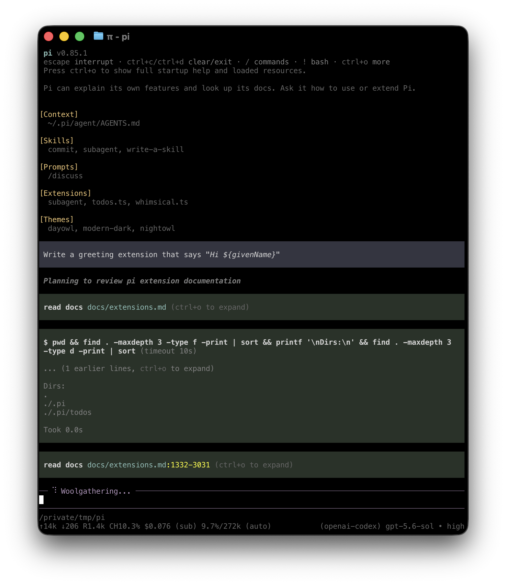

# 使用 Pi

本页汇总不适合放在快速开始页的日用细节。

## 交互模式

<p align="center"></p>

界面有四个主要区域：

- **启动头** - 快捷键、已加载的上下文文件、提示模板、技能和扩展
- **消息** - 用户消息、assistant 回复、工具调用、工具结果、通知、错误和扩展 UI
- **编辑器** - 你输入的地方；边框颜色表示当前思考级别
- **页脚** - 工作目录、会话名、token/缓存用量、成本、上下文用量和当前模型。总计包含 assistant 回复、工具报告的用量和摘要生成。

编辑器可以被内置 UI（如 `/settings`）或自定义扩展 UI 临时替换。

### 编辑器功能

| 功能 | 方式 |
|---------|-----|
| 文件引用 | 输入 `@` 模糊搜索项目文件 |
| 路径补全 | 按 Tab 补全路径 |
| 多行输入 | Shift+Enter，Windows Terminal 上是 Ctrl+Enter |
| 复制回复 | Ctrl+X 复制最后一条 assistant 消息；在 `/tree` 中复制选中的消息 |
| 图片 | Ctrl+V 粘贴、Windows 上是 Alt+V，或拖入终端 |
| Shell 命令 | `!command` 运行并把输出发送给模型 |
| 隐藏 shell 命令 | `!!command` 运行但不把输出发送给模型 |
| 外部编辑器 | Ctrl+G 打开 `externalEditor`、`$VISUAL`、`$EDITOR`、Windows 上是 Notepad，其他系统是 `nano` |

所有快捷键和自定义见 [Keybindings](keybindings.md)。

## 斜杠命令

在编辑器中输入 `/` 打开命令补全。扩展可以注册自定义命令，技能可用 `/skill:name`，提示模板通过 `/templatename` 展开。

| 命令 | 说明 |
|---------|-------------|
| `/login`、`/logout` | 管理 OAuth 或 API-key 凭据 |
| [`/llama`](llama-cpp.md) | 下载、加载和卸载 llama.cpp router 模型 |
| `/model` | 切换模型 |
| `/scoped-models` | 启用/禁用 Ctrl+P 循环的模型 |
| `/settings` | 思考级别、主题、消息投递、传输 |
| `/resume` | 从之前的会话中选择 |
| `/new` | 开始新会话 |
| `/name <name>` | 设置会话显示名 |
| `/session` | 显示会话文件、ID、消息数、token 和成本 |
| `/tree` | 跳到会话中任意点并从中继续 |
| `/trust` | 为未来的会话保存项目信任决定 |
| `/fork` | 从之前的用户消息创建新会话 |
| `/clone` | 把当前活动分支复制到新会话 |
| `/compact [prompt]` | 手动压缩上下文，可选自定义指令 |
| `/copy` | 复制最后一条 assistant 消息到剪贴板 |
| `/export [file]` | 将会话导出为 HTML 或 JSONL |
| `/import <file>` | 从 JSONL 文件导入并恢复会话 |
| `/share` | 上传为私有 GitHub gist，附可分享的 HTML 链接 |
| `/reload` | 重新加载键位、扩展、技能、提示、主题和上下文文件 |
| `/hotkeys` | 显示所有键盘快捷键 |
| `/changelog` | 显示版本历史 |
| `/quit` | 退出 pi |

## 消息队列

agent 仍在工作时你也可以提交消息：

- **Enter** 排队一条 steering 消息，在当前 assistant 回合执行完其工具调用后投递。
- **Alt+Enter** 排队一条 follow-up 消息，在 agent 完成全部工作后投递。
- **Escape** 中止并把已排队消息恢复到编辑器。
- **Alt+Up** 把已排队消息取回编辑器。

在 Windows Terminal 上，Alt+Enter 默认是全屏。希望 pi 收到该快捷键就按 [Terminal setup](terminal-setup.md) 所述重映射。

在 [Settings](settings.md) 中用 `steeringMode` 和 `followUpMode` 配置投递。

## 会话

会话自动保存到 `~/.pi/agent/sessions/`，按工作目录组织。

```bash
pi -c                  # 继续最近的会话
pi -r                  # 浏览并选择会话
pi --no-session        # 临时模式；不保存
pi --name "my task"    # 启动时设置会话显示名
pi --session <path|id> # 使用特定会话文件或会话 ID
pi --fork <path|id>    # 把会话分叉为新会话文件
```

有用的会话命令：

- `/session` 显示当前会话文件和 ID。
- `/tree` 导航文件内的会话树，并可摘要被放弃的分支。
- `/fork` 从更早的用户消息创建新会话。
- `/clone` 把当前活动分支复制到新会话文件。
- `/compact` 摘要较早的消息以释放上下文。

详情见 [Sessions](sessions.md) 和 [Compaction](compaction.md)。

## 上下文文件

Pi 在启动时从以下位置加载 `AGENTS.md` 或 `CLAUDE.md`：

- `~/.pi/agent/AGENTS.md` 作为全局指令
- 父目录，从当前工作目录向上遍历
- 当前目录

如果某目录包含 `AGENTS.override.md`，Pi 加载它而不是该目录的 `AGENTS.md` 或 `CLAUDE.md`。其他目录的上下文文件仍正常叠加。

上下文文件用于项目约定、命令、安全规则和偏好。用 `--no-context-files` 或 `-nc` 禁用加载。

### 系统提示文件

用以下文件替换默认系统提示：

- 项目的 `.pi/SYSTEM.md`
- 全局的 `~/.pi/agent/SYSTEM.md`

在任一位置用 `APPEND_SYSTEM.md` 追加到默认提示而不替换它。

### 项目信任

交互启动时，如果项目文件夹包含项目本地设置、资源或项目 `.agents/skills`，且 `~/.pi/agent/trust.json` 中没有该文件夹或父文件夹的已保存决定，pi 在信任该文件夹前会询问。信任项目允许 pi 加载 `.pi/settings.json` 和 `.pi` 资源、安装缺失的项目包、并执行项目扩展。

在信任决定之前，pi 只加载上下文文件、用户/全局扩展和 CLI `-e` 扩展，使它们能处理 `project_trust` 事件。项目本地扩展、项目包管理的扩展和项目设置只在项目被信任后加载。当切换到当前进程中信任尚未解决的、来自不同 cwd 的会话时，这一划分同样适用。

非交互模式（`-p`、`--mode json` 和 `--mode rpc`）不显示信任提示。在没有适用的已保存信任决定时，它们使用全局设置中的 `defaultProjectTrust`：`ask`（默认）和 `never` 忽略那些项目资源，而 `always` 信任它们。传 `--approve`/`-a` 或 `--no-approve`/`-na` 在单次运行中覆盖项目信任。

如果没有扩展或已保存决定适用，`defaultProjectTrust` 控制回退行为。在 `~/.pi/agent/settings.json` 中设为 `"ask"`、`"always"` 或 `"never"`，或用 `/settings` 修改。

`pi config` 和包命令使用相同的项目信任流程，只是 `pi update` 从不提示。传 `--approve` 为单个命令信任项目本地设置，或 `--no-approve` 忽略它们。

交互模式下用 `/trust` 为未来的会话保存项目信任决定，包括对直接父文件夹的信任。它只写 `~/.pi/agent/trust.json`；当前会话不会重新加载，所以要重启 pi 更改才生效。


## 导出和分享会话

用 `/export [file]` 把会话写为 HTML。

用 `/share` 上传私有 GitHub gist，附可分享的 HTML 链接。

如果你用 pi 做开源工作，想为模型、提示、工具和评估研究发布会话，见 [`badlogic/pi-share-hf`](https://github.com/badlogic/pi-share-hf)。它把会话发布到 Hugging Face 数据集。

## CLI 参考

```bash
pi [options] [@files...] [messages...]
```

### 包命令

```bash
pi install <source> [-l]     # 安装包，-l 为项目本地
pi remove <source> [-l]      # 移除包
pi uninstall <source> [-l]   # remove 的别名
pi update [source|self|pi]   # 只更新 pi，或一个包来源
pi update --all              # 更新 pi 和包；校准已固定 git ref
pi update --extensions       # 只更新包；校准已固定 git ref
pi update --models           # 只刷新模型目录
pi update --self             # 只更新 pi
pi update --extension <src>  # 更新一个包
pi list                      # 列出已安装的包
pi config                    # 启用/禁用包资源
```

这些命令管理 pi 包，`pi update` 可以更新 pi CLI 安装。要卸载 pi 本身，见 [Quickstart](quickstart.md#uninstall)。`pi config` 和项目包命令接受 `--approve`/`--no-approve` 为单个命令信任或忽略项目本地设置。`pi update` 从不提示项目信任。

包来源和安全说明见 [Pi Packages](packages.md)。

### 模式

| 标志 | 说明 |
|------|-------------|
| default | 交互模式 |
| `-p`、`--print` | 打印回复并退出 |
| `--mode json` | 以 JSON 行输出所有事件；见 [JSON mode](json.md) |
| `--mode rpc` | 通过 stdin/stdout 的 RPC 模式；见 [RPC mode](rpc.md) |
| `--export <in> [out]` | 把会话导出为 HTML |

print 模式下，pi 还会读取管道 stdin 并合并到初始提示：

```bash
cat README.md | pi -p "Summarize this text"
```

### 模型选项

| 选项 | 说明 |
|--------|-------------|
| `--provider <name>` | Provider，如 `anthropic`、`openai` 或 `google` |
| `--model <pattern>` | 模型模式或 ID；支持 `provider/id` 和可选 `:<thinking>` |
| `--api-key <key>` | API key，覆盖环境变量 |
| `--thinking <level>` | `off`、`minimal`、`low`、`medium`、`high`、`xhigh`、`max` |
| `--models <patterns>` | 逗号分隔的模式，用于 Ctrl+P 循环 |
| `--list-models [search]` | 列出可用模型 |

### 会话选项

| 选项 | 说明 |
|--------|-------------|
| `-c`、`--continue` | 继续最近的会话 |
| `-r`、`--resume` | 浏览并选择会话 |
| `--session <path\|id>` | 使用特定会话文件或 UUID 片段 |
| `--fork <path\|id>` | 将会话文件或 UUID 片段分叉为新会话 |
| `--session-dir <dir>` | 自定义会话存储目录 |
| `--no-session` | 临时模式；不保存 |
| `--name <name>`、`-n <name>` | 启动时设置会话显示名 |

### 工具选项

| 选项 | 说明 |
|--------|-------------|
| `--tools <list>`、`-t <list>` | 白名单特定的内置、扩展和自定义工具 |
| `--exclude-tools <list>`、`-xt <list>` | 禁用特定的内置、扩展和自定义工具 |
| `--no-builtin-tools`、`-nbt` | 禁用内置工具但保留扩展/自定义工具 |
| `--no-tools`、`-nt` | 禁用所有工具 |

内置工具：`read`、`bash`、`edit`、`write`、`grep`、`find`、`ls`。

### 资源选项

| 选项 | 说明 |
|--------|-------------|
| `-e`、`--extension <source>` | 从路径、npm 或 git 加载扩展；可重复 |
| `--no-extensions` | 禁用扩展发现 |
| `--skill <path>` | 加载技能；可重复 |
| `--no-skills` | 禁用技能发现 |
| `--prompt-template <path>` | 加载提示模板；可重复 |
| `--no-prompt-templates` | 禁用提示模板发现 |
| `--theme <path>` | 加载主题；可重复 |
| `--no-themes` | 禁用主题发现 |
| `--no-context-files`、`-nc` | 禁用 `AGENTS.md` 和 `CLAUDE.md` 发现 |

把 `--no-*` 与显式标志组合，忽略设置、精确加载所需内容。示例：

```bash
pi --no-extensions -e ./my-extension.ts
```

### 其他选项

| 选项 | 说明 |
|--------|-------------|
| `--system-prompt <text>` | 替换默认提示；上下文文件和技能仍会追加 |
| `--append-system-prompt <text>` | 追加到系统提示 |
| `--tui-mode <mode>` | TUI 模式：`regular`（默认）或实验性 `fullscreen` |
| `--use-theme <name[/name]>` | 为本次运行设置初始交互主题，不更改设置 |
| `--verbose` | 强制详细启动 |
| `-a`、`--approve` | 本次运行信任项目本地文件 |
| `-na`、`--no-approve` | 本次运行忽略项目本地文件 |
| `-h`、`--help` | 显示帮助 |
| `-v`、`--version` | 显示版本 |

`fullscreen` 模式下，转录在终端视口内滚动，而已排队消息、工作状态、扩展小部件、编辑器和页脚固定在底部。鼠标/轨道板输入滚动指针下方的区域；键盘视口操作始终可用。内联图片在支持 Kitty 图形协议的终端中可用，包括 Kitty 和 Ghostty。在 iTerm2 中它们渲染为文本占位符，因为其内联图片协议在应用拥有的滚动期间无法删除或裁剪放置。`regular` 模式下，pi 使用主屏幕和终端拥有的回滚区，iTerm2 内联图片继续正常渲染。终端特定的设置和变通方案见 [Terminal setup](terminal-setup.md)。

在 `/settings` 中设置 **TUI mode** 可立即在 `regular` 和 `fullscreen` 间切换，并为未来的会话选择默认值。**Fullscreen exit output** 控制退出全屏时是打印最终转录，还是恢复之前的屏幕并只打印会话恢复提示。

### 文件参数

文件前缀 `@` 以包含在消息中：

```bash
pi @prompt.md "Answer this"
pi -p @screenshot.png "What's in this image?"
pi @code.ts @test.ts "Review these files"
```

### 示例

```bash
# Interactive with initial prompt
pi "List all .ts files in src/"

# Non-interactive
pi -p "Summarize this codebase"

# Non-interactive with piped stdin
cat README.md | pi -p "Summarize this text"

# Named one-shot session
pi --name "release audit" -p "Audit this repository"

# Different model
pi --provider openai --model gpt-4o "Help me refactor"

# Model with provider prefix
pi --model openai/gpt-4o "Help me refactor"

# Model with thinking level shorthand
pi --model sonnet:high "Solve this complex problem"

# Limit model cycling
pi --models "claude-*,gpt-4o"

# Read-only mode
pi --tools read,grep,find,ls -p "Review the code"

# Disable one extension or built-in tool while keeping the rest available
pi --exclude-tools ask_question
```

## 设计原则

Pi 保持内核小，把工作流特定行为推到扩展、技能、提示模板和包中。

它有意不包含内置 MCP、子代理、权限弹窗、plan mode、to-do 或后台 bash。你可以把这些工作流作为扩展或包构建或安装，或使用容器和 tmux 等外部工具。

完整理由见这篇[博客文章](https://mariozechner.at/posts/2025-11-30-pi-coding-agent/)。
