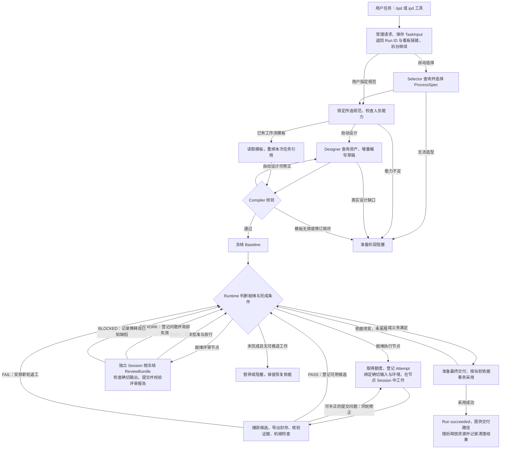

# IPD 模块实现说明

本文按**模块职责、功能实现、输入输出、状态归属与协作边界**组织，模块是职责划分，不代表独立进程或已经完全解耦的包。

第 2–11 章解释实现，第 12 章串起完整任务，第 13 章说明修改与验证入口，第 14 章列出尚待优化的代码边界。

## 目录

- [1. 总体架构与核心对象](#overview)
- [2. 入口与 Run 服务](#service)
- [3. 资产装配与注册](#assets)
- [4. 控制面与工作流编写](#control)
- [5. 编译与执行基线](#compiler)
- [6. 运行调度与执行控制](#runtime)
- [7. Pi Session 与上下文适配](#adapter)
- [8. 受控环境与工具执行](#environment)
- [9. 产物、评审与返工治理](#quality)
- [10. 持久化、恢复与最终交付](#persistence)
- [11. 可视化与运行观测](#observability)
- [12. 端到端流程与分支处理](#flow)
- [13. 修改入口与验证方式](#verification)
- [14. 当前待优化点](#improvements)

<a id="overview"></a>

## 1. 总体架构与核心对象

### 1.1 系统边界

IPD 运行在 Pi 宿主进程中，负责把用户任务组织成受控工作流。它复用 Pi 的模型/工具循环、AgentSession、历史持久化、模型重试和压缩；自己负责流程准备、执行授权、版本绑定、提交采用、评审放行与任务收口。

当前四类 Agent 是流程选择者、工作流设计师、执行员工和评审员工。每个执行/评审节点绑定一名员工及一个持续 Session；节点内团队、递归 IPD 和完整动态重规划尚未实现。

最重要的责任边界是：**模型产出候选和专业判断，代码决定是否采用及如何推进。** 工具捕获成功、文件封存、检查通过、获得批准、Run 成功是不同事件。

### 1.2 功能模块与源码位置

下表路径相对 `packages/ipd/`。同一物理目录可能包含几个功能模块，例如 `runtime/` 同时保存应用服务、调度、治理和存储实现。

| 功能模块 | 主要位置 | 负责的问题 |
|---|---|---|
| 入口与 Run 服务 | `src/tool/`、`src/runtime/ipd-service.ts` | 谁接收请求、拥有 Run 和处理外部控制？ |
| 资产装配 | `assets/`、`src/registry/` | 哪些规范、员工、方法和工具真实可用？ |
| 控制面与编写 | `src/control/` | 如何选流程、组织工作并修正设计？ |
| 契约与编译 | `src/contracts/`、`src/ir/`、`src/compiler/` | 哪些结构、引用和授权必须在执行前成立？ |
| 调度与执行控制 | `src/runtime/` 下的 workflow-runtime、runtime-state、execution-control | 哪个节点现在能执行，哪个结果仍有资格提交？ |
| Session 适配 | `src/adapter/`、`prompts/` | 如何把冻结工作交给原生 Pi Agent？ |
| 受控环境 | `src/environment/`、`environments/` | 文件、命令、网络和进程在哪执行？ |
| 产物与质量治理 | `src/artifact/`、`src/gate/`，及 `src/runtime/` 下的治理文件 | 交付如何验证、批准、失效和局部返工？ |
| 存储与恢复 | `src/runtime/` 下的 run-store、run-snapshot、run-recovery | 哪些事实已持久提交，重启后如何接续？ |
| 展示与观测 | `src/visualization/`、`src/runtime/telemetry.ts` | 如何观察进度和成本，而不取得控制权？ |

### 1.3 对象关系与版本

| 对象 | 内容与用途 |
|---|---|
| `TaskInput` V2 | 原始任务、来源、材料引用、未决事实。原文保持权威，不另外生成替代用户意图的目标模型。 |
| `ProcessSpec / ProcessSelection` V2 | 前者定义活动、交付、评审及规则；后者锁定所选规范的 ID、版本、Hash 和理由。 |
| `AuthoringDraft` V2 | Designer 的可编辑中间状态，可暂不完整，含 revision 和操作回执。 |
| `WorkflowDefinition` V3 | 可编译配置：节点契约、员工/资源、输入输出、标准、阶段、流程覆盖和完成条件。 |
| `ExecutionBaseline` | 编译结果：Workflow、有效节点、锁定资产、环境绑定、图索引和报告。执行期间不能由员工自行改写。 |
| `RunState` | 可变运行事实：节点、轮次、执行尝试、提交、评审、问题、资源、事件与幂等回执。 |
| `Submission / Manifest` | 某轮实际提交的封存输出及文件路径、大小、Hash 等身份信息。 |
| `ReviewBundle / Assessment / Finding` | 一次评审的固定对象集合、逐标准观察、需要修复并核验的问题。 |
| `AgentSession / EnvironmentLease` | 成员的对话身份与私有执行环境；不是批准记录，也不替代 RunState。 |

`Workflow.requirements/decisions` 记录标准来源和设计选择；`RunState.governance.decisions` 记录运行中的 Gate 决策，两者不是同一层数据。`requirement_coverage` 只映射 ProcessSpec 义务，没有旧的 `task_requirement` 类型。

还需区分：Run 是完整任务；round 是节点的一次业务执行/评审；Attempt 是该 round 的执行尝试；dispatch 是向 Session 的一次派发。一次 dispatch 可以有多次模型/工具往返。字段补正通常不换业务 round，质量返工开新 round，技术恢复可在原 round 下创建新 Attempt。

`RunState.phase` 表示 intake/selection/design/compile/execute/closed 等业务位置；`status` 表示 running/paused/blocked/succeeded/failed/cancelled。节点状态与 Run 状态也分开：一个节点 waiting_review，并不意味着整个 Run 暂停。

<a id="service"></a>

## 2. 入口与 Run 服务模块

**职责与接口**：接收任务及模板选择，建立 Run 身份，管理后台执行和生命周期；返回受理回执、状态、事件或交付信息，不负责专业选型或评审。

入口：[ipd-extension.ts](../src/tool/ipd-extension.ts)、[default-ipd-extension.ts](../src/tool/default-ipd-extension.ts)、[IpdService](../src/runtime/ipd-service.ts)。

### 2.1 外部接口与默认装配

`/ipd` 提供交互式模板、任务、材料和可选业务 Skill 输入；模型侧 `ipd` 工具要求 `request_id/task`，可选 `skill_name/materials`。查询工具是 `ipd_get_run/ipd_read_events/ipd_get_result`；控制工具是 `ipd_pause_run/ipd_resume_run/ipd_cancel_run/ipd_reconcile_external_operation`。

仓库根目录的 `./pi-test.sh` 在项目信任后加载 `.pi/extensions/ipd.ts`。注册扩展不创建任务；首次调用服务时，默认工厂根据项目、模型、工具、Skill 和可信策略装配服务。它连接资产目录、机械检查器、RunStore、控制角色、Worker、环境管理和看板。同配置的服务可以复用，不会为每次查询重新创建全部对象。

### 2.2 请求受理与后台执行

创建入口最终汇合为：

```text
createRun / createRunFromTemplates
  → createRequestedRun：比较 request ID 与请求摘要
  → FileRunRequestRegistry.claim：持久绑定 request ID → Run ID
  → ControlPlane.accept：建立目录和初始 RunState
  → acquireController：取得运行控制身份
  → startBackground：准备成功后 activate / run
  → 返回 accepted、当前状态及可用的看板链接
```

相同 request ID、相同内容复用受理结果；内容不同则拒绝。请求登记独立于 Run 准备，避免跨服务实例重复创建。当前内存 `requests` 表尚会保留已失败 Promise，这是第 14 章的缺口，不能把“支持幂等”解释为所有失败重试已经正确。

回执只表示受理，不表示任务完成。准备失败可在后台变成 blocked；看板启动失败通过 `visualizationError` 单独返回，不应改判业务创建失败。

### 2.3 生命周期与状态归属

Service 的 `managed` 表持有每个 Run 的 ControlPlane、Runtime、执行 Promise 和清理责任；`transitions` 串行化同 Run 的控制操作，`recoveries` 合并并发恢复请求。它们是当前进程的运行句柄，不能替代磁盘状态。

暂停保留执行所需历史和文件；取消进入终态并清理；恢复先判定边界再接管。后台执行结束后，终态 Run 触发 cleanup，非终态则保留恢复责任。业务状态和 `cleanup.status` 分开：succeeded 不代表容器已全部释放。

模块协作方向为 Service → ControlPlane/Runtime，而不是 Service 直接调用模型完成业务。查询接口不启动节点；但当前 `getRun()` 使用建目录函数，文件系统上的只读性仍需修正。

<a id="assets"></a>

## 3. 资产装配与注册模块

**职责与接口**：把外部资产文件和真实 Pi 能力转换成可检索、可校验的资产目录，为控制角色选型和 Compiler 绑定提供依据；不决定工作流如何拆分。

入口：[AssetAssembler](../src/registry/asset-assembler.ts)、[Skill 快照](../src/registry/skill-package.ts)、[WorkflowAssetStore](../src/registry/workflow-asset-store.ts)。

### 3.1 来源与可用性检查

员工卡和流程规范来自包内目录、用户 agentDir，以及获得信任的项目 `.pi/ipd/` 目录。资产经过解析、Schema 和语义检查；同 ID/版本冲突被拒绝，不以加载顺序静默覆盖。

AgentCard 给出专业画像、能力、模型选择以及工具/路径授权上限。缺少模型、Skill 或工具的卡可进入 unavailable 列表；格式或语义本身非法不能伪装成可用员工。进入员工池不等于绑定到某节点，节点仍须显式选择资源。

控制角色通过目录工具渐进查询，而不是把整个员工/规范库复制进提示词。查询命中也不证明职责适配；最终引用由 Compiler 核验。

`assembleDefault()/assemble()` 返回 AssembledAssets；默认工厂再通过 `toCompilerAssetCatalog()` 合入检查器和环境策略，形成编译输入。资产目录中的描述与真正执行工具的实现仍是两种对象。

### 3.2 Skill 与工具锁定

Skill 校验会处理 `allowed-tools/required-tools/required-commands` 和环境要求，并对整个包计算 Hash，忽略 `__pycache__` 与 `.pyc`、拒绝符号链接。默认装配将包复制到 `skill-snapshots/<hash>`，再指向这份只读内容；修改原始 Skill 不会自动替换旧快照。

工具资产来自实际 ToolDefinition。锁定描述包含名称、参数和提示说明等摘要，不是任意工具名清单，也不等于把工具全部实现代码做了历史快照。外部只读工具还需显式可信授权，依赖的续读工具仍须绑定。

业务 Run Skill 可选；控制方法 Skill 与节点业务 Skill 的绑定独立。当前知识库字段虽存在，但非空绑定会被 Compiler 拒绝，不能认为注册了名称就已经有可执行后端。

### 3.3 工作流资产与 Run 的区别

`FileWorkflowAssetStore` 通过 `save/list/get` 按 `workflow_id/version` 保存和读取 JSON 或 YAML。相同内容可复用，同版本不同内容报 version conflict；不能覆盖正在被旧 Run 引用的资产。

默认模板菜单读取项目 `.pi/ipd/workflow/`，不是自动扫描包内 `assets/workflows/` 的所有文件。模板中的员工和节点配置仍须重绑本次任务引用并编译。资产库解决复用，Baseline 解决当前 Run 的确切执行身份，两者不能互相替换。

<a id="control"></a>

## 4. 控制面与工作流编写模块

**职责与接口**：接收 TaskInput、可选模板和资产目录，完成流程选择与设计并调用 Compiler；返回包含 Baseline、RunDirectory 的 PrepareRunResult，或阻塞诊断。不执行业务节点，也不拥有最终批准权。

入口：[ControlPlane](../src/control/control-plane.ts)、[Pi 控制角色](../src/control/pi-control-roles.ts)、[DraftManager](../src/control/workflow-draft.ts)。

### 4.1 流程选择与准备分支

`prepareAccepted()` 先确定规范：自动路径调用 Selector 搜索并提交精确版本，用户已指定规范则直接构造选择记录。之后统一检查 ProcessSpec 所需生产/评审能力能否被员工池承担；不足时记录 staffing diagnostics，而不是偷偷删流程义务。

有工作流模板时走重绑与编译路径；没有模板才调用 Designer。恢复准备时还可复用已持久化的选择或候选。模板不合法直接阻塞，不擅自切换为模型重新设计。

### 4.2 草稿工具的实现分工

Designer 编辑的是 AuthoringDraft V2，而不是完整 Workflow V3。实现分为：

- `workflow-draft-schema.ts`：定义各领域工具可编辑字段。
- `workflow-draft-operations.ts`：在草稿副本上应用编辑，检查引用，返回变更与默认值。
- `workflow-draft-materialize.ts`：生成 Workflow、评审输入/对象、阶段内部使用关系，并提供诊断到编写对象的映射。
- `workflow-draft-views.ts`：返回限定范围和分页视图，不默认倾倒整份配置。
- `WorkflowDraftManager`：负责文件锁、修订冲突、操作幂等、校验、候选保存和编辑开闭。

批量编辑按 ID 作用于记录；记录内部的数组替换对应字段，不意味着整个集合被替换。每次编辑带 `expected_revision` 和 `operation_id`；相同操作内容可重放回执，改变内容需新的操作身份。

### 4.3 校验、提交与模型修订

普通缺字段或非法引用留在原草稿中局部补正。`validate` 可检查完整性或运行正式编译，不递增编辑修订；`submit` 重验确切修订、保存不可变候选及回执、关闭编辑并结束当前派发。

控制面仍独立调用 Compiler；诊断或工作流资产版本冲突可以要求原活跃 Designer Session 修订，外层最多 10 次。真正任务/资源/表达能力缺口使用结构化 blocked 报告，不靠不断修改 operation ID 重试。

**状态边界：**草稿和候选文件是准备阶段记录，不能直接成为 Runtime 运行事实。普通设计修订保持原控制 Session；进程重建后的准备恢复不保证原控制 Session 历史连续。

<a id="compiler"></a>

## 5. 编译与执行基线模块

**职责与接口**：`compileWorkflow(input)` 接收任务、选择、规范、Workflow 和已装配能力，返回 `{ok:true, baseline}` 或 `{ok:false, report}`。不调用模型，不创建环境，不替设计师补写业务要求。

入口：[compiler.ts](../src/compiler/compiler.ts)、[关系校验](../src/compiler/validate-workflow.ts)、[契约定义](../src/contracts/workflow.ts)。

### 5.1 编译阶段

1. 校验 TaskInput/ProcessSelection/ProcessSpec/Workflow Schema，以及互相引用的 ID、版本和内容 Hash。
2. 解析节点、员工和标准，检查工具、Skill、能力和权限；当前强制每节点恰好一个员工。
3. 检查输出路径、机械/语义标准和评审覆盖；检查材料、输入、完成条件及 ProcessSpec 的责任/证据/标准映射。
4. 从输入来源和必需批准关系建立前向图，检测循环；返工关系另存，不加入 DAG。
5. 解析环境 Profile 和 Skill 环境需求，形成每个参与者的冻结环境绑定。

例如 B 依赖 A 的输出并要求 Gate R 批准，编译图会同时包含 A→B 与 R→B。节点数组顺序不是执行顺序；“选了一个 Reviewer”也不等于覆盖了所有必需标准。

### 5.2 Baseline 的作用

输出中的 `EffectiveNode` 聚合节点定义、实际标准、标准来源和已锁定参与者；`ExecutionBaseline` 再保存 Workflow、环境绑定、图索引、报告和身份 Hash，并深冻结。

Runtime 消费此结果，不在执行中重新从“最新资产”选择模型、员工、权限或验收标准。编译通过证明结构和支持的治理约束成立，不证明模型对任务的理解正确，更不证明最终业务结果合格。

### 5.3 静态校验与运行校验的分界

Compiler 检查某个输入引用是否合法；Runtime 决定本轮实际绑定哪份 Submission，以及它此刻是否仍有效。Compiler 检查允许使用某工具；环境后端执行实际路径、租约和操作校验。这些检查发生在不同时间边界，不能互相替代。

<a id="runtime"></a>

## 6. 运行调度与执行控制模块

**职责与接口**：接收 Baseline 和当前 RunState，决定就绪工作，创建执行身份，调用 NodeWorker，并将仍然有效的结果事务采用。它不实现模型循环或直接操作 Docker。

入口：[WorkflowRuntime](../src/runtime/workflow-runtime.ts)、[runtime-state.ts](../src/runtime/runtime-state.ts)、[execution-control.ts](../src/runtime/execution-control.ts)、[ResourceAdmission](../src/runtime/resource-admission.ts)。

### 6.1 就绪计算与并行调度

`drive()` 的一次循环先检查 Run/控制者是否仍有效，再判断完成条件，或在并发上限内启动 `readyNodes()` 返回的工作。等待任一运行任务结束后重新读取状态，而不是按固定节点清单一路顺序执行。

就绪条件包括节点可启动、必需材料已声明、上游确切输出可用、所需批准有效、输入来源版本彼此一致。新派发先选该输出的**最新提交**再判资格；最新候选未批准时不会自动退回旧 approved 版本。已有 round 则核验它原先绑定的版本，不能只按“目录中最新文件”继续。

例如，Workflow V3 的输入声明可以是：

```json
{
  "kind": "node_output",
  "input_id": "approved-data",
  "source": { "node_id": "A", "output_id": "data" },
  "required": true,
  "availability": "approved",
  "approval_review_node_ids": ["gate-a"],
  "purpose": "content_basis"
}
```

这不是草稿工具参数。运行时它会被解析成 `submissionId/outputId/revisionId`、批准与放行引用，写入本轮 `inputBindings`，再物化为节点能读取的确切输入。

### 6.2 Attempt 与结果资格

`runNode()` 在 Store 事务内复查就绪，创建/续用 round，并通过 `claimExecution()` 登记 Attempt 和 DispatchIntent。后者记录“准备发送什么工作”，不等于模型已执行；派发进入 delivering/started 时分别记录实际边界。

`ExecutionStamp` 包含 Attempt、command、controller term、Run generation、节点 scope epoch。节点暂停、输入失效或控制者接管后，这些身份使旧结果失去采用资格。正式提交和评审采用时还会重查当前身份及输入，不把异步操作之前的检查当成永久授权。

主要调用链为：

```text
runAdmittedNode → runNode / claimExecution
  → 组装 NodeRoundWork
  → runRoundWithTimeout
      → worker.prepareRound
      → runExecution 或 runReview
  → store.mutate 内采用结果
```

### 6.3 在途工作与资源准入

Runtime 的 `running` 保存调度等待，`inFlight` 保存真实尚未结束的操作。两者有意分开：超时可以结束等待，却不能证明命令、导出或清理已停止。额度与竞争写入资格不能因此提前释放。

共享 ResourceAdmission 限制当前 Pi 进程内各 Run 的执行、工具并发、驻留参与者和封存字节；不构成跨 Pi 进程调度系统，也不是整个容器磁盘配额。额度不足可排队，取消信号会移除等待；驻留超限不会驱逐仍需返工的 Session。

没有在途工作、没有可推进节点且未完成时，Runtime 记录 Wait 条件并暂停/阻塞，不派模型反复查询反馈。默认整轮超时为 0；质量返工次数、单工具超时和清理期限是独立约束。

<a id="adapter"></a>

## 7. Pi Session 与上下文适配模块

**职责与接口**：实现 Runtime 的 NodeWorker 端口，将 `NodeRoundWork` 转为原生 Session 派发，并返回结构化产物、评审或业务阻塞候选；不直接发布批准。

入口：[PiNodeWorker](../src/adapter/pi-node-worker.ts)、[NodeSessionAdapter](../src/adapter/node-session-adapter.ts)、[SessionFactory](../src/adapter/pi-node-session-factory.ts)、[node-context.ts](../src/adapter/node-context.ts)。

### 7.1 Session 创建、复用和恢复

Worker 接收节点定义、输入绑定、反馈、执行戳与环境绑定；Factory 解析 AgentCard 模型选择、Run 默认模型和可信设置，创建或打开原生 Pi AgentSession。

Worker 接口分为三组：`prepareRound` 绑定环境与输入；`runExecution/runReview` 派发模型并返回候选，`exportSubmission/exportReviewEvidence` 单独导出文件；`pauseRun/validateResume/recoverInterrupted/releaseRun` 对接生命周期。把候选返回与文件导出分开，Runtime 才能在两者之间及采用前复查执行资格。

NodeSessionAdapter 的绑定键为 `runId + nodeId + participantId`，负责确保同一成员不会同时接收两个活动派发。正常质量返工和协议补正复用同一 Session；灾后恢复通过保留的 sessionId、sessionFile 和历史边界打开原记录，不新建空白对话冒充继续。

Factory 关闭自动发现的普通扩展/Skills/项目 Context Files，按锁定资源重新注入工具和方法。模型重试、历史压缩仍交 Pi；实际资源加载和基础系统提示词的例外边界见[提示词文档](../prompts/README.md)。

### 7.2 静态契约与动态轮次

执行/评审节点的稳定系统上下文包含四个文件：TASK_SCOPE、NODE_CONTRACT/REVIEW_CONTRACT、PROFESSIONAL_ROLE、EXECUTION_PROTOCOL/REVIEW_PROTOCOL。Worker 同时把它们绑定到环境只读路径，模型无须先 read 才知道契约。

`ipd_current_round` 提供实际输入版本、反馈、Findings、ReviewBundle 和可保留输出。它在真实派发前通过 `before_agent_start` 更新 system section；普通工具续接没有新的 Runtime user 消息。派发消息只说明 execute/review/resume/补正/返工意图。

控制角色采用另一条路径：首次 user 消息展开方法 Skill，再附 TaskInput 和控制任务；Designer 的编译修订只新增修订号与诊断。业务 Skill 和完整上游证据按需读取，不全量广播外层或其他成员对话。

### 7.3 提交捕获与字段补正

Worker 按角色注入 `submit_artifact` 或 `submit_review`，执行节点另有 `report_node_blocked`。SubmissionCapture 只保存本次模型声明，工具成功会结束派发；Runtime 随后仍要验证文件、证据和采用资格。

`submission_context` 提供本轮允许的证据身份，或被拒候选的 `base_hash` 与局部字段。`correct_submission` 对该基底做有限字段修改，再经过原完整校验。基底依赖同 Run/节点/参与者/round/契约/输入范围，不能跨业务轮次随意复用，也不保证进程重启后仍在内存中。

工具通过 getter 取得当前 work 和环境绑定，而不是一直闭包第一轮输入；这对持续 Session 的返工正确性很重要。

### 7.4 有界请求视图

请求视图将历史工具结果中的大文本/图片替换为可定位引用，原内容仍保存在 Session；`ipd_read_context` 可分页回读。它不执行原工具、不改业务证据，也不删任务或标准。

Provider 请求发送前另检查实际序列化字节及图片数。能够缩减时最多尝试两次视图修复，否则拒绝；Pi 的 token 压缩不能替代此字节限制。当前默认局部预算为 4 MiB、8 图/请求、4 图/消息，可被更低的模型限制收紧，不是供应商统一配额。

<a id="environment"></a>

## 8. 受控环境与工具执行模块

**职责与接口**：根据冻结环境绑定提供文件、命令、受管进程、稳定导出和保留恢复。接收 lease/round/操作请求，返回结果或 EnvironmentError；不理解任务应否通过评审。

入口：[EnvironmentManager](../src/environment/manager.ts)、[DockerProvider](../src/environment/docker-provider.ts)、[tool-backend.ts](../src/environment/tool-backend.ts)、[环境说明](../environments/README.md)。

### 8.1 Profile、Binding、Lease、RoundBinding

四个对象分别表示可用环境模板、某节点冻结的环境选择、实际环境实例，以及当前轮次输入/操作授权。Profile 的镜像标签会解析为实际内容身份；旧 Run 不因同名标签更新就自动切换镜像。

Manager 按 Run/节点/参与者登记租约，保存 prepare Promise，避免重复准备；其 `leasesByKey/leasesById` 指向同一个管理对象。Provider 另持有实际容器、挂载路径和进程状态，不能把这两层混成重复账本。每次 bindRound 更新环境代际，旧 round/进程句柄不再自动有效。

### 8.2 文件访问、cwd 与导出

默认容器布局为：

```text
/ipd/context/                 冻结任务与契约，只读
/ipd/skills/<id>/<hash>/      锁定 Skill，只读
/ipd/inputs/<input_id>/       本轮输入，只读
/workspace/                   节点私有 cwd、源文件、依赖和中间工作
/workspace/outputs/...        声明产物的导出范围
```

文件访问校验依据环境布局；命令 cwd 单独校验；导出同时要求位于 export root 和对应 output contract 根。私有 workspace 中间文件不必逐一声明为 Artifact，能写入也不等于能交付。

Docker 创建使用非 root 身份、只读镜像根、限制 capabilities 和资源的参数，并检查实际应用结果及 bridge 握手。节点没有宿主根目录、凭据目录或 Docker socket 挂载。默认 general-purpose 为 2 CPU/2 GiB，节点可以在获准范围内安装私有依赖。

### 8.3 原生工具如何落到容器

`createEnvironmentToolDefinitions()` 复用 Pi 的 read/write/edit/grep/find/ls/bash 定义，替换其文件或执行 operations，使它们读取同一环境。图片检测、完整 Bash 日志和搜索结果路径也经过该边界，不出现一部分工具读宿主、一部分读容器的默认 fallback。

Provider 通过 command/fs/process bridge 编码请求，使用 Docker 执行真正操作。长服务使用受管进程工具及不透明句柄；取消命令需要停止确认，无法确认时可能使租约失效或报告结果未知，不能只中断等待就声称进程已停止。

轮次重绑会停止旧写者后再装入新输入；导出先停止受管进程并暂停容器，再复制和核验授权文件。这些步骤是稳定性边界，不是可随意删除的性能开销。

### 8.4 网络与保留恢复

容器出站经显式配置的代理策略；外部 `control_read` 服务是独立授权路径，IPD 不另造搜索引擎。容器变量从受控配置构造，不直接继承宿主全部变量。具备联网能力的 Bash/进程启动可记录外部操作意图与结果；未知结果需要核对后才能恢复。

暂停保留容器身份和私有工作区，但停止进程；恢复检查镜像、容器标签、租约和文件摘要，服务进程需要重新启动。终态 dispose 才释放容器及私有资源。Docker 不可用时不会静默切换 legacy；旧后端是显式选择的独立边界。

<a id="quality"></a>

## 9. 产物提交与质量治理模块

**职责与接口**：将不可信模型声明转为可追溯的封存产物和质量记录，计算合法批准及返工影响；由 Runtime 协调 I/O，并在 Store 事务中正式采用。

入口：[SubmissionStore](../src/runtime/submission-store.ts)、[MechanicalChecker](../src/gate/mechanical-checker.ts)、[治理迁移](../src/runtime/governance-transitions.ts)、[ReviewBundle](../src/runtime/review-bundle.ts)、[quality-impact.ts](../src/runtime/quality-impact.ts)。

### 9.1 产物封存与采用

执行提交链分为三个责任段：

1. **候选准备**：提交工具捕获声明；Worker 检查提交前项目探针，从节点环境导出授权文件。
2. **文件验证**：SubmissionStore 要求每个声明输出恰好提供或合法保留一次；检查路径、文件和内容，生成 Manifest，复制到暂存目录并重新核验，最后发布封存目录。
3. **业务采用**：Runtime 核验证据并运行机械检查；`applyCandidateSubmission()` 在当前事务中检查执行戳、输入和保留版本仍有效，登记提交、产物版本、来源及检查结果。

每项 output 有独立封存根和局部 submission.json。下游只获得绑定的输出视图；交接摘要标记为生产者陈述，不是自动核验后的结论。

MechanicalChecker 按注册 check_id 和参数执行确定性检查，汇总阻塞性标准为 PASS/FAIL/ERROR。默认 integrity 证明文件与 Manifest 一致，file-set 检查声明文件集合，均不证明内容或视觉质量。节点相应进入 waiting_review/waiting_rework/blocked。

### 9.2 评审对象、证据与决定

评审 claim 时 `buildReviewBundle()` 固定目标输出版本、每个标准的对象集合、必要推导关系和决策政策。Reviewer 检查的是封存候选，不是生产者的可变目录，也不是仅看一段摘要。

报告按标准提供结果、证据、理由和返工目标。Runtime 校验范围与版本，封存 Reviewer 自己产生的验证文件，再在 `applyReviewDecision()` 中登记 Assessment、Finding、GateDecision 和批准/放行记录。

`all_required` 按阻塞性标准汇总：任何 BLOCKED 阻止放行，否则任何 FAIL 要求 REWORK，余下才是 PASS；建议性失败不阻塞。独立性检查生产贡献与 Session 身份，不以换一个角色名或模型名替代。

### 9.3 阶段和组合评审

阶段配置定义成员、获准内部候选使用和受控出口。A→B→联合 Gate R 中，B 可在显式阶段内消费已封存、机械检查通过的 A 候选，避免“B 等 R、R 又等 B”的循环；跨阶段消费仍必须满足出口 Gate。

组合标准通过 `criterion_subjects` 列全对象，`required_relations` 验证版本推导，例如 A2 不能与基于 A1 的 B1 冒充同一依据。`remediation_mappings` 只授权有证据的直接上游责任归因，要求该责任方版本已绑定且关系真实，不授予任意祖先重做权。

### 9.4 问题单与局部返工

Finding 保存缺陷责任和核验归属，不因原 Review 过时而自动消失。生产者用 `resolution_claims` 声明已修复，指定评审用 `finding_resolutions` 核验；一个 Gate 不能替另一个 Gate 关闭问题。

`invalidateOutputRevisions()` 沿 `content_basis` 扩展受影响版本，再撤销关联评审/放行、将失去支持的采用关系标为 held，并使受影响在途 round 失效。Runtime 随后停止相关 Worker，重新计算就绪工作。

因此 A 的错误可要求修 A 和实际依赖它的 B；独立 D 的内容不应只因同处联合评审就重产。仅集成节点 J 抄错时，修复也应留在合法责任范围。正确但暂失放行的结果可重新验证采用关系，无须重新生产。

精确性仍取决于建模：当前各新输出的来源记录使用该节点本轮输入，不能仅靠摘要声称某输出与某输入无关。`preserved_outputs` 可以保留获准的未受影响版本，但提交仍须覆盖全部输出。

**协议补正不属于上述质量返工。** 错误字段可在同业务 round 修正；质量返工开新 round。当前技术错误误进补正的风险见第 14 章。

<a id="persistence"></a>

## 10. 状态持久化、恢复与最终交付模块

**职责与接口**：保存已采用事实和操作回执，提供可核验的恢复依据，并将满足完成条件的结果物化为最终交付。存储、Service、Runtime 各有责任，不由一个“恢复 Agent”修改 state.json。

入口：[RunStore](../src/runtime/run-store.ts)、[SnapshotCodec](../src/runtime/run-snapshot.ts)、[run-recovery.ts](../src/runtime/run-recovery.ts)、[RunFinalizer](../src/runtime/finalization-coordinator.ts)。

### 10.1 状态提交与幂等

普通 `mutate(runId, operationId, request, reducer)` 的流程为：

```text
Run 内排队 → 获取文件写锁 → 读当前状态
  → 核对 operationId / requestHash，复用已提交回执
  → clone 状态，执行同步 reducer，收集事件
  → 增加 revision，连同 events/operations 写临时文件
  → fsync / rename 发布 → 通知观察者 → 解锁
```

模型、网络、Docker 和文件导出在事务外执行；采用前仍在事务内复查资格。事件与操作结果随快照提交，当前不通过独立事件日志重放主状态。首次 create 与普通 mutate 的实现不同，前者的原子发布缺口不能被这段正常流程掩盖。

磁盘 `storageVersion: 1` 把 Baseline、任务等静态内容分离到 `objects/<hash>.json`，状态只保存引用；decode 恢复为 Runtime schema 3。对象 Hash 校验已有，完整结构和跨记录关系检查仍需加强。

### 10.2 恢复协调

正常暂停先使旧执行失去采用资格，再中止模型和环境工作，将原 Session 身份、历史叶节点、工作区 Hash 和环境引用保存到 workProgress。cleanup complete 是保留完成的边界之一，不是删除历史的信号。

Service 的 `resumeRun()` 在内存实例存在时协调它继续；实例丢失则先分类恢复边界并取得新的控制者身份：

| 边界 | 恢复动作 |
|---|---|
| 已保存的 paused/blocked 执行 | 验证冻结任务、输入、Session 和环境，继续原业务 round；可产生新 Attempt。 |
| 中断的准备阶段 | 复用持久任务、规范选择或设计候选继续；不保证原控制 Session 历史连续。 |
| 已 claim、确定未发送 | 使旧 Attempt 失效后重新派发，不把未发生的模型调用记成已完成。 |
| 活动执行中断 | 隔离旧环境，保留原历史与文件；未知外部操作结果先核对。 |
| 已登记的最终收口 | 恢复交付核验，不重新运行已经完成的业务节点。 |

恢复不是简单把 status 改成 running。原 Session、环境或历史边界不成立时应拒绝；cancelled/failed 不是普通 resume 对象。当前执行空档遗漏与关闭责任缺口仍存在，详见第 14 章。

### 10.3 完成条件与最终采用

`completionProblems()` 核对必需节点/评审、final outputs、阶段出口、阻塞 Finding、held adoption，以及未结束的 Attempt、派发和外部操作；不是检查最后一个节点是否回复完成。

RunFinalizer 据此创建 CompletionBasis，锁定交付版本、Manifest、批准与治理依据。只把 `delivery_outputs` 复制到版本化最终目录，核验路径冲突与 Hash，再在事务内检查当前控制者和完成依据。采用 `finalSubmission` 后才进入 succeeded。

文件准备成功而未采用，不是用户最终结果；准备期间依据变化则不能提交。业务终态之后由 Service 另行清理资源，并分别记录 cleanup 结果。

### 10.4 磁盘布局与调查入口

```text
.pi/ipd/
├── requests/                    创建请求身份
├── workflow/                    可复用工作流
├── skill-snapshots/              锁定方法包
├── telemetry.ndjson             被动观察记录
└── runs/<run-id>/
    ├── state.json + objects/    权威状态与静态对象
    ├── workflow-draft.json      自动设计草稿
    ├── workflow-candidates/     捕获的设计修订
    ├── sessions/               原生会话
    ├── submissions/            封存产物
    ├── evidence/               Reviewer 验证文件
    └── final_submissions/      版本化交付
```

模板路径可能没有草稿文件。Docker 私有工作区按环境引用定位，不是所有节点共用 Run 的宿主 workspace。调查时先查 phase/status、failure/waits、Attempt 和资源引用，再看对应 Session、封存文件与清理记录；备份不能只复制 state.json。

<a id="observability"></a>

## 11. 可视化与运行观测模块

**职责与接口**：将已有状态转换为可理解的展示和性能记录；不修改批准、节点调度或 Run 完成条件。

入口：[dashboard-model.ts](../src/visualization/dashboard-model.ts)、[dashboard-server.ts](../src/visualization/dashboard-server.ts)、[telemetry.ts](../src/runtime/telemetry.ts)。

### 11.1 草稿、候选与执行态展示

`buildDashboardSnapshot()` 优先显示冻结 Baseline，其次是已提交设计候选，再其次是 AuthoringDraft。草稿使用独立的展示投影，允许员工、标准或权限尚未填写，不会为了画图把缺失字段补成可执行默认值。

快照将任务、规范选择、节点职责/资源、依赖/返工关系和最近事件投影给前端。服务端缓存以状态文件和草稿文件版本判断是否需要重建；HTTP API 使用 revision ETag 支持 304，前端无需每次重新获取完整历史。

实时页和离线 HTML 使用相同渲染资产；下载的 snapshot 是时间点视图，之后无需服务器。看板只支持读取，默认绑定本机回环地址，没有独立认证层，不能直接暴露给不可信网络。

对应入口是 `/runs/<id>` 页面、`/api/runs/<id>` 状态投影和 `/runs/<id>/snapshot.html` 下载。服务持有的是已注册 Run 列表与展示缓存，不是第二套 Runtime 状态。

### 11.2 权威事件与遥测分开

RunEvent 属于与状态共同提交的业务记录。FileIpdTelemetry 则把状态操作、round 耗时及原生 Session 事件写入独立 NDJSON；模型正文、图片、工具负载和凭据不属于它的常规记录内容。

`record/recordSessionEvent` 将数据追加到串行 Promise 写入队列，`flush()` 等待队列落盘。Session 起止事件用于配对耗时，结束后清理相应计时项；这里保存的是观察数据，不再向 RunStore 写一份重复的节点状态。

遥测写入错误通过独立处理隔离，不据此重放业务或改判已采用结果。当前计量并不完整，例如模型事件主要记录 input/output，写入队列也仍需有界化；不能将一个 durationMs 解释为所有排队、模型推理和网络时间的精确拆分。

<a id="flow"></a>

## 12. 端到端流程与分支处理

本章把前述模块放回一次任务中。图展示正常主线及设计/质量闭环；跨阶段故障通过下面的分支表补充。



### 12.1 模块之间的正式交接

- **入口 → Service**：完整原任务、请求身份及可选模板/材料/业务 Skill。
- **控制面 → Compiler → Runtime**：从可修订候选变成冻结 Baseline；模板也必须经过此边界。
- **Runtime → Worker**：带执行戳、精确输入和反馈的 NodeRoundWork，不是全局任意读写权限。
- **Worker → Runtime → Store**：模型声明先捕获，再导出/校验，最后事务采用。
- **评审治理 → 调度**：产生批准、问题单和失效范围；Runtime 据此决定后续工作。
- **完成判定 → Finalizer → Service**：物化并采用交付，然后独立清理资源。

质量返工回到原责任节点，通常复用 Session 和私有文件；它不是让 Designer 改工作流。编译失败返回 Designer 则属于准备阶段修订，两者不能合并为“失败后重试”。

### 12.2 异常和替代路径

| 情况 | 对应处理与继续条件 |
|---|---|
| 初始化失败、重复或冲突请求 | 缺模型/工具/默认环境可在受理前失败；同请求身份复用结果，内容冲突拒绝。失败缓存缺口另列。 |
| 用户指定规范/工作流 | 分别跳过 Selector/Designer；仍检查人员、引用、资源和编译条件。非法模板不自动改写。 |
| 选型不可靠、人员不足、设计阻塞 | 保存准备诊断，不启动节点。修订耗尽同样阻塞，不能删除义务制造可执行配置。 |
| 普通工具错误 | 返回原 Session 供修正，不自动开新业务 round；权限拒绝不是扩大权限的许可。 |
| 提交协议错误 | 同 round 补正并重验完整候选；部分技术异常误被归入此类的现状见第 14 章。 |
| 机械 FAIL / ERROR | FAIL 进入新轮返工，ERROR 阻塞；不能把检查器执行失败当成质量通过。 |
| 评审 REWORK / BLOCKED | 有责任的输出修复；障碍保留。BLOCKED 不掩盖已知失败，也不自动重做独立分支。 |
| 输入失效或批准撤销 | 重新核对输出版本、来源和采用条件；停止失去资格的在途 round，保留确实独立的工作。 |
| 等资源、等依赖 | 按额度排队或保持不可启动；没有在途/可推进工作且未完成时记录 Wait，暂停/阻塞，不让模型轮询。 |
| 模型请求过大、暂时故障、超时 | 先走请求视图或 Pi 原生机制；失败后由 Runtime 分类。默认没有整轮 deadline，其他超时仍各自有效。 |
| 暂停、重启、恢复 | 验证原历史/环境和保存边界；外部操作结果未知先核对，不重放可能已发生的副作用。 |
| 取消、不可恢复、终态异常 | cancelled/failed 不属于普通 resume；保留失败与清理记录，不建立新员工冒充继续。 |
| 最终交付或清理失败 | 完成依据变化不得采用；收口异常可能 failed。业务成功与资源释放分开呈现。 |

这些是当前模块分流，不表示所有故障窗口已被覆盖。尤其执行空档恢复、评审异常分类和失败关闭的实现限制，应结合第 14 章优化清单审查。

<a id="verification"></a>

## 13. 代码修改与验证入口

不建议从 `src/index.ts` 的全部导出开始通读。按问题进入对应模块，再沿本章表格检查跨模块影响。

| 要修改的功能 | 首要实现与必须联查的部分 | 重点验证 |
|---|---|---|
| 新资产、员工或模板 | Registry、Compiler 目录与版本规则、模板存储路径 | 缺资源、重名、Hash/版本冲突、旧 Run 不被新资产替换。 |
| 草稿工具或 Workflow 字段 | Draft schema/operations/materialize、Workflow Schema、Compiler、Skill 示例、展示投影 | 部分编辑、回执重放、来源映射、生成候选合法性。 |
| 调度或恢复 | WorkflowRuntime、execution-control、Service、Worker/Environment | 取消、迟到结果、同 round 新 Attempt、原 Session 连续性与失败清理。 |
| 提交与评审 | 提交工具、封存/证据验证、governance-transitions、Finding/impact | 补正与质量返工分离、组合版本一致、独立输出不重产。 |
| 文件、命令或网络 | tool-backend、Provider、bridge 源码与生成物、Profile/镜像 | 同一文件系统、真实停止、路径拒绝、稳定导出、恢复身份。 |
| 存储或性能 | RunStore/Codec、查询、上下文投影、遥测 | 幂等与事件顺序不变，故障窗口可核对，优化有分项数据。 |
| 看板 | model/authoring projection、server、client 与生成资产 | 未完成草稿可显示、实时与快照一致、不产生业务写操作。 |

现有测试可按功能阅读：`compiler/control-plane/workflow-draft`、`runtime-rework/round-invalidation`、`run-store/run-lifecycle/runtime-failures/ipd-service`、`native-session-contract`、Docker integration 和 dashboard 测试，均在 [test/](../test/) 中。

修改源代码后按仓库规则运行完整 check 和受影响的显式测试；bridge/dashboard 改动还要验证生成物。合成模型测试证明状态交接，不证明真实任务质量；Docker、打包安装、故障恢复和实际模型实验也不能互相代替。本轮只是文档与源码核对，没有重新运行这些完整验收。

<a id="improvements"></a>

## 14. 当前值得优先优化的点

| 优先级 / 审查项 | 当前情况 → 建议方向 |
|---|---|
| 优先：错误分流 | `runReview` 除 NodeWorkerError 外广泛转成补正，可能让存储/程序错误反复询问模型。按协议、存储、完整性和取消事实分类，保留原始原因。 |
| 优先：持久化边界 | RunStore 首次直接写目标文件；Snapshot 解码缺完整结构校验；锁检查早期 ENOENT 未作为竞争处理。补原子首次发布、解码/恢复关系校验和确定性锁竞争测试。 |
| 优先：恢复与收口 | `classifyRunRecovery` 漏掉已冻结但无活动 Attempt 的执行空档；Finalizer 的旧控制者回调可能弃用当前候选。补空档恢复，并把所有权检查放到准备、采用、弃用各边界。 |
| 优先：服务所有权 | `requests` 保留已失败 Promise；`close` 在 allSettled 后清空 managed；`getRun` 通过 prepare 创建目录。分离在途去重与持久回执，失败关闭保留责任，查询改用纯路径解析。 |
| 随后：职责与契约 | 提交 Schema 与 Pi 工具同文件；Runtime、Worker、默认工厂职责较集中。按提交准备、环境绑定、宿主装配提取单一实现，不另造调度器或 Session 管理器。 |
| 有测量再优化：长程成本 | mutation 整体 clone、锁内通知；输入散列仍用 readFile；节点收到全量 requirements/decisions。先分项测量，再共享可信冻结对象、流式散列、按完整来源链裁剪上下文，不减少业务要求。 |

**不要重复整改已完成项**：根 build 已包含 IPD，内部依赖已对齐 `^0.87.1`，打包验证已有依赖闭包；resume 已清除旧 cleanup 回执。后续仍应补故障窗口与兼容回归，不能据此宣称整份 B0–B3 审查全部完成。

节点内多人、嵌套 IPD、完整动态重规划是后续能力，不是当前流程图隐藏的分支。推进它们之前，先稳住上述所有权与恢复边界；不要先引入新数据库、事件总线或更多管理类。

---

# 附录

## 1. 核心数据结构与资产装配

### 1.1 从配置到运行记录

| 对象 | 主要字段或内容 | 创建与使用方式 |
|---|---|---|
| **TaskInput v2** | `raw_task: {text, source}`、`materials`、`unresolved_facts`。 | 接入时保留用户任务及材料登记；ST、设计师和节点从中取得各自需要的依据。没有另建一套由 Compiler 推断的用户目标列表。 |
| **ProcessSpec v2** | 适用／排除条件；`required_activities`、`required_deliverables`、`required_reviews`、`workflow_rules`。 | 发布的流程资产。规定必要责任和质量关系，不是一张可以直接调度的图。 |
| **ProcessSelection** | 任务内容引用、规范 `id/version/hash`、理由、流程义务与未决事实引用。 | ST 的合法决定或显式选型转成此记录；后续不能只凭规范名称替换版本。 |
| **AuthoringDraft V2** | 可不完整的节点与配置、当前 `revision`、操作回执、校验结果和编辑状态。 | 设计师唯一的受管草稿；写入成功不代表满足执行条件。 |
| **WorkflowDefinition v3** | 节点、输入输出、标准、评审、阶段、规范覆盖、完成条件与来源关联。 | 草稿确定性投影的完整配置，也是可保存和复用的工作流资产形式。 |
| **ExecutionBaseline** | 原 Workflow、`workflowHash`、规范锁定引用、`EffectiveNode[]`、环境绑定、图索引和编译报告。 | Compiler 输出。运行时使用它，不再临时重新挑员工或解释整份规范。 |
| **RunState** | 阶段、状态、节点、Round、Attempt、派发、提交、评审、批准、质量记录、等待、失败和事件。 | 准备控制与 Runtime 通过 RunStore 事务维护，是业务事实来源。 |

`EffectiveNode` 已经解析出该节点的标准、标准来源以及 `EffectiveParticipant`；后者包含实际 AgentCard、`lockedSkills`、`lockedTools` 和锁定知识库。`ExecutionGraphIndex` 保存 `forward/reverse`、`reviewsByOutput`、`reworkTargetsByReview`，避免运行时从自然语言推断关系。

### 1.2 一个节点在配置中实际承载什么

以下是字段关系摘录，不是可以直接提交的完整 Workflow，也不是 Authoring 工具 payload：

```text
WorkflowDefinition
├─ nodes[]
│  ├─ node_id / kind / name
│  ├─ agents[0]：agent_ref、能力、Skill、Tool、知识库、权限
│  ├─ contract：objective、职责/非职责、作业要求、约束
│  ├─ inputs[]：task_material 或 node_output；必需性、使用目的、批准条件
│  ├─ execution：outputs[]，含内容用途、输出根、证据与 criterion_refs
│  └─ review：targets、allowed_rework_node_ids；可附组合对象与修复映射
├─ criteria[]：mechanical 或 semantic
├─ stages[]：可选的阶段内候选使用和 Gate 出口
├─ requirement_coverage[]：仅映射 ProcessSpec 义务
└─ completion：必需节点、必需评审、最终输出、用户交付输出
```

`criteria` 定义标准，节点与评审通过 ID 引用；机械标准绑定真实 `check_id`，语义标准交给 Reviewer。规范中的证据项、评审标准分别通过 `process_evidence_requirement_refs`、`process_criterion_refs` 关联到具体输出和标准。`requirements/decisions` 可记录用户、规范、设计决定和建议的来源／强度；它们与仅覆盖规范义务的 `requirement_coverage` 不是同一机制。

### 1.3 资产如何变成可执行资源

`AssetAssembler.assembleDefault()` 合并包内资产、用户资产和受信任项目的 `.pi/ipd/agent-cards`、`.pi/ipd/process-specs`。系统 Skill 来自包内，业务 Skill 和 Tool 来自 Pi 已提供的注册资源，再经 `toCompilerAssetCatalog()` 与检查器、知识库和环境 Profile 汇合。[资产装配源码][assembler]

装配并非简单扫描 YAML：它校验格式、重复身份、资源引用和模型可用性。员工仅因缺少模型、Skill 或工具而不可用时，会进入 `unavailableAgentCards`，不参加组队；其他非法资产可能直接使装配失败。同 ID／版本重复不按“项目覆盖全局”静默处理。Skill 声明了不存在的工具也可能阻断装配。

资产的职责边界是：**AgentCard 给专业画像与授权上限，Workflow 选择本次实际绑定，Skill 提供方法，Tool 提供操作，环境落实执行权限。** Skill 包按内容计算 hash；工具 hash 主要覆盖注册描述与 Schema，不能由此推断外部服务或工具实现的所有依赖也已被冻结。环境 Profile 则解析到确定镜像身份。磁盘存在、目录可检索、能力标签匹配和实际能执行，是不同层次。

## 2. 任务接入、设计与编译的实现

### 2.1 入口与后台生命周期

`registerDefaultIpdExtension()` 负责组装服务；`ipd-extension.ts` 注册模型工具和 `/ipd` 交互命令。包本身通过 Extension 接入 Pi；当前仓库还提供 `.pi/extensions/ipd.ts` 作为项目级自动加载入口。这不等于任意项目、任意 Pi 安装都会自动开启 IPD。

模型侧 `ipd` 接收 `request_id`、原始 `task`，以及可选材料和业务 Skill。`IpdService.createRun()` 通过 `FileRunRequestRegistry` 持久登记请求身份，`ControlPlane.accept()` 创建初始 RunState，服务取得控制任期后开始后台准备。**回执的 `accepted` 表示已经接入，不表示设计、编译或业务执行已成功。** 同一请求身份与相同内容复用原 Run；同一身份对应不同内容会冲突。可视化启动异常单独放进回执，不将其误判为业务创建失败。

`/ipd` 还支持两条显式路径：只选 ProcessSpec 时跳过 ST；同时选 Workflow 模板时也跳过设计师。模板仍要重新绑定当前 TaskInput、ProcessSelection 并编译，不能直接沿用上一次 Run 的 Baseline。

### 2.2 ST：规范决定与可组队检查分开

`IpdControlPlane.prepareAccepted()` 在没有显式规范时调用 selector。`PiProcessSelector` 使用专用 Session、`process-selection` Skill、规范检索工具及 `submit_process_selection`，只产生选型或 blocked 决定。

控制面校验选择版本和内容身份，记录 `processSelection`、`selectedProcessSpec`，随后调用 `validateProcessSpecStaffing()` 检查当前可用员工能否承担活动与必要评审。失败写入 `staffingReport` 并以 `process_spec_unstaffable` 阻塞；这一步不负责给业务节点分配具体员工，也不证明真实专业表现。

材料可见性需要特别注意：TaskInput 中的 `reference` 是定位信息，不是正文；治理角色的受限 `read` 主要读取锁定 Skill。业务节点在后续通过声明的输入获得实际材料。不能因治理角色看到一个文件名，就声称已通读附件。

### 2.3 Designer：领域编辑，不直接生成或覆写大 JSON

设计师第一次派发同时取得原始任务、选型、完整规范及可用非员工资源；业务 Run Skill 可选且只作补充方法。员工通过 `search_agent_cards/get_agent_card` 查询。后续编译修订返回同一设计 Session，提供当前修订号和诊断，不重复创建一个没有历史的设计者。

`WorkflowDraftManager` 管理一个持久草稿。模型使用以下工具域逐步完成设计：

| 工具域 | 编辑责任 | 程序派生的部分 |
|---|---|---|
| `topology / configure_nodes` | 节点和输出端口，契约、员工、工具与环境。 | 不另存一套独立 `edges` 图；后续由真实输入产生依赖。 |
| `outputs / criteria` | 成果内容、证据、标准与 `output_bindings`。 | 输出的 `criterion_refs`。 |
| `inputs / reviews / stages` | 输入用途与访问策略；single/composite 评审对象；阶段成员与出口。 | 评审目标、组合对象、必要候选输入和阶段内部使用关系。 |
| `governance / coverage / completion` | 来源关联、规范义务映射、必需节点及正式交付。 | 不自动发明缺少的业务要求或默认放行条件。 |

每次编辑携带 `expected_revision` 和 `operation_id`。未提供字段保留原值，数组按该字段整体替换；失败批次不保存。相同 ID 和相同操作内容用于回执丢失后的安全重放，改变操作内容必须使用新身份。`workflow_draft_read` 按对象和部分字段读取，不要求模型反复读完整草稿。

`workflow_draft_validate` 的 draft 模式检查完整性，compile 模式执行完整投影校验；`workflow_draft_submit` 重新校验确切修订，保存候选与回执并关闭模型编辑。它不启动业务。正式 Compiler 拒绝时，可信控制面才重新开放草稿继续修订。自动设计外层修订有上限；模板编译失败返回 `workflow_template_invalid`，不会偷偷改为自动设计。

### 2.4 Compiler：把配置转成运行时可以直接使用的依据

`compileWorkflow()` 依次校验：输入 Schema 和内容引用；规范自身关系；员工／资源与权限；输出所有权；输入依赖和环；阶段候选使用、评审及返工关系；规范证据与标准映射、覆盖和完成条件。环境能力与镜像身份也参与有效绑定。

通过后生成 `ExecutionBaseline`：把 ID 引用解析成 `EffectiveNode`，锁定实际资源，建立图索引并保留 CompilerReport。自动设计工作流还会保存成可复用资产；同版本不同内容的冲突需显式修订版本，而不是覆盖已有资产。服务再调用 `WorkflowRuntime.activate()` 将基线装入 Run，初始化节点并进入 `execute`。

**编译成功只证明被实现的形式约束成立。** 拆分是否合理、资料是否充分、Reviewer 的判断是否可靠，仍需要业务执行与评估；Compiler 不会替模型生成正确结果。[编译入口][compiler]
